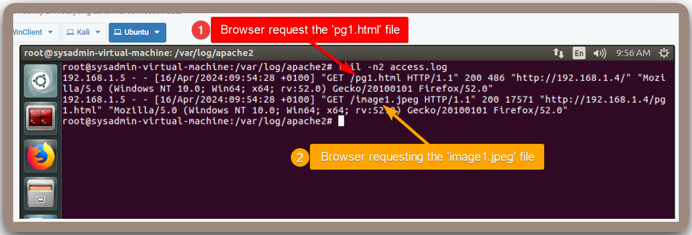
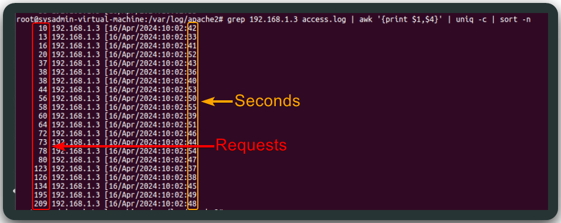
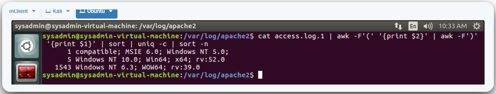

---
layout:
  title:
    visible: true
  description:
    visible: false
  tableOfContents:
    visible: true
  outline:
    visible: true
  pagination:
    visible: true
---

# Apache2

## Information

> **Goal**: Detect abnormal patterns in an Apache2 log files (`/var/log/apache2/`).

The `access.log` file periodically backs itself up (e.g. `access.log.1`). Its structure can be seen below (Figure 1) and the documentation can be found [here](https://httpd.apache.org/docs/2.4/logs.html).

<figure><figcaption><p>Figure 1: Apache2 access log file structure.</p></figcaption></figure>

## Bash Analysis

It is good practice to clear the `access.log` filebefore conducting an examination, so we can isolate the traffic we are trying to observe (requires `root`).

```bash
# switch to root
sudo su
# clear log file
printf "" > /var/log/apache2/access.log
```

### Healthy Traffic

Below is the log file generated from a single browser connection to the web server's homepage (`index.html`) (Figure 2). This is considered as 'healthy' traffic.

<figure><figcaption><p>Figure 2: Examining some 'healthy' HTTP traffic.</p></figcaption></figure>

Below are the logs from when clicking on a page which contains an image (Figure 3). It technically counts as 2 downloads; one for the page itself (`pg1.html`) and another one for the the image (`image1.html`). This is also considered as 'healthy' traffic.

<figure><figcaption><p>Figure 3: Logs generated from visiting a page containing an image file.</p></figcaption></figure>

### Malicious Traffic

Attacking, i.e., spidering, with ZAP, generates a large volume of log lines. There were just 4 lines before, but not there are 1544 more lines.

```bash
# counting the number of lines on the log file
wc -l access.log
1548 access.log
```

We can use bash to extract useful information from the log file, such as unique IP addresses.

```bash
# extract IPs
cat access.log | awk '{print $1}' | sort -u
192.168.1.3
192.168.1.5
```

A large amount of requests originating from a single source can be an indicator of an attack.

```bash
# calculate requests per IP
cat access.log | awk '{print $1}' | sort | uniq -c
1544 192.168.1.3
   4 192.168.1.5
```

However, a large request volume along is not enough to confirm abnormal usage. We can check has fast these requests were made, i.e., how many requests per second were generated (Figure 4).

```bash
# count the number of request per second
grep 192.168.1.3 access.log | awk '{print $1,$4}' | uniq -c | sort -n
```

<figure><figcaption><p>Figure 4: Caclulating requests per second.</p></figcaption></figure>

We can also identify the most common `User-Agent` strings (Figure 5).

```bash
cat access.log | awk -F'"' '{print $6}' | sort | uniq -c | sort -n
```

<figure><figcaption><p>Figure 5: Extract unique <code>User-Agent</code> strings.</p></figcaption></figure>

Notice that we have 3 different `User-Agent` strings, but just 2 IP addresses. This is because the ZAP tool, changed its `User-Agent` for some of its tests.

We can also check the OSs (Figure 6).


```bash
cat access.log | awk -F'(' '{print $2}' | awk -F')' '{print $1}' | sort | uniq -c | sort -n
```


<figure><figcaption><p>Figure 6: Extracting the OS versions.</p></figcaption></figure>
