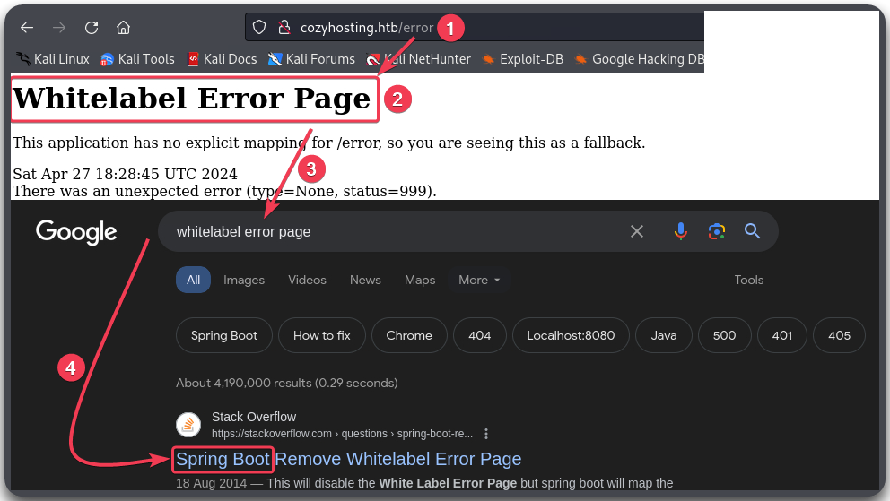

---
layout:
  title:
    visible: true
  description:
    visible: false
  tableOfContents:
    visible: true
  outline:
    visible: true
  pagination:
    visible: true
---

# CozyHosting

## Summary


## Recon

### Port Scan

Let's start with our usual [port scan](../../../tools/tools/port-scanners/nmap.md#nmap-scan).


```bash
# Using the nmap-scan script
$ nmap-scan.sh 10.10.11.230
Creating directory...
[sudo] password for x7331:
Performing initial scan...
Extracting ports...
Performing an aggresive scan on open ports...
All done! See results: less scans/aggressive_scan.nmap

# Displaying the results
$ cat scans/aggressive_scan.nmap
# Nmap 7.94SVN scan initiated Sat Apr 27 18:16:46 2024 as: nmap -T4 --min-rate=10000 -A -p 22,80, -oA scans/aggressive_scan 10.10.11.230
Nmap scan report for 10.10.11.230
Host is up (0.025s latency).

PORT   STATE SERVICE VERSION
22/tcp open  ssh     OpenSSH 8.9p1 Ubuntu 3ubuntu0.3 (Ubuntu Linux; protocol 2.0)
80/tcp open  http    nginx 1.18.0 (Ubuntu)
|_http-title: Did not follow redirect to http://cozyhosting.htb
|_http-server-header: nginx/1.18.0 (Ubuntu)
```


Not much there, just 2 ports open: an SSH server and a web server which redirects us to `http://cozyhosting.htb`. The latter probably will be our main focus, so let's add this to our local DNS file.

```bash
$ grep cozy /etc/hosts
10.10.11.230    cozyhosting.htb
```

### Web Enumeration

As usual, we will go through our [web checklist](../../../tools/tools/web/web-checklist.md) by checking what web technologies are there, manually inspecting the web server, and start our fuzzing scans.


```bash
# Checking what technologies the web server uses
$ whatweb cozyhosting.htb
http://cozyhosting.htb [200 OK] Bootstrap, Content-Language[en-US], Country[RESERVED][ZZ], Email[info@cozyhosting.htb], HTML5, HTTPServer[Ubuntu Linux][nginx/1.18.0 (Ubuntu)], IP[10.10.11.230], Lightbox, Script, Title[Cozy Hosting - Home], UncommonHeaders[x-content-type-options], X-Frame-Options[DENY], X-XSS-Protection[0], nginx[1.18.0]
```


Visiting the web server via our browser, it seems like almost nothing but the `/login` page works. Trying to login with weak credentials (`admin:admin`) does not work. Searching for known vulnerabilities and default credentials does not lead us anywhere either. Our [fuzzing](../../../tools/tools/web/dirbusting/) scans for subdomains and vhosts do not return anything, and the directory scan only reveals an `/admin` directory, which we can't access without credentials, and an `/error` directory (Figure 1).


```bash
# Dirbusting the domain
ffuf -u http://cozyhosting.htb/FUZZ -w /usr/share/wordlists/seclists/Discovery/Web-Content/directory-list-2.3-big.txt -c -ac -ic
```


<figure><figcaption><p>Figure 1: Dirbusting the domain with <code>fuff</code>.</p></figcaption></figure>

Checking the `/error` directory reveals something interesting: a `Whitelabel Error Page` (Figure 2.2). This is the default error page of the **Spring Boot framework** (Figure 2.4).

<figure><figcaption><p>Figure 2: The <code>/error</code> directory reveals the framework in use.</p></figcaption></figure>

Knowing that, we can re-fuzz the domain using a Spring Boot-specific wordlist. Doing that returns much more interesting results than our first attempt (Figure 3).


```bash
# Fuzzing the domain with a framework-specific wordlist
ffuf -u http://cozyhosting.htb/FUZZ -w /usr/share/wordlists/seclists/Discovery/Web-Content/spring-boot.txt -c -ac -ic
```


<figure><figcaption><p>Figure 3: Fuzzing the domain with a framework-specific list.</p></figcaption></figure>

