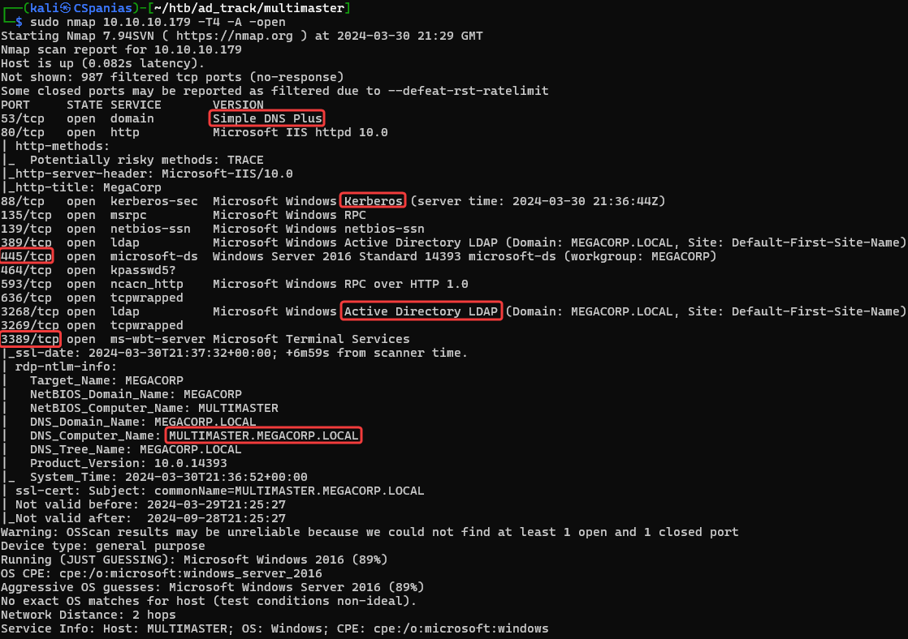

---
layout:
  title:
    visible: true
  description:
    visible: false
  tableOfContents:
    visible: true
  outline:
    visible: true
  pagination:
    visible: false
---

# Multimaster

Let's start with a Nmap scan (Figure 1).

```bash
sudo nmap 10.10.10.179 -T4 -A -open
```

<figure><figcaption><p>Figure 1: Scanning the Multimaster machine.</p></figcaption></figure>

Some interesting things to note from Nmap's output:

1. There are services such as DNS, Kerberos, and LDAP that let us know that **this box is a DC**.
2. Port `3389` is open, so **we can access the host via RDP**.
3. The FQDN is `MULTIMASTER.MEGACORP.LOCAL`.

Before moving enumerating the services, we should add the hostname, the domain, and the FQDN to our local DNS file:

```bash
$ grep multi /etc/hosts
10.10.10.179   multimaster megacorp.local multimaster.megacorp.local
```
