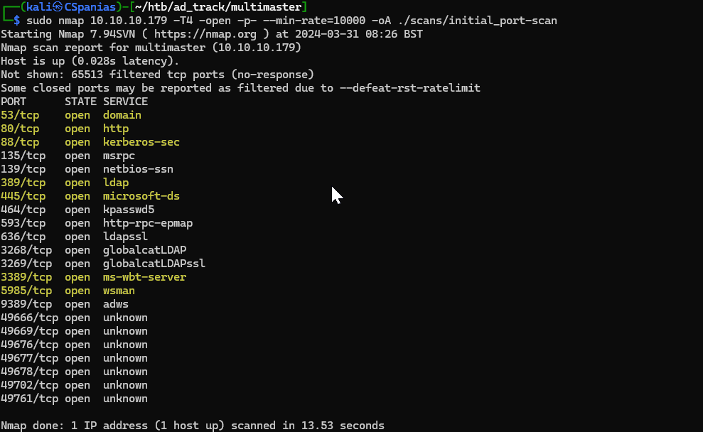

---
layout:
  title:
    visible: true
  description:
    visible: false
  tableOfContents:
    visible: true
  outline:
    visible: true
  pagination:
    visible: false
---

# Multimaster

## Recon

### Nmap

Let's start with a simple port-scan to see what is listening on the box (Figure 1) and then perform an agreesive (`-A`) scan on the ports found (Figure 2).




```bash
# simple port-scan
sudo nmap 10.10.10.179 -T4 -open -p- --min-rate=10000 -oA ./scans/initial_port-scan
# aggresive port-scan on the open ports
sudo nmap 10.10.10.179 -T4 -A -p $(cat ports) --min-rate=10000 -oA ./scans/aggresive_port-scan
```




```bash
# remove junk lines and rpc ports (49666+)
sudo nano scans/initial_port-scan.nmap
# extract port numbers and arrange them in a single comma-separated line
cat scans/initial_port-scan.nmap | cut -d'/' -f1 | tr '\n' ',' > ports
```



<figure><figcaption><p>Figure 1: Scanning the Multimaster machine.</p></figcaption></figure>

<figure><figcaption><p>Figure 2: Aggresive scan on the open ports.</p></figcaption></figure>

Some interesting things to note from Nmap's output:

1. There are services such as DNS, Kerberos, and LDAP that let us know that **this box is a DC**.
2. A **web server** is listening on port `80`.
3. Port `3389` is open, so **we can access the host via RDP**.
4. Port `5985` is also open, **we can jump into the box with WinRM** as well.
5. The FQDN is `MULTIMASTER.MEGACORP.LOCAL`.

Before moving enumerating the services, we should add the hostname, the domain, and the FQDN to our local DNS file:

```bash
$ grep multi /etc/hosts
10.10.10.179   multimaster megacorp.local multimaster.megacorp.local
```

We will start by enumerating the web server as it usually is the largest attack surface, and then move on to SMB and LDAP.&#x20;

### HTTP

The site seems static as nothing really works. The only interesting bit is the _Colleague Finder_ searh bar (Figure 3). This sends a POST request to the `/api/getColleagues` endpoint formatting the data as JSON (Figure 4).

<figure><figcaption><p>Figure 3: The Colleague Finder search bar.</p></figcaption></figure>

<div align="left">

<figure><figcaption><p>Figure 4: The POST request with our input formatted as JSON data.</p></figcaption></figure>

</div>

Trying to perform directory busting with [Ffuf](../../../tools/tools/web/fuff.md), resulted in, almost exclusively, [`403 Forbidden`](https://developer.mozilla.org/en-US/docs/Web/HTTP/Status/403) responses which suggests that a WAF might be there (Figure 5).


```bash
ffuf -u http://10.10.10.179/FUZZ -w /usr/share/wordlists/seclists/Discovery/Web-Content/directory-list-2.3-medium.txt -c -ic
```


<figure><figcaption><p>Figure 5: Dirbusting is prevented by a WAF.</p></figcaption></figure>

The only avenue to explore on the web server seems to be the _Colleague Finder_ search bar request_._ Playing around with common [SQLi](../../../tl-dr/tl-dr/web/sqli.md) detection payloads returns again a `403 Forbidden` response. We can find out which special characters are allowed by slowly fuzzing the endpoint to bypass the WAF.&#x20;


```bash
ffuf -u http://10.10.10.179/api/getColleagues -X POST -d '{"name":"FUZZ}' -H 'Content-Type: application/json;charset=utf-8' -p 3 -t 1 -w /usr/share/wordlists/seclists/Fuzzing/special-chars.txt -c -ic
```

