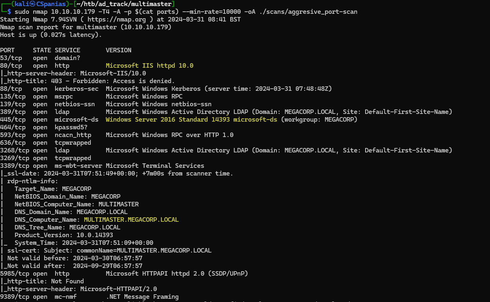

---
layout:
  title:
    visible: true
  description:
    visible: false
  tableOfContents:
    visible: true
  outline:
    visible: true
  pagination:
    visible: false
---

# Multimaster

## Recon

### Nmap

Let's start with a simple port-scan to see what is listening on the box (Figure 1) and then perform an agreesive (`-A`) scan on the ports found (Figure 2).




```bash
# simple port-scan
sudo nmap 10.10.10.179 -T4 -open -p- --min-rate=10000 -oA ./scans/initial_port-scan
# aggresive port-scan on the open ports
sudo nmap 10.10.10.179 -T4 -A -p $(cat ports) --min-rate=10000 -oA ./scans/aggresive_port-scan
```




```bash
# remove junk lines and rpc ports (49666+)
sudo nano scans/initial_port-scan.nmap
# extract port numbers and arrange them in a single comma-separated line
cat scans/initial_port-scan.nmap | cut -d'/' -f1 | tr '\n' ',' > ports
```



<figure><figcaption><p>Figure 1: Scanning the Multimaster machine.</p></figcaption></figure>

<figure><figcaption><p>Figure 2: Aggresive scan on the open ports.</p></figcaption></figure>

Some interesting things to note from Nmap's output:

1. There are services such as DNS, Kerberos, and LDAP that let us know that **this box is a DC**.
2. A **web server** is listening on port `80`.
3. Port `3389` is open, so **we can access the host via RDP**.
4. Port `5985` is also open, **we can jump into the box with WinRM** as well.
5. The FQDN is `MULTIMASTER.MEGACORP.LOCAL`.

Before moving enumerating the services, we should add the hostname, the domain, and the FQDN to our local DNS file:

```bash
$ grep multi /etc/hosts
10.10.10.179   multimaster megacorp.local multimaster.megacorp.local
```

We will start by enumerating the web server as it usually is the largest attack surface, and then move on to SMB and LDAP.&#x20;

### HTTP

The site seems static as nothing really works. The only interesting bit is the _Colleague Finder_ searh bar (Figure 3). This sends a POST request to the `/api/getColleagues` endpoint formatting the data as JSON (Figure 4).

<figure><figcaption><p>Figure 3: The Colleague Finder search bar.</p></figcaption></figure>

<div align="left">

<figure><figcaption><p>Figure 4: The POST request with our input formatted as JSON data.</p></figcaption></figure>

</div>

Performing directory busting with [Ffuf](../../../tools/tools/web/fuff.md) resulted in, almost exclusively, [`403 Forbidden`](https://developer.mozilla.org/en-US/docs/Web/HTTP/Status/403) responses which suggests that a WAF might be there (Figure 5). Introducing a 1 second delay between each request seems to still trigger the WAF, so we will let our dirbusting efforts aside for now.


```bash
ffuf -u http://10.10.10.179/FUZZ -w /usr/share/wordlists/seclists/Discovery/Web-Content/directory-list-2.3-medium.txt -c -ic
```


<figure><figcaption><p>Figure 5: Dirbusting is prevented by a WAF.</p></figcaption></figure>

The only avenue to explore on the web server seems to be the _Colleague Finder_ search bar request_._ Playing around with common [SQLi](../../../tl-dr/tl-dr/web/sqli.md) detection payloads returns again a `403 Forbidden` response.&#x20;

For detecting an SQLi flaw, our initial goal is to try and **induce some kind of server error** which is [typically done](../../../tl-dr/tl-dr/web/sqli.md#detection) using special characters, which in our case will be blocked by the WAF. What we could do, is fuzz the endpoint with special characters and look out what returns as `403 Forbidden` (Figure 6).&#x20;


```bash
ffuf -u http://10.10.10.179/api/getColleagues -X POST -d '{"name":"FUZZ}' -H 'Content-Type: application/json;charset=utf-8' -p 5 -t 1 -w /usr/share/wordlists/seclists/Fuzzing/special-chars.txt -c -ic -mc 403
```


The command may seem complex at first but it's really not that complex:

<table><thead><tr><th width="152">Flag</th><th>Description</th></tr></thead><tbody><tr><td><code>-u</code>, <code>-w</code></td><td>Specify the URL and the wordlist.</td></tr><tr><td><code>-X</code>, <code>-d</code>, <code>-H</code></td><td>Specify the HTTP method, JSON data, and, following Fuff's <a href="https://github.com/ffuf/ffuf/wiki#request-body-data">documentation</a>, Content-Type header.</td></tr><tr><td><code>-c</code>, <code>-ic</code></td><td>Colorize output and ignore any comments within the wordlist file.</td></tr><tr><td><code>-p</code>, <code>-t</code></td><td>To deal with the WAF, we need to slow down the requests per second by introducing a delay among each and reducing the concurrency from 40 (default) to 1.</td></tr><tr><td><code>-mc</code></td><td>Matching only the status codes of interest.</td></tr></tbody></table>

<figure><figcaption><p>Figure 6: Adapting the Fuff command to the WAF and status code 500.</p></figcaption></figure>

The most common SQLi-detection method comes back: the `'` character! At the end of the `Content-Type` header there is the `charset=utf-8` string. [UTF-8](https://en.wikipedia.org/wiki/UTF-8) is an is an encoding system for Unicode, and this suggests that we might need to unicode-endoce our input in order to be accepted by the server.

After confirming this behavior manually (Figure 6.1), unicode-encoding the `'` results in a [`500 Internal Server Error`](https://developer.mozilla.org/en-US/docs/Web/HTTP/Status/500) (Figure 6.2) which might be a good indication of an SQLi flaw.&#x20;

<figure><figcaption><p>Figure 6: Unicode-encoding the single-quote characters results in different server responses.</p></figcaption></figure>

Moving forward, instead of experimenting manually with Fuff and Burp, we will try to confirm the SQLi vulnerability by writing the HTTP request into a file (Figure 7) and passing it to [SQLMap](../../../tools/tools/web/sqlmap.md) (Figure 8).


```bash
sqlmap -r getcolleagues.req --batch -v 0 --level=5 --risk=3 --tamper=charunicodeescape --delay 3
```


<div align="center" data-full-width="true">

<figure><figcaption><p>Figure 7: Writing the HTTP request to a file.</p></figcaption></figure>

</div>
