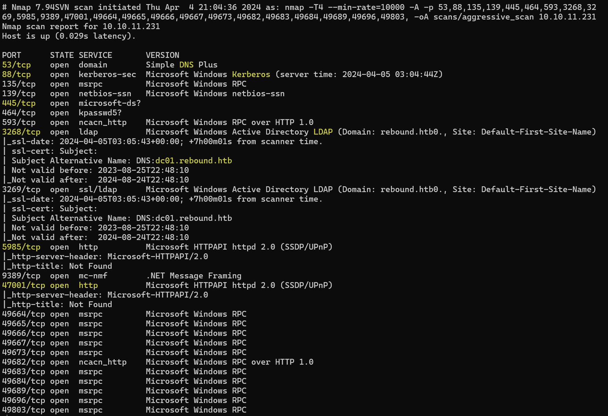
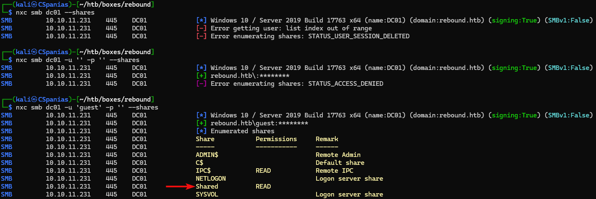

---
layout:
  title:
    visible: true
  description:
    visible: false
  tableOfContents:
    visible: true
  outline:
    visible: true
  pagination:
    visible: true
---

# Rebound

## Summary

[Rebound](https://app.hackthebox.com/machines/560) is an <mark style="color:red;">insane-rated</mark> box

## Recon

Let's start with our [ritualistic nmap scan](../../../tools/tools/port-scanners/nmap.md#nmap-flow) (Figure 1).

<figure><figcaption><p>Figure 1: Services listening on the Rebound machine.</p></figcaption></figure>

Let's write some things down:

* Based on services like DNS (`53`), Kerberos (`88`) and LDAP (`3268`) we are dealing with a Domain Controller (DC).
* The FQDN is `DC01.REBOUND.HTB`.
* SMB is available (`445`).
* WinRM is also available (`5985`). &#x20;

Our plan moving forwards would be to:

1. Add the hostname (`DC01`), domain (`REBOUND.HTB`), and FQDN (`DC01.REBOUND.HTB`) to our local DNS file (`/etc/hosts`).
2. See what information we can get out of the SMB server.
3. See what information we can get out of the LDAP server.

```bash
$ grep rebound /etc/hosts
10.10.11.231    dc01 rebound.htb dc01.rebound.htb
```

## SMB

Quering the SMB server about its shares without passing any or empty credentials returns errors, but `guest` does the trick (Figure 2).

```bash
nxc smb dc01 -u 'guest' -p '' --shares
```

<figure><figcaption><p>Figure 2: Enumerating SMB shares.</p></figcaption></figure>
