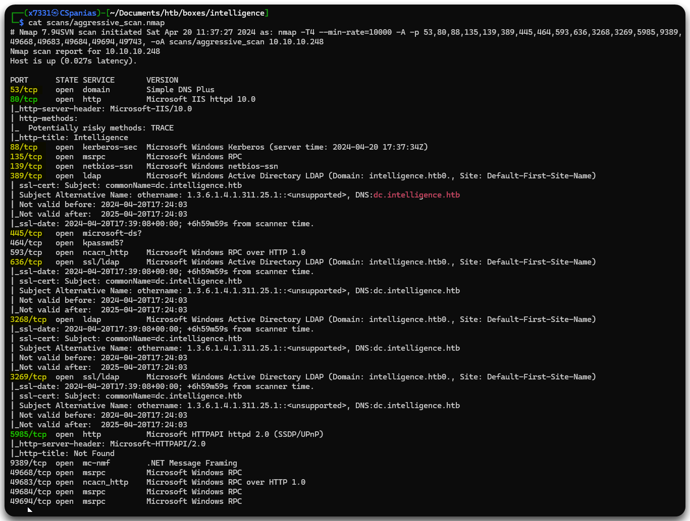

---
layout:
  title:
    visible: true
  description:
    visible: false
  tableOfContents:
    visible: true
  outline:
    visible: true
  pagination:
    visible: true
---

# Intelligence

## Summary

[Intelligence](https://app.hackthebox.com/machines/357) is a <mark style="color:yellow;">medium-rated</mark> machine

<table><thead><tr><th width="83" align="right">Step</th><th width="201">Action</th><th>Tool</th><th>Gained</th></tr></thead><tbody><tr><td align="right">1</td><td>RPC enumeration</td><td><a href="../../../services/services/smb-139-445.md#rpc">rpcclient</a></td><td>Usernames</td></tr><tr><td align="right">2</td><td>Password spray</td><td><a href="https://x7331.gitbook.io/boxes/tools/tools/active-directory/netexec-cme">NXC</a></td><td>Credentials</td></tr><tr><td align="right">3</td><td>SMB enumeration</td><td><a href="https://x7331.gitbook.io/boxes/tools/tools/active-directory/netexec-cme">NXC</a></td><td>Foothold</td></tr><tr><td align="right">4</td><td>Domain enumeration</td><td><a href="https://x7331.gitbook.io/boxes/tools/tools/active-directory/netexec-cme">NXC</a>, <a href="https://x7331.gitbook.io/boxes/tools/tools/active-directory/bloodhound">BloodHound</a></td><td>Non-default group</td></tr><tr><td align="right">5</td><td>Research</td><td><a href="https://github.com/VbScrub/AdSyncDecrypt">PoC</a></td><td><a data-footnote-ref href="#user-content-fn-1">EoP</a></td></tr></tbody></table>

## Recon

### Port Scan

Let's start, as we always do, with a [port scan](../../../tools/tools/port-scanners/nmap.md#nmap-flow) (Figure 1).

```bash
nmap-scan.sh 10.10.10.248
Creating directory...
Performing initial scan...
Extracting ports...
Performing an aggresive scan on open ports...
All done! See results: less scans/aggressive_scan.nmap
```

<figure><figcaption><p>Figure 1: Services listening on the Intelligence machine.</p></figcaption></figure>

* The <mark style="color:yellow;">yellow-highlighted ports</mark>, as well as the host name (`DC`), indicates that we are dealing with a DC[^2], as they are commonly seen on one.
* The <mark style="color:green;">green-highlighted ports</mark> are additional interesting ports to keep a note of:
  1. An IIS web server (`80`) which always represents a large attack surface
  2. In case we obtain any credentials we can try gaining a foothold via WinRM (`5985`)
* The <mark style="color:red;">red-highlighted string</mark> let us know the FQDN[^3] of the machine.

Before jumping on the web server, let's add the hostname (`dc`), the domain (`intelligence.htb`), and the FQDN (`dc.intelligence.htb`) to our local DNS file.

```bash
grep intel /etc/hosts
10.10.10.248    dc.intelligence.htb dc intelligence.htb
```

### IIS Enumeration

The web page does not have many things to explore; the only interesting thing on it are two PDF files that are available to download (Figure 2).

<figure><figcaption><p>Figure 2: The PDF files on the IIS web server.</p></figcaption></figure>

Performing [dirbusting](../../../tools/tools/web/dirbusting/), searching for subdomain and vhosts does not return anything, so let's continue by examining the PDF files' metadata.

```bash
exiftool 2020-12-15-upload.pdf
ExifTool Version Number         : 12.76
File Name                       : 2020-12-15-upload.pdf
Directory                       : .
File Size                       : 27 kB
File Modification Date/Time     : 2024:04:20 12:00:52+01:00
File Access Date/Time           : 2024:04:20 12:05:20+01:00
File Inode Change Date/Time     : 2024:04:20 12:00:52+01:00
File Permissions                : -rw-r--r--
File Type                       : PDF
File Type Extension             : pdf
MIME Type                       : application/pdf
PDF Version                     : 1.5
Linearized                      : No
Page Count                      : 1
Creator                         : Jose.Williams

exiftool 2020-01-01-upload.pdf
ExifTool Version Number         : 12.76
File Name                       : 2020-01-01-upload.pdf
Directory                       : .
File Size                       : 27 kB
File Modification Date/Time     : 2024:04:20 12:00:46+01:00
File Access Date/Time           : 2024:04:20 12:05:12+01:00
File Inode Change Date/Time     : 2024:04:20 12:00:46+01:00
File Permissions                : -rw-r--r--
File Type                       : PDF
File Type Extension             : pdf
MIME Type                       : application/pdf
PDF Version                     : 1.5
Linearized                      : No
Page Count                      : 1
Creator                         : William.Lee
```

Examining the PDFs' metadata gives us two users back: `Jose.Williams` and `William.Lee`. Not much we can't do with that, other than [creating potential usernames](../../../tools/tools/usernames.md) for those two users. Thus, we will do that and jump into SMB.

```bash
# writing the 2 names to a file
nano web_users
# checking file content
cat web_users
Jose Williams
William Lee
# creating username combinations based on the first and last name
username-generator -w web_users > user_gen.lst
username-anarchy -i web_users >> user_gen.lst
# deduplicating the generated user list
sort -u user_gen.lst > users.lst
# counting number of lines on the file
wc -l users.lst
36 users.lst
```

### SMB Enumeration

Trying to get information from SMB or RPC without credentials or via a NULL session does not work. Attempting a BFA[^4] using our `users.lst` and `rockyou` or checking for ASREPRoasting with `users.lst` does not work either.

### LDAP Enumeration

[^1]: Elevation of Privileges

[^2]: Domain Controller

[^3]: Fully Qualified Domain Name

[^4]: Brure Force Attack
