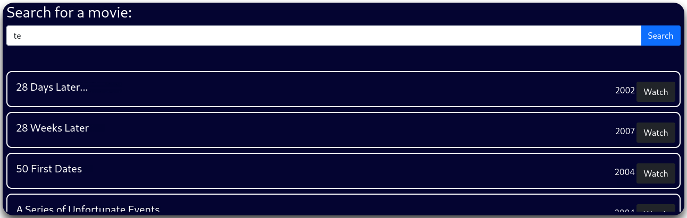

---
layout:
  title:
    visible: true
  description:
    visible: false
  tableOfContents:
    visible: true
  outline:
    visible: true
  pagination:
    visible: true
---

# StreamIO

## Summary

[StreamIO](https://app.hackthebox.com/machines/streamio) is a <mark style="color:yellow;">medium-rated</mark> machine TBC...

<table><thead><tr><th width="84" align="right">Step</th><th width="211">Action</th><th width="225">Tool</th><th>Gained</th></tr></thead><tbody><tr><td align="right">1</td><td>Web server enumeration</td><td><a href="https://github.com/exiftool/exiftool">exiftool</a></td><td>Usernames</td></tr><tr><td align="right">2</td><td>PDF enumeration</td><td><a href="https://ss64.com/bash/bash.html">Bash</a></td><td>Usernames &#x26; Password</td></tr><tr><td align="right">3</td><td>Password spray</td><td><a href="https://x7331.gitbook.io/boxes/tools/tools/active-directory/netexec-cme">NXC</a></td><td>Credentials</td></tr><tr><td align="right">4</td><td>SMB enumeration</td><td><a href="https://x7331.gitbook.io/boxes/tools/tools/active-directory/netexec-cme">NXC</a></td><td><a data-footnote-ref href="#user-content-fn-1">EoP</a> path</td></tr><tr><td align="right">5</td><td><a data-footnote-ref href="#user-content-fn-2">EoP</a> exploitation</td><td><a href="https://github.com/dirkjanm/krbrelayx">dnstool</a>, <a href="https://github.com/SpiderLabs/Responder">responder</a></td><td><a data-footnote-ref href="#user-content-fn-3">EoP</a></td></tr><tr><td align="right">6</td><td>Domain enumeration</td><td><a href="https://x7331.gitbook.io/boxes/tools/tools/active-directory/netexec-cme">NXC</a>, <a href="https://x7331.gitbook.io/boxes/tools/tools/active-directory/bloodhound">BloodHound</a></td><td><a data-footnote-ref href="#user-content-fn-4">EoP</a> path</td></tr><tr><td align="right">7</td><td><a data-footnote-ref href="#user-content-fn-5">EoP</a> exploitation</td><td><a href="https://x7331.gitbook.io/boxes/tools/tools/active-directory/netexec-cme">NXC</a>, <a href="https://github.com/fortra/impacket">Impacket</a></td><td>Domain compromise</td></tr></tbody></table>

## Recon

### Port Scan

Let's start with a [port scan](../../../tools/tools/port-scanners/nmap.md#nmap-flow) (Figure 1).

```bash
nmap-scan.sh 10.10.10.248
Creating directory...
Performing initial scan...
Extracting ports...
Performing an aggresive scan on open ports...
All done! See results: less scans/aggressive_scan.nmap
```

<figure><figcaption><p>Figure 1: Ports listening on the StreamIO machine.</p></figcaption></figure>

* Based on the <mark style="color:yellow;">yellow-highlighted ports</mark>, as well as the host name (`DC`), we are dealing with a DC[^6].
* We have HTTP (`80`) and HTTPS (`443`) hosting an IIS web server. The latter also gives us an interesting DNS name: `watch.streamIO.htb`.
* WinRM (`5985`) is available to access the box in case we obtain credentials.
* The FQDN[^7] of the machine is `DC.STREAMIO.HTB`.

Before jumping on the web server, let's add the hostname (`dc`), the domain (`streamio.htb`), the FQDN (`dc.streamio.htb`), and the alternate name (`watch.streamIO.htb`) to our local DNS file.

```bash
grep stream /etc/hosts
10.10.11.158    dc dc.streamio.htb streamio.htb watch.streamio.htb
```

### Failed Ports

Attempting to enumerate SMB, RCP and LDAP without credentials does not yield anything (Figure 2). In addition, DNS also returns nothing of interest as well (Figure 3).


```bash
# attempting to enumerate SMB via NULL session
nxc smb 10.10.11.158 -u '' -p '' --shares
# attempting to enumerate SMB via guest session
nxc smb 10.10.11.158 -u 'guest' -p '' --shares
# attempting to enumerate SMB via anonymous session
nxc smb 10.10.11.158 -u 'x7331' -p '' --shares
# attempting to enumrating RPC via NULL session
rpcclient -U '' -N 10.10.11.158
# attempting to enumerating LDAP via NULL bind
ldapsearch -x -H ldap://streamio.htb -s sub -b 'DC=streamIO,DC=htb'
# enumerating DNS
dnsenum --dnsserver 10.10.11.158 -f /usr/share/seclists/Discovery/DNS/bitquark-subdomains-top100000.txt streamio.htb
```


<figure><figcaption><p>Figure 2: Failed enumeration attempts on SMB, RPC, and LDAP.</p></figcaption></figure>

<figure><figcaption><p>Figure 3: Enumerating the DNS server.</p></figcaption></figure>

### IIS Enumeration

Checking for the technologies used we can see that PHP and ASP.NET are used. We can add those extensions to our fuzzing commands on the next step.


```bash
# checking technologies used on the domain
whatweb https://streamio.htb
https://streamio.htb [200 OK] Bootstrap, Cookies[PHPSESSID], Country[RESERVED][ZZ], Email[oliver@Streamio.htb], HTML5, HTTPServer[Microsoft-IIS/10.0], IP[10.10.11.158], JQuery[3.4.1], Microsoft-IIS[10.0], PHP[7.2.26,], Script, Title[Streamio], X-Powered-By[PHP/7.2.26, ASP.NET], X-UA-Compatible[IE=edge]
# checking technologies used on the subdomain
whatweb https://watch.streamio.htb
https://watch.streamio.htb [200 OK] Bootstrap, Country[RESERVED][ZZ], HTML5, HTTPServer[Microsoft-IIS/10.0], IP[10.10.11.158], Microsoft-IIS[10.0], PHP[7.2.26,], Script, Title[Streamio], X-Powered-By[PHP/7.2.26, ASP.NET]
```


[Scanning](https://app.gitbook.com/o/asuXdppEfmgK9Dr478w0/s/mjLkek16kB60c2WFd5lf/) the domain for directories, subdomains, and vhosts for HTTP does not return anything interesting. However, doing the same for HTTPS  returns many interesting directories back both for `streamio.htb` and `watch.streamio.htb`.&#x20;

```bash
# scanning the domain
fuff-scan.sh
Enter protocol (HTTP/HTTPS): https
Enter the domain to fuzz: streamio.htb
Enter extension string to fuzz: .php,.aspx
Scanning for directories...

images
contact.php
about.php
index.php
register.php
login.php
admin
css
js
logout.php
fonts

# scanning the subdomain
fuff-scan.sh
Enter protocol (HTTP/HTTPS): https
Enter the domain to fuzz: watch.streamio.htb
Enter extension string to fuzz: .php
Scanning for directories...

index.php
search.php
static
blocked.php
```

Browsing at `https://streamio.htb` there are 2 potential things of interest: some names and a working contact form (Figure 4).

<figure><figcaption><p>Figure 4: The <code>https://streamio.htb</code> site.</p></figcaption></figure>

## SQL Injection

Looking at `watch.streamio.htb` we find something more interesting, an input box to add our email in (`/index.php`) and a movie search bar (`/search.php`). Using the string "_te_" returns all movies containing the string, which suggests that the back-end query makes use of [wildcards](https://www.w3schools.com/sql/sql\_wildcards.asp) (`%`) (Figure 5).

<figure><figcaption><p>Figure 5: A movie search bar under <code>/search.php</code>.</p></figcaption></figure>

Checking for SQLi[^8] has an interesting result: it redirects us to `/blocked.php` which seems some kind of a WAF[^9] simulation (Figure 6 & 7).&#x20;

<figure><figcaption><p>Figure 6: Checking for SQLi with common payloads redirect us to <code>/blocked.php</code>.</p></figcaption></figure>

<figure><figcaption><p>Figure 7: The <code>/blocked.php</code> directory.</p></figcaption></figure>

The site seems vulnerable to SQLi as we are able to modify the results through the parameter. For instance, putting "_anger_" in the search bar returns 5 movies (Figure 8), but if we comment it out returns just one (Figure 9).

<figure><figcaption><p>Figure 8: Searching for movies containing the string "<em>anger</em>".</p></figcaption></figure>

<figure><figcaption><p>Figure 9: Modyfing the query's results.</p></figcaption></figure>


[^1]: Elevation of Privileges

[^2]: Elevation of Privileges

[^3]: Elevation of Privileges

[^4]: Elevation of Privileges

[^5]: Elevation of Privileges

[^6]: Domain Controller

[^7]: Fully Qualified Domain Name

[^8]: Structured Query Language injection

[^9]: Web Application Firewall
