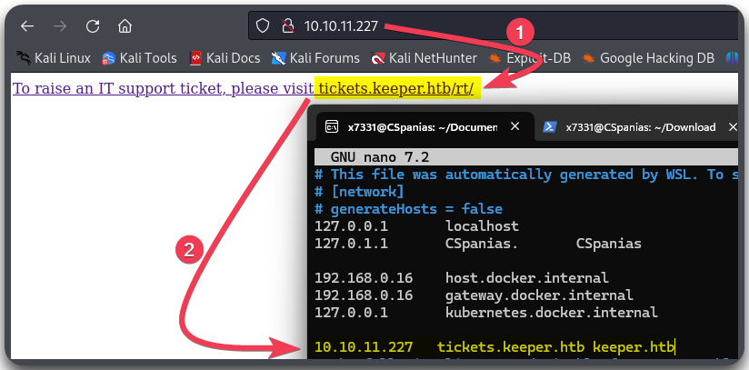
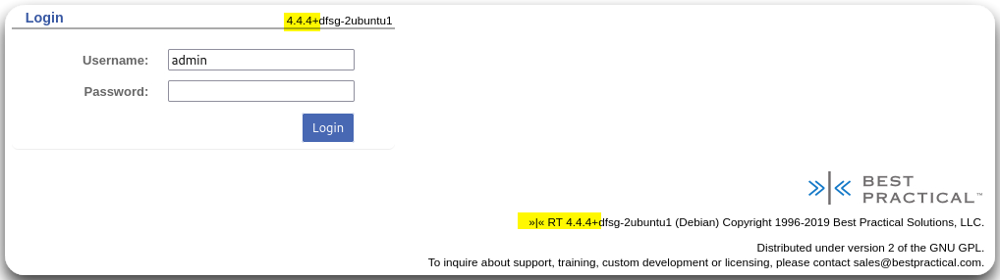
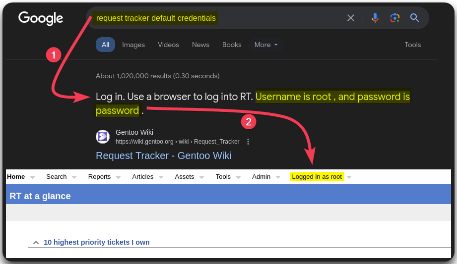
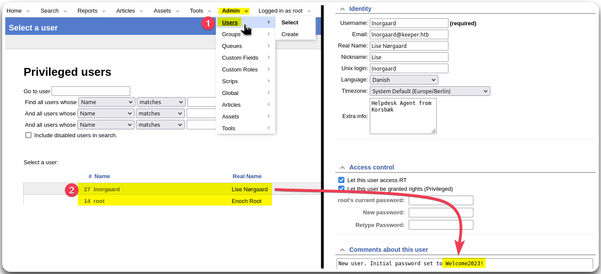
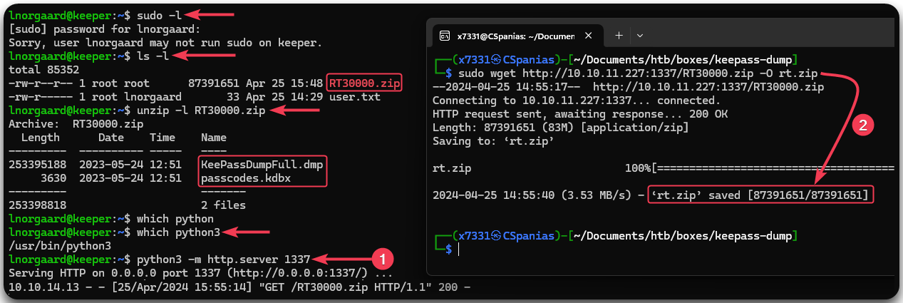
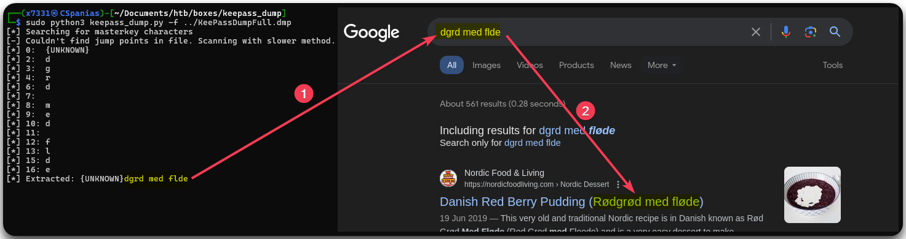
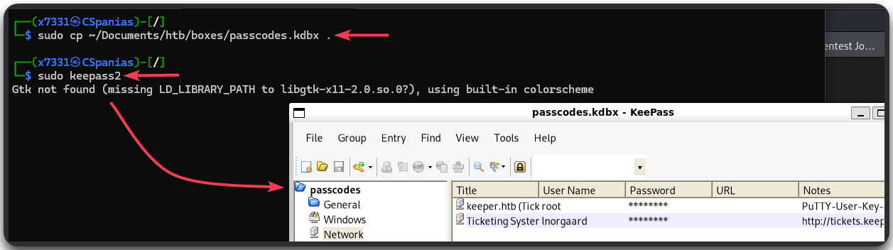
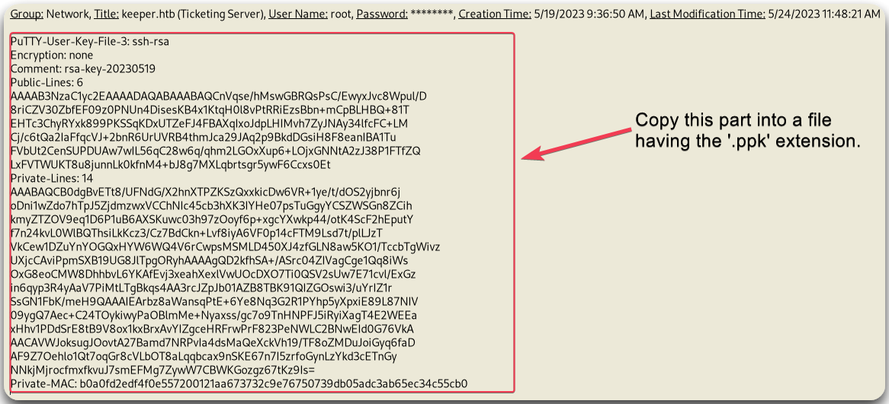
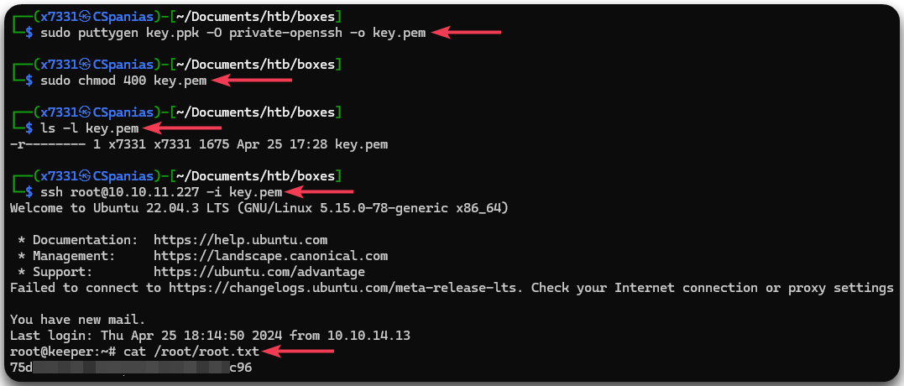

---
layout:
  title:
    visible: true
  description:
    visible: false
  tableOfContents:
    visible: true
  outline:
    visible: true
  pagination:
    visible: true
---

# Keeper

## Summary

[Keeper](https://app.hackthebox.com/machines/556) is an <mark style="color:green;">easy-rated</mark> box which offers a relatively straightforward entry point, primarily focusing on thorough **web enumeration** and leveraging **default credentials**. The initial foothold involves carefully scouring the web application for vulnerabilities and exploiting them to gain access. Moving on to privilege escalation, the process entails comprehensive **host enumeration**, uncovering a **KeePass** dump file and its associated database. By leveraging a [**PoC**](#user-content-fn-1)[^1] **exploit** against the KeePass database, its master key is revealed, and the `root`'s **Putty user key file** is ultimately discovered. Upon conversion of the key file for SSH usage, complete compromise of the host is achieved, granting full access and control.

<table><thead><tr><th width="85" align="right">Step</th><th width="235">Action</th><th width="146">Tool</th><th>Gained</th></tr></thead><tbody><tr><td align="right">1</td><td>Web server enumeration</td><td>Browser</td><td>Default credentials</td></tr><tr><td align="right">2</td><td>Web server enumeration (2)</td><td>Browser</td><td>Lateral movement</td></tr><tr><td align="right">3</td><td>System enumeration</td><td><a data-footnote-ref href="#user-content-fn-2">LoTL</a></td><td>KeePass dump &#x26; database</td></tr><tr><td align="right">4</td><td>Research</td><td><a href="https://github.com/z-jxy/keepass_dump">Public </a><a data-footnote-ref href="#user-content-fn-1">PoC</a></td><td>Master key</td></tr><tr><td align="right">5</td><td>Key conversion</td><td><a href="https://www.puttygen.com/">puttygen</a></td><td>Host compromise</td></tr></tbody></table>

## Recon

### Port Scanning

Starting with our [usual port-scan](https://raw.githubusercontent.com/CSpanias/ctf-scripts/refs/heads/main/nmap-scan.sh), let us know that only 2 ports are listening on the box (Figure 1):

1. An SSH service (`22`) that might be the way to establish our foothold.
2. An HTTP web server (`80`) which probably represent the focus of the box.

```bash
$ nmap-scan.sh 10.10.11.227
Creating directory...
Performing initial scan...
Extracting ports...
Performing an aggresive scan on open ports...
All done! See results: less scans/aggressive_scan.nmap
```

<figure><figcaption><p>Figure 1: Keeper's listening services.</p></figcaption></figure>

### Web Enumeration

Visiting the web server via our browser, we find a message redirecting us to a subdomain: `tickets.keeper.htb/rt/`, so let's add that to our local DNS file (`/etc/hosts`) (Figure 2).

<figure><figcaption><p>Figure 2: Adding the subdomain to our local DNS file.</p></figcaption></figure>

Visiting `tickets.keeper.htb/rt/` we encounter a login form, which also contains the CMS's version (Figure 3).

<figure><figcaption><p>Figure 3: The <code>tickets.keeper.htb/rt/</code> page.</p></figcaption></figure>

## Foothold

### Default Credentials

[Fuzzing](broken-reference) for directories, subdomains, and vhosts does not give us anything back. Based on our web checklist, one of the things to check is default or weak credentials. Trying the former, for instance, `admin:admin`, does not work, but the latter get us in (Figure 4).&#x20;

<figure><figcaption><p>Figure 4: Logging as <code>root</code> using default credentials.</p></figcaption></figure>

### Lateral Movement

By enumerating the application, we see that is has only 2 users: `root` (our current account) and `lnorgaard`. Clicking on the latter's profile, we find a comment with a plaintext password (Figure 5).

<figure><figcaption><p>Figure 5: Enumerating the credentials of `Inorgaard</p></figcaption></figure>

Use these credentials on the SSH server, we obtain our foothold and read the `user.txt` flag 🚩 (Figure 6).

```bash
# Accessing the box via the SSH server
$ ssh lnorgaard@10.10.11.227
lnorgaard@10.10.11.227's password:
Welcome to Ubuntu 22.04.3 LTS (GNU/Linux 5.15.0-78-generic x86_64)

 * Documentation:  https://help.ubuntu.com
 * Management:     https://landscape.canonical.com
 * Support:        https://ubuntu.com/advantage
You have mail.
Last login: Tue Aug  8 11:31:22 2023 from 10.10.14.23
# Reading the user flag
$ lnorgaard@keeper:~$ cat /home/lnorgaard/user.txt
f6b<REDACTED>145
```

## Privilege Escalation

### System Enumeration


[KeePass](https://keepass.info/) is a free password manager for Windows.


Checking for `sudo` permissions, `lnorgaard` has none. Listing the user's home directory reveals an interesting archive (`RT30000.zip`) which contains a KeePass dump (`KeePassDumpFull.dmp`) and a KeePass database (`passcodes.kdbx`). Sadly, in order to access the latter, we need its [master key](https://keepass.info/help/base/keys.html)! Nevertheless, we can transfer them to our attack host and see what we can do with them (Figure 6).

<figure><figcaption><p>Figure 6: Transferring the <code>zip</code> file to the attack host.</p></figcaption></figure>

### KeePass Exploitation

Searching for ways to leverage the KeePass dump, we find the [keepass\_dump](https://github.com/z-jxy/keepass_dump) repository which is based on [CVE-2023-32784](https://cve.mitre.org/cgi-bin/cvename.cgi?name=CVE-2023-32784). After cloning and executing it against the `KeePassDumpFull.dmp` file, a weird result appears. However, searching for it as it is, it appears to be a tradional Danish pastry (Figure 7).

```bash
# Cloning the repository
sudo git clone https://github.com/z-jxy/keepass_dump
# Executing the script
sudo python3 keepass_dump.py -f ../KeePassDumpFull.dmp
```

<figure><figcaption><p>Figure 7: Enumerating Danish pastries.</p></figcaption></figure>

The pastry itself contains some Danish-specific letters which the PoC[^1] used seems to have ignored. Installing `keepass2`, moving the database somewhere that the application can actually see it, and using the Danish-lettered password, i.e., `rødgrød med fløde,` seems to work (Figure 8).

<figure><figcaption><p>Figure 8: Infiltrating the <code>keepass</code> database.</p></figcaption></figure>

The database does not contain much:

1. The _Recycle Bin_ directory contains 2 sample entries.
2. The _Network_ directory contains the credentias for the users `lnorgaard` and `root`!&#x20;

The `root` entry contains a Putty user key file which has the `.ppk` extension by default. We can convert this key into a `.pem` file and use with the SSH client. All we need to do is to copy the key part into a `.ppk` file (Figure 9), such as `key.ppk`, and then use `puttygen` to convert it.

<figure><figcaption><p>Figure 9: The <code>root</code>'s Putty user key file.</p></figcaption></figure>

We also need to assign the `key.pem` file appropriate permissions, i.e., not be accessible by others, otherwise the SSH server won't accept it; both `400` (`r--`) and `600` (`rw-`) will work. Using public key authentication allows us to access the machine as `root` and read the `root.txt` flag 🚩 (Figure 10).

```bash
# Converting PPK to PEM
sudo puttygen key.ppk -O private-openssh -o key.pem
# Assigning the appropriate permissions
sudo chmod 400 key.pem
# Confirming permissions
ls -l key.pem
# Using public key authentication
ssh root@10.10.11.227 -i key.pem
# Reading the root flag
cat /root/root.txt
```

<figure><figcaption><p>Figure 10: Converting the PPK to PEM and using public key authentication.</p></figcaption></figure>

[^1]: Proof of Concept

[^2]: Living of The Land
