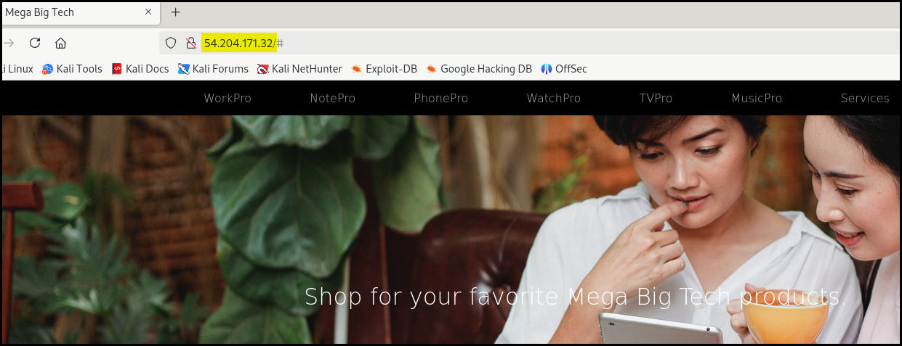
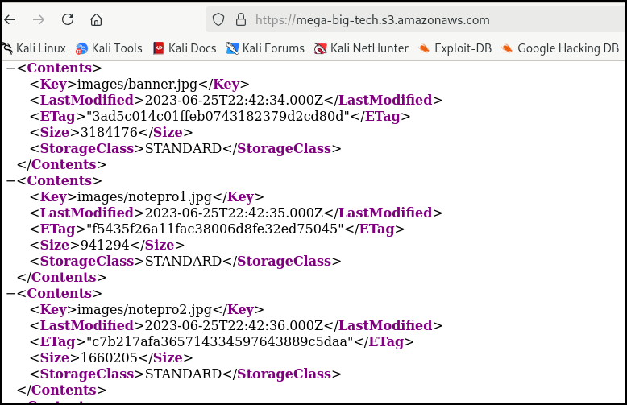
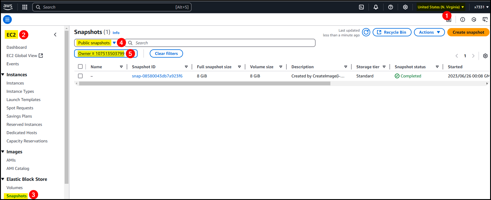

---
layout:
  title:
    visible: true
  description:
    visible: false
  tableOfContents:
    visible: true
  outline:
    visible: true
  pagination:
    visible: true
---

# Public Snapshots

> _Lab:_ [_Identify the AWS Account ID from a Public S3 Bucket_](public-snapshots.md)_._

Next we need to provide the Amazon Resource Name (ARN) of the role under our control (i.e. in our own AWS account), as well as a target S3 bucket in the AWS account whose ID we want to enumerate. Here we have created the role and provided it for you.

This reveals the AWS account ID `107513503799`. We can use this information to hunt down public resources that might have been accidently exposed by the account owner, such as public EBS and RDS snapshots.

First, it would be good to know the AWS region that the S3 bucket was created in, as public snapshots are available to all users in the same region that the EBS or RDS snapshot was created in. It's likely that if the S3 bucket was created in a specific region, that other resources will be available there too!

To find the S3 bucket region we can use another trick, this time with cURL.

In the response headers we see that the header `x-amz-bucket-region` is set to `us-east-1`, which is North Virginia. Next, log into the AWS management console in your own personal AWS account and make sure that the `us-east-1` region is selected.

## 📌 **Overview**

In this lab, we’ll perform basic enumeration against an exposed AWS S3 bucket linked from a public-facing web service. We’ll extract the AWS Account ID that owns the bucket — a valuable piece of information for cloud pentesting, as it can be used to track down other public AWS resources like EBS and RDS snapshots. We’ll walk through:

* Discovering a service and identifying an S3 bucket
* Enumerating the AWS Account ID via role assumption
* Identifying the S3 bucket’s region
* Searching for publicly exposed snapshots owned by that account


👉 Think of **EBS (Elastic Block Store)** like a hard drive in the cloud. It provides storage volumes that can be attached to virtual machines (called **EC2 instances**) to store operating systems, applications, and data. These volumes can sometimes be made public by accident.

👉 **RDS (Relational Database Service)** is a managed cloud database service that lets you run databases like MySQL, PostgreSQL, or SQL Server without handling the underlying infrastructure. Just like with EBS, database snapshots (backups) can sometimes be made public unintentionally.


> _Publicly exposed EBS and RDS snapshots can unintentionally leak sensitive data or system configurations if not secured properly (e.g._ [_Capital One breach_](https://www.darkreading.com/cyberattacks-data-breaches/capital-one-attacker-exploited-misconfigured-aws-databases)_)._

## 🔍 **Enumeration**

We start by scanning the target IP for open ports:

```bash
$ sudo nmap -T4 -p- -open -Pn 54.204.171.32
<SNIP>
PORT   STATE SERVICE
80/tcp open  http

Nmap done: 1 IP address (1 host up) scanned in 280.46 second
```

<figure><figcaption><p>Figure 1: The homepage of the web server.</p></figcaption></figure>

Visiting the site's source code reveals some images being loaded from an AWS S3 bucket (Figure 2). By visiting `https://mega-big-tech.s3.amazonaws.com`, we can list the bucket’s contents if permissions allow it (Figure 3).

<div><figure><figcaption><p>Figure 2: Reading the source code of the website.</p></figcaption></figure> <figure><figcaption><p>Figure 3: Enumerating the S3 bucket's contents.</p></figcaption></figure></div>


👉 An **S3 bucket** is AWS's object storage service. Buckets are globally unique and often exposed via URLs like `https://.s3.amazonaws.com`.


## 🔐 **AWS CLI Credentials**

We’re provided with AWS credentials to assume a role for this lab that will allow us to execute commands in a specific user context, in this case, have the `s3:GetObject` and `s3:ListBucket` permissions.&#x20;

> _Assuming a role that's assigned one of these permissions is required for the `s3-account-search` script to work._

```bash
# credential configuration
$ aws configure
AWS Access Key ID [None]: AKI<REDACTED>7HK
AWS Secret Access Key [None]: UdU<REDACTED>Hq3
Default region name [None]:
Default output format [None]:

# check the identiry behind the above credentials
$ aws sts get-caller-identity
{
    "UserId": "AIDAWHEOTHRF62U7I6AWZ",
    "Account": "427648302155",
    "Arn": "arn:aws:iam::427648302155:user/s3user"
}
```


👉 The **AWS Account ID** here (`427648302155`) belongs to the identity we're currently using — not the bucket owner we’re trying to find.


The [`s3-account-search`](https://github.com/WeAreCloudar/s3-account-search/blob/main/s3_account_search/cli.py)  script attempts to enumerate the AWS Account ID of the target S3 bucket by using our credentials and a role we control.

```bash
$ s3-account-search arn:aws:iam::427648302155:role/LeakyBucket mega-big-tech
Starting search (this can take a while)
found: 1
found: 10
found: 107
found: 1075
found: 10751
found: 107513
found: 1075135
found: 10751350
found: 107513503
found: 1075135037
found: 10751350379
found: 107513503799
```


👉 An **AWS Account ID** is a globally unique 12-digit identifier for an AWS account. It’s useful for targeting public resources like snapshots, AMIs, etc.


This Python script is a cloud enumeration utility designed to **brute-forces the AWS account ID of a target S3 bucket’s owner** by:

1. **Assuming a provided IAM role** in your account.
2. **Incrementally testing IAM policies** that allow access only if the resource belongs to an account whose ID starts with specific digits.
3. **Brute-forcing one digit at a time** by checking whether access is allowed, using AWS’s `s3:ResourceAccount` condition key.
4. **Repeating this until the full 12-digit account ID is discovered**.

```
Assume IAM Role 
        ↓
 Test IAM Policy with 1 digit 
        ↓
    Access Granted?
      ↙       ↘
   Yes         No
    ↓          ↓
  Append    Try next digit 
   digit       ↓
      ↘
  Repeat until 12 digits found
```

We can use `curl` to check which region the bucket resides in. This is crucial because public snapshots are only visible in their home region.


```bash
$ curl -I https://mega-big-tech.s3.amazonaws.com
HTTP/1.1 200 OK
x-amz-id-2: Kjoy7MFQr2HIKEnCNtV0Lxb6Qk6Ckp2j+/eFO/YXgfP3eEox3EmC/YJgsm0iJcz40wFhCISO4+PYEp4f17wIbOjdD4Ep4MT9
x-amz-request-id: FWXE4YE6VQMH4T64
Date: Tue, 15 Apr 2025 10:31:21 GMT
x-amz-bucket-region: us-east-1
x-amz-access-point-alias: false
Content-Type: application/xml
Transfer-Encoding: chunked
Server: AmazonS3
```



👉 **us-east-1** is the AWS region code for **North Virginia** — where we’ll hunt for other public resources.


## 🌐 **Public Snapshots**

Now log into your personal AWS account, and in the **us-east-1** region (Figure 4.1). Once logged-in:

1. Go to **EC2** → **EBS Snapshots** (Figure 4.2 & 4.3)
2. Select **Public Snapshots** (Figure 4.4)
3. In the search bar, type: `Owner = 107513503799` (Figure 4.5)

<figure><figcaption><p>Figure 4: Finding a public EBS snapshot.</p></figcaption></figure>


👉 AWS allows creating **public snapshots** of EBS volumes and RDS databases, sometimes accidentally left open. If found, these can be mounted or restored to access data.


Once we have the owner's ID, after configuring the region, we can enumerate public snapshots via the CLI.


```bash
$ aws configure
AWS Access Key ID [****************P7HK]:
AWS Secret Access Key [****************4Hq3]:
Default region name [None]: us-east-1
Default output format [None]:

$ aws ec2 describe-snapshots --owner-ids 107513503799
{
    "Snapshots": [
        {
            "StorageTier": "standard",
            "TransferType": "standard",
            "CompletionTime": "2023-06-25T23:10:22.078000+00:00",
            "SnapshotId": "snap-08580043db7a923f6",
            "VolumeId": "vol-04462a3562c7e6a15",
            "State": "completed",
            "StartTime": "2023-06-25T23:08:45.155000+00:00",
            "Progress": "100%",
            "OwnerId": "107513503799",
            "Description": "Created by CreateImage(i-089b146125db92ee4) for ami-0676627ee43624fb2",
            "VolumeSize": 8,
            "Encrypted": false
        }
    ]
}
```


## ✅ **Summary**

In this lab you learned to:

* Scan for open services
* Identify S3 bucket references in web pages
* Interact with AWS CLI and configure credentials
* Use **S**ecurity Token Service (STS) to verify the active identity
* Enumerate a bucket owner’s AWS Account ID
* Identify a bucket’s region using HTTP headers
* Search for public AWS resources (like EBS snapshots) associated with that account

## 📌 **Key AWS Concepts**

<table><thead><tr><th width="198.00006103515625">Term</th><th width="494">Meaning</th></tr></thead><tbody><tr><td><strong>S3 Bucket</strong></td><td>Cloud-based object storage container</td></tr><tr><td><strong>AWS Account ID</strong></td><td>Unique 12-digit AWS account identifier</td></tr><tr><td><strong>Role</strong></td><td>Temporary credentials allowing users/services to assume permissions</td></tr><tr><td><strong>Security Token Service</strong></td><td>API to retrieve details about the current identity</td></tr><tr><td><strong>Public Snapshot</strong></td><td>An EBS/RDS snapshot marked public and accessible by anyone in its region</td></tr></tbody></table>
