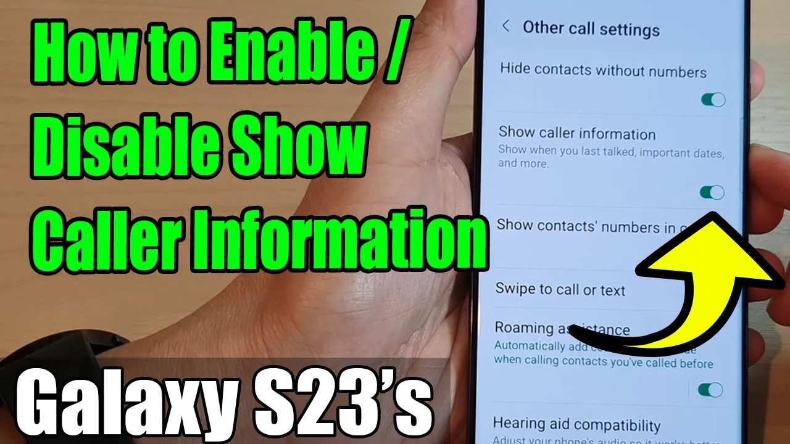

# Galaxy S23's: How to Enable/Disable Show Caller Information - YouTube

## Galaxy S23's: How to Enable/Disable Show Caller Information

https://www.youtube.com/watch?v=1jLg3G84Kx8

* Visibility: Public
* Uploaded by: [ITJungles](http://www.youtube.com/@Itjungles)
* Uploaded at: 2023-02-27T07:28:22-08:00
* Published at: 2023-02-27T07:28:22-08:00
* Length: 01:19
* Views: 6780
* Likes: 7
* Category: Science & Technology

Description

Learn how you can enable or disable Show Caller Information on the Samsung Galaxy S23/S23+/Ultra.

This demonstration is running on Android 13.

To Donate to ITJUNGLES so I can keep making relevant videos on newer electronics, use https://gofund.me/f7364b87.

When you receive a call on a Samsung Galaxy smartphone, the phone will display the caller's name and phone number (if available) on the screen. If the caller is not in your contacts, the phone may only display the phone number.

To enable or disable the option to show caller information, follow these steps:



### Open the Phone app

Open the Phone app on your Galaxy S23.



### Open Settings

Tap the three dots icon in the top-right corner and select "Settings" from the drop-down menu.



### Other call settings

Scroll down and tap on "Other call settings."



### Show caller information

Tap on "Show caller information."



### Toggle Caller ID

Tap the toggle button to switch Show Caller Information off or on.



If the feature is turned on and you are still not seeing the caller information on your Samsung Galaxy smartphone, make sure that your phone's software is up-to-date and that the phone number is stored correctly in your contacts.

Gears I use:

* Velbon Sherpa 200 R/F Tripod With 3 Way Panhead https://amzn.to/2IuyFGa
* Rode VideoMic Pro+ Compact Directional Microphone: https://amzn.to/36w0pme

\#Commissions Earned\
As an Amazon Associate, I earn from qualifying purchases

FOLLOW US ON TWITTER: http://bit.ly/10Glst1\
LIKE US ON FACEBOOK: http://on.fb.me/ZKP4nU\
http://www.itjungles.com

ITJungles assumes no liability for property damage or injury incurred as a result of any of the information contained in this video. ITJungles recommends safe practices when working with electrical tools, power equipment, automotive lifts, lifting tools, electrical equipment, blunt instruments, chemicals, lubricants, expensive electronics, or any other tools or equipment seen or implied in this video. Due to factors beyond the control of ITJungles, no information contained in this video shall create any express or implied warranty or guarantee of any particular result. Any injury, damage, or loss that may result from improper use of these tools, equipment, or the information
