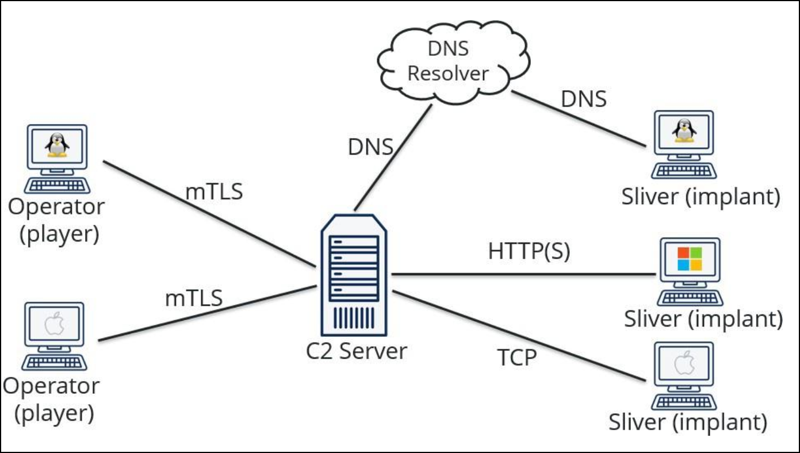

---
layout:
  width: default
  title:
    visible: true
  description:
    visible: false
  tableOfContents:
    visible: true
  outline:
    visible: true
  pagination:
    visible: true
---

# Sliver

[Sliver](https://sliver.sh/) is a cross-platform C2 framework built for red team operations and adversary emulation. It enables secure, covert communication with target systems over protocols like Mutual TLS, HTTP(S), DNS, and WireGuard. Once deployed, it supports remote command execution, information gathering, and post-exploitation tasks across Windows, Linux, and macOS.

<figure><figcaption><p>The Sliver infrastructure (<a href="https://sliver.sh/tutorials?name=1+-+Getting+Started">source</a>).</p></figcaption></figure>

```bash
# Generate implant
> generate -b localhost --os linux --skip-symbols --debug

# List implants
> implants

# Start a HTTP listener
> http

# List listeners
> jobs

# List sessions
> sessions

# Choose session
> use

# Get session information
> info
```

## Beacons vs Sessions

Sliver implants operate in two modes: sessions and beacons. **Sessions maintain a persistent connection** to the C2 using long-polling, keeping a TCP connection open for continuous communication. This allows for real-time interaction but increases network visibility.

**Beacons** function differently, **calling back at configurable intervals and remaining dormant between check-ins**. This periodic behavior reduces the implant’s network footprint, making detection less likely. Callback frequency can be tuned—for instance, to every six hours—and shortened temporarily to enable active control when needed.

```bash
# Generate a beacon (-j -> jitter, -S -> callback time)
> generate beacon -b localhost --skip-symbols --debug -j5 -S 15 --os linux

# List beacons
> beacons

# Check beacons' callback times
> beacons watch
> info

# Modify the jitter and callback time on the fly
> reconfig -i 5s -j 1s

# List commands issued for beacons
> tasks

# Results of the previously run tasks
> tasks fetch

# Spin up session on the beacon (a session will be received)
> interactive
```

In practice, a beacon is typically deployed for stealthy persistence. During active phases of an engagement, its sleep interval can be reduced or converted into a session to enable faster, interactive command execution and system enumeration.

## Beacon Operations

Sliver provides multiple **process injection techniques** and supports the execution of external .NET tools via the `execute-assembly` feature. This functionality uses the **fork-and-run method**, in which a new sacrificial process is spawned, injected with post-exploitation payloads, allowed to execute in-memory, and terminated once the operation completes. This enables tools like [StandIn](https://github.com/FuzzySecurity/StandIn) to operate covertly within the memory space of legitimate Windows processes, reducing on-disk artifacts and increasing evasion.

<table><thead><tr><th width="364.66668701171875">Used For</th><th>Process</th></tr></thead><tbody><tr><td>Credential theft</td><td><code>lsass.exe</code></td></tr><tr><td>Evasion</td><td><code>calc.exe</code>, <code>notepad.exe</code>, <code>svchost.exe</code>, <code>werfault.exe</code>, <code>wuauclt.exe</code>, <code>spoolsv.exe</code></td></tr><tr><td>Application control bypass</td><td><code>backgroundtaskhost.exe</code></td></tr><tr><td>Application control bypass and other evasion</td><td><code>regsvr32.exe</code>, <code>searchprotocolhost.exe</code></td></tr><tr><td>Evasion via COM abuse (executes often, has a short lifetime)</td><td><code>dllhost.exe</code></td></tr></tbody></table>

To further enhance evasion, Sliver supports **PPID spoofing**—a technique that spawns a process with an arbitrary parent, masking the true origin. This manipulation distorts the normal parent-child process tree, **allowing malicious processes to appear as though they were spawned by legitimate system components**.

**Detection often relies on identifying anomalous relationships**, such as `WINWORD.exe` spawning `rundll32.exe` or `cmd.exe`, which are strong indicators of compromise. To avoid raising suspicion, adversaries can **replicate legitimate process hierarchies**, such as `svchost.exe` launching `RuntimeBroker.exe`, `sihost.exe`, `taskhostw.exe`, or `SearchUI.exe`. Impersonating these expected relationships during injection operations improves operational security and reduces the likelihood of detection during process analysis.

## Tool Execution

Sliver provides built-in modules for standard beacon operations and post-exploitation tasks. In addition to these native features, it integrates with the [Sliver Armory](https://github.com/sliverarmory/armory/blob/master/armory.json), a repository of commonly used offensive tools that can be downloaded and used as if they were native Sliver commands. For executing external .NET tools, Sliver supports both `execute-assembly` and `inline-execute-assembly`.


**Event Tracing for Windows (ETW)** is a telemetry framework used by the OS and EDRs to monitor real-time activity, including PowerShell and .NET execution. It enables detection of in-memory operations without disk artifacts. Red team tools often tamper with ETW in memory to avoid detection.


* The `execute-assembly` capability enables remote process injection using the fork-and-run technique, which includes support for PPID spoofing to improve stealth. It also supports self-injection (`-i`), leveraging Sliver’s built-in AMSI (`-M`) and ETW (`-E)` bypasses to evade in-memory scanning and telemetry.
* The `inline-execute-assembly` method was introduced primarily for self-process injection, allowing operators to avoid spawning new sacrificial processes entirely and operate from within the beacon's current context.

### Execute-Assembly

The way C2 frameworks, like Cobalt Strike and Sliver implement `execute-assembly` allows tools like ADSearch to run entirely in memory.

1. `execute-assembly` loads a .NET assembly (e.g., `ADSearch.exe`) directly into the memory of an already running process (usually the implant).
2. The C2 never drops the file to disk — instead, it reflects the assembly into memory and invokes its `Main()` method.

This makes execution stealthier compared to traditional CLI tools like PowerView, which are typically run via `powershell.exe` or similar, often touching disk or spawning new processes that can trigger EDR alerts. So while tools like ADSearch are just .NET programs, they become "in-memory" and stealthy because of **how the C2 delivers and runs it**, not because of anything unique in the code itself. That said, well-written .NET tools are often **designed with C2 execution in mind** (e.g., no GUI, minimal dependencies, single assembly), which makes them ideal for use with execute-assembly.

To effectively run external tools, it is important to identify and migrate to a suitable parent process, enabling the spawning of child processes that execute the .NET assemblies and tooling. Selecting a stable and commonly used process like `explorer.exe` for migration not only improves session stability but also enhances stealth by blending into normal system activity.

```bash
# List processes
> ps
Pid    Ppid   Owner               Arch     Executable        Session
====== ====== =================== ======== ================= =========
1032   2684   dcorp\student337   x86_64   explorer.exe     3

# Migrate to the target process
> migrate -p 1032
[*] Successfully migrated to 1032
```

## LDAP Queries

Parts of domain enumeration rely on raw LDAP queries, which are used by most tools under the hood to extract data from AD. Understanding LDAP filter syntax allows operators to craft custom queries for tailored enumeration, especially as tools like [PowerView](https://x7331.gitbook.io/notes/) and [SharpView ](https://github.com/tevora-threat/SharpView)are increasingly detected by modern defenses. Alternatives such as [StandIn](https://github.com/FuzzySecurity/StandIn) and [ADSearch](https://github.com/tomcarver16/ADSearch) support custom LDAP queries and provide similar functionality with reduced detection risk. **Enabling verbosity when running these tools helps reveal the specific LDAP filters being executed, aiding both learning and operational tuning**. For reference, Microsoft’s LDAP syntax [documentation](https://learn.microsoft.com/en-us/archive/technet-wiki/5392.active-directory-ldap-syntax-filters) and various [cheat sheets](https://gist.github.com/jonlabelle/0f8ec20c2474084325a89bc5362008a7) offer quick lookup for common query structures.

However, tools that execute multiple LDAP queries in rapid succession can trigger detections by security mechanisms like Microsoft Defender for Identity (MDI) and Microsoft Defender for Endpoint (MDE/ATP). In realistic offensive operations, it is advisable to pace such enumeration over extended intervals to reduce noise and avoid triggering behavioral analytics.

## Foothold

To establish a remote foothold via process injection, the typical approach begins with deploying a Sliver implant on a compromised host to maintain access. Once deployed, a process injection technique is used to execute shellcode within a legitimate process, allowing for stealthy execution and evasion.

This is commonly done using a custom PE loader, such as NtDropper or BinLoader for Windows or [memexec](https://app.gitbook.com/o/asuXdppEfmgK9Dr478w0/s/mjLkek16kB60c2WFd5lf/) for Linux, which leverage low-level Windows NtAPI calls to avoid detection. These loaders retrieve shellcode—often from a local or remote web server—and inject it directly into memory.&#x20;

The typical flow involves: loader execution → shellcode retrieval → in-memory injection using stealthy system calls.
