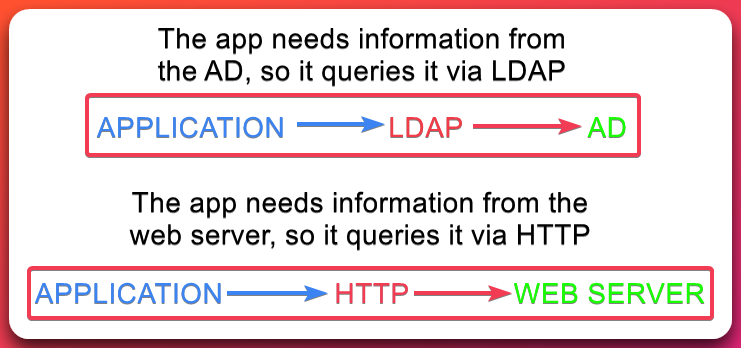

---
layout:
  title:
    visible: true
  description:
    visible: false
  tableOfContents:
    visible: true
  outline:
    visible: true
  pagination:
    visible: true
---

# LDAP (389,636)

## TL;DR

### Basics

* LDAP stands for **Lightweight Directory Access Protocol** and, as the name suggests, it is used for **accessing various directory services**, most commonly the [**AD**](#user-content-fn-1)[^1].
* LDAP uses ports `389` (unencrypted) and `636` (encrypted).
* **LDAP is the language that systems can use for speaking to** [**AD**](#user-content-fn-1)[^1] (Figure 1)**.**

<figure><figcaption><p>Figure 1: LDAP-HTTP analogy. </p></figcaption></figure>

### Authentication

LDAP supports two authentication methods:

1. **Simple**: This includes anonymous, unauthenticated, and `username:password` authentication and it means that **a pair of credentials create a bind request** to authenticate to the LDAP server.
2. [**SASL**](#user-content-fn-2)[^2]: This uses other authentication services, like Kerberos, to bind to the LDAP server.

**All domain users can authenticate with the LDAP server.**

### Global Catalog

A DC[^3] can also be granted the GC[^4] role which is an LDAP-compliant directory consisting of **a partial representation of every object from every domain within the forest**. This is available by default on ports `3268` (unencrypted) and `3269` (encrypted).

## Tools


```bash
# validate credentials
ldapwhoami -x -v -D <domain> -w <pass> -H ldap://<ip>
# query LDAP
ldapsearch -x -v -D <domain> -w <pass> -H ldap://<ip> -b "DC=SUPPORT,DC=HTB"
# domain dump
ldapdomaindump.py -u <user> -p <pass> -at SIMPLE -n <dns-server>
```


Detailed queries can be found on the [`ldapsearch`](../tl-dr/active-directory/ad-tools/ldapsearch.md) page.

## Resources



















[^1]: Active Directory

[^2]: Simple Authentication & Security Layer

[^3]: Domain Controller

[^4]: Global Catalog
