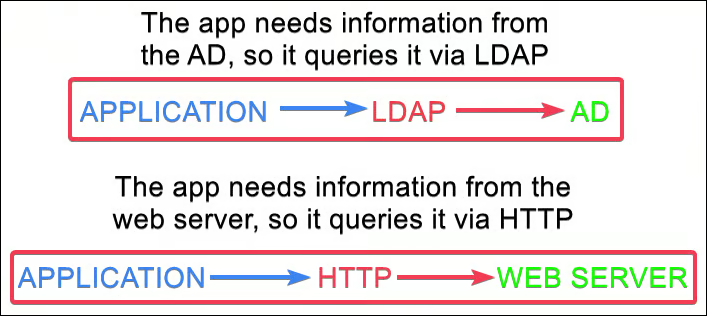
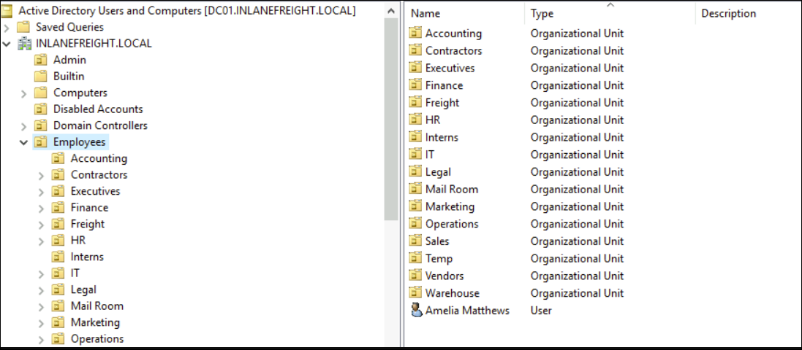

# 389,636 - LDAP

## What is LDAP?

> [Lightweight Directory Access Protocol documentation](https://ldap.com/)

LDAP stands for **Lightweight Directory Access Protocol** and it is used for accessing various directory services, such as the Active Directory (AD) service in Windows. It uses ports `389` (unencrypted) and `636` (encrypted). **LDAP is the language that systems use to query AD**, similar to how web applications use HTTP to speak to web servers.

<figure><figcaption></figcaption></figure>

A Domain Controller (DC) can also be granted the **Global Catalog** role which is an LDAP-compliant directory consisting of **a partial representation of every object from every domain within the forest**. This is available by default on ports `3268` (unencrypted) and `3269` (encrypted).

## Authentication


All domain users can authenticate with the LDAP server.


LDAP authenticates credentials against AD using a **BIND** operation. This operation establishes the authentication state for an LDAP session. There are two main types of LDAP authentication:

1. **Simple** → anonymous, unauthenticated, and username/password authentication. In this method, the client directly provides credentials to the LDAP server.
2. **Simple Authentication and Security Layer (SASL)** → allows LDAP to use external authentication services, such as Kerberos, rather than sending credentials directly. The client first authenticates with another system and then uses that trusted identity to bind to LDAP.
3. **SASL/GSSAPI** → a common SASL mechanism that integrates LDAP with Kerberos. If an attacker compromises a valid Kerberos ticket, they may be able to bind to LDAP without knowing the user’s password!


```
## Simple
Here is my username and password. LDAP, please verify them.

## SASL
I will authenticate using another supported mechanism. LDAP, use that method to verify who I am.

## SASL/GSSAPI
I have already authenticated using another trusted system. LDAP, please trust that authentication.
```


## LDAP Syntax

LDAP queries must have one or more criteria and they are written with [Polish notation](https://en.wikipedia.org/wiki/Polish_notation), i.e., the operators are placed in front of the criteria (aka operands). More details about operators used can be found in the [Search Filters](ldap-389-636.md#search-filters) section.

```powershell
 # General format
(operand(criterion1)(criterion2))

# Condition 1 AND Condition 2
(&(..C1..)(..C2..))

# Condition 1 OR Condition 2
(|(..C1..)(..C2..))

# Nested operations: (Condition 1 AND Condition 2) OR (Condition 3 AND Condition 4)
(|(&(..C1..)(..C2..))(&(..C3..)(..C4..)))
```

<table><thead><tr><th width="172">Criteria</th><th width="153">Rule</th><th>Example</th></tr></thead><tbody><tr><td>Equal to</td><td>(attribute=123)</td><td><code>(&#x26;(objectclass=user)(displayName=Smith))</code></td></tr><tr><td>Not equal to</td><td>(!(attribute=123))</td><td><code>(!objectClass=group)</code></td></tr><tr><td>Present</td><td>(attribute=\*)</td><td><code>(department=\*)</code></td></tr><tr><td>Not present</td><td>(!(attribute=\*))</td><td><code>(!homeDirectory=\*)</code></td></tr><tr><td>Greater than</td><td>(attribute>123)</td><td><code>(maxStorage>100000)</code></td></tr><tr><td>Less than</td><td>(attribute&#x3C;123)</td><td><code>(maxStorage&#x3C;100000)</code></td></tr><tr><td>Approximate match</td><td>(attribute~=123)</td><td><code>(sAMAccountName~=Jason)</code></td></tr><tr><td>Wildcards</td><td>(attribute=\*A)</td><td><code>(givenName=\*Sam)</code></td></tr></tbody></table>

#### Object Identifiers (OIDs)

In LDAP, an OID is a globally unique, hierarchical dotted-decimal number used to identify schema elements such as:

* **Object classes** (users → `1.2.840.113556.1.5.9`)
* **Attributes** (`sAMAccountName` → `1.2.840.113556.1.4.221`)

LDAP servers rely on OIDs internally, while humans typically use friendly names. This is because names can change, collide, or differ between vendors, whereas OIDs are stable and never change. This is especially important in environments like AD, where consistent schema identification is critical.

#### Matching Rule OIDs

A matching rule OID tells LDAP how to compare an attribute’s value with a search filter. This is required when a simple equality comparison (`=`) is not sufficient, such as bitwise flag checks, recursive group membership, and special string or binary comparisons.&#x20;

Let's go over an example of a **bitwise matching rule**. Some attributes (e.g. [`userAccountControl`](https://learn.microsoft.com/en-us/troubleshoot/windows-server/active-directory/useraccountcontrol-manipulate-account-properties)) store multiple flags inside a single integer value. A normal equality comparison cannot isolate a specific flag, so a bitwise matching rule is required. For instance, if we are interested in enumerating standard user accounts (`512`) with the `ACCOUNTDISABLE` flag set (`2`), we need to target the latter:

```
# General format
(attribute : matchingRuleOID := value)

# A maching OID rule for disabled user accounts
(userAccountControl:1.2.840.113556.1.4.803:=2)

1. userAccountControl -> an integer attribute containing multiple account flags
2. 1.2.840.113556.1.4.803 → instructs LDAP to perform a bitwise AND comparison
3. =2 → the value representing the ACCOUNTDISABLE flag
```

LDAP evaluates the above as:

```
userAccountControl AND 2 == 2
```

which translates to _“Return all objects where the disabled account flag is set.”_ For example:

```
userAccountControl = 514
```

represents multiple account properties at the same time. In its binary representation (`1000000010`) each bit has a specific meaning, and several bits can be set simultaneously. The resulting decimal number `514` is simply the sum of these bits:

```
 512 (NORMAL_ACCOUNT)
+  2 (ACCOUNTDISABLE)
---------------------
 514 (UAC value)
```

In essence, a bitwise check asks _“Is this specific bit set?”_ rather than checking if the full number equals a value. A normal equality check would fail in this case:

```
userAccountControl = 2 → FALSE (514≠2)
```

But the bitwise check succeeds:

```
userAccountControl AND 2 == 2 → TRUE (2=2)
```

The key takeaway is that matching rule OIDs exist because **some comparisons require special logic** that cannot be expressed with simple equality (`=`). We can enumerate and translate UAC flag values as shown in the [Tools](ldap-389-636.md#tools) section.

## Search Filters

The [Active Directory](https://learn.microsoft.com/en-us/powershell/module/activedirectory/?view=windowsserver2025-ps) PowerShell module, along with its [`Filter`](https://learn.microsoft.com/en-us/powershell/module/activedirectory/get-aduser?view=windowsserver2025-ps#-filter) and [`LDAPFilter`](https://learn.microsoft.com/en-us/powershell/module/activedirectory/get-adobject?view=windowsserver2025-ps#ldapfilter) params, can be used to enumerate an AD environment via LDAP. Tools like [PowerView](../tl-dr/active-directory/ad-tools/powerview.md) use those filters under the hood.

<table><thead><tr><th width="173">Purpose</th><th width="283">LDAPFilter syntax</th><th width="289">Filter syntax</th></tr></thead><tbody><tr><td>Equality</td><td><code>(cn=Alice)</code></td><td><code>"Name -eq 'Alice'"</code></td></tr><tr><td>Not equal</td><td><code>(!(cn=Alice))</code></td><td><code>"Name -ne 'Alice'"</code></td></tr><tr><td>Greater than</td><td><code>(logonCount>=5)</code></td><td><code>"logonCount -ge 5"</code></td></tr><tr><td>Less than</td><td><code>(logonCount&#x3C;=5)</code></td><td><code>"logonCount -le 5"</code></td></tr><tr><td>Wildcard</td><td><code>(cn=Alice*)</code></td><td><code>"Name -like 'Alice*'"</code></td></tr><tr><td>Ends with</td><td><code>(cn=*Alice)</code></td><td><code>"Name -like '*Alice'"</code></td></tr><tr><td>Contains</td><td><code>(cn=*Alice*)</code></td><td><code>"Name -like '*Alice*'"</code></td></tr><tr><td>Approximate match</td><td><code>(sn~=Smit)</code></td><td><code>"Surname -like 'Smit*'"</code></td></tr><tr><td>Presence</td><td><code>(mail=*)</code></td><td><code>"mail -like '*'"</code></td></tr><tr><td>Logical AND</td><td><code>(&#x26;(objectClass=user)(cn=Alice))</code></td><td><code>"ObjectClass -eq 'user' -and Name -eq 'Alice'"</code></td></tr><tr><td>Logical OR</td><td><code>(|(cn=Alice)(cn=Bob))</code></td><td><code>"Name -eq 'Alice' -or Name -eq 'Bob'"</code></td></tr><tr><td>Logical NOT</td><td><code>(!(cn=Alice))</code></td><td><code>"Name -notlike 'Alice'"</code> or <code>"Name -ne 'Alice'"</code></td></tr><tr><td>Boolean</td><td><code>(enabled=TRUE)</code></td><td><code>"Enabled -eq \$true"</code></td></tr></tbody></table>

### LDAP Queries

The `LDAPFilter` uses **standard LDAP query syntax** to search AD.


[ldapwiki](https://ldapwiki.com/wiki/Wiki.jsp?page=Microsoft%20Active%20Directory) can be used to find example queries for [computers](https://ldapwiki.com/wiki/Wiki.jsp?page=Active%20Directory%20Computer%20Related%20LDAP%20Query), [users](https://ldapwiki.com/wiki/Wiki.jsp?page=Active%20Directory%20User%20Related%20Searches), and [groups](https://ldapwiki.com/wiki/Wiki.jsp?page=Active%20Directory%20Group%20Related%20Searches).



```bash
# List all AD groups
Get-ADObject -LDAPFilter '(objectClass=group)' | select name

# Count domain users
(Get-ADObject -LDAPFilter '(&(objectCategory=person)(objectClass=user))').Count

# Disabled users
Get-ADObject -LDAPFilter '(&(objectCategory=person)(objectClass=user)(userAccountControl:1.2.840.113556.1.4.803:=2))' -Properties * | select samaccountname,useraccountcontrol

# Privileged account with SPN
Get-ADUser -LDAPFilter '(&(servicePrincipalName=*)(memberOf=CN=Protected Users,CN=Users,DC=Inlanefreight,DC=Local))' | select SamAccountName3

# User accounts with non-empty description field
Get-ADUser -Properties * -LDAPFilter '(&(objectCategory=user)(description=*))' | select samaccountname,description

# Users marked as trusted for delegation
Get-ADUser -Properties * -LDAPFilter '(userAccountControl:1.2.840.113556.1.4.803:=524288)' | select Name,memberof, servicePrincipalName,TrustedForDelegation | fl

# Computers marked as trusted for delegation
Get-ADComputer -Properties * -LDAPFilter '(userAccountControl:1.2.840.113556.1.4.803:=524288)' | select DistinguishedName,servicePrincipalName,TrustedForDelegation | fl

# Administrative users who required no password
Get-AdUser -LDAPFilter '(&(objectCategory=person)(objectClass=user)(userAccountControl:1.2.840.113556.1.4.803:=32))(adminCount=1)' -Properties * | select name,memberof | fl
```


Because some symbols are used as operands, if we need to use them literally within a query, they need to be escaped.

| Character | Hex Representation |
| --------- | ------------------ |
| `*`       | `\2a`              |
| `(`       | `\28`              |
| `)`       | `\29`              |
| `\`       | `\5c`              |
| `NULL`    | `\00`              |

### AD Queries

The `Filter` parameter uses **PowerShell expression syntax** (SQL-like), which is internally converted into an LDAP query.


```bash
# Filter out all Microsoft software
get-ciminstance win32_product -Filter "NOT Vendor like '%Microsoft%'" | fl

# User information
Get-ADUser -Filter "name -eq 'sally jones'"
Get-ADUser -Filter {name -eq 'sally jones'}

# Hostnames that contain the SQL string
Get-ADComputer  -Filter "DNSHostName -like 'SQL*'"

#Privileged groups
Get-ADGroup -Filter "adminCount -eq 1" | select Name

# Privileged ASREPRoastable users
Get-ADUser -Filter {adminCount -eq '1' -and DoesNotRequirePreAuth -eq 'True'}

# Kerberoastable users
Get-ADUser -Filter "adminCount -eq '1'" -Properties * | where servicePrincipalName -ne $null | select SamAccountName,MemberOf,ServicePrincipalName | fl
```


### Search Base & Scope

These parameters are essential for **controlling where and how deeply AD queries are performed**, because without limiting the search base and scope, a query can potentially return extremely large result sets, which may impact performance and consume unnecessary resources:

* The `SearchBase` parameter specifies the AD path under which the search should be performed, typically using the distinguished name (DN) of an organizational unit (OU) or container.
* The `SearchScope` parameter determines the depth of the search relative to the `SearchBase`, allowing queries to be targeted to a single object, a container, or a container and all of its subcontainers. It has three levels:
  1. `Base` → searches only the specified object (the exact DN) and does not include any child objects.
  2. `OneLevel` → searches for objects directly within the container, but does not recurse into sub-containers.
  3. `SubTree` → searches for objects within the container and all of its child containers, recursively.

In the below example, if we define our `SearchBase` to the `Employees` OU, the `Get-ADUser` will fetch:

1. `Base` → nothing (just the DN itself, i.e., `OU=Employees,DC=example,DC=com`, which is not a user)
2. `OneLevel` → `Amelia Matthews` (the only user directly under the `Employees` container)
3. `SubTree` → all users in all sub-containers (all users and subcontainers under `Employees`)




```powershell
# Domain Users
> Get-ADUser -SearchBase "OU=Employees,DC=INLANEFREIGHT,DC=LOCAL" -Filter *).count
970

# Base
> Get-ADUser -SearchBase "OU=Employees,DC=INLANEFREIGHT,DC=LOCAL" -SearchScope Base -Filter *

# OneLevel
> Get-ADUser -SearchBase "OU=Employees,DC=INLANEFREIGHT,DC=LOCAL" -SearchScope OneLevel -Filter *
DistinguishedName : CN=Amelia Matthews,OU=Employees,DC=INLANEFREIGHT,DC=LOCAL
...

# SubTree
> (Get-ADUser -SearchBase "OU=Employees,DC=INLANEFREIGHT,DC=LOCAL" -SearchScope Subtree -Filter *).count
970
```


### Recursive Match

An interesting case when enumerating via LDAP, is when we need to do a recursive match, e.g. nested group memberships. In the example below:

* `harry.jones` is a member of `Security Operations`
* `Security Operations` is a member of `Domain Admins`

Using the below command does not reveal the above relationship:

```powershell
Get-ADUser -Identity harry.jones -Properties * | select memberof | ft -Wrap
```

However, we can reveal it using the `RecursiveMatch` parameter or a matching OID rule:


```powershell
Get-ADGroup -Filter 'member -RecursiveMatch "CN=Harry Jones,OU=Network Ops,OU=IT,OU=Employees,DC=INLANEFREIGHT,DC=LOCAL"' | select name

Get-ADGroup -LDAPFilter '(member:1.2.840.113556.1.4.1941:=CN=Harry Jones,OU=Network Ops,OU=IT,OU=Employees,DC=INLANEFREIGHT,DC=LOCAL)' | select Name
```


## Tools

### Built-in

Besides the PS AD module, [`dsquery`](https://learn.microsoft.com/en-us/previous-versions/windows/it-pro/windows-server-2012-r2-and-2012/cc732952\(v=ws.11\)), [`Get-WmiObject`](https://learn.microsoft.com/en-us/powershell/module/microsoft.powershell.management/get-wmiobject?view=powershell-5.1), and [`adsisearcher`](https://devblogs.microsoft.com/scripting/use-the-powershell-adsisearcher-type-accelerator-to-search-active-directory/) can be also used:


```powershell
> dsquery user "OU=Employees,DC=inlanefreight,DC=local" -name * -scope subtree -limit 0 | dsget user -samid -pwdneverexpires | findstr /V no

  samid                  pwdneverexpires
  svc-backup             yes
  svc-scan               yes
  ...
  
dsget succeeded

> Get-WmiObject -Class win32_group -Filter "Domain='INLANEFREIGHT'" | Select Caption,Name

Caption                                               Name
-------                                               ----
INLANEFREIGHT\Cert Publishers                         Cert Publishers
INLANEFREIGHT\RAS and IAS Servers                     RAS and IAS Servers

> ([adsisearcher]"(&(objectClass=Computer))").FindAll() | select Path

Path
----
LDAP://CN=DC01,OU=Domain Controllers,DC=INLANEFREIGHT,DC=LOCAL
LDAP://CN=EXCHG01,OU=Mail Servers,OU=Servers,DC=INLANEFREIGHT,DC=LOCAL
```


### Third-Party

Detailed queries can be found on the [`ldapsearch`](../tl-dr/active-directory/ad-tools/ldapsearch.md) page.

> [`ldapwhoami`](https://linux.die.net/man/1/ldapwhoami), [`ldapdomaindump`](https://github.com/dirkjanm/ldapdomaindump) , [`ldapsearch-ad`](https://github.com/yaap7/ldapsearch-ad)&#x20;


```bash
# Validate credentials
ldapwhoami -x -v -D <domain> -w <pass> -H ldap://<ip>
# Query LDAP
ldapsearch-ad -x -v -D <domain> -w <pass> -H ldap://<ip> -b "DC=SUPPORT,DC=HTB"
# Domain dump
ldapdomaindump.py -u <user> -p <pass> -at SIMPLE -n <dns-server>
```


### UAC Conversion

UAC values can be converted into flags using the AD PS module and the [`Convert-UserAccountControlValues.ps1`](https://github.com/dodiorne/pentest_tools/blob/main/Convert-UserAccountControlValues.ps1) script, as well as `PowerView`:


```powershell
# Enumerate UAC values for domain users
> Get-ADUser -Filter {adminCount -gt 0} -Properties admincount,useraccountcontrol | select Name,useraccountcontrol
Name           useraccountcontrol
----           ------------------
Administrator               66048
krbtgt                      66050
daniel.carter                 512
...

# Convert UAC value to flags
> .\Convert-UserAccountControlValues.ps1

Please provide the userAccountControl value: : 4260384

Name                           Value
----                           -----
PASSWD_NOTREQD                 32
NORMAL_ACCOUNT                 512
DONT_EXPIRE_PASSWORD           65536
DONT_REQ_PREAUTH               4194304

# Same with PowerView
> Get-DomainUser * -AdminCount | select samaccountname,useraccountcontrol

samaccountname                                                     useraccountcontrol
--------------                                                     ------------------
Administrator                                    NORMAL_ACCOUNT, DONT_EXPIRE_PASSWORD
krbtgt                           ACCOUNTDISABLE, NORMAL_ACCOUNT, DONT_EXPIRE_PASSWORD
daniel.carter                                                          NORMAL_ACCOUNT
```

